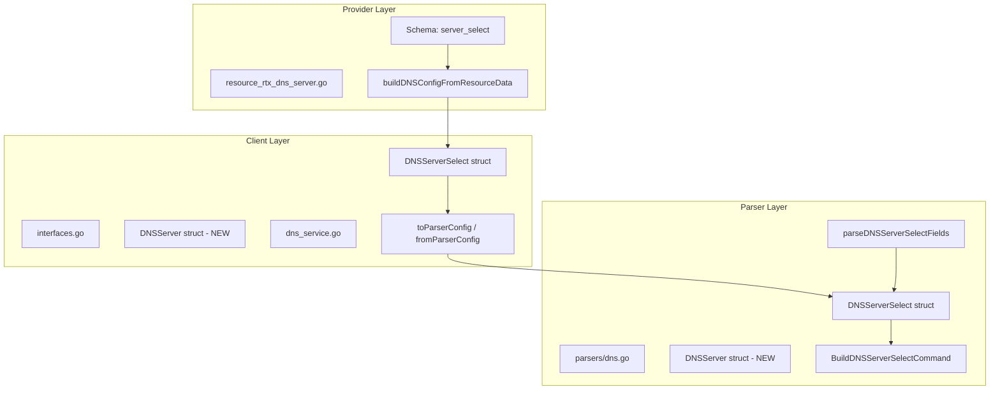

# Design Document: DNS Server Select Per-Server EDNS Support

## Overview

This design introduces a nested `server` block within `server_select` to enable per-server EDNS configuration, replacing the flat `servers` list and shared `edns` boolean. This change aligns with RTX router capabilities and fixes the parsing issue where `query_pattern` incorrectly reads as "edns".

## Steering Document Alignment

### Technical Standards (tech.md)
- Follows existing parser/builder pattern in `internal/rtx/parsers/`
- Maintains separation between parser, client, and provider layers
- Uses Terraform SDK v2 schema patterns consistent with other resources

### Project Structure (structure.md)
- Changes isolated to DNS-related files across three layers
- No new packages or major structural changes required

## Code Reuse Analysis

### Existing Components to Leverage
- **`parsers.DNSParser`**: Extend `parseDNSServerSelectFields` to parse per-server EDNS
- **`parsers.BuildDNSServerSelectCommand`**: Modify to generate per-server EDNS in commands
- **`client.DNSService`**: Conversion functions already handle struct transformation
- **`validateIPAddressAny`**: Reuse existing IP validation for server addresses

### Integration Points
- **Provider Schema**: Update `server_select` element schema
- **State Migration**: Terraform handles backward compatibility via Computed + Optional
- **Client Layer**: Struct definitions mirror parser layer

## Architecture



## Components and Interfaces

### Component 1: New DNSServer Struct
- **Purpose:** Represents a single DNS server with its EDNS setting
- **Location:** `internal/rtx/parsers/dns.go`, `internal/client/interfaces.go`
- **Definition:**
  ```go
  type DNSServer struct {
      Address string `json:"address"` // DNS server IP (IPv4 or IPv6)
      EDNS    bool   `json:"edns"`    // Per-server EDNS setting
  }
  ```

### Component 2: Updated DNSServerSelect Struct
- **Purpose:** Represents a DNS server select entry with nested servers
- **Changes:**
  - Remove: `Servers []string`, `EDNS bool`
  - Add: `Servers []DNSServer`
- **Definition:**
  ```go
  type DNSServerSelect struct {
      ID             int         `json:"id"`
      Servers        []DNSServer `json:"servers"`         // Changed from []string
      // EDNS removed - now per-server
      RecordType     string      `json:"record_type"`
      QueryPattern   string      `json:"query_pattern"`
      OriginalSender string      `json:"original_sender"`
      RestrictPP     int         `json:"restrict_pp"`
  }
  ```

### Component 3: Updated Parser (`parseDNSServerSelectFields`)
- **Purpose:** Parse RTX output with per-server EDNS options
- **Current Logic Issue:**
  - Parses `edns=on` but stores in single boolean
  - After parsing servers, may incorrectly identify next token
- **New Logic:**
  ```
  For each token after ID:
    IF token is valid IP:
      Create DNSServer{Address: token}
      IF next token is "edns=on" or "edns=off":
        Set server.EDNS accordingly
        Advance
      Append server to list
    ELSE:
      Break to next phase (record_type, query_pattern)
  ```
- **Reuses:** `isValidIPForDNS()` for IP validation

### Component 4: Updated Command Builder (`BuildDNSServerSelectCommand`)
- **Purpose:** Generate RTX command with per-server EDNS
- **Output Format:**
  ```
  dns server select <id> <server1> [edns=on] [<server2> [edns=on]] [<type>] <pattern>
  ```
- **Logic:**
  ```
  For each server in Servers:
    Append server.Address
    IF server.EDNS:
      Append "edns=on"
  ```

### Component 5: Updated Provider Schema
- **Purpose:** Enable per-server EDNS in Terraform configuration
- **Changes to `server_select` element:**
  ```go
  // Deprecated - for backward compatibility
  "servers": {
      Type:       schema.TypeList,
      Optional:   true,
      Deprecated: "Use 'server' blocks instead for per-server EDNS control",
      Elem:       &schema.Schema{Type: schema.TypeString},
  },
  "edns": {
      Type:       schema.TypeBool,
      Optional:   true,
      Deprecated: "Use 'edns' within 'server' blocks instead",
  },

  // New nested block
  "server": {
      Type:     schema.TypeList,
      Optional: true,
      MaxItems: 2,  // RTX limit
      Elem: &schema.Resource{
          Schema: map[string]*schema.Schema{
              "address": {
                  Type:         schema.TypeString,
                  Required:     true,
                  ValidateFunc: validateIPAddressAny,
              },
              "edns": {
                  Type:     schema.TypeBool,
                  Optional: true,
                  Default:  false,
              },
          },
      },
  },
  ```

### Component 6: Data Conversion Functions
- **Location:** `resource_rtx_dns_server.go`
- **Functions to Update:**
  - `buildDNSConfigFromResourceData`: Handle both old and new schema
  - State reading in `resourceRTXDNSServerRead`: Convert to new format
  - Import in `resourceRTXDNSServerImport`: Same conversion

## Data Models

### New: DNSServer
```go
type DNSServer struct {
    Address string `json:"address"` // DNS server IP address (IPv4/IPv6)
    EDNS    bool   `json:"edns"`    // EDNS enabled for this server
}
```

### Updated: DNSServerSelect
```go
type DNSServerSelect struct {
    ID             int         `json:"id"`              // Selector ID (1-65535)
    Servers        []DNSServer `json:"servers"`         // DNS servers with per-server EDNS
    RecordType     string      `json:"record_type"`     // a, aaaa, ptr, mx, ns, cname, any
    QueryPattern   string      `json:"query_pattern"`   // ".", "*.example.com", etc.
    OriginalSender string      `json:"original_sender"` // Source IP/CIDR restriction
    RestrictPP     int         `json:"restrict_pp"`     // PP session restriction
}
```

## Backward Compatibility Strategy

### Detection Logic
```go
func buildDNSConfigFromResourceData(d *schema.ResourceData) client.DNSConfig {
    // Check which schema is used
    hasNewServerBlocks := len(d.Get("server_select.0.server").([]interface{})) > 0
    hasOldServers := len(d.Get("server_select.0.servers").([]interface{})) > 0

    if hasNewServerBlocks && hasOldServers {
        // Validation error: cannot use both
    }

    if hasOldServers {
        // Convert old format to new
        edns := d.Get("server_select.0.edns").(bool)
        for _, addr := range oldServers {
            servers = append(servers, DNSServer{Address: addr, EDNS: edns})
        }
    }
}
```

### State Read (Always New Format)
When reading from RTX, always populate the new `server` blocks format in state. The old `servers` and `edns` attributes will be empty, encouraging migration.

## Error Handling

### Error Scenarios

1. **Both old and new schema used**
   - **Handling:** Return validation error during plan
   - **Message:** "Cannot use both 'servers' and 'server' blocks. Please migrate to 'server' blocks."

2. **More than 2 servers specified**
   - **Handling:** Schema MaxItems validation
   - **Message:** "RTX routers support at most 2 DNS servers per selector."

3. **Invalid IP address**
   - **Handling:** Existing `validateIPAddressAny` function
   - **Message:** Standard IP validation error

4. **Parse failure on malformed RTX output**
   - **Handling:** Log warning, skip entry
   - **Message:** "Failed to parse dns server select entry: <details>"

## Testing Strategy

### Unit Testing

**Parser Tests** (`dns_test.go`):
- Interleaved EDNS: `<server1> edns=on <server2> edns=on <type> <pattern>`
- Mixed EDNS: `<server1> edns=on <server2> edns=off <type> <pattern>`
- Trailing EDNS (legacy): `<server1> <server2> edns=on <pattern>`
- Single server with EDNS
- No EDNS specified (default off)

**Builder Tests**:
- All servers EDNS on
- All servers EDNS off
- Mixed EDNS settings
- Single server

### Integration Testing

**Provider Tests** (`resource_rtx_dns_server_test.go`):
- Create with new `server` block schema
- Create with deprecated `servers` schema (verify warning)
- Update from old to new schema
- Import and verify correct format

### Acceptance Testing
- Configure RTX with per-server EDNS
- Import and verify `terraform plan` shows no changes
- Verify server_select[500100] has correct `query_pattern` and `record_type`

## Files to Modify

| File | Changes |
|------|---------|
| `internal/rtx/parsers/dns.go` | Add `DNSServer` struct, update `DNSServerSelect`, modify parser/builder |
| `internal/rtx/parsers/dns_test.go` | Add tests for per-server EDNS parsing |
| `internal/client/interfaces.go` | Mirror struct changes from parser layer |
| `internal/client/dns_service.go` | Update conversion functions |
| `internal/provider/resource_rtx_dns_server.go` | Update schema, add deprecated attrs, update data conversion |
| `internal/provider/resource_rtx_dns_server_test.go` | Add tests for new schema |
