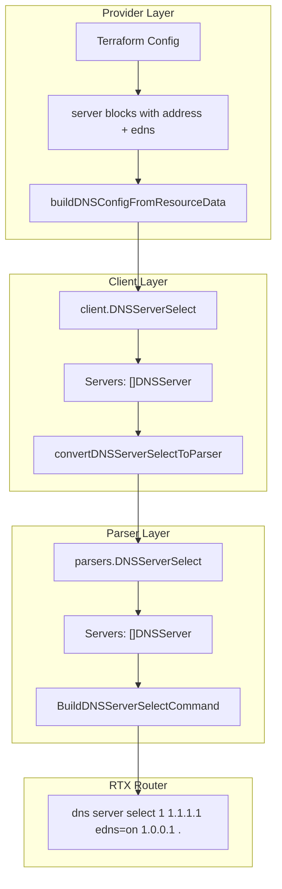

# Design Document: DNS Server Select Per-Server EDNS

## Overview

This feature aligns the provider and client layers with the parser layer's per-server EDNS support. The parser layer already correctly implements `DNSServer{Address, EDNS}` structure, but the client layer flattens this to `[]string` + single `bool`, and the provider layer uses a similar flat schema. This design updates both layers to support per-server EDNS configuration.

## Steering Document Alignment

### Technical Standards (tech.md)
- **Go 1.23**: All changes follow existing Go code style
- **terraform-plugin-sdk/v2**: Schema changes follow SDK v2 nested block patterns
- **Layer Separation**: Parser, Client, Provider layers maintain clear boundaries
- **Type Alignment**: Client types will mirror parser types for consistency

### Project Structure (structure.md)
- Client interface changes in `internal/client/interfaces.go`
- Service layer changes in `internal/client/dns_service.go`
- Provider schema changes in `internal/provider/resource_rtx_dns_server.go`
- Provider tests in `internal/provider/resource_rtx_dns_server_test.go`

## Code Reuse Analysis

### Existing Components to Leverage
- **parsers.DNSServer**: Already correctly implemented with `Address` and `EDNS` fields
- **parsers.DNSServerSelect**: Already uses `[]DNSServer` for per-server EDNS
- **parsers.BuildDNSServerSelectCommand**: Already generates correct RTX commands with per-server EDNS
- **parsers.ParseDNSConfig**: Already parses per-server EDNS from RTX output

### Integration Points
- **Parser Layer**: No changes needed - already correct
- **Client Layer**: Update `DNSServerSelect` struct and conversion functions
- **Provider Layer**: Update Terraform schema to use nested `server` blocks

## Architecture

The data flow remains the same, but type alignment is improved:



### Modular Design Principles
- **Type Alignment**: Client layer mirrors parser layer structures exactly
- **Single Responsibility**: Each layer handles its specific concern
- **Minimal Changes**: Only modify what's necessary for per-server EDNS

## Components and Interfaces

### Component 1: Client DNSServer Struct (NEW)
- **Purpose:** Mirror parser's DNSServer struct for type consistency
- **Location:** `internal/client/interfaces.go`
- **Interface:**
  ```go
  type DNSServer struct {
      Address string `json:"address"` // DNS server IP address
      EDNS    bool   `json:"edns"`    // Enable EDNS for this server
  }
  ```
- **Dependencies:** None
- **Reuses:** Mirrors `parsers.DNSServer`

### Component 2: Client DNSServerSelect Struct (MODIFIED)
- **Purpose:** Store DNS server select entry with per-server EDNS
- **Location:** `internal/client/interfaces.go`
- **Interface:**
  ```go
  type DNSServerSelect struct {
      ID             int         `json:"id"`
      Servers        []DNSServer `json:"servers"`         // Changed from []string
      RecordType     string      `json:"record_type"`
      QueryPattern   string      `json:"query_pattern"`
      OriginalSender string      `json:"original_sender"`
      RestrictPP     int         `json:"restrict_pp"`
  }
  // Note: Removed EDNS field - now per-server in Servers
  ```
- **Dependencies:** `DNSServer`
- **Changes:** Replace `Servers []string` + `EDNS bool` with `Servers []DNSServer`

### Component 3: Conversion Functions (SIMPLIFIED)
- **Purpose:** Convert between client and parser types
- **Location:** `internal/client/dns_service.go`
- **Interface:**
  ```go
  func convertDNSServerSelectToParser(sel DNSServerSelect) parsers.DNSServerSelect
  func convertDNSServerSelectFromParser(sel parsers.DNSServerSelect) DNSServerSelect
  ```
- **Changes:** Direct mapping since types now align
  ```go
  // To parser - direct copy
  func convertDNSServerSelectToParser(sel DNSServerSelect) parsers.DNSServerSelect {
      servers := make([]parsers.DNSServer, len(sel.Servers))
      for i, srv := range sel.Servers {
          servers[i] = parsers.DNSServer{
              Address: srv.Address,
              EDNS:    srv.EDNS,
          }
      }
      return parsers.DNSServerSelect{
          ID:             sel.ID,
          Servers:        servers,
          RecordType:     sel.RecordType,
          QueryPattern:   sel.QueryPattern,
          OriginalSender: sel.OriginalSender,
          RestrictPP:     sel.RestrictPP,
      }
  }

  // From parser - direct copy
  func convertDNSServerSelectFromParser(sel parsers.DNSServerSelect) DNSServerSelect {
      servers := make([]DNSServer, len(sel.Servers))
      for i, srv := range sel.Servers {
          servers[i] = DNSServer{
              Address: srv.Address,
              EDNS:    srv.EDNS,
          }
      }
      return DNSServerSelect{
          ID:             sel.ID,
          Servers:        servers,
          RecordType:     sel.RecordType,
          QueryPattern:   sel.QueryPattern,
          OriginalSender: sel.OriginalSender,
          RestrictPP:     sel.RestrictPP,
      }
  }
  ```

### Component 4: Terraform Schema (MODIFIED)
- **Purpose:** Define HCL structure for server_select with per-server EDNS
- **Location:** `internal/provider/resource_rtx_dns_server.go`
- **Changes:** Replace `servers` list + `edns` bool with nested `server` block

**Before:**
```go
"servers": {
    Type:     schema.TypeList,
    Required: true,
    Elem:     &schema.Schema{Type: schema.TypeString},
},
"edns": {
    Type:     schema.TypeBool,
    Optional: true,
},
```

**After:**
```go
"server": {
    Type:        schema.TypeList,
    Required:    true,
    MinItems:    1,
    MaxItems:    2,
    Description: "DNS servers with per-server EDNS configuration",
    Elem: &schema.Resource{
        Schema: map[string]*schema.Schema{
            "address": {
                Type:         schema.TypeString,
                Required:     true,
                Description:  "DNS server IP address (IPv4 or IPv6)",
                ValidateFunc: validateIPAddressAny,
            },
            "edns": {
                Type:        schema.TypeBool,
                Optional:    true,
                Default:     false,
                Description: "Enable EDNS for this server",
            },
        },
    },
},
```

### Component 5: Resource Data Conversion (MODIFIED)
- **Purpose:** Convert between Terraform state and client types
- **Location:** `internal/provider/resource_rtx_dns_server.go`
- **Functions:**
  - `buildDNSConfigFromResourceData`: Extract `server` blocks to `[]client.DNSServer`
  - `resourceRTXDNSServerRead`: Flatten `[]client.DNSServer` to `server` blocks
  - `resourceRTXDNSServerImport`: Same as Read

## Data Models

### Terraform HCL (New Format)
```hcl
resource "rtx_dns_server" "main" {
  server_select {
    id            = 500000
    query_pattern = "."
    record_type   = "a"

    server {
      address = "1.1.1.1"
      edns    = true
    }
    server {
      address = "1.0.0.1"
      edns    = true
    }
  }
}
```

### RTX Command (Unchanged)
```
dns server select 500000 1.1.1.1 edns=on 1.0.0.1 edns=on a .
```

## Error Handling

### Error Scenarios

1. **No server blocks in server_select**
   - **Handling:** Schema validation with `MinItems: 1`
   - **User Impact:** Terraform plan fails: "server_select: attribute 'server' is required"

2. **More than 2 server blocks**
   - **Handling:** Schema validation with `MaxItems: 2`
   - **User Impact:** Terraform plan fails: "server_select: attribute 'server' cannot have more than 2 entries"

3. **Invalid IP address in server block**
   - **Handling:** `validateIPAddressAny` function validates format
   - **User Impact:** Terraform plan fails with validation error

4. **Old schema with `servers` attribute**
   - **Handling:** Terraform reports "Unsupported argument"
   - **User Impact:** Clear error pointing to use `server` block instead

## Testing Strategy

### Unit Testing
- **Client Layer** (`internal/client/dns_service_test.go`):
  - Test `convertDNSServerSelectToParser` with various EDNS combinations
  - Test `convertDNSServerSelectFromParser` preserves per-server EDNS
  - Test roundtrip conversion maintains data integrity

### Integration Testing
- **Provider Layer** (`internal/provider/resource_rtx_dns_server_test.go`):
  - Test CRUD with new `server` block schema
  - Test mixed EDNS settings (first=true, second=false)
  - Test import with per-server EDNS configuration
  - Test schema validation (min/max items, required fields)

### Acceptance Testing
- Configure RTX with `dns server select 1 1.1.1.1 edns=on 1.0.0.1 .`
- Verify Terraform read shows correct per-server EDNS
- Verify Terraform plan shows no changes when config matches
- Verify Terraform apply generates correct RTX commands

## Implementation Sequence

1. **Client Layer** (`internal/client/interfaces.go`)
   - Add `DNSServer` struct
   - Update `DNSServerSelect` to use `[]DNSServer`
   - Remove `EDNS bool` field

2. **Client Layer** (`internal/client/dns_service.go`)
   - Simplify `convertDNSServerSelectToParser` (direct mapping)
   - Simplify `convertDNSServerSelectFromParser` (direct mapping)

3. **Provider Layer** (`internal/provider/resource_rtx_dns_server.go`)
   - Update schema: replace `servers`+`edns` with `server` block
   - Update `buildDNSConfigFromResourceData` for new schema
   - Update `resourceRTXDNSServerRead` flatten logic
   - Update `resourceRTXDNSServerImport` flatten logic

4. **Tests**
   - Update provider tests for new schema
   - Verify existing parser tests still pass (no parser changes)
