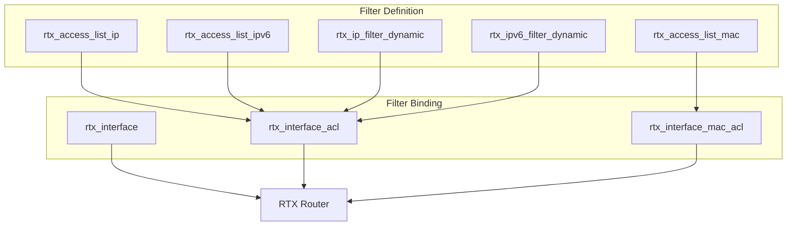
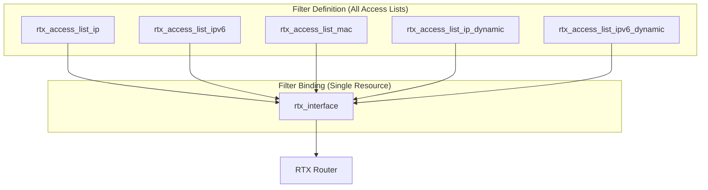

# Design: Filter Attribute Consolidation

## Overview

This document describes the technical design for consolidating filter management into a consistent access list pattern with simplified interface binding.

## Architecture

### Current Architecture (Fragmented)



### Target Architecture (Unified)



## Implementation Plan

### Phase 1: Create New Dynamic Filter Access List Resources

Create `rtx_access_list_ip_dynamic`:
- Name-based grouping of dynamic IP filter rules
- Entry block with sequence, source, destination, protocol, etc.

Create `rtx_access_list_ipv6_dynamic`:
- Name-based grouping of dynamic IPv6 filter rules
- Entry block with sequence, source, destination, protocol, etc.

### Phase 2: Add Access List Attributes to rtx_interface

Add new attributes:
- `access_list_ip_in`, `access_list_ip_out`
- `access_list_ipv6_in`, `access_list_ipv6_out`
- `access_list_ip_dynamic_in`, `access_list_ip_dynamic_out`
- `access_list_ipv6_dynamic_in`, `access_list_ipv6_dynamic_out`
- `access_list_mac_in`, `access_list_mac_out`

### Phase 3: Remove Old Filter Attributes from rtx_interface

Remove:
- `secure_filter_in`, `secure_filter_out`
- `dynamic_filter_out`
- `ethernet_filter_in`, `ethernet_filter_out`

### Phase 4: Remove Redundant Resources

Delete:
- `rtx_interface_acl`
- `rtx_interface_mac_acl`
- `rtx_ip_filter_dynamic`
- `rtx_ipv6_filter_dynamic`

### Phase 5: Update Documentation

- Update resource documentation
- Create migration guide
- Update examples

## Schema Definitions

### rtx_access_list_ip_dynamic (New)

```go
Schema: map[string]*schema.Schema{
    "name": {
        Type:        schema.TypeString,
        Required:    true,
        ForceNew:    true,
        Description: "Access list name (identifier)",
    },
    "entry": {
        Type:        schema.TypeList,
        Required:    true,
        Description: "List of dynamic filter entries",
        Elem: &schema.Resource{
            Schema: map[string]*schema.Schema{
                "sequence": {
                    Type:        schema.TypeInt,
                    Required:    true,
                    Description: "Sequence number (determines order)",
                },
                "source": {
                    Type:        schema.TypeString,
                    Required:    true,
                    Description: "Source address or * for any",
                },
                "destination": {
                    Type:        schema.TypeString,
                    Required:    true,
                    Description: "Destination address or * for any",
                },
                "protocol": {
                    Type:        schema.TypeString,
                    Required:    true,
                    Description: "Protocol (www, ftp, smtp, tcp, udp, etc.)",
                },
                "syslog": {
                    Type:        schema.TypeBool,
                    Optional:    true,
                    Default:     false,
                    Description: "Enable syslog logging",
                },
                "timeout": {
                    Type:        schema.TypeInt,
                    Optional:    true,
                    Description: "Timeout in seconds",
                },
            },
        },
    },
}
```

### rtx_access_list_ipv6_dynamic (New)

```go
Schema: map[string]*schema.Schema{
    "name": {
        Type:        schema.TypeString,
        Required:    true,
        ForceNew:    true,
        Description: "Access list name (identifier)",
    },
    "entry": {
        Type:        schema.TypeList,
        Required:    true,
        Description: "List of dynamic IPv6 filter entries",
        Elem: &schema.Resource{
            Schema: map[string]*schema.Schema{
                "sequence": {
                    Type:        schema.TypeInt,
                    Required:    true,
                    Description: "Sequence number (determines order)",
                },
                "source": {
                    Type:        schema.TypeString,
                    Required:    true,
                    Description: "Source IPv6 address or * for any",
                },
                "destination": {
                    Type:        schema.TypeString,
                    Required:    true,
                    Description: "Destination IPv6 address or * for any",
                },
                "protocol": {
                    Type:        schema.TypeString,
                    Required:    true,
                    Description: "Protocol (www, ftp, smtp, tcp, udp, etc.)",
                },
                "syslog": {
                    Type:        schema.TypeBool,
                    Optional:    true,
                    Default:     false,
                    Description: "Enable syslog logging",
                },
            },
        },
    },
}
```

### rtx_interface (Updated - Filter Attributes Only)

```go
// New attributes to add
"access_list_ip_in": {
    Type:        schema.TypeString,
    Optional:    true,
    Description: "Inbound IP access list name",
},
"access_list_ip_out": {
    Type:        schema.TypeString,
    Optional:    true,
    Description: "Outbound IP access list name",
},
"access_list_ip_dynamic_in": {
    Type:        schema.TypeString,
    Optional:    true,
    Description: "Inbound dynamic IP access list name",
},
"access_list_ip_dynamic_out": {
    Type:        schema.TypeString,
    Optional:    true,
    Description: "Outbound dynamic IP access list name",
},
"access_list_ipv6_in": {
    Type:        schema.TypeString,
    Optional:    true,
    Description: "Inbound IPv6 access list name",
},
"access_list_ipv6_out": {
    Type:        schema.TypeString,
    Optional:    true,
    Description: "Outbound IPv6 access list name",
},
"access_list_ipv6_dynamic_in": {
    Type:        schema.TypeString,
    Optional:    true,
    Description: "Inbound dynamic IPv6 access list name",
},
"access_list_ipv6_dynamic_out": {
    Type:        schema.TypeString,
    Optional:    true,
    Description: "Outbound dynamic IPv6 access list name",
},
"access_list_mac_in": {
    Type:        schema.TypeString,
    Optional:    true,
    Description: "Inbound MAC access list name",
},
"access_list_mac_out": {
    Type:        schema.TypeString,
    Optional:    true,
    Description: "Outbound MAC access list name",
},
```

## RTX Command Mapping

### Access List to Filter Number Mapping

Each access list resource internally manages filter numbers. When an access list is referenced by name, the provider:

1. Looks up the access list by name
2. Retrieves the filter numbers from entries (based on sequence or filter_id)
3. Generates the appropriate RTX commands

### Interface Filter Commands

| Access List Attribute | RTX Command |
|----------------------|-------------|
| `access_list_ip_in` | `ip {interface} secure filter in {filter_nums...}` |
| `access_list_ip_out` | `ip {interface} secure filter out {filter_nums...}` |
| `access_list_ip_dynamic_in` | `ip {interface} secure filter in ... dynamic {filter_nums...}` |
| `access_list_ip_dynamic_out` | `ip {interface} secure filter out ... dynamic {filter_nums...}` |
| `access_list_ipv6_in` | `ipv6 {interface} secure filter in {filter_nums...}` |
| `access_list_ipv6_out` | `ipv6 {interface} secure filter out {filter_nums...}` |
| `access_list_mac_in` | `ethernet {interface} filter in {filter_nums...}` |
| `access_list_mac_out` | `ethernet {interface} filter out {filter_nums...}` |

## Usage Example

### Complete Configuration

```hcl
# Static IP filters
resource "rtx_access_list_ip" "inbound" {
  name = "ip-inbound"

  entry {
    sequence    = 10
    ace_action  = "permit"
    protocol    = "tcp"
    destination_port = "80"
  }

  entry {
    sequence    = 20
    ace_action  = "permit"
    protocol    = "tcp"
    destination_port = "443"
  }

  entry {
    sequence    = 100
    ace_action  = "deny"
    source_any  = true
  }
}

# Dynamic IP filters (stateful inspection)
resource "rtx_access_list_ip_dynamic" "stateful" {
  name = "ip-stateful"

  entry {
    sequence    = 10
    source      = "*"
    destination = "*"
    protocol    = "www"
  }

  entry {
    sequence    = 20
    source      = "*"
    destination = "*"
    protocol    = "ftp"
    syslog      = true
  }
}

# MAC filters
resource "rtx_access_list_mac" "trusted" {
  name = "mac-trusted"

  entry {
    sequence       = 10
    ace_action     = "pass"
    source_address = "00:11:22:33:44:55"
    destination_any = true
  }

  entry {
    sequence       = 100
    ace_action     = "pass"
    source_any     = true
    destination_any = true
  }
}

# Interface with all filters
resource "rtx_interface" "lan1" {
  name       = "lan1"
  ip_address = "192.168.1.1"
  ip_mask    = "255.255.255.0"

  # IP filters
  access_list_ip_in          = rtx_access_list_ip.inbound.name
  access_list_ip_dynamic_out = rtx_access_list_ip_dynamic.stateful.name

  # MAC filters
  access_list_mac_in = rtx_access_list_mac.trusted.name
}
```

## Migration Example

### Before (Current Design)

```hcl
# Individual dynamic filter resources
resource "rtx_ip_filter_dynamic" "http" {
  sequence    = 100
  source      = "*"
  destination = "*"
  protocol    = "www"
}

resource "rtx_ip_filter_dynamic" "ftp" {
  sequence    = 101
  source      = "*"
  destination = "*"
  protocol    = "ftp"
}

# Interface with filter numbers
resource "rtx_interface" "lan1" {
  name              = "lan1"
  secure_filter_in  = [1, 2, 3]
  dynamic_filter_out = [100, 101]
  ethernet_filter_in = [1, 2]
}

# Separate ACL binding
resource "rtx_interface_acl" "lan1" {
  interface           = "lan1"
  ip_access_group_in  = "my-acl"
}

resource "rtx_interface_mac_acl" "lan1" {
  interface            = "lan1"
  mac_access_group_in  = "mac-acl"
}
```

### After (New Design)

```hcl
# Grouped dynamic filter resource
resource "rtx_access_list_ip_dynamic" "stateful" {
  name = "stateful-rules"

  entry {
    sequence    = 10
    source      = "*"
    destination = "*"
    protocol    = "www"
  }

  entry {
    sequence    = 20
    source      = "*"
    destination = "*"
    protocol    = "ftp"
  }
}

# Interface with access list references
resource "rtx_interface" "lan1" {
  name       = "lan1"
  ip_address = "192.168.1.1"
  ip_mask    = "255.255.255.0"

  access_list_ip_in          = rtx_access_list_ip.inbound.name
  access_list_ip_dynamic_out = rtx_access_list_ip_dynamic.stateful.name
  access_list_mac_in         = rtx_access_list_mac.trusted.name
}
```

## File Changes

### Files to Delete (Complete List)

#### Resource Implementation Files
| File | Reason |
|------|--------|
| `internal/provider/resource_rtx_interface_acl.go` | Replaced by `rtx_interface` attributes |
| `internal/provider/resource_rtx_interface_acl_test.go` | Test for deleted resource |
| `internal/provider/resource_rtx_interface_mac_acl.go` | Replaced by `rtx_interface` attributes |
| `internal/provider/resource_rtx_interface_mac_acl_test.go` | Test for deleted resource |
| `internal/provider/resource_rtx_ip_filter_dynamic.go` | Replaced by `rtx_access_list_ip_dynamic` |
| `internal/provider/resource_rtx_ip_filter_dynamic_test.go` | Test for deleted resource |
| `internal/provider/resource_rtx_ipv6_filter_dynamic.go` | Replaced by `rtx_access_list_ipv6_dynamic` |
| `internal/provider/resource_rtx_ipv6_filter_dynamic_test.go` | Test for deleted resource |

#### Documentation Files
| File | Reason |
|------|--------|
| `docs/resources/interface_acl.md` | Documentation for deleted resource |
| `docs/resources/interface_mac_acl.md` | Documentation for deleted resource |
| `docs/resources/ip_filter_dynamic.md` | Documentation for deleted resource |
| `docs/resources/ipv6_filter_dynamic.md` | Documentation for deleted resource |

### Files to Create (Complete List)

#### Resource Implementation Files
| File | Purpose |
|------|---------|
| `internal/provider/resource_rtx_access_list_ip_dynamic.go` | Dynamic IP filter access list resource |
| `internal/provider/resource_rtx_access_list_ip_dynamic_test.go` | Tests |
| `internal/provider/resource_rtx_access_list_ipv6_dynamic.go` | Dynamic IPv6 filter access list resource |
| `internal/provider/resource_rtx_access_list_ipv6_dynamic_test.go` | Tests |

#### Documentation Files
| File | Purpose |
|------|---------|
| `docs/resources/access_list_ip_dynamic.md` | Resource documentation |
| `docs/resources/access_list_ipv6_dynamic.md` | Resource documentation |

### Files to Modify

#### `internal/provider/provider.go`

Remove from ResourcesMap:
```go
// DELETE these lines
"rtx_interface_acl":       resourceRTXInterfaceACL(),
"rtx_interface_mac_acl":   resourceRTXInterfaceMACACL(),
"rtx_ip_filter_dynamic":   resourceRTXIPFilterDynamic(),
"rtx_ipv6_filter_dynamic": resourceRTXIPv6FilterDynamic(),
```

Add to ResourcesMap:
```go
// ADD these lines
"rtx_access_list_ip_dynamic":   resourceRTXAccessListIPDynamic(),
"rtx_access_list_ipv6_dynamic": resourceRTXAccessListIPv6Dynamic(),
```

#### `internal/provider/resource_rtx_interface.go`

Remove attributes:
- `secure_filter_in`
- `secure_filter_out`
- `dynamic_filter_out`
- `ethernet_filter_in`
- `ethernet_filter_out`

Add attributes:
- `access_list_ip_in`
- `access_list_ip_out`
- `access_list_ipv6_in`
- `access_list_ipv6_out`
- `access_list_ip_dynamic_in`
- `access_list_ip_dynamic_out`
- `access_list_ipv6_dynamic_in`
- `access_list_ipv6_dynamic_out`
- `access_list_mac_in`
- `access_list_mac_out`

#### `internal/provider/resource_rtx_interface_test.go`

- Remove tests for old filter attributes
- Add tests for new access_list_* attributes

#### `docs/resources/interface.md`

- Remove documentation for old filter attributes
- Add documentation for new access_list_* attributes
- Add migration note

#### `internal/client/interface_service.go`

- Remove filter number handling from Configure/Update/Reset methods
- Add access list name lookup and filter number resolution

#### `internal/client/interfaces.go`

Update InterfaceConfig struct:
```go
// Remove these fields
SecureFilterIn    []int
SecureFilterOut   []int
DynamicFilterOut  []int
EthernetFilterIn  []int
EthernetFilterOut []int

// Add these fields
AccessListIPIn           string
AccessListIPOut          string
AccessListIPv6In         string
AccessListIPv6Out        string
AccessListIPDynamicIn    string
AccessListIPDynamicOut   string
AccessListIPv6DynamicIn  string
AccessListIPv6DynamicOut string
AccessListMACIn          string
AccessListMACOut         string
```

## Testing Strategy

### Unit Tests

1. Schema validation for new access list resources
2. Entry ordering by sequence number
3. Filter number generation from access list entries

### Integration Tests

1. Create access list → reference in interface
2. Update access list entries → verify interface filters update
3. Multiple access lists on single interface
4. All filter types (IP, IPv6, MAC, dynamic)

### Migration Tests

1. Verify old resources are rejected
2. Verify clear error messages for deprecated attributes

## Change History

| Date | Author | Changes |
|------|--------|---------|
| 2026-01-25 | Claude | Initial design |
| 2026-01-25 | Claude | Simplified to unified access list pattern |
