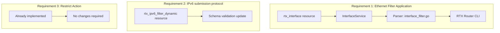

# Design Document: Filter Enhancements

## Overview

This document describes the technical design for three filter enhancement features in the RTX Terraform provider. The implementation follows existing patterns and minimizes changes to core infrastructure.

## Steering Document Alignment

### Technical Standards (tech.md)
- Go-based Terraform provider using `terraform-plugin-sdk/v2`
- SSH-based communication with RTX routers via `rtx/client`
- Parser-based command generation in `rtx/parsers`

### Project Structure (structure.md)
- Resources: `internal/provider/resource_rtx_*.go`
- Parsers: `internal/rtx/parsers/*.go`
- Client services: `internal/client/*_service.go`

## Code Reuse Analysis

### Existing Components to Leverage
- **`resource_rtx_interface.go`**: Add ethernet filter attributes to existing interface resource
- **`parsers/ethernet_filter.go`**: Existing parser for ethernet filter definitions
- **`resource_rtx_ipv6_filter_dynamic.go`**: Add `submission` to protocol validation
- **`parsers/ip_filter.go`**: Already supports `restrict`/`tcpfin`/`tcprst` - **no changes needed**

### Integration Points
- **Interface service**: Extend to handle `ethernet <interface> filter in/out` commands
- **Parser infrastructure**: Reuse existing validation and command generation patterns

## Architecture



## Feature 1: Ethernet Filter Interface Application

### Design Decision
Extend `rtx_interface` resource with new attributes rather than creating a new resource. This approach:
- Keeps all interface configuration in one place
- Follows existing pattern for `secure_filter_in/out` and `dynamic_filter_out`
- Simplifies lifecycle management

### Schema Changes

Add to `resource_rtx_interface.go`:

```go
"ethernet_filter_in": {
    Type:        schema.TypeList,
    Optional:    true,
    Description: "Ethernet (MAC) filter numbers for inbound traffic. Order matters.",
    Elem: &schema.Schema{
        Type:         schema.TypeInt,
        ValidateFunc: validation.IntBetween(1, 512),
    },
},
"ethernet_filter_out": {
    Type:        schema.TypeList,
    Optional:    true,
    Description: "Ethernet (MAC) filter numbers for outbound traffic. Order matters.",
    Elem: &schema.Schema{
        Type:         schema.TypeInt,
        ValidateFunc: validation.IntBetween(1, 512),
    },
},
```

### Command Generation

Commands to generate:
```
ethernet lan1 filter in 1 100
ethernet lan1 filter out 2 100
```

Delete commands:
```
no ethernet lan1 filter in
no ethernet lan1 filter out
```

### Parser Changes

Add to `parsers/interface.go` or create `parsers/interface_filter.go`:

```go
// EthernetFilterApplication represents ethernet filter binding to interface
type EthernetFilterApplication struct {
    Interface string // lan1, lan2, etc.
    Direction string // in, out
    Filters   []int  // Filter numbers in order
}

// ParseEthernetFilterApplication parses "ethernet <interface> filter in/out" commands
func ParseEthernetFilterApplication(raw string) ([]EthernetFilterApplication, error)

// BuildEthernetFilterApplicationCommand generates the CLI command
func BuildEthernetFilterApplicationCommand(app EthernetFilterApplication) string
```

### Client Service Changes

Extend `InterfaceService` in `internal/client/interface_service.go`:

```go
type InterfaceConfig struct {
    // ... existing fields ...
    EthernetFilterIn  []int `json:"ethernet_filter_in,omitempty"`
    EthernetFilterOut []int `json:"ethernet_filter_out,omitempty"`
}
```

## Feature 2: IPv6 Dynamic Filter Protocol Extensions

### Design Decision
Simple schema validation update. No parser changes needed as parsers accept arbitrary protocol strings.

### Schema Changes

Update `resource_rtx_ipv6_filter_dynamic.go` line 52:

```go
// Before
ValidateFunc: validation.StringInSlice([]string{"ftp", "www", "smtp", "pop3", "dns", "domain", "telnet", "ssh", "tcp", "udp", "*"}, false),

// After
ValidateFunc: validation.StringInSlice([]string{"ftp", "www", "smtp", "pop3", "dns", "domain", "telnet", "ssh", "tcp", "udp", "submission", "*"}, false),
```

### Parser Impact
- No changes required - parser already passes protocol string through

### Documentation
Update resource documentation to include `submission` in valid protocols list.

## Feature 3: Restrict Action Support

### Implementation Status: **ALREADY COMPLETE**

Investigation reveals this feature is already implemented:

1. **IP Filter Parser** (`internal/rtx/parsers/ip_filter.go:44`):
   ```go
   var ValidIPFilterActions = []string{"pass", "reject", "restrict", "restrict-log", "restrict-nolog"}
   ```

2. **Protocol Support** (`internal/rtx/parsers/ip_filter.go:47`):
   ```go
   var ValidIPFilterProtocols = []string{"tcp", "udp", "icmp", "ip", "*", "gre", "esp", "ah", "icmp6", "tcpfin", "tcprst", "tcpsyn", "established"}
   ```

3. **Resource Schema** (`internal/provider/resource_rtx_access_list_ip.go:38-39`):
   ```go
   ValidateFunc: validation.StringInSlice([]string{"pass", "reject", "restrict", "restrict-log"}, false),
   ```

4. **Tests exist** (`internal/rtx/parsers/ip_filter_test.go:524-565`):
   - `restrict-log action` test
   - `restrict-nolog action` test
   - `tcpfin protocol` test
   - `tcprst protocol` test

### Recommendation
- Mark this requirement as **complete** in requirements.md
- No implementation work needed
- Document existing capability for users

## Data Models

### InterfaceConfig (Extended)

```go
type InterfaceConfig struct {
    Name              string   `json:"name"`
    Description       string   `json:"description,omitempty"`
    IPAddress         *IPAddressConfig `json:"ip_address,omitempty"`
    SecureFilterIn    []int    `json:"secure_filter_in,omitempty"`
    SecureFilterOut   []int    `json:"secure_filter_out,omitempty"`
    DynamicFilterOut  []int    `json:"dynamic_filter_out,omitempty"`
    // New fields:
    EthernetFilterIn  []int    `json:"ethernet_filter_in,omitempty"`
    EthernetFilterOut []int    `json:"ethernet_filter_out,omitempty"`
    NatDescriptor     int      `json:"nat_descriptor,omitempty"`
    // ... other existing fields ...
}
```

### IPv6FilterDynamicEntry (Updated Description)

```go
type IPv6FilterDynamicEntry struct {
    Number   int    `json:"number"`
    Source   string `json:"source"`
    Dest     string `json:"destination"`
    Protocol string `json:"protocol"` // Now includes: submission
    Syslog   bool   `json:"syslog"`
}
```

## Error Handling

### Error Scenarios

1. **Invalid interface for ethernet filter**
   - **Handling:** Validate interface name supports ethernet filters (lan1, lan2, etc.)
   - **User Impact:** Clear error message: "Ethernet filters can only be applied to LAN interfaces"

2. **Invalid filter number reference**
   - **Handling:** Validate filter number is within range (1-512)
   - **User Impact:** Error message with valid range

3. **Unknown protocol in IPv6 dynamic filter**
   - **Handling:** Schema validation rejects unknown protocols
   - **User Impact:** List of valid protocols shown in error

## Testing Strategy

### Unit Testing

For Feature 1 (Ethernet Filter Application):
- Parser tests for `ethernet <if> filter in/out` parsing
- Command generation tests
- Interface validation tests

For Feature 2 (IPv6 submission):
- Schema validation test with `submission` protocol

### Integration Testing

- Acceptance test: Create interface with ethernet_filter_in/out
- Acceptance test: Update ethernet filter application
- Acceptance test: Import interface with existing ethernet filter application
- Acceptance test: IPv6 dynamic filter with submission protocol

### Test Cases

```go
// Feature 1: Ethernet filter application
func TestAccRTXInterface_EthernetFilter(t *testing.T) {
    resource.Test(t, resource.TestCase{
        // Test ethernet filter in/out on lan1
    })
}

// Feature 2: IPv6 submission protocol
func TestAccRTXIPv6FilterDynamic_Submission(t *testing.T) {
    resource.Test(t, resource.TestCase{
        // Test IPv6 dynamic filter with submission protocol
    })
}
```

## Implementation Summary

| Feature | Effort | Files Changed |
|---------|--------|---------------|
| 1. Ethernet Filter Application | Medium | 4-5 files |
| 2. IPv6 submission protocol | Trivial | 1 file |
| 3. Restrict Action Support | **None** | Already implemented |

### Files to Modify

1. `internal/provider/resource_rtx_interface.go` - Add schema attributes
2. `internal/client/interface_service.go` - Add fields and command handling
3. `internal/client/interfaces.go` - Add struct fields
4. `internal/rtx/parsers/interface.go` or new `interface_filter.go` - Parser logic
5. `internal/provider/resource_rtx_ipv6_filter_dynamic.go` - Add `submission` to validation
