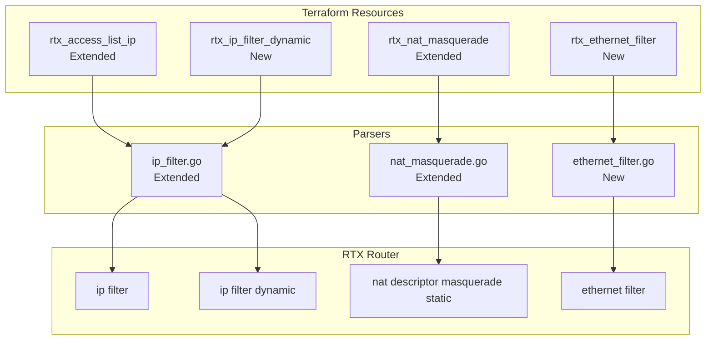

# Design Document: Filter & NAT Enhancements

## Overview

This design document outlines the implementation approach for extending the terraform-provider-rtx's filtering and NAT capabilities. The enhancements include:
1. Adding `restrict-nolog` action and TCP flag protocols (tcpfin, tcprst, tcpsyn, established) to IP filters
2. Creating a new `rtx_ip_filter_dynamic` resource for dynamic/stateful filters
3. Enabling protocol-only NAT masquerade static entries (ESP, AH, GRE)
4. Creating a new `rtx_ethernet_filter` resource for Layer 2 MAC filtering

## Steering Document Alignment

### Technical Standards (tech.md)
- Follow existing parser patterns in `internal/rtx/parsers/`
- Use standard Terraform resource CRUD patterns
- Implement comprehensive validation before SSH command execution
- Support both create and import workflows

### Project Structure (structure.md)
- Parser modules: `internal/rtx/parsers/`
- Resource files: `internal/provider/resource_rtx_*.go`
- Test files alongside implementation with `_test.go` suffix

## Code Reuse Analysis

### Existing Components to Leverage

- **`internal/rtx/parsers/ip_filter.go`**:
  - Extend `ValidIPFilterActions` to include `restrict-nolog`
  - Extend `ValidIPFilterProtocols` to include `tcpfin`, `tcprst`, `tcpsyn`, `established`
  - Extend `ValidDynamicProtocols` to include missing services
  - Reuse `IPFilterDynamic` struct with enhancements

- **`internal/rtx/parsers/nat_masquerade.go`**:
  - Extend `MasqueradeStaticEntry` to support optional port fields
  - Modify `BuildNATMasqueradeStaticCommand` to handle protocol-only entries

- **`internal/provider/resource_rtx_access_list_ip.go`**:
  - Use as template for new `rtx_ip_filter_dynamic` resource
  - Reuse validation patterns and CRUD structure

### Integration Points

- **SSH Client (`internal/client/`)**: All commands execute via existing SSH infrastructure
- **Working Session**: Reuse session management for atomic configuration changes

## Architecture

### Component Diagram



## Components and Interfaces

### Component 1: IP Filter Parser Extensions

**File:** `internal/rtx/parsers/ip_filter.go`

**Changes:**
```go
// Extend existing validation lists
ValidIPFilterActions = []string{
    "pass", "pass-log", "pass-nolog",
    "reject", "reject-log", "reject-nolog",
    "restrict", "restrict-log", "restrict-nolog",  // Add restrict-nolog
}

ValidIPFilterProtocols = []string{
    "tcp", "udp", "icmp", "ip", "*", "gre", "esp", "ah", "icmp6",
    "tcpfin", "tcprst", "tcpsyn", "established",  // Add TCP flag protocols
}

ValidDynamicProtocols = []string{
    // Existing
    "ftp", "www", "smtp", "pop3", "dns", "domain", "telnet", "ssh", "tcp", "udp", "*",
    // New services
    "tftp", "echo", "discard", "daytime", "chargen", "time", "whois",
    "gopher", "finger", "http", "sunrpc", "ident", "nntp", "ntp", "ms-rpc",
    "netbios_ns", "netbios_dgm", "netbios_ssn", "imap", "snmp", "snmptrap",
    "bgp", "imap3", "ldap", "https", "ms-ds", "ike", "rlogin", "rwho", "rsh",
    "syslog", "printer", "rip", "ripng", "ms-sql", "radius", "l2tp", "pptp",
    "nfs", "msblast", "ipsec-nat-t", "sip", "ping", "ping6", "submission", "netmeeting",
}
```

**New Functions:**
- `ParseIPFilterDynamicConfigExtended()` - Parse both forms of dynamic filter
- `BuildIPFilterDynamicCommandExtended()` - Build command for filter-reference form
- `ValidateIPFilterDynamicExtended()` - Validate all dynamic filter options

### Component 2: rtx_ip_filter_dynamic Resource (New)

**File:** `internal/provider/resource_rtx_ip_filter_dynamic.go`

**Purpose:** Manage dynamic IP filters for stateful packet inspection

**Schema:**
```hcl
resource "rtx_ip_filter_dynamic" "example" {
  number = 200080

  # Form 1: Protocol-based
  source      = "*"
  destination = "*"
  protocol    = "ftp"  # or tcp, udp, www, etc.

  # Form 2: Filter reference-based (mutually exclusive with protocol)
  # filter_list     = [10, 11]
  # in_filter_list  = [20]
  # out_filter_list = [30]

  # Options
  syslog  = false   # syslog=off
  timeout = 1800    # Optional timeout in seconds
}
```

**Interfaces:**
- `resourceRTXIPFilterDynamic()` - Resource definition
- `resourceRTXIPFilterDynamicCreate()` - Create dynamic filter
- `resourceRTXIPFilterDynamicRead()` - Read current state
- `resourceRTXIPFilterDynamicUpdate()` - Update filter
- `resourceRTXIPFilterDynamicDelete()` - Delete filter
- `resourceRTXIPFilterDynamicImport()` - Import existing filter

### Component 3: NAT Masquerade Parser Extensions

**File:** `internal/rtx/parsers/nat_masquerade.go`

**Changes to MasqueradeStaticEntry:**
```go
type MasqueradeStaticEntry struct {
    EntryNumber       int
    InsideLocal       string
    InsideLocalPort   *int    // Pointer - nil for protocol-only entries
    OutsideGlobal     *string // Optional
    OutsideGlobalPort *int    // Optional
    Protocol          string  // esp, ah, gre, icmp, tcp, udp, or number
}
```

**Changes to BuildNATMasqueradeStaticCommand:**
```go
func BuildNATMasqueradeStaticCommand(descriptorID int, entry MasqueradeStaticEntry) string {
    if entry.InsideLocalPort == nil {
        // Protocol-only: nat descriptor masquerade static 1000 1 192.168.1.253 esp
        return fmt.Sprintf("nat descriptor masquerade static %d %d %s %s",
            descriptorID, entry.EntryNumber, entry.InsideLocal, entry.Protocol)
    }
    // With port: nat descriptor masquerade static 1000 2 192.168.1.253 udp 500
    // ... existing logic
}
```

### Component 4: rtx_ethernet_filter Resource (New)

**File:** `internal/provider/resource_rtx_ethernet_filter.go`

**Purpose:** Manage Layer 2 Ethernet (MAC) filters

**Schema:**
```hcl
resource "rtx_ethernet_filter" "example" {
  number = 1
  action = "reject-nolog"  # pass-log, pass-nolog, reject-log, reject-nolog

  # MAC-based filter
  source_mac      = "bc:5c:17:05:59:3a"  # or "*"
  destination_mac = "*"                   # Optional, defaults to "*"

  # OR DHCP-based filter (mutually exclusive)
  # dhcp_type = "dhcp-bind"  # or "dhcp-not-bind"
  # dhcp_scope = 1           # Optional scope number

  # Advanced byte filtering (optional)
  # offset    = 0
  # byte_list = "08,00"
}
```

### Component 5: Ethernet Filter Parser (New)

**File:** `internal/rtx/parsers/ethernet_filter.go`

**Structs:**
```go
type EthernetFilter struct {
    Number         int
    Action         string   // pass-log, pass-nolog, reject-log, reject-nolog
    SourceMAC      string   // MAC address or "*"
    DestinationMAC string   // MAC address or "*"
    DHCPType       string   // dhcp-bind, dhcp-not-bind, or empty
    DHCPScope      *int     // Optional scope number
    Offset         *int     // Optional byte offset
    ByteList       []string // Optional byte list
}

var ValidEthernetFilterActions = []string{
    "pass-log", "pass-nolog", "reject-log", "reject-nolog",
}
```

**Functions:**
- `ParseEthernetFilterConfig()` - Parse `show config` output for ethernet filters
- `BuildEthernetFilterCommand()` - Generate `ethernet filter` command
- `BuildDeleteEthernetFilterCommand()` - Generate `no ethernet filter` command
- `BuildEthernetInterfaceFilterCommand()` - Generate interface application command
- `ValidateEthernetFilterNumber()` - Validate filter number range
- `ValidateMACAddress()` - Validate MAC address format
- `ValidateEthernetFilter()` - Full filter validation

## Data Models

### IPFilterDynamic (Extended)
```go
type IPFilterDynamic struct {
    Number        int
    Source        string
    Destination   string
    Protocol      string   // Form 1: service/protocol name
    FilterList    []int    // Form 2: static filter references
    InFilterList  []int    // Form 2: in direction filters
    OutFilterList []int    // Form 2: out direction filters
    SyslogOn      bool
    Timeout       *int     // Optional timeout in seconds
}
```

### MasqueradeStaticEntry (Extended)
```go
type MasqueradeStaticEntry struct {
    EntryNumber       int
    InsideLocal       string
    InsideLocalPort   *int    // nil for protocol-only
    OutsideGlobal     *string
    OutsideGlobalPort *int
    Protocol          string
}
```

### EthernetFilter (New)
```go
type EthernetFilter struct {
    Number         int
    Action         string
    SourceMAC      string
    DestinationMAC string
    DHCPType       string
    DHCPScope      *int
    Offset         *int
    ByteList       []string
}
```

## Error Handling

### Error Scenarios

1. **Invalid Protocol Type**
   - **Handling:** Return validation error before SSH execution
   - **User Impact:** Clear error message: "protocol 'xyz' is not valid; supported values are: tcp, udp, tcpfin, tcprst, ..."

2. **Invalid MAC Address Format**
   - **Handling:** Regex validation in schema validator
   - **User Impact:** "MAC address must be in format xx:xx:xx:xx:xx:xx or '*'"

3. **Protocol-Only Entry with Port Specified**
   - **Handling:** Schema conflict validation
   - **User Impact:** "Port cannot be specified for protocol 'esp'; remove port fields"

4. **Filter Number Out of Range**
   - **Handling:** Range validation in schema
   - **User Impact:** "Ethernet filter number must be between 1 and 512"

5. **Import Parse Failure**
   - **Handling:** Log warning and return partial state
   - **User Impact:** Warning logged, non-matching lines skipped

## Testing Strategy

### Unit Testing

**Parser Tests:**
- `ip_filter_test.go` - Add tests for new protocols and actions
- `nat_masquerade_test.go` - Add tests for protocol-only static entries
- `ethernet_filter_test.go` - New comprehensive parser tests

**Test Cases:**
```go
// IP Filter - new protocols
{"ip filter 100 pass * * tcpfin * 80", IPFilter{Action: "pass", Protocol: "tcpfin", ...}}
{"ip filter 101 restrict-nolog * * * * *", IPFilter{Action: "restrict-nolog", ...}}

// Dynamic Filter - both forms
{"ip filter dynamic 100 * * ftp syslog=off", IPFilterDynamic{Protocol: "ftp", SyslogOn: false}}
{"ip filter dynamic 101 * * filter 10 in 20", IPFilterDynamic{FilterList: []int{10}, InFilterList: []int{20}}}

// NAT - protocol-only
{"nat descriptor masquerade static 1000 1 192.168.1.253 esp", MasqueradeStaticEntry{Protocol: "esp", InsideLocalPort: nil}}

// Ethernet Filter
{"ethernet filter 1 reject-nolog bc:5c:17:* *", EthernetFilter{Action: "reject-nolog", SourceMAC: "bc:5c:17:*"}}
```

### Integration Testing

**Acceptance Tests:**
- `resource_rtx_access_list_ip_test.go` - Add restrict-nolog and tcpfin tests
- `resource_rtx_ip_filter_dynamic_test.go` - New resource tests
- `resource_rtx_nat_masquerade_test.go` - Add protocol-only entry tests
- `resource_rtx_ethernet_filter_test.go` - New resource tests

**Test Scenarios:**
1. Create IP filter with `restrict-nolog` action
2. Create IP filter with `tcpfin` protocol
3. Create dynamic filter with protocol form
4. Create dynamic filter with filter-reference form
5. Create NAT masquerade with ESP static entry (no port)
6. Create ethernet filter with MAC addresses
7. Create ethernet filter with DHCP binding
8. Import existing filters of all types

### End-to-End Testing

**Manual Verification:**
1. Apply configuration to real RTX router
2. Verify `show config` output matches expected
3. Verify import recreates exact state
4. Verify plan shows no changes after apply + import cycle

## Implementation Order

1. **Phase 1: IP Filter Extensions** (REQ-1, REQ-2)
   - Extend validation lists
   - Update parser tests
   - Update resource validation

2. **Phase 2: Dynamic IP Filter Resource** (REQ-3)
   - Create parser functions
   - Create resource file
   - Add comprehensive tests

3. **Phase 3: NAT Protocol-Only Support** (REQ-4)
   - Modify struct to use pointer types
   - Update command builder
   - Update resource schema
   - Add tests

4. **Phase 4: Ethernet Filter Resource** (REQ-5)
   - Create new parser file
   - Create new resource file
   - Add comprehensive tests
