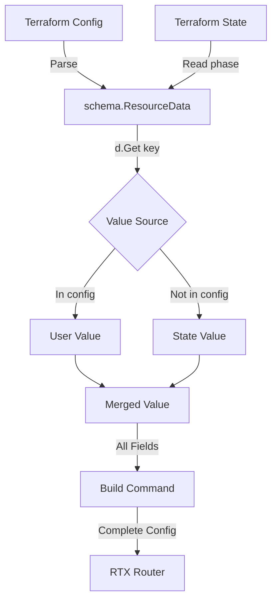

# Design Document: Optional Field Preservation

## Overview

This document describes the technical design for preserving optional field values when they are not explicitly specified in Terraform configurations. The solution uses a **Read-Merge-Write** pattern: always read current values from the router, merge with user-specified values, and write the complete configuration back.

## RTX Router Behavior (Critical Discovery)

**The RTX `user attribute` command REPLACES the entire configuration line.**

When you execute:
```
user attribute admin login-timer=120
```

Any attributes NOT included in the command (like `administrator`) are **reset to their defaults**, not preserved.

### Documented Behavior

From Yamaha RTX documentation:
- The `user attribute` command overwrites the existing line completely
- To change one attribute while keeping others, you must re-specify ALL attributes
- Missing attributes revert to factory defaults (e.g., `administrator=off`)

### Example of the Problem

```bash
# Current config
user attribute admin administrator=2

# User wants to add login-timer, runs:
user attribute admin login-timer=120

# Result: administrator privilege is LOST because it wasn't re-specified
# New config becomes:
user attribute admin login-timer=120
# (administrator defaults to off)
```

### Correct Approach

```bash
# Read current: user attribute admin administrator=2
# Merge with new: login-timer=120
# Write complete: user attribute admin administrator=2 login-timer=120
```

This behavior necessitates a **Read-Merge-Write** pattern for ALL attribute updates.

## Steering Document Alignment

### Technical Standards (tech.md)

The design follows existing project conventions:
- Uses Zerolog for structured logging
- Follows interface-first design patterns
- Uses existing error handling patterns with `fmt.Errorf`

### Project Structure (structure.md)

Implementation will follow the established structure:
- Shared utilities in `internal/provider/field_tracking.go`
- Resource-specific changes in `internal/provider/resource_*.go`
- Client-side changes in `internal/client/*.go`

## Code Reuse Analysis

### Existing Components to Leverage

- **Terraform SDK schema.ResourceData**: Use `GetOk()` method to detect explicitly set values
- **parsers package**: Extend command builders to accept optional parameters
- **client interfaces**: Update structs to use pointer types for optional fields

### Integration Points

- **Provider resources**: All Create/Update functions will use the new field tracking pattern
- **Client services**: Service methods will accept optional configurations
- **RTX parsers**: Command builders will conditionally include fields

## Architecture

The solution uses a **Read-Merge-Write** pattern across three layers:

1. **Schema Layer**: Mark fields as `Optional: true, Computed: true` to enable preservation
2. **Resource Layer**: Use `GetOk()` to detect explicitly set values, merge with current router state
3. **Client Layer**: Use pointer types to distinguish "not set" from "explicitly set"



### Read-Merge-Write Flow

1. **Read**: Current configuration is already in Terraform state (from the `Read` function called before `Update`)
2. **Merge**: For each field:
   - If user specified a value in config (`GetOk` returns true) → use user's value
   - If user did NOT specify → use value from current state (`d.Get()`)
3. **Write**: Send complete configuration with ALL fields to router

**Note**: No additional router API call is needed. Terraform always calls `Read` before `Update` to refresh state, so current values are already available in `schema.ResourceData`.

## Components and Interfaces

### Component 1: OptionalFieldHelper

- **Purpose:** Provide utility functions for extracting optional field values from ResourceData
- **Location:** `internal/provider/field_tracking.go`
- **Interfaces:**
  ```go
  // GetOptionalBool returns a pointer to bool if the field is set, nil otherwise
  func GetOptionalBool(d *schema.ResourceData, key string) *bool

  // GetOptionalInt returns a pointer to int if the field is set, nil otherwise
  func GetOptionalInt(d *schema.ResourceData, key string) *int

  // GetOptionalString returns a pointer to string if the field is set, nil otherwise
  func GetOptionalString(d *schema.ResourceData, key string) *string

  // GetOptionalStringList returns the list if set, nil otherwise
  func GetOptionalStringList(d *schema.ResourceData, key string) []string
  ```
- **Dependencies:** `github.com/hashicorp/terraform-plugin-sdk/v2/helper/schema`

### Component 2: Updated AdminUserAttributes

- **Purpose:** Represent optional user attributes with pointer types
- **Location:** `internal/client/interfaces.go`
- **Current Interface:**
  ```go
  type AdminUserAttributes struct {
      Administrator bool     // Always has a value
      Connection    []string
      GUIPages      []string
      LoginTimer    int      // 0 could be intentional
  }
  ```
- **New Interface:**
  ```go
  type AdminUserAttributes struct {
      Administrator *bool    // nil = not set, true/false = explicit
      Connection    []string // nil = not set, empty = explicitly empty
      GUIPages      []string // nil = not set
      LoginTimer    *int     // nil = not set, 0 = infinite
  }
  ```

### Component 3: Updated Command Builders

- **Purpose:** Build RTX commands with ALL fields (after merge)
- **Location:** `internal/rtx/parsers/admin.go`
- **Current Behavior:**
  ```go
  if attrs.Administrator {
      parts = append(parts, "administrator=on")
  } else {
      parts = append(parts, "administrator=off")  // Always sent - but may be wrong default!
  }
  ```
- **New Behavior:**
  ```go
  // After merge, all fields have values (either user-specified or from current config)
  if attrs.Administrator != nil {
      if *attrs.Administrator {
          parts = append(parts, "administrator=on")
      } else {
          parts = append(parts, "administrator=off")
      }
  }
  // Note: nil should not occur after proper merge, but if it does,
  // the field is omitted (router will use default)
  ```

### Component 4: Attribute Merger

- **Purpose:** Merge user-specified attributes with current router configuration
- **Location:** `internal/client/admin_service.go`
- **Interface:**
  ```go
  // MergeAdminUserAttributes merges user-specified values with current config
  // For each field: if userAttrs field is non-nil, use it; otherwise use currentAttrs
  func MergeAdminUserAttributes(userAttrs, currentAttrs AdminUserAttributes) AdminUserAttributes
  ```
- **Dependencies:** None (pure function)

## Data Models

### OptionalAdminUserAttributes

```go
// AdminUserAttributes with pointer types for optional field support
type AdminUserAttributes struct {
    Administrator *bool    `json:"administrator,omitempty"` // nil = preserve current
    Connection    []string `json:"connection,omitempty"`    // nil = preserve current
    GUIPages      []string `json:"gui_pages,omitempty"`     // nil = preserve current
    LoginTimer    *int     `json:"login_timer,omitempty"`   // nil = preserve current
}
```

### Field Tracking Pattern for Resources (Read-Merge-Write)

```go
// Example pattern for resource Update function
func resourceRTXAdminUserUpdate(ctx context.Context, d *schema.ResourceData, meta interface{}) diag.Diagnostics {
    apiClient := meta.(*apiClient)
    username := d.Get("username").(string)

    // Current values are already in state (Terraform calls Read before Update)
    // Use GetValueWithFallback to get user-specified value OR current state value
    attrs := AdminUserAttributes{
        Administrator: BoolPtr(GetBoolWithFallback(d, "administrator")),
        Connection:    GetStringListWithFallback(d, "connection"),
        GUIPages:      GetStringListWithFallback(d, "gui_pages"),
        LoginTimer:    IntPtr(GetIntWithFallback(d, "login_timer")),
    }

    // Send complete configuration to router
    user := AdminUser{
        Username:   username,
        Attributes: attrs,  // Contains ALL attributes (merged)
    }
    return apiClient.UpdateAdminUser(ctx, user)
}
```

### Helper Functions for Merge-from-State

```go
// GetBoolWithFallback returns config value if set, otherwise state value
// This achieves the merge without needing a separate merge function
func GetBoolWithFallback(d *schema.ResourceData, key string) bool {
    // GetOk returns (value, true) if explicitly set in config
    // GetOk returns (state_value, false) if not in config but in state
    // Either way, d.Get(key) returns the correct merged value
    return d.Get(key).(bool)
}

// GetIntWithFallback returns config value if set, otherwise state value
func GetIntWithFallback(d *schema.ResourceData, key string) int {
    return d.Get(key).(int)
}

// GetStringListWithFallback returns config value if set, otherwise state value
func GetStringListWithFallback(d *schema.ResourceData, key string) []string {
    raw := d.Get(key).([]interface{})
    result := make([]string, len(raw))
    for i, v := range raw {
        result[i] = v.(string)
    }
    return result
}

// BoolPtr returns a pointer to the bool value
func BoolPtr(v bool) *bool { return &v }

// IntPtr returns a pointer to the int value
func IntPtr(v int) *int { return &v }
```

**Key Insight**: Terraform's `d.Get()` already returns the merged value:
- If field is in user config → returns user's value
- If field is NOT in config but IS in state → returns state value
- This is exactly the merge behavior we need!

## Type-Specific Handling Strategies

### Bool Fields

**Example**: `administrator`

| Config | State | d.Get() Result | Command |
|--------|-------|----------------|---------|
| `true` | `false` | `true` | `administrator=on` |
| `false` | `true` | `false` | `administrator=off` |
| (not set) | `true` | `true` | `administrator=on` |
| (not set) | `false` | `false` | `administrator=off` |

**Strategy**: Simply use `d.Get(key).(bool)`. The merged value is always correct.

```go
admin := d.Get("administrator").(bool)
if admin {
    parts = append(parts, "administrator=on")
} else {
    parts = append(parts, "administrator=off")
}
```

### Int Fields

**Example**: `login_timer` (0 = infinite, valid value)

| Config | State | d.Get() Result | Command |
|--------|-------|----------------|---------|
| `120` | `0` | `120` | `login-timer=120` |
| `0` | `120` | `0` | `login-timer=0` |
| (not set) | `120` | `120` | `login-timer=120` |
| (not set) | `0` | `0` | `login-timer=0` |

**Strategy**: Use `d.Get(key).(int)`. Zero is a valid value and will be correctly preserved/applied.

```go
timer := d.Get("login_timer").(int)
parts = append(parts, fmt.Sprintf("login-timer=%d", timer))
```

**Special Case**: If a field should be omitted when zero (not sent to router):
```go
timer := d.Get("login_timer").(int)
if timer > 0 {
    parts = append(parts, fmt.Sprintf("login-timer=%d", timer))
}
// If 0, omit from command (router uses default)
```

### String Fields

**Example**: `description`

| Config | State | d.Get() Result | Command |
|--------|-------|----------------|---------|
| `"new"` | `"old"` | `"new"` | `description="new"` |
| `""` | `"old"` | `""` | `description=""` (explicit empty) |
| (not set) | `"old"` | `"old"` | `description="old"` |
| (not set) | `""` | `""` | (omit or `description=""`) |

**Strategy**: Use `d.Get(key).(string)`. Empty string may be intentional.

```go
desc := d.Get("description").(string)
if desc != "" {
    parts = append(parts, fmt.Sprintf("description=%s", desc))
}
// If empty, decide based on RTX behavior:
// - If router accepts empty: include it
// - If router treats empty as "remove": may omit
```

### List/Set Fields (Simple Values)

**Example**: `connection` (allowed connection types: serial, telnet, ssh, etc.)

For simple value lists (strings, ints), the list is treated as a **whole unit** - if user specifies a list, it replaces the entire list.

| Config | State | d.Get() Result | Command |
|--------|-------|----------------|---------|
| `["ssh"]` | `["telnet"]` | `["ssh"]` | `connection=ssh` |
| `[]` | `["telnet"]` | `[]` | (explicit empty - remove all) |
| (not set) | `["telnet"]` | `["telnet"]` | `connection=telnet` |
| (not set) | `[]` | `[]` | (no connection specified) |

**Strategy**: Use `d.Get(key).([]interface{})` and convert to `[]string`.

```go
func getStringList(d *schema.ResourceData, key string) []string {
    raw := d.Get(key).([]interface{})
    if len(raw) == 0 {
        return nil  // or []string{} depending on semantics
    }
    result := make([]string, len(raw))
    for i, v := range raw {
        result[i] = v.(string)
    }
    return result
}

// Usage
connections := getStringList(d, "connection")
if len(connections) > 0 {
    parts = append(parts, fmt.Sprintf("connection=%s", strings.Join(connections, ",")))
}
```

**Note on Empty Lists**: An explicitly empty list `[]` vs not specified requires `GetOk()` to distinguish:
```go
if v, ok := d.GetOk("connection"); ok {
    // Explicitly set (could be empty list)
    connections := convertToStringList(v)
    // Include in command even if empty
} else {
    // Not set - use state value
    connections := getStringList(d, "connection")
}
```

### List/Set Fields (Nested Blocks) - Recursive Merge

**Example**: `filter_rules` block with multiple rules, each having its own fields

```hcl
resource "rtx_firewall" "example" {
  filter_rules {
    id       = 1
    action   = "accept"
    protocol = "tcp"
    # port not specified - should preserve current value
  }
  filter_rules {
    id       = 2
    action   = "deny"
    # This is a new rule
  }
}
```

For nested block lists, we need **recursive merge by identifier**:

1. **Match by identifier**: Use a unique field (e.g., `id`, `name`) to match config blocks with state blocks
2. **Merge each block**: For matched blocks, apply field-level merge (config value or state value)
3. **Handle additions**: Blocks in config but not in state are new additions
4. **Handle deletions**: Blocks in state but not in config are removed (if user explicitly removed them)

**Strategy**:

```go
// MergeNestedBlocks merges config blocks with state blocks by identifier
func MergeNestedBlocks(d *schema.ResourceData, key string, idField string) []map[string]interface{} {
    // Get config blocks (what user specified)
    configBlocks := getBlockList(d, key, true)  // from config
    // Get state blocks (current values)
    stateBlocks := getBlockList(d, key, false)  // from state

    // Build state lookup by identifier
    stateByID := make(map[interface{}]map[string]interface{})
    for _, block := range stateBlocks {
        if id, ok := block[idField]; ok {
            stateByID[id] = block
        }
    }

    // Merge each config block with corresponding state block
    result := make([]map[string]interface{}, 0, len(configBlocks))
    for _, configBlock := range configBlocks {
        id := configBlock[idField]
        if stateBlock, exists := stateByID[id]; exists {
            // Merge: config values override, unset fields use state values
            merged := mergeBlock(configBlock, stateBlock)
            result = append(result, merged)
        } else {
            // New block - use config values only
            result = append(result, configBlock)
        }
    }

    return result
}

// mergeBlock merges two blocks, preferring configBlock values when set
func mergeBlock(configBlock, stateBlock map[string]interface{}) map[string]interface{} {
    result := make(map[string]interface{})

    // Start with state values
    for k, v := range stateBlock {
        result[k] = v
    }

    // Override with config values (recursively for nested structures)
    for k, v := range configBlock {
        if nested, ok := v.([]interface{}); ok && len(nested) > 0 {
            // Recursive merge for nested blocks
            if stateNested, ok := stateBlock[k].([]interface{}); ok {
                result[k] = mergeNestedLists(nested, stateNested)
            } else {
                result[k] = v
            }
        } else {
            result[k] = v
        }
    }

    return result
}
```

**Example Merge Scenario**:

```
State:
  filter_rules:
    - id: 1, action: "accept", protocol: "tcp", port: 80
    - id: 2, action: "accept", protocol: "udp", port: 53

Config:
  filter_rules:
    - id: 1, action: "deny"  # Change action, keep other fields
    - id: 3, action: "accept", protocol: "icmp"  # New rule

Result (after merge):
  filter_rules:
    - id: 1, action: "deny", protocol: "tcp", port: 80  # Merged
    - id: 3, action: "accept", protocol: "icmp"  # New
    # id: 2 removed (not in config)
```

**Important Considerations for Nested Blocks**:

1. **Identifier Selection**: Choose a field that uniquely identifies each block (e.g., `id`, `name`, `index`)
2. **Deletion Semantics**: Blocks not in config are removed - this is intentional Terraform behavior
3. **Deep Nesting**: Apply recursively for blocks within blocks
4. **Order Sensitivity**: Some resources may be order-sensitive; preserve order from config

## Summary Table: Type Handling

| Type | Get Method | Zero Value | Merge Strategy |
|------|-----------|------------|----------------|
| Bool | `d.Get(key).(bool)` | `false` | Direct use - always has value |
| Int | `d.Get(key).(int)` | `0` | Direct use - 0 may be valid |
| String | `d.Get(key).(string)` | `""` | Direct use - empty may be valid |
| List (simple) | `d.Get(key).([]interface{})` | `nil`/`[]` | Replace entire list |
| List (nested) | Custom merge function | `nil`/`[]` | **Recursive merge by identifier** |
| Set | `d.Get(key).(*schema.Set)` | empty set | Replace entire set |

## Schema Changes

### Current Schema Pattern (Problematic)

```go
"administrator": {
    Type:        schema.TypeBool,
    Optional:    true,
    Description: "Whether user has administrator privileges",
},
```

### New Schema Pattern

```go
"administrator": {
    Type:        schema.TypeBool,
    Optional:    true,
    Computed:    true,  // Allow reading current value
    Description: "Whether user has administrator privileges",
},
```

The `Computed: true` flag allows Terraform to:
1. Accept user-specified values (Optional)
2. Read and preserve current values from the router (Computed)
3. Show accurate diffs in `terraform plan`

## Error Handling

### Error Scenarios

1. **Field Type Mismatch**
   - **Handling:** Use type assertions with ok check, return diagnostic on failure
   - **User Impact:** Clear error message indicating which field has incorrect type

2. **Router Command Failure**
   - **Handling:** Existing error handling patterns apply
   - **User Impact:** Command output included in error message

3. **Partial Update Failure**
   - **Handling:** If attribute command fails, user creation still succeeds but attributes may not be set
   - **User Impact:** Error clearly indicates which part failed

## Testing Strategy

### Unit Testing

- Test `GetOptional*` helper functions with:
  - Value explicitly set
  - Value not set (GetOk returns false)
  - Value set to zero/false/empty (should be detected as set)
- Test command builders with:
  - All fields set
  - No fields set (should return empty command)
  - Mix of set and unset fields

### Integration Testing

- Test resource create with missing optional fields
- Test resource update preserving unspecified fields
- Test resource import followed by apply (no changes expected)

### Regression Testing

- **Administrator Lockout Scenario**: Create user without `administrator` field, verify it doesn't get set to `off`
- **Full Attribute Test**: Create user with all attributes, update only username, verify attributes preserved

## Implementation Order

1. **Phase 1**: Create shared helper utilities (`field_tracking.go`)
2. **Phase 2**: Update client interfaces to use pointer types
3. **Phase 3**: Update command builders to handle nil values
4. **Phase 4**: Update resource Create/Update functions
5. **Phase 5**: Add/update tests
6. **Phase 6**: Audit all other resources for same pattern

## Backward Compatibility

### Terraform State Compatibility

- Existing state files remain compatible
- `Computed: true` allows reading values not in config
- No state migration required

### Configuration Compatibility

- Existing configs with explicit values continue to work
- Configs without optional fields now correctly preserve router values
- No breaking changes to HCL syntax

## Performance Considerations

- `GetOk()` and `d.Get()` overhead is minimal (simple map lookup)
- **No additional router API calls**: Current values are already in Terraform state
  - Terraform calls `Read` before `Update` to refresh state
  - `d.Get()` returns merged value (config or state) automatically
  - Zero additional SSH commands needed
- Command strings will be complete (all fields included)

## Security Considerations

- Prevents accidental removal of administrator privileges
- Sensitive fields (passwords) already handled separately
- No new security concerns introduced
