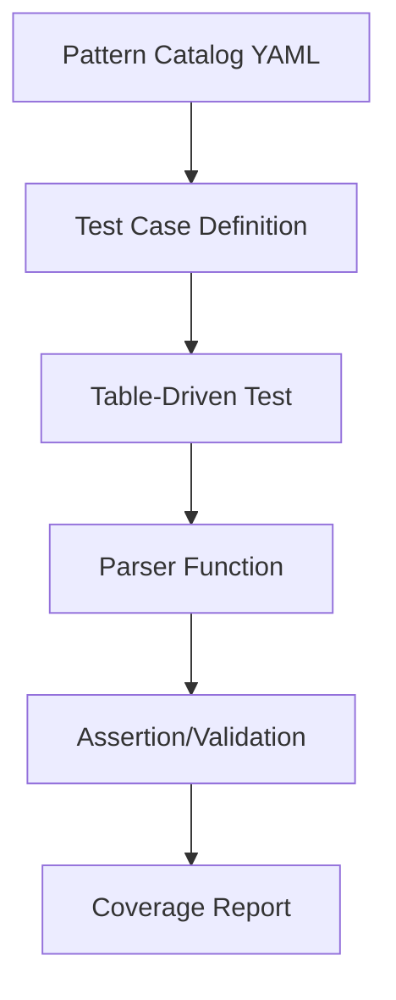

# Design Document: Parser Edge Case Tests

## Overview

This feature adds comprehensive edge case tests to four high-priority parsers (IPsec, OSPF, NAT, BGP) that currently have functional coverage but lack exhaustive parameter combination testing. The design follows the established pattern-driven testing methodology.

## Steering Document Alignment

### Technical Standards (tech.md)
- Follow Go's table-driven test pattern consistently
- Reference YAML pattern catalogs for test case generation
- Maintain test independence (no shared state)

### Project Structure (structure.md)
- Tests located in `internal/rtx/parsers/*_test.go`
- Pattern catalogs in `internal/rtx/testdata/patterns/*.yaml`
- Fixtures in `internal/rtx/testdata/fixtures/*/`

## Code Reuse Analysis

### Existing Components to Leverage
- **Existing test files**: Extend `ipsec_tunnel_test.go`, `ospf_test.go`, `nat_masquerade_test.go`, `bgp_test.go`
- **Pattern catalogs**: Reference `ipsec.yaml`, `ospf.yaml`, `nat.yaml`, `bgp.yaml`
- **Test helpers**: Use existing assertion patterns and test utilities

### Integration Points
- **YAML pattern catalogs**: Tests will reference specific pattern entries
- **Existing test infrastructure**: Use same test setup/teardown patterns

## Architecture



## Components and Interfaces

### Component 1: IPsec Edge Case Tests
- **Purpose:** Test all encryption/authentication algorithm combinations
- **File:** `internal/rtx/parsers/ipsec_tunnel_test.go`
- **Test Functions:**
  - `TestParseIPsecEncryptionAlgorithms` - All encryption variants
  - `TestParseIPsecHashAlgorithms` - All hash algorithm variants
  - `TestParseIPsecIKEVersions` - IKEv1/IKEv2 configurations
  - `TestParseIPsecNATTraversal` - NAT-T options
  - `TestParseIPsecAuthentication` - PSK, certificate, XAUTH
- **Reuses:** Existing `TestParseIPsecTunnel*` patterns

### Component 2: OSPF Edge Case Tests
- **Purpose:** Test all area types and authentication options
- **File:** `internal/rtx/parsers/ospf_test.go`
- **Test Functions:**
  - `TestParseOSPFAreaTypes` - Normal, stub, NSSA, totally stubby
  - `TestParseOSPFAuthentication` - None, simple, MD5
  - `TestParseOSPFRedistribution` - Static, connected, with metrics
  - `TestParseOSPFInterfaceSettings` - Cost, priority, timers
- **Reuses:** Existing `TestParseOSPF*` patterns

### Component 3: NAT Edge Case Tests
- **Purpose:** Test all NAT types and port mapping variations
- **File:** `internal/rtx/parsers/nat_masquerade_test.go`
- **Test Functions:**
  - `TestParseNATPortRanges` - Single port, port ranges
  - `TestParseNATProtocols` - TCP, UDP, ICMP, any
  - `TestParseNATDynamic` - Pool configurations
  - `TestParseNATStaticEdgeCases` - 1:1 mapping variants
- **Reuses:** Existing `TestParseNAT*` patterns

### Component 4: BGP Edge Case Tests
- **Purpose:** Test route-map, ASN, and community configurations
- **File:** `internal/rtx/parsers/bgp_test.go`
- **Test Functions:**
  - `TestParseBGPRouteMap` - In/out route-maps
  - `TestParseBGP4ByteASN` - asdot/asplain notation
  - `TestParseBGPCommunity` - Standard, well-known, extended
  - `TestParseBGPNeighborAdvanced` - Multihop, timers, passwords
- **Reuses:** Existing `TestParseBGP*` patterns

## Data Models

### Test Case Structure
```go
type EdgeCaseTest struct {
    Name           string   // Descriptive test name
    Input          string   // RTX command string
    Expected       any      // Expected parsed result
    PatternRef     string   // Reference to YAML pattern entry
    DocRef         string   // RTX documentation reference
}
```

### Pattern Catalog Entry Addition
```yaml
edge_cases:
  - name: encryption_aes_gcm_256
    input: "ipsec ike encryption 1 aes-gcm-256"
    expected:
      tunnel_id: 1
      algorithm: "aes-gcm-256"
    doc_ref: "Chapter 15, ipsec ike encryption"
```

## Error Handling

### Error Scenarios
1. **Invalid algorithm name:**
   - **Handling:** Parser returns error with invalid algorithm message
   - **Test Impact:** Verify error message content and type

2. **Out-of-range numeric values:**
   - **Handling:** Parser returns validation error
   - **Test Impact:** Test boundary values (min-1, min, max, max+1)

## Testing Strategy

### Unit Testing
- Each edge case is an independent table-driven test entry
- Tests grouped by feature area within test functions
- Subtests use descriptive names referencing the edge case

### Coverage Metrics
| Parser | Current Tests | Target Tests | Edge Cases Added |
|--------|--------------|--------------|------------------|
| ipsec_tunnel | 11 | 31 | ~20 |
| ospf | 19 | 34 | ~15 |
| nat_masquerade | 26 | 41 | ~15 |
| bgp | 31 | 41 | ~10 |

### Test Naming Convention
```
TestParse{Feature}{Category}/{specific_edge_case}
```
Example: `TestParseIPsecEncryptionAlgorithms/aes_gcm_256_mode`
