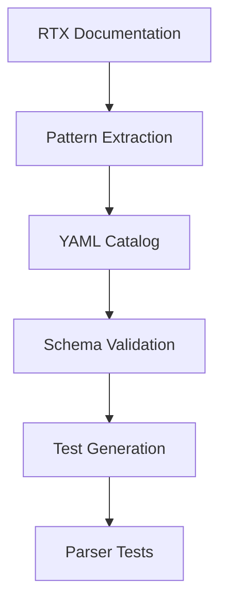

# Design Document: Parser Pattern Catalogs

## Overview

This feature creates YAML pattern catalogs for 7 parsers that currently lack explicit documentation, and adds test coverage for the IPsec transport mode parser. The catalogs follow the established schema and enable automated test generation.

## Steering Document Alignment

### Technical Standards (tech.md)
- Follow existing `schema.yaml` structure for all catalogs
- Maintain consistency with existing catalogs (dns.yaml, vlan.yaml, etc.)
- Include RTX documentation references

### Project Structure (structure.md)
- Pattern catalogs in `internal/rtx/testdata/patterns/*.yaml`
- Test file in `internal/rtx/parsers/ipsec_transport_test.go`

## Code Reuse Analysis

### Existing Components to Leverage
- **schema.yaml**: Base schema for all pattern catalogs
- **Existing catalogs**: Reference structure from dns.yaml, vlan.yaml
- **ipsec_tunnel_test.go**: Pattern for IPsec transport tests

### Integration Points
- **Parser registry**: Catalogs reference existing parser file names
- **Test framework**: Enable YAML-driven test generation

## Architecture



## Components and Interfaces

### Component 1: ip_filter.yaml
- **Purpose:** Document IP filter command patterns
- **File:** `internal/rtx/testdata/patterns/ip_filter.yaml`
- **Commands Covered:**
  - `ip filter <n> <action> <src> <dst> <proto> [opts]`
  - `ip filter set <interface> <filter-list>`
  - `ip filter dynamic <n> <src> <dst> <proto> <trigger>`
- **Reuses:** Schema from schema.yaml

### Component 2: ethernet_filter.yaml
- **Purpose:** Document Ethernet/MAC filter patterns
- **File:** `internal/rtx/testdata/patterns/ethernet_filter.yaml`
- **Commands Covered:**
  - `ethernet filter <n> <action> <src-mac> <dst-mac>`
  - `ethernet filter <n> vlan <vid>`
  - `ethernet filter <n> ether-type <type>`
- **Reuses:** Schema from schema.yaml

### Component 3: bridge.yaml
- **Purpose:** Document bridge interface patterns
- **File:** `internal/rtx/testdata/patterns/bridge.yaml`
- **Commands Covered:**
  - `bridge member <bridge> <interface-list>`
  - `bridge group <n> <interface-list>`
  - `ip bridge address <bridge> <ip>/<mask>`
- **Reuses:** Schema from schema.yaml

### Component 4: service.yaml
- **Purpose:** Document HTTPD/SSHD/SFTPD patterns
- **File:** `internal/rtx/testdata/patterns/service.yaml`
- **Commands Covered:**
  - `httpd host <host-list>`
  - `httpd listen <port>`
  - `sshd host <host-list>`
  - `sshd host key generate`
  - `sftpd host <host-list>`
- **Reuses:** Schema from schema.yaml

### Component 5: system.yaml
- **Purpose:** Document system configuration patterns
- **File:** `internal/rtx/testdata/patterns/system.yaml`
- **Commands Covered:**
  - `timezone <offset>`
  - `console character <encoding>`
  - `console speed <baud>`
  - `statistics <type> on/off`
- **Reuses:** Schema from schema.yaml

### Component 6: ipv6_interface.yaml
- **Purpose:** Document IPv6 interface patterns
- **File:** `internal/rtx/testdata/patterns/ipv6_interface.yaml`
- **Commands Covered:**
  - `ipv6 <interface> address <addr>/<prefix>`
  - `ipv6 <interface> rtadv send <prefix> <opts>`
  - `ipv6 <interface> dhcp service client`
  - `ipv6 <interface> mtu <size>`
- **Reuses:** Schema from schema.yaml

### Component 7: ipv6_prefix.yaml
- **Purpose:** Document IPv6 prefix patterns
- **File:** `internal/rtx/testdata/patterns/ipv6_prefix.yaml`
- **Commands Covered:**
  - `ipv6 prefix <n> <prefix>/<len>`
  - `ipv6 prefix <n> ra-prefix <interface>`
  - `ipv6 prefix <n> dhcp-prefix <interface>`
- **Reuses:** Schema from schema.yaml

### Component 8: ipsec_transport_test.go
- **Purpose:** Add test coverage for IPsec transport parser
- **File:** `internal/rtx/parsers/ipsec_transport_test.go`
- **Test Functions:**
  - `TestParseIPsecTransportConfig`
  - `TestParseIPsecTransportSA`
  - `TestBuildIPsecTransportCommands`
- **Reuses:** Patterns from ipsec_tunnel_test.go

## Data Models

### Pattern Catalog Schema
```yaml
metadata:
  name: string           # Catalog name
  parser: string         # Parser file reference
  chapter: string        # RTX doc chapter
  last_updated: date

patterns:
  - name: string         # Pattern identifier
    command: string      # Base command
    format: string       # Full format with placeholders
    parameters:
      - name: string
        type: enum       # int, string, ipv4, ipv6, mac, enum, bool
        range: string    # For numeric types
        values: []       # For enum types
        default: any     # Default value
        required: bool
    examples:
      - input: string
        description: string
        expected: object
```

## Error Handling

### Error Scenarios
1. **Invalid YAML syntax:**
   - **Handling:** Schema validation fails with line number
   - **User Impact:** Clear error message pointing to syntax issue

2. **Missing required fields:**
   - **Handling:** Schema validator reports missing fields
   - **User Impact:** List of missing required fields

## Testing Strategy

### Unit Testing
- Each catalog validated against schema.yaml
- Test generation from catalog examples
- Parser round-trip tests (parse → build → parse)

### Validation Checklist
| Catalog | Commands | Examples | Schema Valid |
|---------|----------|----------|--------------|
| ip_filter.yaml | 3+ | 6+ | ✓ |
| ethernet_filter.yaml | 3+ | 4+ | ✓ |
| bridge.yaml | 3+ | 4+ | ✓ |
| service.yaml | 5+ | 6+ | ✓ |
| system.yaml | 4+ | 5+ | ✓ |
| ipv6_interface.yaml | 4+ | 6+ | ✓ |
| ipv6_prefix.yaml | 3+ | 4+ | ✓ |
