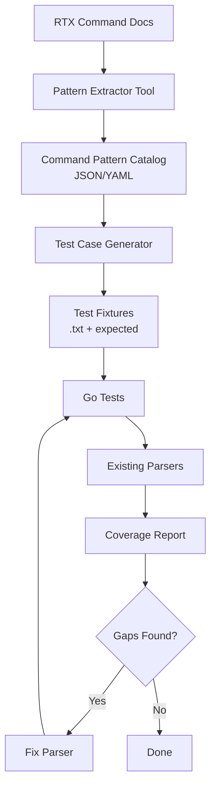

# Design Document: RTX Command Parser Test Coverage

## Overview

This design describes the approach for systematically extracting RTX command patterns from documentation, generating comprehensive test cases, and validating existing parsers. The goal is to ensure parser reliability by identifying and fixing any parsing gaps.

## Steering Document Alignment

### Technical Standards (tech.md)
- Uses Go's standard testing package with table-driven tests (established pattern)
- Follows existing parser registry pattern in `internal/rtx/parsers/`
- Test fixtures stored in `internal/rtx/testdata/` (existing structure)

### Project Structure (structure.md)
- Test files colocated with parser implementations (`*_test.go`)
- Test fixtures organized by category in `internal/rtx/testdata/`
- Command pattern catalog stored in `docs/RTX-commands/` (source documentation)

## Code Reuse Analysis

### Existing Components to Leverage
- **Parser Registry** (`internal/rtx/parsers/registry.go`): Centralized parser management
- **Existing Parsers** (~25 parsers): dns.go, static_route.go, vlan.go, ipsec_tunnel.go, etc.
- **Existing Test Patterns**: Table-driven tests with input/expected pairs
- **Test Fixtures**: `internal/rtx/testdata/` structure with `.txt` and `.golden.json` files

### Integration Points
- **RTX Command Documentation** (`docs/RTX-commands/*.md`): Source for command patterns
- **Existing `*_test.go` files**: Extend with additional test cases

## Architecture



### Modular Design Principles
- **Pattern Extractor**: Standalone script to parse markdown documentation
- **Test Case Generator**: Creates test fixtures from pattern catalog
- **Coverage Reporter**: Summarizes test results and identifies gaps
- **Each parser maintains its own tests**: No centralized test runner changes needed

## Components and Interfaces

### Component 1: Command Pattern Catalog
- **Purpose:** Structured representation of all RTX command syntax patterns
- **Format:** YAML files organized by chapter/category
- **Location:** `internal/rtx/testdata/patterns/`
- **Example:**
```yaml
# patterns/dns.yaml
commands:
  - name: dns server
    syntax: "dns server <ip1> [ip2] [ip3]"
    parameters:
      - name: ip1
        type: ipv4
        required: true
      - name: ip2
        type: ipv4
        required: false
      - name: ip3
        type: ipv4
        required: false
    examples:
      - input: "dns server 8.8.8.8"
        chapter: 24
        section: "24.1"
      - input: "dns server 8.8.8.8 8.8.4.4"
        chapter: 24
        section: "24.1"
    parser: dns.go
```

### Component 2: Test Fixture Generator
- **Purpose:** Generate test input/expected pairs from pattern catalog
- **Interfaces:**
  - `GenerateFixtures(patternFile string) ([]TestFixture, error)`
  - `WriteFixtures(fixtures []TestFixture, outputDir string) error`
- **Dependencies:** Pattern catalog YAML files
- **Reuses:** Existing `internal/rtx/testdata/` directory structure

### Component 3: Parser Test Runner
- **Purpose:** Execute tests and collect results
- **Interfaces:** Standard Go test commands (`go test ./internal/rtx/parsers/...`)
- **Dependencies:** Existing test infrastructure
- **Output:** Test results with pass/fail/skip counts

### Component 4: Coverage Report Generator
- **Purpose:** Summarize coverage and identify gaps
- **Interfaces:**
  - `GenerateReport(testResults, patternCatalog) CoverageReport`
- **Output:** Markdown report with:
  - Patterns tested vs. total patterns
  - Failing tests with details
  - Patterns without parser coverage

## Data Models

### CommandPattern
```go
type CommandPattern struct {
    Name        string           `yaml:"name"`
    Syntax      string           `yaml:"syntax"`
    NoForm      string           `yaml:"no_form,omitempty"`
    Parameters  []Parameter      `yaml:"parameters"`
    Examples    []Example        `yaml:"examples"`
    Parser      string           `yaml:"parser"`
    Chapter     int              `yaml:"chapter"`
    Section     string           `yaml:"section"`
}

type Parameter struct {
    Name     string   `yaml:"name"`
    Type     string   `yaml:"type"`     // ipv4, ipv6, int, bool, string, interface, etc.
    Required bool     `yaml:"required"`
    Default  string   `yaml:"default,omitempty"`
    Range    string   `yaml:"range,omitempty"`   // e.g., "1-100", "64-1500"
    Values   []string `yaml:"values,omitempty"`  // enum values like "on", "off"
}

type Example struct {
    Input    string `yaml:"input"`
    Chapter  int    `yaml:"chapter"`
    Section  string `yaml:"section"`
}
```

### TestFixture
```go
type TestFixture struct {
    Name           string                 `json:"name"`
    Input          string                 `json:"input"`
    Expected       map[string]interface{} `json:"expected"`
    Parser         string                 `json:"parser"`
    Source         string                 `json:"source"` // e.g., "Chapter 24, Section 24.1"
    Category       string                 `json:"category"`
    EdgeCase       bool                   `json:"edge_case"`
}
```

### CoverageReport
```go
type CoverageReport struct {
    TotalPatterns    int
    TestedPatterns   int
    PassingTests     int
    FailingTests     int
    SkippedTests     int
    CoveragePercent  float64
    ByCategory       map[string]CategoryStats
    Gaps             []Gap
}

type CategoryStats struct {
    Total   int
    Tested  int
    Passing int
    Failing int
}

type Gap struct {
    Pattern    string
    Parser     string
    Reason     string // "no_parser", "failing_test", "no_test"
    Priority   string // "high", "medium", "low"
}
```

## Test Fixture Organization

```
internal/rtx/testdata/
├── patterns/                    # Command pattern catalog (NEW)
│   ├── dns.yaml
│   ├── ip.yaml
│   ├── ipsec.yaml
│   ├── vlan.yaml
│   └── ...
├── fixtures/                    # Generated test fixtures (NEW)
│   ├── dns/
│   │   ├── dns_server_basic.txt
│   │   ├── dns_server_basic.expected.json
│   │   ├── dns_server_select.txt
│   │   ├── dns_server_select.expected.json
│   │   └── ...
│   ├── ip/
│   ├── ipsec/
│   └── ...
├── import_fidelity/             # Existing complex test cases
│   └── ...
├── RTX830/                      # Existing model-specific data
│   └── ...
└── RTX1210/
    └── ...
```

## Phase 1 Implementation: Priority Commands

Focus on commands used by existing Terraform resources first:

| Category | Parser File | Terraform Resource | Priority |
|----------|-------------|-------------------|----------|
| DNS | dns.go | rtx_dns_server | High |
| Static Route | static_route.go | rtx_static_route | High |
| VLAN | vlan.go | rtx_vlan | High |
| Interface | interface_config.go | rtx_interface | High |
| IPsec | ipsec_tunnel.go | rtx_ipsec_tunnel | High |
| OSPF | ospf.go | rtx_ospf | High |
| BGP | bgp.go | rtx_bgp | High |
| NAT | nat_masquerade.go, nat_static.go | rtx_nat_* | High |
| DHCP | dhcp_scope.go, dhcp_bindings.go | rtx_dhcp_* | Medium |
| L2TP | l2tp.go | rtx_l2tp | Medium |
| PPTP | pptp.go | rtx_pptp | Medium |
| Schedule | schedule.go | rtx_schedule | Medium |
| Admin | admin.go | rtx_admin_user | Medium |
| SNMP | snmp.go | rtx_snmp | Low |
| Syslog | syslog.go | rtx_syslog | Low |
| QoS | qos.go | rtx_qos | Low |

## Error Handling

### Error Scenarios
1. **Pattern extraction fails**
   - **Handling:** Log warning, continue with other chapters
   - **User Impact:** Partial catalog generated

2. **Test fixture generation fails**
   - **Handling:** Log error with pattern details
   - **User Impact:** Missing test case identified in report

3. **Parser not found for pattern**
   - **Handling:** Mark as "skip" in test results
   - **User Impact:** Gap identified in coverage report

4. **Test assertion fails**
   - **Handling:** Standard Go test failure with diff
   - **User Impact:** Detailed failure message with expected vs actual

## Testing Strategy

### Unit Testing
- Each pattern catalog YAML file is validated
- Test fixture generator produces valid JSON
- Coverage report generator calculates statistics correctly

### Integration Testing
- Pattern extraction from sample documentation
- End-to-end: documentation → catalog → fixtures → test execution

### Existing Test Enhancement
- Add new test cases to existing `*_test.go` files
- Use table-driven tests for easy addition of cases
- Reference documentation source in test comments

## Implementation Workflow

1. **Extract patterns** from one chapter (e.g., DNS, Chapter 24)
2. **Create YAML catalog** for that chapter
3. **Generate test fixtures** from catalog
4. **Add tests** to existing `*_test.go`
5. **Run tests** and identify failures
6. **Fix parser** if needed
7. **Repeat** for next chapter

This incremental approach allows continuous progress while maintaining working code.
