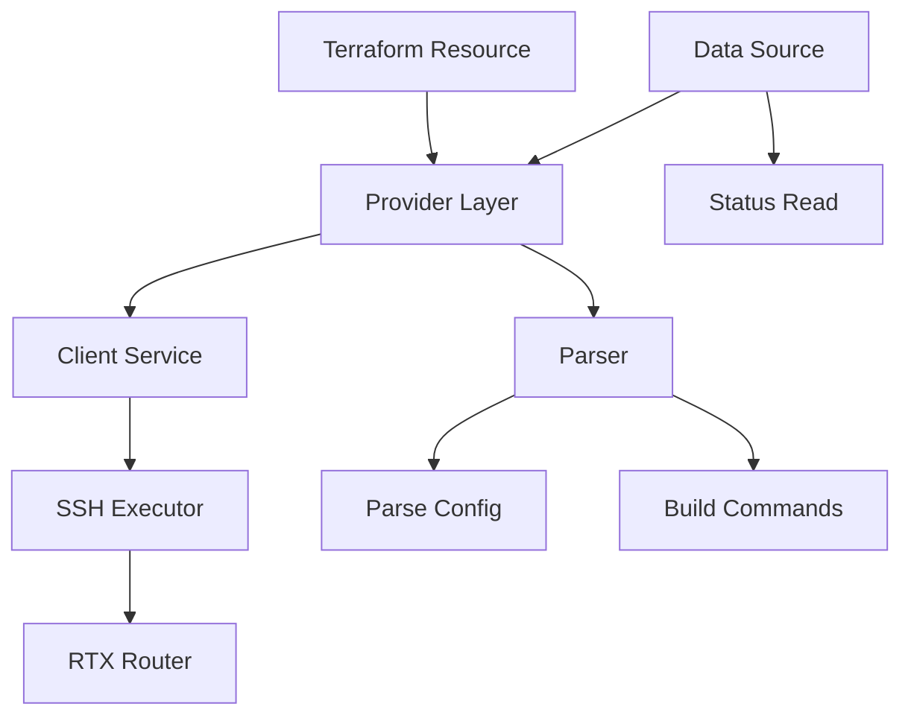

# Design Document: RTX DDNS Resource

## Overview

This feature implements Terraform resources for Dynamic DNS configuration on Yamaha RTX routers, including support for Yamaha's NetVolante DNS service and custom DDNS providers. The design follows the established parser → client → provider pattern.

## Steering Document Alignment

### Technical Standards (tech.md)
- Follow existing parser implementation patterns
- Use SSH command execution via existing client infrastructure
- Implement CRUD operations with import support

### Project Structure (structure.md)
- Parser: `internal/rtx/parsers/ddns.go`
- Client: `internal/client/ddns_service.go`
- Provider: `internal/provider/resource_rtx_ddns.go`, `resource_rtx_netvolante_dns.go`
- Data Source: `internal/provider/data_source_rtx_ddns_status.go`
- Tests: Corresponding `*_test.go` files
- Examples: `examples/ddns/main.tf`

## Code Reuse Analysis

### Existing Components to Leverage
- **SSH Client**: `internal/client/client.go` for command execution
- **Parser patterns**: Follow `dns.go` structure
- **Resource patterns**: Follow singleton resource patterns (like `resource_rtx_dns_server.go`)

### Integration Points
- **Interface system**: DDNS binds to specific interfaces for IP detection
- **PP interfaces**: Common to update DNS when PPPoE reconnects
- **VPN resources**: DDNS hostnames used as VPN endpoints

## Architecture



## Components and Interfaces

### Component 1: DDNS Parser
- **Purpose:** Parse and build DDNS commands
- **File:** `internal/rtx/parsers/ddns.go`
- **Interfaces:**
  ```go
  func ParseDDNSConfig(output string) (*DDNSConfig, error)
  func ParseNetVolanteDNS(output string) (*NetVolanteConfig, error)
  func ParseDDNSStatus(output string) (*DDNSStatus, error)
  func BuildNetVolanteCommand(config *NetVolanteConfig) []string
  func BuildDDNSCommand(config *DDNSConfig) []string
  ```
- **Dependencies:** regexp, strings, strconv, time
- **Reuses:** Parsing patterns from dns.go

### Component 2: DDNS Service
- **Purpose:** Execute DDNS operations via SSH
- **File:** `internal/client/ddns_service.go`
- **Interfaces:**
  ```go
  type DDNSService interface {
      // NetVolante DNS
      GetNetVolanteDNS() (*NetVolanteConfig, error)
      ConfigureNetVolanteDNS(config *NetVolanteConfig) error
      UpdateNetVolanteDNS(config *NetVolanteConfig) error
      DeleteNetVolanteDNS() error
      TriggerNetVolanteUpdate() error

      // Custom DDNS
      GetDDNS(id int) (*DDNSConfig, error)
      ConfigureDDNS(config *DDNSConfig) error
      DeleteDDNS(id int) error

      // Status
      GetDDNSStatus() (*DDNSStatus, error)
  }
  ```
- **Dependencies:** client.Executor
- **Reuses:** Command execution pattern from dns_service.go

### Component 3: NetVolante DNS Resource
- **Purpose:** Terraform resource for Yamaha NetVolante DNS
- **File:** `internal/provider/resource_rtx_netvolante_dns.go`
- **Schema:**
  ```hcl
  resource "rtx_netvolante_dns" "main" {
    hostname      = "myrouter"        # or "auto" for MAC-based
    server        = 1                 # 1 or 2
    interface     = "pp 1"            # Interface for IP detection
    update_interval = 60              # minutes, 0 = on change only
    ipv6_enabled  = false
  }
  ```
- **Dependencies:** DDNSService, schema package
- **Reuses:** Singleton resource pattern from resource_rtx_dns_server.go

### Component 4: Custom DDNS Resource
- **Purpose:** Terraform resource for custom DDNS providers
- **File:** `internal/provider/resource_rtx_ddns.go`
- **Schema:**
  ```hcl
  resource "rtx_ddns" "custom" {
    id            = 1
    provider_url  = "https://api.dyndns.org/nic/update"
    hostname      = "myhost.dyndns.org"
    username      = "user"
    password      = "secret"
    interface     = "pp 1"
    update_interval = 30              # minutes
    retry_count   = 3
    retry_delay   = 60                # seconds
  }
  ```
- **Dependencies:** DDNSService, schema package

### Component 5: DDNS Status Data Source
- **Purpose:** Read current DDNS registration status
- **File:** `internal/provider/data_source_rtx_ddns_status.go`
- **Schema:**
  ```hcl
  data "rtx_ddns_status" "current" {}

  # Outputs:
  # - netvolante_hostname
  # - netvolante_registered_ip
  # - netvolante_last_update
  # - netvolante_status
  # - custom_ddns_status (list)
  ```
- **Dependencies:** DDNSService

## Data Models

### NetVolanteConfig
```go
type NetVolanteConfig struct {
    Hostname       string   // hostname or "auto"
    Server         int      // 1 or 2
    Interface      string   // "pp 1", "lan2", etc.
    UpdateInterval int      // minutes
    IPv6Enabled    bool
}
```

### DDNSConfig
```go
type DDNSConfig struct {
    ID             int
    ProviderURL    string
    Hostname       string
    Username       string
    Password       string   // Sensitive
    Interface      string
    UpdateInterval int      // minutes
    RetryCount     int
    RetryDelay     int      // seconds
}
```

### DDNSStatus
```go
type DDNSStatus struct {
    NetVolante     *NetVolanteStatus
    CustomDDNS     []CustomDDNSStatus
}

type NetVolanteStatus struct {
    Hostname       string
    RegisteredIP   string
    LastUpdate     time.Time
    Status         string    // "success", "error", "pending"
    ErrorMessage   string
}

type CustomDDNSStatus struct {
    ID             int
    Hostname       string
    RegisteredIP   string
    LastUpdate     time.Time
    Status         string
}
```

### RTX Commands Mapping

#### NetVolante DNS
| Terraform Attribute | RTX Command |
|---------------------|-------------|
| hostname | `netvolante-dns hostname host <name>` |
| hostname = "auto" | `netvolante-dns auto hostname on` |
| server | `netvolante-dns server <n>` |
| interface | `netvolante-dns go <interface>` |
| update_interval | `netvolante-dns timeout <minutes>` |
| ipv6_enabled | `netvolante-dns ipv6 on` |

#### Custom DDNS
| Terraform Attribute | RTX Command |
|---------------------|-------------|
| provider_url | `ddns server <id> url <url>` |
| hostname | `ddns server <id> hostname <name>` |
| username | `ddns server <id> user <user>` |
| password | `ddns server <id> password <pass>` |
| interface | `ddns go <id> <interface>` |

## Error Handling

### Error Scenarios
1. **Hostname already registered:**
   - **Handling:** Check availability before registration
   - **User Impact:** Suggest alternative hostname

2. **Network connectivity failure:**
   - **Handling:** Retry with configured delay
   - **User Impact:** Report retry status and last error

3. **Invalid provider URL:**
   - **Handling:** Validate URL format before apply
   - **User Impact:** Clear error about URL format

## Testing Strategy

### Unit Testing
- Parser tests with sample RTX output
- Command builder tests for all configurations
- Status parsing tests

### Integration Testing
- Mock client tests for CRUD operations
- State management tests
- Multi-DDNS configuration tests

### Acceptance Testing (requires RTX)
- NetVolante DNS registration test
- Custom DDNS update test
- Status monitoring test
