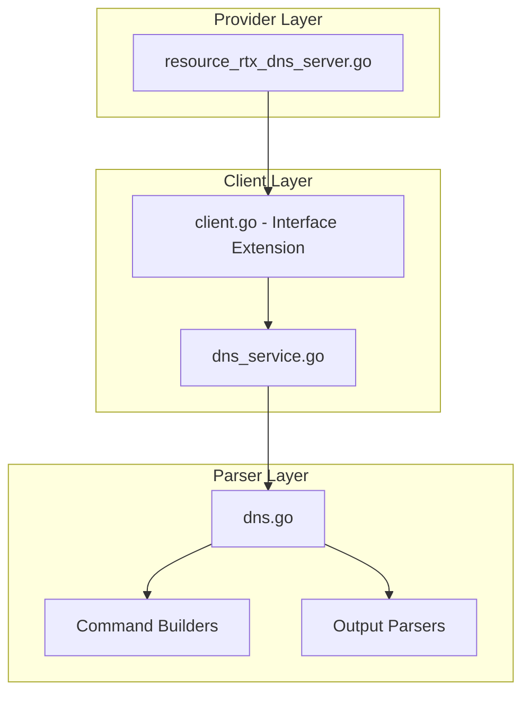

# Design Document: rtx_dns_server

## Overview

The `rtx_dns_server` resource enables Terraform-based management of DNS server and resolver configuration on Yamaha RTX series routers. Following Cisco IOS XE naming patterns, this resource manages DNS server settings, upstream DNS servers, static host entries, and domain-based routing.

## Code Reuse Analysis

### Existing Components to Leverage

- **`internal/client/dhcp_scope_service.go`**: Pattern for service layer implementation with CRUD operations.
- **`internal/client/interfaces.go`**: Extend the `Client` interface with DNS methods.
- **`internal/rtx/parsers/dhcp_scope.go`**: Reference for parser implementation and command builders.
- **`internal/provider/resource_rtx_dhcp_scope.go`**: Template for Terraform resource structure.

### Integration Points

- **`rtxClient`**: Add DNS methods for CRUD operations
- **`Executor`**: Use existing SSH command execution infrastructure

## Architecture



### Modular Design Principles

- **Single File Responsibility**: `DNSService` handles all DNS CRUD operations
- **Component Isolation**: Parser, service, and resource layers clearly separated
- **Service Layer Separation**: Service encapsulates all DNS logic
- **Utility Modularity**: Shared validation functions for IP/domain operations

## Components and Interfaces

### Component 1: DNSService (`internal/client/dns_service.go`)

- **Purpose:** Handles all DNS CRUD operations against the RTX router
- **Interfaces:**
  ```go
  type DNSService struct {
      executor Executor
      client   *rtxClient
  }

  func (s *DNSService) Create(ctx context.Context, dns DNSConfig) error
  func (s *DNSService) Get(ctx context.Context) (*DNSConfig, error)
  func (s *DNSService) Update(ctx context.Context, dns DNSConfig) error
  func (s *DNSService) Delete(ctx context.Context) error
  ```
- **Dependencies:** `Executor`, `rtxClient`, `parsers.DNSParser`
- **Reuses:** Pattern from service layer implementations

### Component 2: DNSParser (`internal/rtx/parsers/dns.go`)

- **Purpose:** Parses RTX router output for DNS configuration and builds commands
- **Interfaces:**
  ```go
  type DNSConfig struct {
      DomainLookup  bool              `json:"domain_lookup"`
      DomainName    string            `json:"domain_name,omitempty"`
      NameServers   []string          `json:"name_servers"`
      ServerSelect  []DNSServerSelect `json:"server_select,omitempty"`
      Hosts         []DNSHost         `json:"hosts,omitempty"`
      ServiceOn     bool              `json:"service_on"`
      PrivateSpoof  bool              `json:"private_address_spoof"`
  }

  type DNSServerSelect struct {
      ID      int      `json:"id"`
      Servers []string `json:"servers"`
      Domains []string `json:"domains"`
  }

  type DNSHost struct {
      Name    string `json:"name"`
      Address string `json:"address"`
  }

  func ParseDNSConfig(raw string) (*DNSConfig, error)
  func BuildDNSServerCommand(servers []string) string
  func BuildDNSServerSelectCommand(sel DNSServerSelect) string
  func BuildDNSStaticCommand(host DNSHost) string
  func BuildDNSServiceCommand(on bool) string
  func BuildDeleteDNSCommand() string
  ```
- **Dependencies:** `regexp`, `strings`, `net`
- **Reuses:** IP validation patterns

### Component 3: Terraform Resource (`internal/provider/resource_rtx_dns_server.go`)

- **Purpose:** Terraform resource definition implementing CRUD lifecycle
- **Interfaces:**
  ```go
  func resourceRTXDNSServer() *schema.Resource
  func resourceRTXDNSServerCreate(ctx, d, meta) diag.Diagnostics
  func resourceRTXDNSServerRead(ctx, d, meta) diag.Diagnostics
  func resourceRTXDNSServerUpdate(ctx, d, meta) diag.Diagnostics
  func resourceRTXDNSServerDelete(ctx, d, meta) diag.Diagnostics
  func resourceRTXDNSServerImport(ctx, d, meta) ([]*schema.ResourceData, error)
  ```
- **Dependencies:** `Client`, `DNSConfig`, Terraform SDK
- **Reuses:** Resource patterns from other implementations

### Component 4: Client Interface Extension (`internal/client/interfaces.go`)

- **Purpose:** Extend Client interface with DNS methods
- **Interfaces:**
  ```go
  // Add to existing Client interface:
  GetDNS(ctx context.Context) (*DNSConfig, error)
  CreateDNS(ctx context.Context, dns DNSConfig) error
  UpdateDNS(ctx context.Context, dns DNSConfig) error
  DeleteDNS(ctx context.Context) error
  ```
- **Dependencies:** Existing Client interface
- **Reuses:** Pattern from existing methods

## Data Models

### DNSConfig

```go
// DNSConfig represents DNS configuration on an RTX router
type DNSConfig struct {
    DomainLookup  bool              `json:"domain_lookup"`  // Enable DNS resolution
    DomainName    string            `json:"domain_name"`    // Default domain
    NameServers   []string          `json:"name_servers"`   // Upstream DNS servers
    ServerSelect  []DNSServerSelect `json:"server_select"`  // Domain-based routing
    Hosts         []DNSHost         `json:"hosts"`          // Static host entries
    ServiceOn     bool              `json:"service_on"`     // DNS service enabled
    PrivateSpoof  bool              `json:"private_address_spoof"` // Spoof private addresses
}

// DNSServerSelect represents domain-based DNS routing
type DNSServerSelect struct {
    ID      int      `json:"id"`      // Selection rule ID
    Servers []string `json:"servers"` // DNS servers for this rule
    Domains []string `json:"domains"` // Domains to match
}

// DNSHost represents a static host entry
type DNSHost struct {
    Name    string `json:"name"`    // Hostname
    Address string `json:"address"` // IP address
}
```

### Terraform Schema

```hcl
resource "rtx_dns_server" "main" {
  domain_lookup = true
  domain_name   = "example.local"

  name_servers = ["8.8.8.8", "8.8.4.4"]

  # Domain-specific DNS routing
  server_select = [
    {
      id      = 1
      domains = ["internal.example.com", "corp.example.com"]
      servers = ["192.168.1.53"]
    },
    {
      id      = 2
      domains = ["partner.example.com"]
      servers = ["10.0.0.53", "10.0.0.54"]
    }
  ]

  # Static host entries
  hosts = [
    {
      name    = "router.local"
      address = "192.168.1.1"
    },
    {
      name    = "nas.local"
      address = "192.168.1.100"
    }
  ]

  private_address_spoof = true
}
```

## RTX Command Mapping

### Configure DNS Servers

```
dns server <ip1> [<ip2>]
```

Example: `dns server 8.8.8.8 8.8.4.4`

### Configure DNS from PP Interface

```
dns server pp <n>
```

### Configure Domain-based DNS Routing

```
dns server select <id> <server> <domain>...
```

Example: `dns server select 1 192.168.1.53 internal.example.com corp.example.com`

### Configure Static Host

```
dns static <hostname> <ip>
```

Example: `dns static router.local 192.168.1.1`

### Enable DNS Service

```
dns service on
```

### Configure Private Address Spoofing

```
dns private address spoof on
```

### Delete DNS Configuration

```
no dns server
no dns static <hostname>
no dns server select <id>
```

### Show DNS Configuration

```
show config | grep dns
show dns cache
```

## Error Handling

### Error Scenarios

1. **Invalid DNS Server IP**
   - **Handling:** Validate IP address format
   - **User Impact:** Clear validation error with expected format

2. **Invalid Domain Name**
   - **Handling:** Validate domain name format
   - **User Impact:** Clear error with valid format

3. **Duplicate Server Select ID**
   - **Handling:** Check for duplicate IDs
   - **User Impact:** Error indicating duplicate

4. **Invalid Hostname**
   - **Handling:** Validate hostname format
   - **User Impact:** Clear error with valid format

5. **Connection/Command Timeout**
   - **Handling:** Use existing retry logic from `rtxClient`
   - **User Impact:** Standard Terraform timeout error

## Testing Strategy

### Unit Testing

- **Parser Tests** (`dns_test.go`):
  - Parse various RTX `show config` output for DNS
  - Test command builder functions with different parameters
  - Test domain and IP validation

- **Service Tests** (`dns_service_test.go`):
  - Mock executor for service method testing
  - Test error handling for various failure scenarios
  - Test server select configuration

### Integration Testing

- **Resource Tests** (`resource_rtx_dns_server_test.go`):
  - Full CRUD lifecycle with mock client
  - Import functionality testing
  - Static host configuration testing

### End-to-End Testing

- **Acceptance Tests** (with real RTX router):
  - Create DNS with basic servers
  - Create DNS with server select rules
  - Create static hosts
  - Update configuration
  - Delete DNS settings
  - Import existing configuration

## File Structure

```
internal/
├── provider/
│   ├── resource_rtx_dns_server.go      # NEW: Terraform resource
│   └── resource_rtx_dns_server_test.go # NEW: Resource tests
├── client/
│   ├── interfaces.go                    # MODIFY: Add DNS types and methods
│   ├── client.go                        # MODIFY: Add DNS service initialization
│   ├── dns_service.go                  # NEW: DNS service implementation
│   └── dns_service_test.go             # NEW: Service tests
└── rtx/
    └── parsers/
        ├── dns.go                      # NEW: Parser and command builders
        └── dns_test.go                 # NEW: Parser tests
```

## Implementation Notes

1. **Singleton Resource**: DNS is a singleton resource. Only one DNS configuration can exist.

2. **Terraform ID**: Use "dns" as the fixed Terraform resource ID.

3. **Server Priority**: DNS servers are used in order. First server is primary.

4. **Server Select**: Domain-based routing takes precedence over general DNS servers.

5. **In-place Updates**: Most DNS settings support in-place updates.

6. **PP Interface DNS**: Consider handling `dns server pp <n>` as special case for PPPoE.

7. **Cache Clearing**: May need to clear DNS cache after configuration changes.

8. **Configuration Save**: Use existing `SaveConfig()` pattern after modifications.

9. **Provider Registration**: Add `resourceRTXDNSServer` to provider's resource map.

## State Handling

- Persist only configuration attributes in Terraform state.
- Operational/runtime status must not be stored in state to avoid perpetual diffs.
