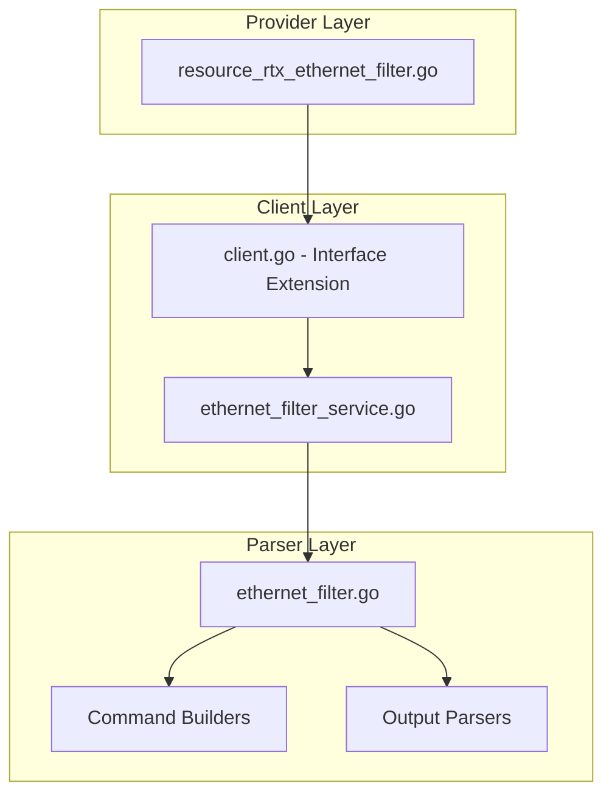

# Design Document: rtx_ethernet_filter

## Overview

The `rtx_ethernet_filter` resource enables Terraform-based management of Ethernet (Layer 2) packet filters on Yamaha RTX series routers. Following Cisco MAC ACL naming patterns, this resource manages MAC address-based filtering, EtherType filtering, and Layer 2 access control.

## Code Reuse Analysis

### Existing Components to Leverage

- **`internal/client/ip_filter_service.go`**: Pattern for filter service implementation (if created first).
- **`internal/client/interfaces.go`**: Extend the `Client` interface with Ethernet filter methods.
- **`internal/rtx/parsers/ip_filter.go`**: Reference for filter parser implementation (if created first).
- **`internal/provider/resource_rtx_dhcp_scope.go`**: Template for Terraform resource structure.

### Integration Points

- **`rtxClient`**: Add Ethernet filter methods for CRUD operations
- **`Executor`**: Use existing SSH command execution infrastructure
- **LAN interface**: Coordinate with interface configuration

## Architecture



### Modular Design Principles

- **Single File Responsibility**: `EthernetFilterService` handles all Ethernet filter CRUD operations
- **Component Isolation**: Parser, service, and resource layers clearly separated
- **Service Layer Separation**: Service encapsulates all filter logic
- **Utility Modularity**: Shared validation functions for MAC address operations

## Components and Interfaces

### Component 1: EthernetFilterService (`internal/client/ethernet_filter_service.go`)

- **Purpose:** Handles all Ethernet filter CRUD operations against the RTX router
- **Interfaces:**
  ```go
  type EthernetFilterService struct {
      executor Executor
      client   *rtxClient
  }

  func (s *EthernetFilterService) Create(ctx context.Context, filter EthernetFilter) error
  func (s *EthernetFilterService) Get(ctx context.Context, filterNum int) (*EthernetFilter, error)
  func (s *EthernetFilterService) Update(ctx context.Context, filter EthernetFilter) error
  func (s *EthernetFilterService) Delete(ctx context.Context, filterNum int) error
  func (s *EthernetFilterService) List(ctx context.Context) ([]EthernetFilter, error)
  ```
- **Dependencies:** `Executor`, `rtxClient`, `parsers.EthernetFilterParser`
- **Reuses:** Pattern from service layer implementations

### Component 2: EthernetFilterParser (`internal/rtx/parsers/ethernet_filter.go`)

- **Purpose:** Parses RTX router output for Ethernet filter configuration and builds commands
- **Interfaces:**
  ```go
  type EthernetFilter struct {
      Number  int                    `json:"number"`
      Name    string                 `json:"name,omitempty"`
      Entries []EthernetFilterEntry  `json:"entries"`
  }

  type EthernetFilterEntry struct {
      Sequence       int    `json:"sequence"`
      Action         string `json:"ace_action"`           // permit/deny
      SourceMAC      string `json:"source_address,omitempty"`
      SourceMACMask  string `json:"source_address_mask,omitempty"`
      SourceAny      bool   `json:"source_any,omitempty"`
      DestMAC        string `json:"destination_address,omitempty"`
      DestMACMask    string `json:"destination_address_mask,omitempty"`
      DestAny        bool   `json:"destination_any,omitempty"`
      EtherType      string `json:"ethertype,omitempty"`
      VlanID         int    `json:"vlan_id,omitempty"`
  }

  func ParseEthernetFilterConfig(raw string) ([]EthernetFilter, error)
  func BuildEthernetFilterCommand(num int, entry EthernetFilterEntry) string
  func BuildInterfaceEthernetFilterCommand(iface, dir string, filters []int) string
  func BuildDeleteEthernetFilterCommand(num int) string
  func NormalizeMAC(mac string) string
  ```
- **Dependencies:** `regexp`, `strings`, `strconv`
- **Reuses:** MAC address validation patterns

### Component 3: Terraform Resource (`internal/provider/resource_rtx_access_list_mac.go`)

- **Purpose:** Terraform resource definition implementing CRUD lifecycle
- **Interfaces:**
  ```go
  func resourceRTXAccessListMac() *schema.Resource
  func resourceRTXAccessListMacCreate(ctx, d, meta) diag.Diagnostics
  func resourceRTXAccessListMacRead(ctx, d, meta) diag.Diagnostics
  func resourceRTXAccessListMacUpdate(ctx, d, meta) diag.Diagnostics
  func resourceRTXAccessListMacDelete(ctx, d, meta) diag.Diagnostics
  func resourceRTXAccessListMacImport(ctx, d, meta) ([]*schema.ResourceData, error)
  ```
- **Dependencies:** `Client`, `EthernetFilter`, Terraform SDK
- **Reuses:** Resource patterns from other implementations

### Component 4: Client Interface Extension (`internal/client/interfaces.go`)

- **Purpose:** Extend Client interface with Ethernet filter methods
- **Interfaces:**
  ```go
  // Add to existing Client interface:
  GetEthernetFilter(ctx context.Context, filterNum int) (*EthernetFilter, error)
  CreateEthernetFilter(ctx context.Context, filter EthernetFilter) error
  UpdateEthernetFilter(ctx context.Context, filter EthernetFilter) error
  DeleteEthernetFilter(ctx context.Context, filterNum int) error
  ListEthernetFilters(ctx context.Context) ([]EthernetFilter, error)
  ```
- **Dependencies:** Existing Client interface
- **Reuses:** Pattern from existing methods

## Data Models

### EthernetFilter

```go
// EthernetFilter represents an Ethernet (MAC) filter on an RTX router
type EthernetFilter struct {
    Number  int                   `json:"number"`  // Filter number (1-65535)
    Name    string                `json:"name"`    // Access list name
    Entries []EthernetFilterEntry `json:"entries"` // Filter entries
}

// EthernetFilterEntry represents a single Ethernet filter rule
type EthernetFilterEntry struct {
    Sequence      int    `json:"sequence"`                       // Entry sequence
    Action        string `json:"ace_action"`                     // permit/deny
    SourceMAC     string `json:"source_address,omitempty"`       // Source MAC
    SourceMACMask string `json:"source_address_mask,omitempty"`  // Source MAC mask
    SourceAny     bool   `json:"source_any,omitempty"`           // Any source
    DestMAC       string `json:"destination_address,omitempty"`
    DestMACMask   string `json:"destination_address_mask,omitempty"`
    DestAny       bool   `json:"destination_any,omitempty"`
    EtherType     string `json:"ethertype,omitempty"`            // 0x0800, 0x0806, etc.
    VlanID        int    `json:"vlan_id,omitempty"`              // VLAN filter
}
```

### Terraform Schema

```hcl
# MAC access list
resource "rtx_access_list_mac" "trusted_macs" {
  name = "TRUSTED_MACS"

  entries = [
    {
      sequence            = 10
      ace_action          = "permit"
      source_address      = "0011.2200.0000"
      source_address_mask = "0000.00ff.ffff"
      destination_any     = true
    },
    {
      sequence              = 20
      ace_action            = "deny"
      source_any            = true
      destination_address   = "ffff.ffff.ffff"  # Broadcast
      ethertype             = "0x0806"          # ARP
    },
    {
      sequence        = 999
      ace_action      = "deny"
      source_any      = true
      destination_any = true
    }
  ]
}

# Apply MAC ACL to interface
resource "rtx_interface_mac_acl" "lan1" {
  interface           = "lan1"
  mac_access_group_in = "TRUSTED_MACS"
}
```

## RTX Command Mapping

### Create Ethernet Filter

```
ethernet filter <n> <action> <src_mac> <dst_mac> [<eth_type>]
```

Example: `ethernet filter 1 pass 00:11:22:* * 0x0800`

### Apply to Interface

```
ethernet <interface> filter <direction> <filter_list>
```

Example: `ethernet lan1 filter in 1 2 3`

### Delete Ethernet Filter

```
no ethernet filter <n>
```

### Show Configuration

```
show config | grep "ethernet filter"
show ethernet filter
```

## Error Handling

### Error Scenarios

1. **Invalid Filter Number**
   - **Handling:** Validate number is in range 1-65535
   - **User Impact:** Clear validation error with valid range

2. **Invalid MAC Address**
   - **Handling:** Validate MAC address format
   - **User Impact:** Clear error with expected format

3. **Invalid EtherType**
   - **Handling:** Validate EtherType is valid hex value
   - **User Impact:** Clear error with valid format

4. **Invalid VLAN ID**
   - **Handling:** Validate VLAN ID is in range 1-4094
   - **User Impact:** Clear error with valid range

5. **Connection/Command Timeout**
   - **Handling:** Use existing retry logic from `rtxClient`
   - **User Impact:** Standard Terraform timeout error

## Testing Strategy

### Unit Testing

- **Parser Tests** (`ethernet_filter_test.go`):
  - Parse various RTX `show config` output for Ethernet filters
  - Test command builder functions with different parameters
  - Test MAC address normalization

- **Service Tests** (`ethernet_filter_service_test.go`):
  - Mock executor for service method testing
  - Test error handling for various failure scenarios
  - Test EtherType filtering

### Integration Testing

- **Resource Tests** (`resource_rtx_ethernet_filter_test.go`):
  - Full CRUD lifecycle with mock client
  - Import functionality testing
  - MAC matching configuration testing

### End-to-End Testing

- **Acceptance Tests** (with real RTX router):
  - Create Ethernet filter with MAC matching
  - Create filter with EtherType
  - Update filter entries
  - Delete filter
  - Import existing filter

## File Structure

```
internal/
├── provider/
│   ├── resource_rtx_access_list_mac.go      # NEW: MAC ACL resource
│   ├── resource_rtx_access_list_mac_test.go # NEW: MAC ACL tests
│   ├── resource_rtx_interface_mac_acl.go    # NEW: Interface binding resource
│   └── resource_rtx_interface_mac_acl_test.go # NEW: Interface binding tests
├── client/
│   ├── interfaces.go                         # MODIFY: Add EthernetFilter types and methods
│   ├── client.go                             # MODIFY: Add filter service initialization
│   ├── ethernet_filter_service.go           # NEW: Filter service implementation
│   └── ethernet_filter_service_test.go      # NEW: Service tests
└── rtx/
    └── parsers/
        ├── ethernet_filter.go               # NEW: Parser and command builders
        └── ethernet_filter_test.go          # NEW: Parser tests
```

## Implementation Notes

1. **MAC Address Format**: RTX may use different MAC formats (00:11:22:33:44:55 vs 0011.2233.4455). Normalize to one format.

2. **Terraform ID**: Use filter number as Terraform resource ID.

3. **Sequence Numbers**: Auto-generate or require explicit sequence numbers.

4. **Action Mapping**: Map Cisco `permit/deny` to RTX `pass/reject`.

5. **Wildcard Matching**: RTX uses `*` for wildcard MAC positions.

6. **EtherType Values**: Common values: 0x0800 (IPv4), 0x0806 (ARP), 0x86DD (IPv6).

7. **Interface ACL**: Consider separate resource `rtx_interface_mac_acl` for binding.

8. **Order Sensitivity**: Filters evaluated in order. First match wins.

9. **Configuration Save**: Use existing `SaveConfig()` pattern after modifications.

10. **Provider Registration**: Add `resourceRTXAccessListMac` and `resourceRTXInterfaceMacACL` to provider's resource map.

## State Handling

- Persist only configuration attributes in Terraform state.
- Operational/runtime status must not be stored in state to avoid perpetual diffs.
