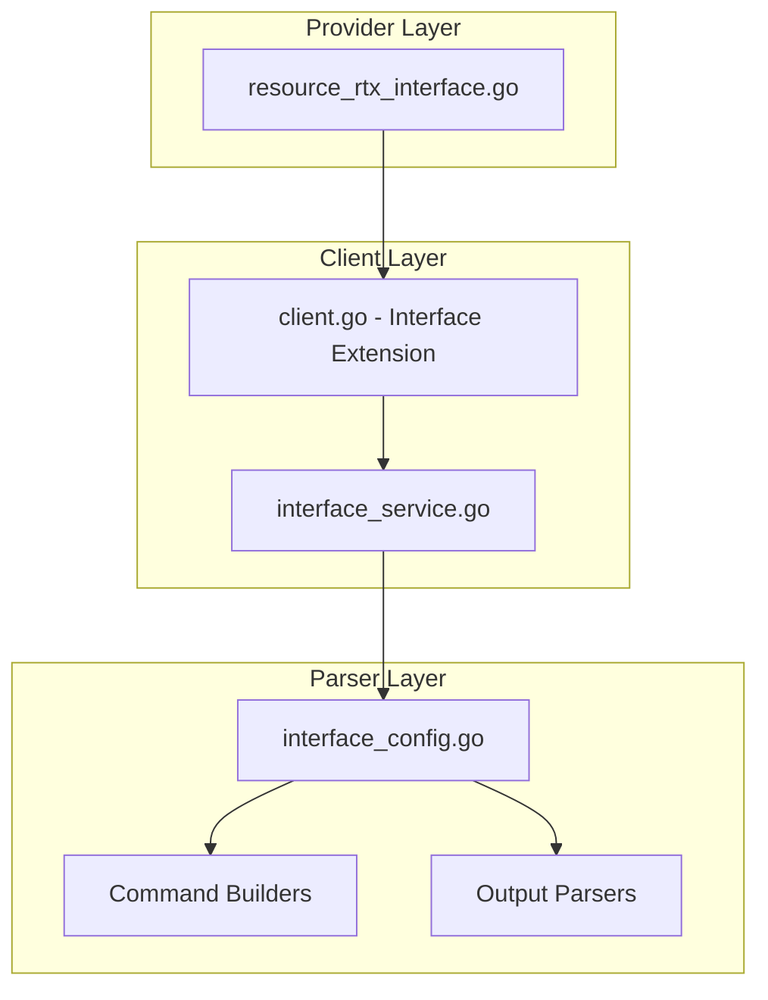

# Design Document: rtx_interface

## Overview

The `rtx_interface` resource enables Terraform-based management of network interface configurations on Yamaha RTX series routers. This is a foundational resource that manages IP addresses, security filters, NAT descriptors, and other interface-level settings.

## Scope

This resource manages **interface-level configuration** including:
- IP address assignment (static or DHCP)
- Security filter application (inbound/outbound)
- NAT descriptor binding
- ProxyARP settings
- Interface description
- MTU settings

**Note**: This resource does NOT manage filter definitions themselves (use `rtx_ip_filter`) or NAT descriptor definitions (use `rtx_nat_masquerade`/`rtx_nat_static`).

## Code Reuse Analysis

### Existing Components to Leverage

- **`internal/client/dhcp_scope_service.go`**: Pattern for service layer implementation with CRUD operations.
- **`internal/client/interfaces.go`**: Extend the `Client` interface with interface configuration methods.
- **`internal/rtx/parsers/`**: Reference for parser implementation patterns.
- **`internal/provider/resource_rtx_dhcp_scope.go`**: Template for Terraform resource structure.

### Integration Points

- **`rtxClient`**: Add interface configuration methods for CRUD operations
- **`Executor`**: Use existing SSH command execution infrastructure
- **`rtx_ip_filter`**: Security filters referenced by number
- **`rtx_nat_masquerade`/`rtx_nat_static`**: NAT descriptors referenced by number

## Architecture



## Components and Interfaces

### Component 1: InterfaceService (`internal/client/interface_service.go`)

- **Purpose:** Handles all interface configuration CRUD operations against the RTX router
- **Interfaces:**
  ```go
  type InterfaceService struct {
      executor Executor
      client   *rtxClient
  }

  func (s *InterfaceService) Configure(ctx context.Context, config InterfaceConfig) error
  func (s *InterfaceService) Get(ctx context.Context, interfaceName string) (*InterfaceConfig, error)
  func (s *InterfaceService) Update(ctx context.Context, config InterfaceConfig) error
  func (s *InterfaceService) Reset(ctx context.Context, interfaceName string) error
  func (s *InterfaceService) List(ctx context.Context) ([]InterfaceConfig, error)
  ```
- **Dependencies:** `Executor`, `rtxClient`, `parsers.InterfaceConfigParser`

### Component 2: InterfaceConfigParser (`internal/rtx/parsers/interface_config.go`)

- **Purpose:** Parses RTX router output for interface configuration and builds commands
- **Interfaces:**
  ```go
  type InterfaceConfig struct {
      Name              string           `json:"name"`               // lan1, lan2, pp1, bridge1
      Description       string           `json:"description,omitempty"`
      IPAddress         *InterfaceIP     `json:"ip_address,omitempty"`
      SecureFilterIn    []int            `json:"secure_filter_in,omitempty"`
      SecureFilterOut   []int            `json:"secure_filter_out,omitempty"`
      DynamicFilterOut  []int            `json:"dynamic_filter_out,omitempty"`
      NATDescriptor     int              `json:"nat_descriptor,omitempty"`
      ProxyARP          bool             `json:"proxyarp"`
      MTU               int              `json:"mtu,omitempty"`
  }

  type InterfaceIP struct {
      Address string `json:"address,omitempty"` // CIDR notation or "dhcp"
      DHCP    bool   `json:"dhcp"`
  }

  func ParseInterfaceConfig(raw string, interfaceName string) (*InterfaceConfig, error)
  func BuildIPAddressCommand(iface string, ip InterfaceIP) string
  func BuildSecureFilterCommand(iface, direction string, filters []int) string
  func BuildNATDescriptorCommand(iface string, natID int) string
  func BuildProxyARPCommand(iface string, enabled bool) string
  func BuildDescriptionCommand(iface, desc string) string
  ```
- **Dependencies:** `regexp`, `strings`, `strconv`

### Component 3: Terraform Resource (`internal/provider/resource_rtx_interface.go`)

- **Purpose:** Terraform resource definition implementing CRUD lifecycle
- **Interfaces:**
  ```go
  func resourceRTXInterface() *schema.Resource
  func resourceRTXInterfaceCreate(ctx, d, meta) diag.Diagnostics
  func resourceRTXInterfaceRead(ctx, d, meta) diag.Diagnostics
  func resourceRTXInterfaceUpdate(ctx, d, meta) diag.Diagnostics
  func resourceRTXInterfaceDelete(ctx, d, meta) diag.Diagnostics
  func resourceRTXInterfaceImport(ctx, d, meta) ([]*schema.ResourceData, error)
  ```
- **Dependencies:** `Client`, `InterfaceConfig`, Terraform SDK

### Component 4: Client Interface Extension (`internal/client/interfaces.go`)

- **Purpose:** Extend Client interface with interface configuration methods
- **Interfaces:**
  ```go
  // Add to existing Client interface:
  GetInterfaceConfig(ctx context.Context, interfaceName string) (*InterfaceConfig, error)
  ConfigureInterface(ctx context.Context, config InterfaceConfig) error
  UpdateInterfaceConfig(ctx context.Context, config InterfaceConfig) error
  ResetInterface(ctx context.Context, interfaceName string) error
  ListInterfaceConfigs(ctx context.Context) ([]InterfaceConfig, error)
  ```
- **Dependencies:** Existing Client interface

## Data Models

### InterfaceConfig

```go
// InterfaceConfig represents interface configuration on an RTX router
type InterfaceConfig struct {
    Name              string       `json:"name"`                       // Interface name (lan1, lan2, pp1, bridge1, tunnel1)
    Description       string       `json:"description,omitempty"`      // Interface description
    IPAddress         *InterfaceIP `json:"ip_address,omitempty"`       // IPv4 address configuration
    SecureFilterIn    []int        `json:"secure_filter_in,omitempty"` // Inbound security filter numbers
    SecureFilterOut   []int        `json:"secure_filter_out,omitempty"`// Outbound security filter numbers
    DynamicFilterOut  []int        `json:"dynamic_filter_out,omitempty"` // Dynamic filters for outbound
    NATDescriptor     int          `json:"nat_descriptor,omitempty"`   // NAT descriptor number (0 = none)
    ProxyARP          bool         `json:"proxyarp"`                   // Enable ProxyARP
    MTU               int          `json:"mtu,omitempty"`              // MTU size (0 = default)
}

// InterfaceIP represents IP address configuration
type InterfaceIP struct {
    Address string `json:"address,omitempty"` // CIDR notation (192.168.1.1/24) or empty if DHCP
    DHCP    bool   `json:"dhcp"`              // Use DHCP for address assignment
}
```

### Terraform Schema

```hcl
resource "rtx_interface" "wan" {
  name        = "lan2"           # Required, ForceNew
  description = "WAN connection" # Optional

  # IP Address configuration (exactly one of address or dhcp)
  ip_address {
    dhcp = true
  }

  # Alternative: static IP
  # ip_address {
  #   address = "203.0.113.1/24"
  # }

  # Security filters (reference filter numbers)
  secure_filter_in  = [200020, 200021, 200022, 200023, 200024, 200025, 200103, 200100, 200102, 200104, 200101, 200105, 200099]
  secure_filter_out = [200020, 200021, 200022, 200023, 200024, 200025, 200026, 200027, 200099]
  dynamic_filter_out = [200080, 200081, 200082, 200083, 200084, 200085]

  # NAT binding
  nat_descriptor = 1000
}

resource "rtx_interface" "lan" {
  name = "lan1"

  # ProxyARP for bridged network
  proxyarp = true
}

resource "rtx_interface" "bridge" {
  name        = "bridge1"
  description = "Internal bridge"

  ip_address {
    address = "192.168.1.253/16"
  }
}
```

## RTX Command Mapping

### Configure IP Address

#### Static IP
```
ip <interface> address <ip>/<prefix>
```
Example: `ip lan2 address 203.0.113.1/24`

#### DHCP
```
ip <interface> address dhcp
```
Example: `ip lan2 address dhcp`

### Configure Security Filters

#### Inbound Filter
```
ip <interface> secure filter in <filter_list>
```
Example: `ip lan2 secure filter in 200020 200021 200022 200099`

#### Outbound Filter with Dynamic
```
ip <interface> secure filter out <filter_list> dynamic <dynamic_filter_list>
```
Example: `ip lan2 secure filter out 200020 200099 dynamic 200080 200081`

### Configure NAT Descriptor

```
ip <interface> nat descriptor <descriptor_id>
```
Example: `ip lan2 nat descriptor 1000`

### Configure ProxyARP

```
ip <interface> proxyarp on
ip <interface> proxyarp off
```
Example: `ip lan1 proxyarp on`

### Configure Description

```
description <interface> <description>
```
Example: `description lan2 au`

### Configure MTU

```
ip <interface> mtu <size>
```
Example: `ip lan2 mtu 1500`

### Remove Configuration

```
no ip <interface> address
no ip <interface> secure filter in
no ip <interface> secure filter out
no ip <interface> nat descriptor
no ip <interface> proxyarp
no description <interface>
```

### Show Configuration

```
show config | grep "<interface>"
show status <interface>
```

## Error Handling

### Error Scenarios

1. **Invalid Interface Name**
   - **Handling:** Validate interface name format (lan1, lan2, pp1, bridge1, tunnel1, etc.)
   - **User Impact:** Clear validation error with valid interface names

2. **Invalid IP Address**
   - **Handling:** Validate CIDR notation
   - **User Impact:** Clear error with expected format

3. **Invalid Filter Number**
   - **Handling:** Validate filter numbers are positive integers
   - **User Impact:** Warning that filter may not exist

4. **Invalid NAT Descriptor**
   - **Handling:** Validate NAT descriptor is positive integer
   - **User Impact:** Warning that descriptor may not exist

5. **Interface Not Found**
   - **Handling:** Check if interface exists on router
   - **User Impact:** Error with available interfaces

6. **Connection/Command Timeout**
   - **Handling:** Use existing retry logic from `rtxClient`
   - **User Impact:** Standard Terraform timeout error

## Testing Strategy

### Unit Testing

- **Parser Tests** (`interface_config_test.go`):
  - Parse various RTX `show config` output for interface settings
  - Test command builder functions with different parameters
  - Test IP address validation (CIDR, DHCP)

- **Service Tests** (`interface_service_test.go`):
  - Mock executor for service method testing
  - Test error handling for various failure scenarios
  - Test filter list handling

### Integration Testing

- **Resource Tests** (`resource_rtx_interface_test.go`):
  - Full CRUD lifecycle with mock client
  - Import functionality testing
  - Filter and NAT descriptor binding testing

### End-to-End Testing

- **Acceptance Tests** (with real RTX router):
  - Configure interface with static IP
  - Configure interface with DHCP
  - Apply security filters
  - Bind NAT descriptor
  - Enable ProxyARP
  - Update configuration
  - Remove configuration
  - Import existing interface

## File Structure

```
internal/
├── provider/
│   ├── resource_rtx_interface.go      # NEW: Terraform resource
│   └── resource_rtx_interface_test.go # NEW: Resource tests
├── client/
│   ├── interfaces.go                   # MODIFY: Add InterfaceConfig types and methods
│   ├── client.go                       # MODIFY: Add interface service initialization
│   ├── interface_service.go           # NEW: Interface service implementation
│   └── interface_service_test.go      # NEW: Service tests
└── rtx/
    └── parsers/
        ├── interface_config.go        # NEW: Parser and command builders
        └── interface_config_test.go   # NEW: Parser tests
```

## Implementation Notes

1. **Interface Name as Terraform ID**: Use interface name (e.g., `lan2`) as Terraform resource ID.

2. **ForceNew**: Only `name` is ForceNew. Other attributes support in-place updates.

3. **Filter Order**: Filter list order matters. First match wins.

4. **Dependency Management**: Filters and NAT descriptors should be created before interface configuration.

5. **DHCP vs Static**: ExactlyOneOf constraint - either `dhcp=true` or `address` must be set.

6. **ProxyARP Default**: Default is `off`. Only set when explicitly enabled.

7. **Configuration Save**: Use existing `SaveConfig()` pattern after modifications.

8. **Provider Registration**: Add `resourceRTXInterface` to provider's resource map.

9. **Bridge Interface**: Bridge interfaces have IP addresses but also require `bridge member` configuration (separate resource).

10. **Tunnel Interface**: Tunnel interfaces are typically configured through L2TP/IPsec resources.

## State Handling

- Persist only configuration attributes in Terraform state.
- Operational/runtime status must not be stored in state to avoid perpetual diffs.
