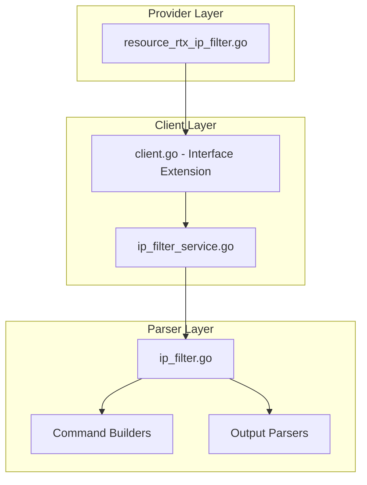

# Design Document: rtx_ip_filter

## Overview

The IP filter resources enable Terraform-based management of IP packet filters (firewall rules) on Yamaha RTX series routers. Following Cisco IOS XE Terraform provider naming conventions, this specification covers multiple resources:

- **`rtx_access_list_extended`**: Extended access list definition (IPv4)
- **`rtx_access_list_extended_ipv6`**: Extended access list definition (IPv6)
- **`rtx_ip_filter_dynamic`**: Dynamic (stateful) filter for IPv4
- **`rtx_ipv6_filter_dynamic`**: Dynamic (stateful) filter for IPv6
- **`rtx_interface_acl`**: Apply ACL to interface

## Code Reuse Analysis

### Existing Components to Leverage

- **`internal/client/dhcp_scope_service.go`**: Pattern for service layer implementation with CRUD operations.
- **`internal/client/interfaces.go`**: Extend the `Client` interface with IP filter methods.
- **`internal/rtx/parsers/dhcp_scope.go`**: Reference for parser implementation and command builders.
- **`internal/provider/resource_rtx_dhcp_scope.go`**: Template for Terraform resource structure.

### Integration Points

- **`rtxClient`**: Add IP filter methods for CRUD operations
- **`Executor`**: Use existing SSH command execution infrastructure
- **Interface binding**: Coordinate with interface security filter application

## Architecture



### Modular Design Principles

- **Single File Responsibility**: `IPFilterService` handles all filter CRUD operations
- **Component Isolation**: Parser, service, and resource layers clearly separated
- **Service Layer Separation**: Service encapsulates all filter logic
- **Utility Modularity**: Shared validation functions for IP/port operations

## Components and Interfaces

### Component 1: IPFilterService (`internal/client/ip_filter_service.go`)

- **Purpose:** Handles all IP filter CRUD operations against the RTX router
- **Interfaces:**
  ```go
  type IPFilterService struct {
      executor Executor
      client   *rtxClient
  }

  func (s *IPFilterService) Create(ctx context.Context, filter IPFilter) error
  func (s *IPFilterService) Get(ctx context.Context, filterNum int) (*IPFilter, error)
  func (s *IPFilterService) Update(ctx context.Context, filter IPFilter) error
  func (s *IPFilterService) Delete(ctx context.Context, filterNum int) error
  func (s *IPFilterService) List(ctx context.Context) ([]IPFilter, error)
  ```
- **Dependencies:** `Executor`, `rtxClient`, `parsers.IPFilterParser`
- **Reuses:** Pattern from service layer implementations

### Component 2: IPFilterParser (`internal/rtx/parsers/ip_filter.go`)

- **Purpose:** Parses RTX router output for filter configuration and builds commands
- **Interfaces:**
  ```go
  type IPFilter struct {
      Number  int             `json:"number"`
      Name    string          `json:"name,omitempty"`
      Entries []IPFilterEntry `json:"entries"`
  }

  type IPFilterEntry struct {
      Sequence           int    `json:"sequence"`
      Remark             string `json:"remark,omitempty"`
      Action             string `json:"ace_rule_action"`     // permit/deny (pass/reject)
      Protocol           string `json:"ace_rule_protocol"`   // tcp/udp/icmp/ip
      SourcePrefix       string `json:"source_prefix,omitempty"`
      SourcePrefixMask   string `json:"source_prefix_mask,omitempty"`
      SourceAny          bool   `json:"source_any,omitempty"`
      SourcePort         string `json:"source_port,omitempty"`
      DestPrefix         string `json:"destination_prefix,omitempty"`
      DestPrefixMask     string `json:"destination_prefix_mask,omitempty"`
      DestAny            bool   `json:"destination_any,omitempty"`
      DestPort           string `json:"destination_port_equal,omitempty"`
      Log                bool   `json:"log"`
      Established        bool   `json:"established,omitempty"`
  }

  func ParseIPFilterConfig(raw string) ([]IPFilter, error)
  func BuildIPFilterCommand(num int, entry IPFilterEntry) string
  func BuildIPFilterDynamicCommand(num int, entry IPFilterEntry) string
  func BuildIPFilterSetCommand(setNum int, filters []int) string
  func BuildInterfaceSecureFilterCommand(iface, dir string, setNum int) string
  func BuildDeleteIPFilterCommand(num int) string
  ```
- **Dependencies:** `regexp`, `strings`, `strconv`
- **Reuses:** IP validation patterns

### Component 3: Terraform Resources

#### 3.1 AccessListExtended Resource (`internal/provider/resource_rtx_access_list_extended.go`)

```go
func resourceRTXAccessListExtended() *schema.Resource
func resourceRTXAccessListExtendedCreate(ctx, d, meta) diag.Diagnostics
func resourceRTXAccessListExtendedRead(ctx, d, meta) diag.Diagnostics
func resourceRTXAccessListExtendedUpdate(ctx, d, meta) diag.Diagnostics
func resourceRTXAccessListExtendedDelete(ctx, d, meta) diag.Diagnostics
func resourceRTXAccessListExtendedImport(ctx, d, meta) ([]*schema.ResourceData, error)
```

#### 3.2 AccessListExtendedIPv6 Resource (`internal/provider/resource_rtx_access_list_extended_ipv6.go`)

```go
func resourceRTXAccessListExtendedIPv6() *schema.Resource
// ... similar CRUD methods
```

#### 3.3 IPFilterDynamic Resource (`internal/provider/resource_rtx_ip_filter_dynamic.go`)

```go
func resourceRTXIPFilterDynamic() *schema.Resource
// ... similar CRUD methods
```

#### 3.4 IPv6FilterDynamic Resource (`internal/provider/resource_rtx_ipv6_filter_dynamic.go`)

```go
func resourceRTXIPv6FilterDynamic() *schema.Resource
// ... similar CRUD methods
```

#### 3.5 InterfaceACL Resource (`internal/provider/resource_rtx_interface_acl.go`)

```go
func resourceRTXInterfaceACL() *schema.Resource
func resourceRTXInterfaceACLCreate(ctx, d, meta) diag.Diagnostics
func resourceRTXInterfaceACLRead(ctx, d, meta) diag.Diagnostics
func resourceRTXInterfaceACLUpdate(ctx, d, meta) diag.Diagnostics
func resourceRTXInterfaceACLDelete(ctx, d, meta) diag.Diagnostics
func resourceRTXInterfaceACLImport(ctx, d, meta) ([]*schema.ResourceData, error)
```

- **Dependencies:** `Client`, `IPFilter`, Terraform SDK
- **Reuses:** Resource patterns from other implementations

### Component 4: Client Interface Extension (`internal/client/interfaces.go`)

- **Purpose:** Extend Client interface with IP filter methods
- **Interfaces:**
  ```go
  // Add to existing Client interface:
  GetIPFilter(ctx context.Context, filterNum int) (*IPFilter, error)
  CreateIPFilter(ctx context.Context, filter IPFilter) error
  UpdateIPFilter(ctx context.Context, filter IPFilter) error
  DeleteIPFilter(ctx context.Context, filterNum int) error
  ListIPFilters(ctx context.Context) ([]IPFilter, error)
  ```
- **Dependencies:** Existing Client interface
- **Reuses:** Pattern from existing methods

## Data Models

### IPFilter

```go
// IPFilter represents an IP filter (access list) on an RTX router
type IPFilter struct {
    Number  int             `json:"number"`  // Filter number (1-65535)
    Name    string          `json:"name"`    // Access list name (for Cisco compatibility)
    Entries []IPFilterEntry `json:"entries"` // Filter entries
}

// IPFilterEntry represents a single filter rule
type IPFilterEntry struct {
    Sequence         int    `json:"sequence"`                     // Entry sequence number
    Remark           string `json:"remark,omitempty"`             // Comment
    Action           string `json:"ace_rule_action"`              // permit/deny
    Protocol         string `json:"ace_rule_protocol"`            // tcp/udp/icmp/ip
    SourcePrefix     string `json:"source_prefix,omitempty"`      // Source IP
    SourcePrefixMask string `json:"source_prefix_mask,omitempty"` // Source wildcard
    SourceAny        bool   `json:"source_any,omitempty"`         // Any source
    SourcePort       string `json:"source_port,omitempty"`        // Source port
    DestPrefix       string `json:"destination_prefix,omitempty"`
    DestPrefixMask   string `json:"destination_prefix_mask,omitempty"`
    DestAny          bool   `json:"destination_any,omitempty"`
    DestPort         string `json:"destination_port_equal,omitempty"`
    Log              bool   `json:"log"`                          // Enable logging
    Established      bool   `json:"established,omitempty"`        // TCP established
}
```

### Terraform Schema

```hcl
resource "rtx_access_list_extended" "web_access" {
  name = "WEB_ACCESS"

  entries = [
    {
      sequence                 = 10
      remark                   = "Allow HTTP/HTTPS to internal servers"
      ace_rule_action          = "permit"
      ace_rule_protocol        = "tcp"
      source_prefix            = "0.0.0.0"
      source_prefix_mask       = "255.255.255.255"
      destination_prefix       = "192.168.1.0"
      destination_prefix_mask  = "0.0.0.255"
      destination_port_equal   = "80"
      log                      = true
    },
    {
      sequence                 = 20
      ace_rule_action          = "permit"
      ace_rule_protocol        = "tcp"
      source_prefix            = "0.0.0.0"
      source_prefix_mask       = "255.255.255.255"
      destination_prefix       = "192.168.1.0"
      destination_prefix_mask  = "0.0.0.255"
      destination_port_equal   = "443"
    },
    {
      sequence          = 999
      remark            = "Deny all other traffic"
      ace_rule_action   = "deny"
      ace_rule_protocol = "ip"
      source_any        = true
      destination_any   = true
    }
  ]
}

# Apply access list to interface
resource "rtx_interface_acl" "wan" {
  interface          = "pp1"
  ip_access_group_in = "WEB_ACCESS"
}
```

## RTX Command Mapping

### Create IP Filter

```
ip filter <n> <action> <src> <dst> <protocol> [<src_port>] [<dst_port>]
```

Example: `ip filter 100 pass 0.0.0.0/0 192.168.1.0/24 tcp * 80`

### Create Dynamic Filter (Stateful)

```
ip filter dynamic <n> <src> <dst> <protocol> [syslog=on|off]
```

Dynamic filters enable stateful packet inspection, automatically allowing return traffic for established connections.

#### Dynamic Filter Examples

```
ip filter dynamic 200080 * * ftp syslog=off
ip filter dynamic 200081 * * domain syslog=off
ip filter dynamic 200082 * * www syslog=off
ip filter dynamic 200083 * * smtp syslog=off
ip filter dynamic 200084 * * pop3 syslog=off
ip filter dynamic 200085 * * submission syslog=off
ip filter dynamic 200098 * * tcp syslog=off
ip filter dynamic 200099 * * udp syslog=off
```

#### Supported Protocols for Dynamic Filters

| Protocol | Description |
|----------|-------------|
| `ftp` | FTP with data channel tracking |
| `domain` | DNS queries |
| `www` | HTTP |
| `smtp` | SMTP mail |
| `pop3` | POP3 mail |
| `submission` | Mail submission (port 587) |
| `tcp` | Generic TCP (stateful) |
| `udp` | Generic UDP (stateful) |

### Dynamic Filter Data Model

```go
// IPFilterDynamic represents a dynamic (stateful) filter rule
type IPFilterDynamic struct {
    Number    int    `json:"number"`              // Filter number
    Source    string `json:"source"`              // Source address (* for any)
    Dest      string `json:"destination"`         // Destination address (* for any)
    Protocol  string `json:"protocol"`            // Protocol (ftp, www, tcp, etc.)
    SyslogOn  bool   `json:"syslog"`              // Enable syslog logging
}
```

### Dynamic Filter Terraform Schema

```hcl
resource "rtx_ip_filter_dynamic" "stateful_ftp" {
  number      = 200080
  source      = "*"
  destination = "*"
  protocol    = "ftp"
  syslog      = false
}

resource "rtx_ip_filter_dynamic" "stateful_tcp" {
  number      = 200098
  source      = "*"
  destination = "*"
  protocol    = "tcp"
  syslog      = false
}
```

### Create Filter Set

```
ip filter set <set_n> <filter_list>
```

Example: `ip filter set 1 100 101 102`

### Apply to Interface

```
ip <interface> secure filter <direction> <set>
```

Example: `ip pp1 secure filter in 1`

### Delete Filter

```
no ip filter <n>
```

### Show Configuration

```
show config | grep "ip filter"
show ip filter
```

## Error Handling

### Error Scenarios

1. **Invalid Filter Number**
   - **Handling:** Validate number is in range 1-65535
   - **User Impact:** Clear validation error with valid range

2. **Filter Already Exists**
   - **Handling:** Parse RTX output for existing filter
   - **User Impact:** Error suggesting import

3. **Invalid IP Address**
   - **Handling:** Validate IP address format
   - **User Impact:** Clear error with expected format

4. **Invalid Port**
   - **Handling:** Validate port is in range 1-65535 or service name
   - **User Impact:** Clear error with valid range

5. **Invalid Protocol**
   - **Handling:** Validate protocol name
   - **User Impact:** Error with valid protocols

6. **Connection/Command Timeout**
   - **Handling:** Use existing retry logic from `rtxClient`
   - **User Impact:** Standard Terraform timeout error

## Testing Strategy

### Unit Testing

- **Parser Tests** (`ip_filter_test.go`):
  - Parse various RTX `show config` output for filters
  - Test command builder functions with different parameters
  - Test protocol and port validation

- **Service Tests** (`ip_filter_service_test.go`):
  - Mock executor for service method testing
  - Test error handling for various failure scenarios
  - Test entry ordering

### Integration Testing

- **Resource Tests** (`resource_rtx_ip_filter_test.go`):
  - Full CRUD lifecycle with mock client
  - Import functionality testing
  - Multi-entry configuration testing

### End-to-End Testing

- **Acceptance Tests** (with real RTX router):
  - Create filter with various protocols
  - Create filter with port ranges
  - Update filter entries
  - Delete filter
  - Import existing filter

## File Structure

```
internal/
├── provider/
│   ├── resource_rtx_access_list_extended.go       # NEW: IPv4 ACL
│   ├── resource_rtx_access_list_extended_test.go  # NEW: IPv4 ACL tests
│   ├── resource_rtx_access_list_extended_ipv6.go  # NEW: IPv6 ACL
│   ├── resource_rtx_access_list_extended_ipv6_test.go # NEW: IPv6 ACL tests
│   ├── resource_rtx_ip_filter_dynamic.go          # NEW: IPv4 dynamic filter
│   ├── resource_rtx_ip_filter_dynamic_test.go     # NEW: IPv4 dynamic tests
│   ├── resource_rtx_ipv6_filter_dynamic.go        # NEW: IPv6 dynamic filter
│   ├── resource_rtx_ipv6_filter_dynamic_test.go   # NEW: IPv6 dynamic tests
│   ├── resource_rtx_interface_acl.go              # NEW: Interface binding
│   └── resource_rtx_interface_acl_test.go         # NEW: Interface binding tests
├── client/
│   ├── interfaces.go                   # MODIFY: Add IPFilter types and methods
│   ├── client.go                       # MODIFY: Add filter service initialization
│   ├── ip_filter_service.go           # NEW: Filter service implementation
│   └── ip_filter_service_test.go      # NEW: Service tests
└── rtx/
    └── parsers/
        ├── ip_filter.go               # NEW: Parser and command builders
        └── ip_filter_test.go          # NEW: Parser tests
```

## IPv6 Filter Support

### IPv6 Filter Overview

RTX routers support IPv6 packet filtering with similar syntax to IPv4 filters. IPv6 filters are essential for dual-stack networks.

### IPv6 Filter Commands

#### Create IPv6 Filter

```
ipv6 filter <n> <action> <src> <dst> <protocol> [<src_port>] [<dst_port>]
```

Examples:
```
ipv6 filter 101000 pass * * icmp6 * *
ipv6 filter 101002 pass * * udp * 546
ipv6 filter 101098 reject * * * * *
ipv6 filter 101099 pass * * * * *
```

#### Create IPv6 Dynamic Filter

```
ipv6 filter dynamic <n> <src> <dst> <protocol> [syslog=on|off]
```

Examples:
```
ipv6 filter dynamic 101080 * * ftp syslog=off
ipv6 filter dynamic 101081 * * domain syslog=off
ipv6 filter dynamic 101082 * * www syslog=off
ipv6 filter dynamic 101098 * * tcp syslog=off
ipv6 filter dynamic 101099 * * udp syslog=off
```

#### Apply IPv6 Filter to Interface

```
ipv6 <interface> secure filter in <filter_list>
ipv6 <interface> secure filter out <filter_list> [dynamic <dynamic_filter_list>]
```

Example:
```
ipv6 lan2 secure filter in 101000 101002 101099
ipv6 lan2 secure filter out 101099 dynamic 101080 101081 101082 101098 101099
```

### IPv6 Filter Data Model

```go
// IPv6Filter represents an IPv6 filter rule
type IPv6Filter struct {
    Number   int    `json:"number"`
    Action   string `json:"action"`    // pass/reject
    Source   string `json:"source"`    // IPv6 address or *
    Dest     string `json:"destination"`
    Protocol string `json:"protocol"`  // icmp6/tcp/udp/*
    SrcPort  string `json:"source_port,omitempty"`
    DstPort  string `json:"destination_port,omitempty"`
}

// IPv6FilterDynamic represents a dynamic IPv6 filter
type IPv6FilterDynamic struct {
    Number    int    `json:"number"`
    Source    string `json:"source"`
    Dest      string `json:"destination"`
    Protocol  string `json:"protocol"`
    SyslogOn  bool   `json:"syslog"`
}
```

### IPv6 Access List Terraform Schema

```hcl
resource "rtx_access_list_extended_ipv6" "allow_icmp6" {
  number      = 101000
  action      = "pass"
  source      = "*"
  destination = "*"
  protocol    = "icmp6"
}

resource "rtx_access_list_extended_ipv6" "allow_dhcpv6" {
  number           = 101002
  action           = "pass"
  source           = "*"
  destination      = "*"
  protocol         = "udp"
  destination_port = "546"
}

resource "rtx_ipv6_filter_dynamic" "stateful_web" {
  number      = 101082
  source      = "*"
  destination = "*"
  protocol    = "www"
  syslog      = false
}
```

## Implementation Notes

1. **Action Mapping**: Map Cisco `permit/deny` to RTX `pass/reject`.

2. **Wildcard Mask**: Cisco uses wildcard masks (0.0.0.255). RTX may use CIDR or similar.

3. **Terraform ID**: Use filter number as Terraform resource ID.

4. **Sequence Numbers**: Auto-generate or require explicit sequence numbers.

5. **Order Sensitivity**: Filters are evaluated in order. First match wins.

6. **Filter Sets**: Consider as separate resource or part of interface ACL binding.

7. **Dynamic Filters**: Stateful filtering implemented as separate resource `rtx_ip_filter_dynamic` and `rtx_ipv6_filter_dynamic`.

8. **Interface ACL**: Consider separate resource `rtx_interface_acl` for binding.

9. **Configuration Save**: Use existing `SaveConfig()` pattern after modifications.

10. **Provider Registration**: Add `resourceRTXAccessListExtended`, `resourceRTXAccessListExtendedIPv6`, `resourceRTXIPFilterDynamic`, `resourceRTXIPv6FilterDynamic`, and `resourceRTXInterfaceACL` to provider's resource map.

11. **IPv6 Support**: Full IPv6 filter support with identical structure to IPv4 filters, enabling dual-stack firewall management.

12. **Resource Dependencies**: interface_acl depends on access_list_extended being defined first.

## State Handling

- Persist only configuration attributes in Terraform state.
- Operational/runtime status must not be stored in state to avoid perpetual diffs.
