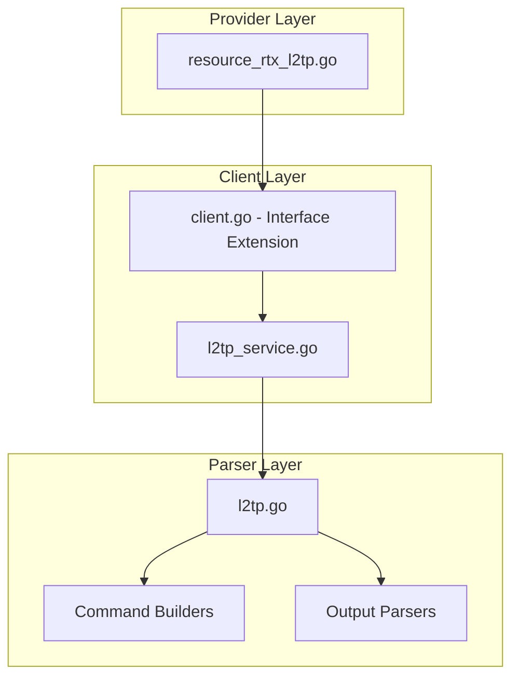

# Design Document: rtx_l2tp

## Overview

The `rtx_l2tp` resource enables Terraform-based management of L2TP (Layer 2 Tunneling Protocol) configuration on Yamaha RTX series routers. This resource supports both **L2TPv2** (L2TP/IPsec for remote access VPN) and **L2TPv3** (L2VPN for site-to-site Layer 2 connectivity).

### L2TP Versions Supported

| Version | Use Case | Description |
|---------|----------|-------------|
| **L2TPv2** | Remote Access VPN | L2TP/IPsec for smartphone/PC clients connecting to LAN. Server (LNS) mode only. |
| **L2TPv3** | Site-to-Site L2VPN | Ethernet frame tunneling between routers. Enables same L2 segment across multiple sites. |

### RTX L2TP Limitations
- **L2TPv2**: L2TP/IPsec only (no standalone L2TP), LNS mode only (no LAC), IKEv1 only
- **L2TPv3**: L2TPv3 over UDP only (no L2TPv3 over IP), Ethernet frames only, IKEv1 transport mode for IPsec

## Code Reuse Analysis

### Existing Components to Leverage

- **`internal/client/dhcp_scope_service.go`**: Pattern for service layer implementation with CRUD operations.
- **`internal/client/interfaces.go`**: Extend the `Client` interface with L2TP methods.
- **`internal/rtx/parsers/dhcp_scope.go`**: Reference for parser implementation and command builders.
- **`internal/provider/resource_rtx_dhcp_scope.go`**: Template for Terraform resource structure.

### Integration Points

- **`rtxClient`**: Add L2TP methods for CRUD operations
- **`Executor`**: Use existing SSH command execution infrastructure
- **PP Anonymous**: Coordinate with PP anonymous configuration
- **IPsec**: Optional integration with IPsec tunnel

## Architecture



### Modular Design Principles

- **Single File Responsibility**: `L2TPService` handles all L2TP CRUD operations
- **Component Isolation**: Parser, service, and resource layers clearly separated
- **Service Layer Separation**: Service encapsulates all L2TP logic
- **Utility Modularity**: Shared validation functions for authentication parameters

## Components and Interfaces

### Component 1: L2TPService (`internal/client/l2tp_service.go`)

- **Purpose:** Handles all L2TP CRUD operations against the RTX router
- **Interfaces:**
  ```go
  type L2TPService struct {
      executor Executor
      client   *rtxClient
  }

  func (s *L2TPService) Create(ctx context.Context, l2tp L2TPConfig) error
  func (s *L2TPService) Get(ctx context.Context, tunnelID int) (*L2TPConfig, error)
  func (s *L2TPService) Update(ctx context.Context, l2tp L2TPConfig) error
  func (s *L2TPService) Delete(ctx context.Context, tunnelID int) error
  func (s *L2TPService) List(ctx context.Context) ([]L2TPConfig, error)
  ```
- **Dependencies:** `Executor`, `rtxClient`, `parsers.L2TPParser`
- **Reuses:** Pattern from service layer implementations

### Component 2: L2TPParser (`internal/rtx/parsers/l2tp.go`)

- **Purpose:** Parses RTX router output for L2TP configuration and builds commands
- **Interfaces:**
  ```go
  type L2TPConfig struct {
      ID               int            `json:"id"`
      Name             string         `json:"name,omitempty"`
      Version          string         `json:"version"`         // l2tp (v2) or l2tpv3
      Mode             string         `json:"mode"`            // lns, lac (v2 only), or l2vpn (v3)
      Shutdown         bool           `json:"shutdown"`
      TunnelSource     string         `json:"tunnel_source,omitempty"`
      TunnelDest       string         `json:"tunnel_destination,omitempty"`
      Authentication   L2TPAuth       `json:"authentication"`
      IPPool           *L2TPIPPool    `json:"ip_pool,omitempty"`
      IPsecProfile     *L2TPIPsec     `json:"ipsec_profile,omitempty"`
      L2TPv3Config     *L2TPv3Config  `json:"l2tpv3_config,omitempty"`  // L2TPv3 specific
      KeepaliveEnabled bool           `json:"keepalive_enabled"`
      DisconnectTime   int            `json:"disconnect_time,omitempty"`
  }

  // L2TPv3Config represents L2TPv3-specific settings
  type L2TPv3Config struct {
      LocalRouterID   string `json:"local_router_id"`   // IPv4 address for local router ID
      RemoteRouterID  string `json:"remote_router_id"`  // IPv4 address for remote router ID
      RemoteEndID     string `json:"remote_end_id,omitempty"` // Optional end ID string
      AlwaysOn        bool   `json:"always_on"`         // Keep connection always active
      BridgeInterface string `json:"bridge_interface,omitempty"` // Bridge interface to bind
  }

  type L2TPAuth struct {
      Method   string `json:"method"`   // pap, chap
      Username string `json:"username,omitempty"`
      Password string `json:"password,omitempty"`
  }

  type L2TPIPPool struct {
      Start string `json:"start"`
      End   string `json:"end"`
  }

  type L2TPIPsec struct {
      Enabled       bool   `json:"enabled"`
      PreSharedKey  string `json:"pre_shared_key,omitempty"`
  }

  func ParseL2TPConfig(raw string) ([]L2TPConfig, error)
  func BuildPPSelectAnonymousCommand() string
  func BuildPPBindTunnelCommand(tunnelID int) string
  func BuildPPAuthAcceptCommand(method string) string
  func BuildPPAuthMynameCommand(user, pass string) string
  func BuildL2TPTunnelDisconnectTimeCommand(seconds int) string
  func BuildL2TPKeepaliveCommand(enabled bool) string
  func BuildDeleteL2TPCommand(tunnelID int) string
  ```
- **Dependencies:** `regexp`, `strings`, `strconv`
- **Reuses:** IP validation patterns, authentication patterns

### Component 3: Terraform Resource (`internal/provider/resource_rtx_l2tp.go`)

- **Purpose:** Terraform resource definition implementing CRUD lifecycle
- **Interfaces:**
  ```go
  func resourceRTXL2TP() *schema.Resource
  func resourceRTXL2TPCreate(ctx, d, meta) diag.Diagnostics
  func resourceRTXL2TPRead(ctx, d, meta) diag.Diagnostics
  func resourceRTXL2TPUpdate(ctx, d, meta) diag.Diagnostics
  func resourceRTXL2TPDelete(ctx, d, meta) diag.Diagnostics
  func resourceRTXL2TPImport(ctx, d, meta) ([]*schema.ResourceData, error)
  ```
- **Dependencies:** `Client`, `L2TPConfig`, Terraform SDK
- **Reuses:** Resource patterns from other implementations

### Component 4: Client Interface Extension (`internal/client/interfaces.go`)

- **Purpose:** Extend Client interface with L2TP methods
- **Interfaces:**
  ```go
  // Add to existing Client interface:
  GetL2TP(ctx context.Context, tunnelID int) (*L2TPConfig, error)
  CreateL2TP(ctx context.Context, l2tp L2TPConfig) error
  UpdateL2TP(ctx context.Context, l2tp L2TPConfig) error
  DeleteL2TP(ctx context.Context, tunnelID int) error
  ListL2TPs(ctx context.Context) ([]L2TPConfig, error)
  ```
- **Dependencies:** Existing Client interface
- **Reuses:** Pattern from existing methods

## Data Models

### L2TPConfig

```go
// L2TPConfig represents L2TP configuration on an RTX router
type L2TPConfig struct {
    ID               int          `json:"id"`                 // Tunnel ID
    Name             string       `json:"name,omitempty"`     // Description
    Version          string       `json:"version"`            // "l2tp" (v2) or "l2tpv3"
    Mode             string       `json:"mode"`               // lns (v2), l2vpn (v3)
    Shutdown         bool         `json:"shutdown"`           // Admin state
    TunnelSource     string       `json:"tunnel_source"`      // Local endpoint
    TunnelDest       string       `json:"tunnel_destination"` // Remote endpoint
    Authentication   L2TPAuth     `json:"authentication"`     // Auth settings (v2 only)
    IPPool           *L2TPIPPool  `json:"ip_pool,omitempty"`  // IP pool for clients (v2 only)
    IPsecProfile     *L2TPIPsec   `json:"ipsec_profile,omitempty"` // L2TP/IPsec
    L2TPv3Config     *L2TPv3Config `json:"l2tpv3_config,omitempty"` // L2TPv3 specific settings
    KeepaliveEnabled bool         `json:"keepalive_enabled"`
    DisconnectTime   int          `json:"disconnect_time"`    // Idle timeout
}

// L2TPAuth represents authentication settings (L2TPv2 only)
type L2TPAuth struct {
    Method   string `json:"method"`   // pap, chap
    Username string `json:"username"` // For LAC mode
    Password string `json:"password"` // Sensitive
}

// L2TPIPPool represents IP address pool for clients (L2TPv2 only)
type L2TPIPPool struct {
    Start string `json:"start"` // Start IP
    End   string `json:"end"`   // End IP
}

// L2TPIPsec represents L2TP over IPsec settings
type L2TPIPsec struct {
    Enabled      bool   `json:"enabled"`
    PreSharedKey string `json:"pre_shared_key"` // Sensitive
}

// L2TPv3Config represents L2TPv3-specific settings for L2VPN
type L2TPv3Config struct {
    LocalRouterID   string `json:"local_router_id"`    // IPv4 address for local router ID
    RemoteRouterID  string `json:"remote_router_id"`   // IPv4 address for remote router ID
    RemoteEndID     string `json:"remote_end_id"`      // Optional end ID string (32 chars max)
    AlwaysOn        bool   `json:"always_on"`          // Keep connection always active (default: true)
    BridgeInterface string `json:"bridge_interface"`   // Bridge interface to bind for L2 forwarding
}
```

### Terraform Schema

```hcl
# ============================================
# L2TPv2: Remote Access VPN Server (LNS mode)
# ============================================
resource "rtx_l2tp" "vpn_server" {
  id       = 1
  name     = "L2TP_VPN"
  version  = "l2tp"   # L2TPv2
  mode     = "lns"    # L2TP Network Server
  shutdown = false

  tunnel_source      = "203.0.113.1"
  tunnel_destination = "0.0.0.0"  # Accept from any

  authentication {
    method   = "chap"
    username = "vpnuser"
    password = var.l2tp_password
  }

  ip_pool {
    start = "192.168.100.100"
    end   = "192.168.100.200"
  }

  # L2TP/IPsec (required for L2TPv2 on RTX)
  ipsec_profile {
    enabled        = true
    pre_shared_key = var.ipsec_psk
  }

  keepalive_enabled = true
  disconnect_time   = 3600
}

# ============================================
# L2TPv3: Site-to-Site L2VPN
# ============================================
resource "rtx_l2tp" "l2vpn_site_a" {
  id       = 2
  name     = "L2VPN_TO_SITE_B"
  version  = "l2tpv3"  # L2TPv3
  mode     = "l2vpn"
  shutdown = false

  tunnel_source      = "203.0.113.1"
  tunnel_destination = "198.51.100.1"

  # L2TPv3 specific configuration
  l2tpv3_config {
    local_router_id  = "1.1.1.1"      # Unique identifier for this router
    remote_router_id = "2.2.2.2"      # Remote router's identifier
    remote_end_id    = "site-b-tunnel"
    always_on        = true
    bridge_interface = "bridge1"      # Bridge interface for L2 forwarding
  }

  # Optional: L2TPv3/IPsec for encryption
  ipsec_profile {
    enabled        = true
    pre_shared_key = var.ipsec_psk
  }

  keepalive_enabled = true
  disconnect_time   = 60
}

# L2TPv3 without IPsec (unencrypted L2VPN)
resource "rtx_l2tp" "l2vpn_unencrypted" {
  id       = 3
  name     = "L2VPN_INTERNAL"
  version  = "l2tpv3"
  mode     = "l2vpn"
  shutdown = false

  tunnel_source      = "10.0.0.1"
  tunnel_destination = "10.0.0.2"

  l2tpv3_config {
    local_router_id  = "10.0.0.1"
    remote_router_id = "10.0.0.2"
    always_on        = true
    bridge_interface = "bridge2"
  }

  keepalive_enabled = true
}
```

## RTX Command Mapping

### Enable L2TP Service

```
l2tp service on                      # Enable both L2TPv2 and L2TPv3
l2tp service on l2tp                 # Enable L2TPv2 only
l2tp service on l2tpv3               # Enable L2TPv3 only
```

---

### L2TPv2 Commands (Remote Access VPN)

#### Configure PP Anonymous (LNS)

```
pp select anonymous
pp bind tunnel<n>
```

#### Configure Authentication

```
pp auth accept <pap/chap>
pp auth myname <name> <password>
```

#### Configure IPCP

```
ppp ipcp ipaddress on
ppp ipcp msext on
ip pp remote address pool <start>-<end>
```

#### Configure L2TP/IPsec (Required for L2TPv2)

```
tunnel enable <n>
tunnel encapsulation <n> l2tp
ipsec tunnel <n>
ipsec ike pre-shared-key <n> text <key>
```

---

### L2TPv3 Commands (Site-to-Site L2VPN)

#### Configure L2TPv3 Tunnel

```
tunnel select <n>
tunnel encapsulation l2tpv3
tunnel endpoint address <local_ip> <remote_ip>
```

#### Configure L2TPv3 Router IDs

```
l2tp local router-id <ipv4_address>    # Local router identifier
l2tp remote router-id <ipv4_address>   # Remote router identifier
l2tp remote end-id <string>            # Optional end ID (32 chars max)
```

#### Configure L2TPv3 Connection Behavior

```
l2tp always-on on                      # Keep connection always active (default)
l2tp always-on off                     # Connect on demand
```

#### Configure L2TPv3/IPsec (Optional)

```
ipsec tunnel <n>
ipsec ike pre-shared-key <n> text <key>
ipsec sa policy <n> <tunnel_n> esp aes-cbc sha-hmac
```

#### Bind L2TPv3 to Bridge Interface

```
bridge member bridge<n> tunnel<n>      # Add tunnel to bridge for L2 forwarding
```

---

### Common L2TP Settings

```
l2tp tunnel disconnect time <n>        # Idle disconnect timeout (seconds)
l2tp tunnel disconnect time off        # Disable idle disconnect
l2tp keepalive use on <interval> <retry>  # Enable keepalive with interval and retry count
l2tp keepalive log on                  # Log keepalive events
l2tp keepalive log off                 # Disable keepalive logging
l2tp hostname <name>                   # Set hostname for L2TP negotiation
l2tp tunnel auth on <password>         # Enable tunnel authentication
l2tp syslog on                         # Enable L2TP syslog
```

### Extended L2TPv3 Configuration (from real config)

Based on actual RTX configuration, L2TPv3 tunnels include these additional settings:

```
tunnel select 1
 tunnel encapsulation l2tpv3
 tunnel endpoint name <fqdn> fqdn           # Use FQDN instead of IP
 ipsec tunnel 101
  ipsec sa policy 101 1 esp aes-cbc sha-hmac
  ipsec ike keepalive log 1 off
  ipsec ike keepalive use 1 on heartbeat 10 6
  ipsec ike local address 1 <local_ip>
  ipsec ike log 1 key-info message-info payload-info
  ipsec ike nat-traversal 1 on
  ipsec ike pre-shared-key 1 text <psk>
  ipsec ike remote address 1 <remote_host>
  ipsec ike remote name 1 l2tpv3 key-id
 l2tp always-on on
 l2tp hostname <hostname>
 l2tp tunnel auth on <password>
 l2tp tunnel disconnect time off
 l2tp keepalive use on 60 3
 l2tp keepalive log off
 l2tp syslog on
 l2tp local router-id <local_ip>
 l2tp remote router-id <remote_ip>
 l2tp remote end-id <end_id>
 ip tunnel secure filter in <filter_list>
 ip tunnel tcp mss limit auto
 tunnel enable 1
```

### Extended Data Model for L2TPv3

```go
// L2TPv3Config represents comprehensive L2TPv3-specific settings
type L2TPv3Config struct {
    LocalRouterID    string `json:"local_router_id"`     // IPv4 address for local router ID
    RemoteRouterID   string `json:"remote_router_id"`    // IPv4 address for remote router ID
    RemoteEndID      string `json:"remote_end_id"`       // Optional end ID string (32 chars max)
    AlwaysOn         bool   `json:"always_on"`           // Keep connection always active
    BridgeInterface  string `json:"bridge_interface"`    // Bridge interface to bind
    Hostname         string `json:"hostname"`            // L2TP hostname for negotiation
    TunnelAuth       *L2TPTunnelAuth `json:"tunnel_auth"` // Tunnel authentication
    Keepalive        *L2TPKeepalive  `json:"keepalive"`   // Keepalive settings
    SyslogEnabled    bool   `json:"syslog_enabled"`      // Enable L2TP syslog
    TCPMSSLimit      string `json:"tcp_mss_limit"`       // TCP MSS limit (auto or value)
    SecureFilterIn   []int  `json:"secure_filter_in"`    // Inbound filter list
}

// L2TPTunnelAuth represents tunnel authentication settings
type L2TPTunnelAuth struct {
    Enabled  bool   `json:"enabled"`
    Password string `json:"password"` // Sensitive
}

// L2TPKeepalive represents keepalive settings
type L2TPKeepalive struct {
    Enabled  bool `json:"enabled"`
    Interval int  `json:"interval"`  // Seconds
    Retry    int  `json:"retry"`     // Retry count
    LogOn    bool `json:"log_on"`    // Enable keepalive logging
}
```

### Extended Terraform Schema for L2TPv3

```hcl
resource "rtx_l2tp" "l2vpn_full" {
  id       = 1
  name     = "L2VPN_SITE_A"
  version  = "l2tpv3"
  mode     = "l2vpn"
  shutdown = false

  # Tunnel endpoint - supports FQDN
  tunnel_source      = "192.168.1.253"
  tunnel_destination = "itm.ohno.be"
  tunnel_dest_type   = "fqdn"  # "ip" or "fqdn"

  # L2TPv3 specific configuration
  l2tpv3_config {
    local_router_id   = "192.168.1.253"
    remote_router_id  = "192.168.1.254"
    remote_end_id     = "shin1"
    always_on         = true
    bridge_interface  = "bridge1"
    hostname          = "ebisu-RTX1210"
    syslog_enabled    = true
    tcp_mss_limit     = "auto"
    secure_filter_in  = [200028, 200099]

    tunnel_auth {
      enabled  = true
      password = var.l2tp_tunnel_password
    }

    keepalive {
      enabled  = true
      interval = 60
      retry    = 3
      log_on   = false
    }
  }

  # IPsec profile for encrypted L2TPv3
  ipsec_profile {
    enabled        = true
    pre_shared_key = var.ipsec_psk

    # Extended IPsec settings
    sa_policy      = "esp aes-cbc sha-hmac"
    nat_traversal  = true
    ike_keepalive {
      enabled   = true
      type      = "heartbeat"
      interval  = 10
      retry     = 6
      log_on    = false
    }
  }
}

### Delete L2TP

```
no pp select anonymous                 # Delete L2TPv2 anonymous PP
no tunnel <n>                          # Delete tunnel
no l2tp service                        # Disable L2TP service
```

### Show Configuration

```
show config | grep l2tp
show config | grep "pp select anonymous"
show status l2tp
```

## Error Handling

### Error Scenarios

1. **Invalid Tunnel ID**
   - **Handling:** Validate ID is positive integer
   - **User Impact:** Clear validation error

2. **Invalid Mode**
   - **Handling:** Validate mode is "lns" or "lac"
   - **User Impact:** Clear error with valid values

3. **Invalid Authentication Method**
   - **Handling:** Validate method is supported
   - **User Impact:** Error with valid methods

4. **Invalid IP Pool**
   - **Handling:** Validate IP range is valid and start < end
   - **User Impact:** Clear error with expected format

5. **Missing Credentials**
   - **Handling:** Require username/password for LAC mode
   - **User Impact:** Validation error

6. **Connection/Command Timeout**
   - **Handling:** Use existing retry logic from `rtxClient`
   - **User Impact:** Standard Terraform timeout error

## Testing Strategy

### Unit Testing

- **Parser Tests** (`l2tp_test.go`):
  - Parse various RTX `show config` output for L2TP
  - Test command builder functions with different parameters
  - Test authentication configuration

- **Service Tests** (`l2tp_service_test.go`):
  - Mock executor for service method testing
  - Test error handling for various failure scenarios
  - Test LNS vs LAC mode handling

### Integration Testing

- **Resource Tests** (`resource_rtx_l2tp_test.go`):
  - Full CRUD lifecycle with mock client
  - Import functionality testing
  - Sensitive attribute handling

### End-to-End Testing

- **Acceptance Tests** (with real RTX router):
  - Create L2TP server
  - Create L2TP client
  - Configure L2TP/IPsec
  - Update settings
  - Delete configuration
  - Import existing L2TP

## State Handling

- Persist only configuration attributes in Terraform state.
- Tunnel status is operational-only and must not be stored in state to avoid perpetual diffs.

## File Structure

```
internal/
├── provider/
│   ├── resource_rtx_l2tp.go      # NEW: Terraform resource
│   └── resource_rtx_l2tp_test.go # NEW: Resource tests
├── client/
│   ├── interfaces.go              # MODIFY: Add L2TP types and methods
│   ├── client.go                  # MODIFY: Add L2TP service initialization
│   ├── l2tp_service.go           # NEW: L2TP service implementation
│   └── l2tp_service_test.go      # NEW: Service tests
└── rtx/
    └── parsers/
        ├── l2tp.go               # NEW: Parser and command builders
        └── l2tp_test.go          # NEW: Parser tests
```

## Implementation Notes

1. **Sensitive Data**: Password and PSK must be marked as sensitive in Terraform state.

2. **Terraform ID**: Use tunnel ID as Terraform resource ID.

3. **ForceNew**: Tunnel ID and mode are ForceNew. Other attributes support in-place updates.

4. **PP Anonymous**: LNS mode uses PP anonymous configuration. Consider relationship.

5. **L2TP/IPsec**: IPsec integration requires coordinating with IPsec tunnel configuration.

6. **Tunnel vs PP**: RTX uses both tunnel and PP concepts. Map appropriately.

7. **IP Pool**: Consider as embedded or separate resource.

8. **Keepalive**: L2TP keepalive is different from IPsec DPD.

9. **Configuration Save**: Use existing `SaveConfig()` pattern after modifications.

10. **Provider Registration**: Add `resourceRTXL2TP` to provider's resource map.
