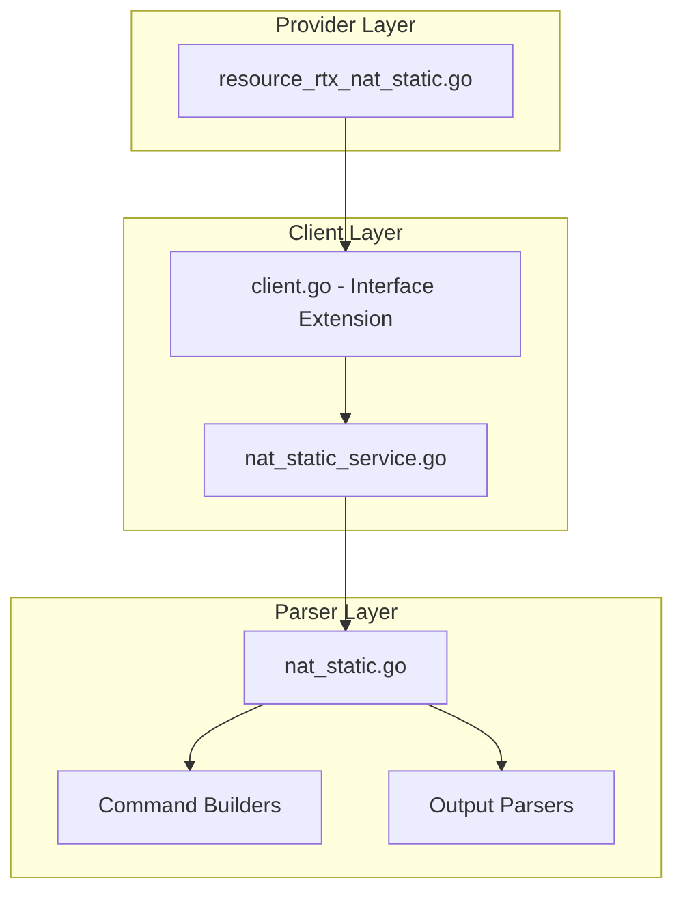

# Design Document: rtx_nat_static

## Overview

The `rtx_nat_static` resource enables Terraform-based management of static NAT (1:1 address mapping) on Yamaha RTX series routers. Following Cisco IOS XE Terraform provider naming conventions, this resource manages NAT descriptors configured for one-to-one address translation, including port-based static NAT.

## Code Reuse Analysis

### Existing Components to Leverage

- **`internal/client/nat_masquerade_service.go`**: Pattern for NAT descriptor service implementation (if created first).
- **`internal/client/interfaces.go`**: Extend the `Client` interface with static NAT methods.
- **`internal/rtx/parsers/nat_masquerade.go`**: Reference for NAT parser implementation (if created first).
- **`internal/provider/resource_rtx_dhcp_scope.go`**: Template for Terraform resource structure.

### Integration Points

- **`rtxClient`**: Add static NAT methods for CRUD operations
- **`Executor`**: Use existing SSH command execution infrastructure
- **Interface binding**: Coordinate with interface configuration

## Architecture



### Modular Design Principles

- **Single File Responsibility**: `NATStaticService` handles all static NAT CRUD operations
- **Component Isolation**: Parser, service, and resource layers clearly separated
- **Service Layer Separation**: Service encapsulates all static NAT logic
- **Utility Modularity**: Shared validation functions for IP/port operations

## Components and Interfaces

### Component 1: NATStaticService (`internal/client/nat_static_service.go`)

- **Purpose:** Handles all static NAT CRUD operations against the RTX router
- **Interfaces:**
  ```go
  type NATStaticService struct {
      executor Executor
      client   *rtxClient
  }

  func (s *NATStaticService) Create(ctx context.Context, nat NATStatic) error
  func (s *NATStaticService) Get(ctx context.Context, descriptorID int) (*NATStatic, error)
  func (s *NATStaticService) Update(ctx context.Context, nat NATStatic) error
  func (s *NATStaticService) Delete(ctx context.Context, descriptorID int) error
  func (s *NATStaticService) List(ctx context.Context) ([]NATStatic, error)
  ```
- **Dependencies:** `Executor`, `rtxClient`, `parsers.NATStaticParser`
- **Reuses:** Pattern from service layer implementations

### Component 2: NATStaticParser (`internal/rtx/parsers/nat_static.go`)

- **Purpose:** Parses RTX router output for static NAT configuration and builds commands
- **Interfaces:**
  ```go
  type NATStatic struct {
      DescriptorID  int                 `json:"descriptor_id"`
      StaticEntries []NATStaticEntry    `json:"static_entries"`
      Interface     string              `json:"interface,omitempty"`
  }

  type NATStaticEntry struct {
      InsideLocal       string `json:"inside_local"`
      InsideLocalPort   int    `json:"inside_local_port,omitempty"`
      OutsideGlobal     string `json:"outside_global"`
      OutsideGlobalPort int    `json:"outside_global_port,omitempty"`
      Protocol          string `json:"protocol,omitempty"` // tcp/udp
  }

  func ParseNATStaticConfig(raw string) ([]NATStatic, error)
  func BuildNATDescriptorTypeStaticCommand(id int) string
  func BuildNATStaticMappingCommand(id int, entry NATStaticEntry) string
  func BuildNATStaticPortMappingCommand(id int, entry NATStaticEntry) string
  func BuildDeleteNATStaticCommand(id int) string
  ```
- **Dependencies:** `regexp`, `strings`, `strconv`
- **Reuses:** IP validation patterns

### Component 3: Terraform Resource (`internal/provider/resource_rtx_nat_static.go`)

- **Purpose:** Terraform resource definition implementing CRUD lifecycle
- **Interfaces:**
  ```go
  func resourceRTXNATStatic() *schema.Resource
  func resourceRTXNATStaticCreate(ctx, d, meta) diag.Diagnostics
  func resourceRTXNATStaticRead(ctx, d, meta) diag.Diagnostics
  func resourceRTXNATStaticUpdate(ctx, d, meta) diag.Diagnostics
  func resourceRTXNATStaticDelete(ctx, d, meta) diag.Diagnostics
  func resourceRTXNATStaticImport(ctx, d, meta) ([]*schema.ResourceData, error)
  ```
- **Dependencies:** `Client`, `NATStatic`, Terraform SDK
- **Reuses:** Resource patterns from other implementations

### Component 4: Client Interface Extension (`internal/client/interfaces.go`)

- **Purpose:** Extend Client interface with static NAT methods
- **Interfaces:**
  ```go
  // Add to existing Client interface:
  GetNATStatic(ctx context.Context, descriptorID int) (*NATStatic, error)
  CreateNATStatic(ctx context.Context, nat NATStatic) error
  UpdateNATStatic(ctx context.Context, nat NATStatic) error
  DeleteNATStatic(ctx context.Context, descriptorID int) error
  ListNATStatics(ctx context.Context) ([]NATStatic, error)
  ```
- **Dependencies:** Existing Client interface
- **Reuses:** Pattern from existing methods

## Data Models

### NATStatic

```go
// NATStatic represents a static NAT descriptor on an RTX router
type NATStatic struct {
    DescriptorID  int              `json:"descriptor_id"`   // NAT descriptor ID (1-65535)
    StaticEntries []NATStaticEntry `json:"static_entries"`  // 1:1 mappings
    Interface     string           `json:"interface,omitempty"` // Bound interface
}

// NATStaticEntry represents a 1:1 NAT mapping
type NATStaticEntry struct {
    InsideLocal       string `json:"inside_local"`         // Inside local IP
    InsideLocalPort   int    `json:"inside_local_port,omitempty"`
    OutsideGlobal     string `json:"outside_global"`       // Outside global IP
    OutsideGlobalPort int    `json:"outside_global_port,omitempty"`
    Protocol          string `json:"protocol,omitempty"`   // tcp/udp for port NAT
}
```

### Terraform Schema

```hcl
# Static 1:1 NAT
resource "rtx_nat_static" "webserver" {
  id = 10  # Descriptor ID, Required, ForceNew

  static_entries = [
    {
      inside_local   = "192.168.1.10"
      outside_global = "203.0.113.10"
    }
  ]
}

# Port-based static NAT
resource "rtx_nat_static" "port_forward" {
  id = 11

  static_entries = [
    {
      protocol            = "tcp"
      inside_local        = "192.168.1.20"
      inside_local_port   = 80
      outside_global      = "203.0.113.1"
      outside_global_port = 8080
    },
    {
      protocol            = "tcp"
      inside_local        = "192.168.1.21"
      inside_local_port   = 443
      outside_global      = "203.0.113.1"
      outside_global_port = 443
    }
  ]
}
```

## RTX Command Mapping

### Create Static NAT Descriptor

```
nat descriptor type <id> static
```

### Configure 1:1 Mapping

```
nat descriptor static <id> <outer_ip>=<inner_ip>
```

Example: `nat descriptor static 10 203.0.113.10=192.168.1.10`

### Configure Port-based Mapping

```
nat descriptor static <id> <outer_ip>:<port>=<inner_ip>:<port> <protocol>
```

Example: `nat descriptor static 11 203.0.113.1:8080=192.168.1.20:80 tcp`

### Apply to Interface

```
ip <interface> nat descriptor <id>
```

Example: `ip pp1 nat descriptor 10`

### Delete Static NAT

```
no nat descriptor type <id>
```

### Show NAT Configuration

```
show nat descriptor address
show config | grep "nat descriptor"
```

## Error Handling

### Error Scenarios

1. **Invalid Descriptor ID**
   - **Handling:** Validate ID is in range 1-65535
   - **User Impact:** Clear validation error with valid range

2. **Descriptor Already Exists**
   - **Handling:** Parse RTX output for existing descriptor
   - **User Impact:** Error suggesting import or different ID

3. **Invalid IP Address**
   - **Handling:** Validate IP address format
   - **User Impact:** Clear error with expected format

4. **Invalid Port**
   - **Handling:** Validate port is in range 1-65535
   - **User Impact:** Clear error with valid range

5. **Overlapping Mapping**
   - **Handling:** Check for conflicts with existing mappings
   - **User Impact:** Error indicating conflict

6. **Missing Protocol for Port NAT**
   - **Handling:** Require protocol when ports are specified
   - **User Impact:** Validation error requiring protocol

7. **Connection/Command Timeout**
   - **Handling:** Use existing retry logic from `rtxClient`
   - **User Impact:** Standard Terraform timeout error

## Testing Strategy

### Unit Testing

- **Parser Tests** (`nat_static_test.go`):
  - Parse various RTX `show nat descriptor` output formats
  - Test command builder functions with different parameters
  - Test port-based NAT command building

- **Service Tests** (`nat_static_service_test.go`):
  - Mock executor for service method testing
  - Test error handling for various failure scenarios
  - Test multiple entry handling

### Integration Testing

- **Resource Tests** (`resource_rtx_nat_static_test.go`):
  - Full CRUD lifecycle with mock client
  - Import functionality testing
  - Port-based NAT configuration testing

### End-to-End Testing

- **Acceptance Tests** (with real RTX router):
  - Create 1:1 static NAT
  - Create port-based static NAT
  - Create multiple mappings
  - Update mappings
  - Delete static NAT
  - Import existing configuration

## File Structure

```
internal/
├── provider/
│   ├── resource_rtx_nat_static.go      # NEW: Terraform resource
│   └── resource_rtx_nat_static_test.go # NEW: Resource tests
├── client/
│   ├── interfaces.go                    # MODIFY: Add NATStatic type and methods
│   ├── client.go                        # MODIFY: Add NAT static service initialization
│   ├── nat_static_service.go           # NEW: NAT static service implementation
│   └── nat_static_service_test.go      # NEW: Service tests
└── rtx/
    └── parsers/
        ├── nat_static.go               # NEW: Parser and command builders
        └── nat_static_test.go          # NEW: Parser tests
```

## Implementation Notes

1. **Descriptor Type**: This resource specifically handles `static` type NAT descriptors, distinct from `masquerade` type.

2. **Bidirectional Translation**: Static NAT is bidirectional - traffic can be initiated from either side.

3. **Terraform ID**: Use descriptor ID directly as Terraform resource ID.

4. **ForceNew**: `descriptor_id` is ForceNew. Static entries support in-place updates.

5. **Entry Ordering**: Static entries may need sequence numbers. Consider auto-generation.

6. **Protocol Requirement**: When `inside_local_port` or `outside_global_port` is set, `protocol` must be specified.

7. **IP vs ipcp**: Unlike masquerade NAT, static NAT typically uses specific IP addresses, not interface references.

8. **Configuration Save**: Use existing `SaveConfig()` pattern after modifications.

9. **Provider Registration**: Add `resourceRTXNATStatic` to provider's resource map.

10. **Shared Code**: Consider sharing common NAT parsing code with `rtx_nat_masquerade` resource.

## State Handling

- Persist only configuration attributes in Terraform state.
- Operational/runtime status must not be stored in state to avoid perpetual diffs.
