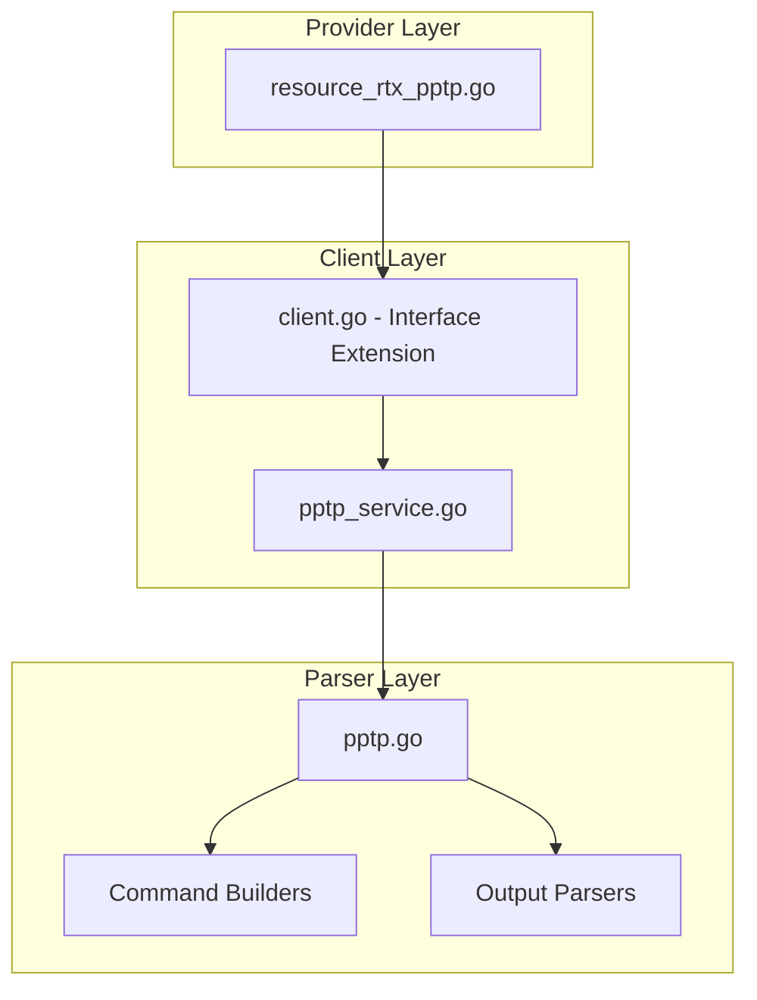

# Design Document: rtx_pptp

## Overview

The `rtx_pptp` resource enables Terraform-based management of PPTP (Point-to-Point Tunneling Protocol) configuration on Yamaha RTX series routers. Note that PPTP is considered a legacy/deprecated protocol for security-sensitive applications. This resource manages PPTP server configuration including authentication, encryption (MPPE), and IP address assignment.

## Code Reuse Analysis

### Existing Components to Leverage

- **`internal/client/l2tp_service.go`**: Pattern for VPN service layer (if created first).
- **`internal/client/interfaces.go`**: Extend the `Client` interface with PPTP methods.
- **`internal/rtx/parsers/l2tp.go`**: Reference for VPN parser implementation (if created first).
- **`internal/provider/resource_rtx_dhcp_scope.go`**: Template for Terraform resource structure.

### Integration Points

- **`rtxClient`**: Add PPTP methods for CRUD operations
- **`Executor`**: Use existing SSH command execution infrastructure
- **PP Anonymous**: Coordinate with PP anonymous configuration

## Architecture



### Modular Design Principles

- **Single File Responsibility**: `PPTPService` handles all PPTP CRUD operations
- **Component Isolation**: Parser, service, and resource layers clearly separated
- **Service Layer Separation**: Service encapsulates all PPTP logic
- **Utility Modularity**: Shared validation functions for authentication parameters

## Components and Interfaces

### Component 1: PPTPService (`internal/client/pptp_service.go`)

- **Purpose:** Handles all PPTP CRUD operations against the RTX router
- **Interfaces:**
  ```go
  type PPTPService struct {
      executor Executor
      client   *rtxClient
  }

  func (s *PPTPService) Create(ctx context.Context, pptp PPTPConfig) error
  func (s *PPTPService) Get(ctx context.Context) (*PPTPConfig, error)
  func (s *PPTPService) Update(ctx context.Context, pptp PPTPConfig) error
  func (s *PPTPService) Delete(ctx context.Context) error
  ```
- **Dependencies:** `Executor`, `rtxClient`, `parsers.PPTPParser`
- **Reuses:** Pattern from service layer implementations

### Component 2: PPTPParser (`internal/rtx/parsers/pptp.go`)

- **Purpose:** Parses RTX router output for PPTP configuration and builds commands
- **Interfaces:**
  ```go
  type PPTPConfig struct {
      Shutdown       bool           `json:"shutdown"`
      ListenAddress  string         `json:"listen_address,omitempty"`
      MaxConnections int            `json:"max_connections,omitempty"`
      Authentication PPTPAuth       `json:"authentication"`
      Encryption     PPTPEncryption `json:"encryption,omitempty"`
      IPPool         *PPTPIPPool    `json:"ip_pool,omitempty"`
      DisconnectTime int            `json:"disconnect_time,omitempty"`
      KeepaliveEnabled bool         `json:"keepalive_enabled"`
  }

  type PPTPAuth struct {
      Method   string `json:"method"`   // pap, chap, mschap, mschap-v2
      Username string `json:"username,omitempty"`
      Password string `json:"password,omitempty"`
  }

  type PPTPEncryption struct {
      MPPEBits int  `json:"mppe_bits"`  // 40, 56, 128
      Required bool `json:"required"`
  }

  type PPTPIPPool struct {
      Start string `json:"start"`
      End   string `json:"end"`
  }

  func ParsePPTPConfig(raw string) (*PPTPConfig, error)
  func BuildPPTPServiceCommand(enabled bool) string
  func BuildPPTPTunnelDisconnectTimeCommand(seconds int) string
  func BuildPPTPKeepaliveCommand(enabled bool) string
  func BuildPPAuthAcceptCommand(method string) string
  func BuildPPPCCPTypeCommand(mppeType string) string
  func BuildDeletePPTPCommand() string
  ```
- **Dependencies:** `regexp`, `strings`, `strconv`
- **Reuses:** IP validation patterns, authentication patterns from L2TP

### Component 3: Terraform Resource (`internal/provider/resource_rtx_pptp.go`)

- **Purpose:** Terraform resource definition implementing CRUD lifecycle
- **Interfaces:**
  ```go
  func resourceRTXPPTP() *schema.Resource
  func resourceRTXPPTPCreate(ctx, d, meta) diag.Diagnostics
  func resourceRTXPPTPRead(ctx, d, meta) diag.Diagnostics
  func resourceRTXPPTPUpdate(ctx, d, meta) diag.Diagnostics
  func resourceRTXPPTPDelete(ctx, d, meta) diag.Diagnostics
  func resourceRTXPPTPImport(ctx, d, meta) ([]*schema.ResourceData, error)
  ```
- **Dependencies:** `Client`, `PPTPConfig`, Terraform SDK
- **Reuses:** Resource patterns from other implementations

### Component 4: Client Interface Extension (`internal/client/interfaces.go`)

- **Purpose:** Extend Client interface with PPTP methods
- **Interfaces:**
  ```go
  // Add to existing Client interface:
  GetPPTP(ctx context.Context) (*PPTPConfig, error)
  CreatePPTP(ctx context.Context, pptp PPTPConfig) error
  UpdatePPTP(ctx context.Context, pptp PPTPConfig) error
  DeletePPTP(ctx context.Context) error
  ```
- **Dependencies:** Existing Client interface
- **Reuses:** Pattern from existing methods

## Data Models

### PPTPConfig

```go
// PPTPConfig represents PPTP configuration on an RTX router
type PPTPConfig struct {
    Shutdown         bool           `json:"shutdown"`          // Admin state
    ListenAddress    string         `json:"listen_address"`    // 0.0.0.0 = all
    MaxConnections   int            `json:"max_connections"`   // Max simultaneous
    Authentication   PPTPAuth       `json:"authentication"`    // Auth settings
    Encryption       PPTPEncryption `json:"encryption"`        // MPPE settings
    IPPool           *PPTPIPPool    `json:"ip_pool,omitempty"` // IP pool
    DisconnectTime   int            `json:"disconnect_time"`   // Idle timeout
    KeepaliveEnabled bool           `json:"keepalive_enabled"`
}

// PPTPAuth represents authentication settings
type PPTPAuth struct {
    Method   string `json:"method"`   // pap, chap, mschap, mschap-v2
    Username string `json:"username"` // For server users
    Password string `json:"password"` // Sensitive
}

// PPTPEncryption represents MPPE encryption settings
type PPTPEncryption struct {
    MPPEBits int  `json:"mppe_bits"` // 40, 56, 128
    Required bool `json:"required"`  // Require encryption
}

// PPTPIPPool represents IP address pool for clients
type PPTPIPPool struct {
    Start string `json:"start"` // Start IP
    End   string `json:"end"`   // End IP
}
```

### Terraform Schema

```hcl
# PPTP VPN Server (Legacy - consider using L2TP/IPsec or IKEv2)
resource "rtx_pptp" "vpn_server" {
  shutdown = false

  listen_address  = "0.0.0.0"
  max_connections = 10

  authentication {
    method   = "mschap-v2"
    username = "vpnuser"
    password = var.pptp_password
  }

  encryption {
    mppe_bits = 128
    required  = true
  }

  ip_pool {
    start = "192.168.200.100"
    end   = "192.168.200.200"
  }

  disconnect_time   = 3600
  keepalive_enabled = true
}
```

## RTX Command Mapping

### Enable PPTP Service

```
pptp service on
```

### Configure PP Anonymous

```
pp select anonymous
pp bind tunnel<n>
```

### Configure Authentication

```
pp auth accept <pap/chap/mschap/mschap-v2>
pp auth myname <name> <password>
```

### Configure MPPE Encryption

```
ppp ccp type mppe-any
ppp ccp type mppe-128
```

### Configure IPCP

```
ppp ipcp ipaddress on
ip pp remote address pool <start>-<end>
```

### Configure Disconnect Time

```
pptp tunnel disconnect time <n>
```

### Configure Keepalive

```
pptp keepalive use on
```

### Delete PPTP

```
pptp service off
no pp select anonymous
```

### Show Configuration

```
show config | grep pptp
show status pptp
```

## Error Handling

### Error Scenarios

1. **Invalid Authentication Method**
   - **Handling:** Validate method is supported (pap/chap/mschap/mschap-v2)
   - **User Impact:** Error with valid methods

2. **Invalid MPPE Bits**
   - **Handling:** Validate bits is 40, 56, or 128
   - **User Impact:** Clear error with valid values

3. **Invalid IP Pool**
   - **Handling:** Validate IP range is valid
   - **User Impact:** Clear error with expected format

4. **Max Connections Out of Range**
   - **Handling:** Validate within router limits
   - **User Impact:** Clear error with valid range

5. **Connection/Command Timeout**
   - **Handling:** Use existing retry logic from `rtxClient`
   - **User Impact:** Standard Terraform timeout error

## Testing Strategy

### Unit Testing

- **Parser Tests** (`pptp_test.go`):
  - Parse various RTX `show config` output for PPTP
  - Test command builder functions with different parameters
  - Test MPPE configuration parsing

- **Service Tests** (`pptp_service_test.go`):
  - Mock executor for service method testing
  - Test error handling for various failure scenarios
  - Test encryption configuration

### Integration Testing

- **Resource Tests** (`resource_rtx_pptp_test.go`):
  - Full CRUD lifecycle with mock client
  - Import functionality testing
  - Sensitive attribute handling

### End-to-End Testing

- **Acceptance Tests** (with real RTX router):
  - Create PPTP server
  - Configure MPPE encryption
  - Update settings
  - Delete configuration
  - Import existing PPTP

## State Handling

- Persist only configuration attributes in Terraform state.
- Tunnel status is operational-only and must not be stored in state to avoid perpetual diffs.

## File Structure

```
internal/
├── provider/
│   ├── resource_rtx_pptp.go      # NEW: Terraform resource
│   └── resource_rtx_pptp_test.go # NEW: Resource tests
├── client/
│   ├── interfaces.go              # MODIFY: Add PPTP types and methods
│   ├── client.go                  # MODIFY: Add PPTP service initialization
│   ├── pptp_service.go           # NEW: PPTP service implementation
│   └── pptp_service_test.go      # NEW: Service tests
└── rtx/
    └── parsers/
        ├── pptp.go               # NEW: Parser and command builders
        └── pptp_test.go          # NEW: Parser tests
```

## Implementation Notes

1. **Singleton Resource**: PPTP is a singleton resource. Only one PPTP configuration can exist.

2. **Terraform ID**: Use "pptp" as the fixed Terraform resource ID.

3. **Sensitive Data**: Password must be marked as sensitive in Terraform state.

4. **Security Warning**: Consider adding a deprecation warning in documentation since PPTP has known security vulnerabilities.

5. **MPPE**: MPPE encryption is optional but recommended. 128-bit is the most secure option.

6. **PP Anonymous**: PPTP uses PP anonymous configuration. Consider relationship.

7. **Shared Code**: Consider sharing common VPN parsing code with `rtx_l2tp` resource.

8. **Configuration Save**: Use existing `SaveConfig()` pattern after modifications.

9. **Provider Registration**: Add `resourceRTXPPTP` to provider's resource map.

10. **MS-CHAP v2**: Recommend MS-CHAP v2 over older authentication methods.
