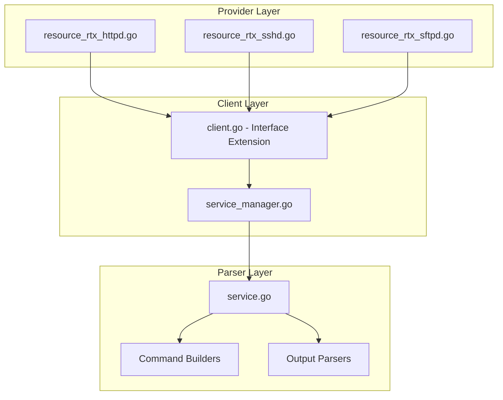

# Design Document: rtx_service

## Overview

The `rtx_httpd`, `rtx_sshd`, and `rtx_sftpd` resources enable Terraform-based management of network services on Yamaha RTX series routers. This includes HTTPD (web interface), SSHD (SSH access), and SFTPD (SFTP file transfer) services.

## Scope

This resource manages **network service configuration** including:
- HTTPD (HTTP server for web management interface)
- SSHD (SSH daemon for secure remote access)
- SFTPD (SFTP daemon for secure file transfer)

**Note**: These services control remote access methods to the router.

## Code Reuse Analysis

### Existing Components to Leverage

- **`internal/client/dhcp_scope_service.go`**: Pattern for service layer implementation.
- **`internal/client/interfaces.go`**: Extend the `Client` interface with service methods.
- **`internal/rtx/parsers/`**: Reference for parser implementation patterns.
- **`internal/provider/resource_rtx_dhcp_scope.go`**: Template for Terraform resource structure.

### Integration Points

- **`rtxClient`**: Add service configuration methods
- **`Executor`**: Use existing SSH command execution infrastructure

## Architecture



## Components and Interfaces

### Component 1: ServiceManager (`internal/client/service_manager.go`)

- **Purpose:** Handles all service CRUD operations against the RTX router
- **Interfaces:**
  ```go
  type ServiceManager struct {
      executor Executor
      client   *rtxClient
  }

  // HTTPD
  func (s *ServiceManager) ConfigureHTTPD(ctx context.Context, config HTTPDConfig) error
  func (s *ServiceManager) GetHTTPD(ctx context.Context) (*HTTPDConfig, error)

  // SSHD
  func (s *ServiceManager) ConfigureSSHD(ctx context.Context, config SSHDConfig) error
  func (s *ServiceManager) GetSSHD(ctx context.Context) (*SSHDConfig, error)

  // SFTPD
  func (s *ServiceManager) ConfigureSFTPD(ctx context.Context, config SFTPDConfig) error
  func (s *ServiceManager) GetSFTPD(ctx context.Context) (*SFTPDConfig, error)
  ```
- **Dependencies:** `Executor`, `rtxClient`, `parsers.ServiceParser`

### Component 2: ServiceParser (`internal/rtx/parsers/service.go`)

- **Purpose:** Parses RTX router output for service configuration and builds commands
- **Interfaces:**
  ```go
  type HTTPDConfig struct {
      Host        string `json:"host"`         // "any" or specific interface
      ProxyAccess bool   `json:"proxy_access"` // Allow proxy access
  }

  type SSHDConfig struct {
      Enabled bool     `json:"enabled"`
      Hosts   []string `json:"hosts"` // Interface list (lan1, bridge1, etc.)
      HostKey string   `json:"host_key,omitempty"` // RSA key
  }

  type SFTPDConfig struct {
      Hosts []string `json:"hosts"` // Interface list
  }

  func ParseHTTPDConfig(raw string) (*HTTPDConfig, error)
  func ParseSSHDConfig(raw string) (*SSHDConfig, error)
  func ParseSFTPDConfig(raw string) (*SFTPDConfig, error)
  func BuildHTTPDHostCommand(host string) string
  func BuildHTTPDProxyAccessCommand(enabled bool) string
  func BuildSSHDServiceCommand(enabled bool) string
  func BuildSSHDHostCommand(hosts []string) string
  func BuildSFTPDHostCommand(hosts []string) string
  ```
- **Dependencies:** `regexp`, `strings`, `strconv`

### Component 3: Terraform Resources

#### HTTPD Resource (`internal/provider/resource_rtx_httpd.go`)

```go
func resourceRTXHTTPD() *schema.Resource
func resourceRTXHTTPDCreate(ctx, d, meta) diag.Diagnostics
func resourceRTXHTTPDRead(ctx, d, meta) diag.Diagnostics
func resourceRTXHTTPDUpdate(ctx, d, meta) diag.Diagnostics
func resourceRTXHTTPDDelete(ctx, d, meta) diag.Diagnostics
func resourceRTXHTTPDImport(ctx, d, meta) ([]*schema.ResourceData, error)
```

#### SSHD Resource (`internal/provider/resource_rtx_sshd.go`)

```go
func resourceRTXSSHD() *schema.Resource
func resourceRTXSSHDCreate(ctx, d, meta) diag.Diagnostics
func resourceRTXSSHDRead(ctx, d, meta) diag.Diagnostics
func resourceRTXSSHDUpdate(ctx, d, meta) diag.Diagnostics
func resourceRTXSSHDDelete(ctx, d, meta) diag.Diagnostics
func resourceRTXSSHDImport(ctx, d, meta) ([]*schema.ResourceData, error)
```

#### SFTPD Resource (`internal/provider/resource_rtx_sftpd.go`)

```go
func resourceRTXSFTPD() *schema.Resource
func resourceRTXSFTPDCreate(ctx, d, meta) diag.Diagnostics
func resourceRTXSFTPDRead(ctx, d, meta) diag.Diagnostics
func resourceRTXSFTPDUpdate(ctx, d, meta) diag.Diagnostics
func resourceRTXSFTPDDelete(ctx, d, meta) diag.Diagnostics
func resourceRTXSFTPDImport(ctx, d, meta) ([]*schema.ResourceData, error)
```

### Component 4: Client Interface Extension (`internal/client/interfaces.go`)

- **Purpose:** Extend Client interface with service methods
- **Interfaces:**
  ```go
  // Add to existing Client interface:
  GetHTTPDConfig(ctx context.Context) (*HTTPDConfig, error)
  ConfigureHTTPD(ctx context.Context, config HTTPDConfig) error
  GetSSHDConfig(ctx context.Context) (*SSHDConfig, error)
  ConfigureSSHD(ctx context.Context, config SSHDConfig) error
  GetSFTPDConfig(ctx context.Context) (*SFTPDConfig, error)
  ConfigureSFTPD(ctx context.Context, config SFTPDConfig) error
  ```
- **Dependencies:** Existing Client interface

## Data Models

### HTTPDConfig

```go
// HTTPDConfig represents HTTP server configuration
type HTTPDConfig struct {
    Host        string `json:"host"`         // "any" or interface name
    ProxyAccess bool   `json:"proxy_access"` // Allow proxy access
}
```

### SSHDConfig

```go
// SSHDConfig represents SSH daemon configuration
type SSHDConfig struct {
    Enabled bool     `json:"enabled"`
    Hosts   []string `json:"hosts"`             // Allowed interfaces
    HostKey string   `json:"host_key,omitempty"` // RSA host key (sensitive)
}
```

### SFTPDConfig

```go
// SFTPDConfig represents SFTP daemon configuration
type SFTPDConfig struct {
    Hosts []string `json:"hosts"` // Allowed interfaces
}
```

### Terraform Schema

```hcl
# HTTPD (Web Interface)
resource "rtx_httpd" "main" {
  host         = "any"  # "any" or specific interface
  proxy_access = true   # Allow L2MS proxy access
}

# SSHD (SSH Server)
resource "rtx_sshd" "main" {
  enabled = true
  hosts   = ["lan2", "bridge1"]  # Interfaces to listen on

  # Optional: Generate or provide host key
  # host_key = var.ssh_host_key
}

# SFTPD (SFTP Server)
resource "rtx_sftpd" "main" {
  hosts = ["bridge1"]  # Interfaces to listen on
}
```

## RTX Command Mapping

### HTTPD Configuration

```
httpd host any
httpd host <interface>
httpd proxy-access l2ms permit on|off
```

Examples:
```
httpd host any
httpd proxy-access l2ms permit on
```

### SSHD Configuration

```
sshd service on|off
sshd host <interface1> [<interface2> ...]
sshd host key generate <key_length> <key_data>
```

Examples:
```
sshd service on
sshd host lan2 bridge1
sshd host key generate 2869 <key_data>
```

### SFTPD Configuration

```
sftpd host <interface1> [<interface2> ...]
```

Example: `sftpd host bridge1`

### Remove Configuration

```
no httpd host
no httpd proxy-access
no sshd service
no sshd host
no sftpd host
```

### Show Configuration

```
show config | grep httpd
show config | grep sshd
show config | grep sftpd
```

## Error Handling

### Error Scenarios

1. **Invalid Interface Name**
   - **Handling:** Validate interface name exists
   - **User Impact:** Clear validation error with valid interfaces

2. **Invalid Host Value**
   - **Handling:** Validate "any" or valid interface
   - **User Impact:** Clear error with valid options

3. **SSHD Key Generation Failure**
   - **Handling:** Parse RTX output for key generation errors
   - **User Impact:** Error with troubleshooting guidance

4. **Service Already Configured**
   - **Handling:** Check existing configuration
   - **User Impact:** Error suggesting import

5. **Connection/Command Timeout**
   - **Handling:** Use existing retry logic from `rtxClient`
   - **User Impact:** Standard Terraform timeout error

## Testing Strategy

### Unit Testing

- **Parser Tests** (`service_test.go`):
  - Parse various RTX `show config` output for service settings
  - Test command builder functions with different parameters
  - Test interface list handling

- **Service Tests** (`service_manager_test.go`):
  - Mock executor for service method testing
  - Test error handling for various failure scenarios
  - Test each service type

### Integration Testing

- **Resource Tests** (`resource_rtx_*_test.go`):
  - Full CRUD lifecycle with mock client
  - Import functionality testing
  - Interface validation testing

### End-to-End Testing

- **Acceptance Tests** (with real RTX router):
  - Configure HTTPD
  - Configure SSHD
  - Configure SFTPD
  - Update service settings
  - Disable services
  - Import existing configuration

## File Structure

```
internal/
├── provider/
│   ├── resource_rtx_httpd.go      # NEW: HTTPD resource
│   ├── resource_rtx_httpd_test.go # NEW: HTTPD tests
│   ├── resource_rtx_sshd.go       # NEW: SSHD resource
│   ├── resource_rtx_sshd_test.go  # NEW: SSHD tests
│   ├── resource_rtx_sftpd.go      # NEW: SFTPD resource
│   └── resource_rtx_sftpd_test.go # NEW: SFTPD tests
├── client/
│   ├── interfaces.go               # MODIFY: Add service types and methods
│   ├── client.go                   # MODIFY: Add service manager initialization
│   ├── service_manager.go         # NEW: Service manager implementation
│   └── service_manager_test.go    # NEW: Service tests
└── rtx/
    └── parsers/
        ├── service.go             # NEW: Parser and command builders
        └── service_test.go        # NEW: Parser tests
```

## Implementation Notes

1. **Singleton Resources**: Each service (HTTPD, SSHD, SFTPD) is a singleton resource.

2. **Fixed IDs**: Use service name as ID (e.g., `"httpd"`, `"sshd"`, `"sftpd"`).

3. **SSHD Host Key**: The host key is sensitive and very long. Consider storing only the key fingerprint in state.

4. **Interface Validation**: Validate that specified interfaces exist on the router.

5. **HTTPD "any"**: Special value "any" means listen on all interfaces.

6. **L2MS Proxy**: HTTPD proxy access is for Yamaha LAN Monitor System (L2MS).

7. **Configuration Save**: Use existing `SaveConfig()` pattern after modifications.

8. **Provider Registration**: Add `resourceRTXHTTPD`, `resourceRTXSSHD`, `resourceRTXSFTPD` to provider's resource map.

9. **Delete Behavior**: Deleting service resource disables the service.

10. **Security Consideration**: Be careful when managing SSH/HTTP services - misconfiguration could lock out access.

## Security Considerations

1. **Self-Lockout Prevention**: Warn users before disabling all remote access methods.

2. **Host Key Sensitivity**: SSH host key should be marked as sensitive in Terraform state.

3. **Interface Restriction**: Recommend restricting services to internal interfaces only.

4. **HTTPS**: Consider documenting HTTPS configuration if supported.

5. **Access Logging**: Enable logging for security-sensitive service access.

## State Handling

- Persist only configuration attributes in Terraform state.
- Operational/runtime status must not be stored in state to avoid perpetual diffs.
