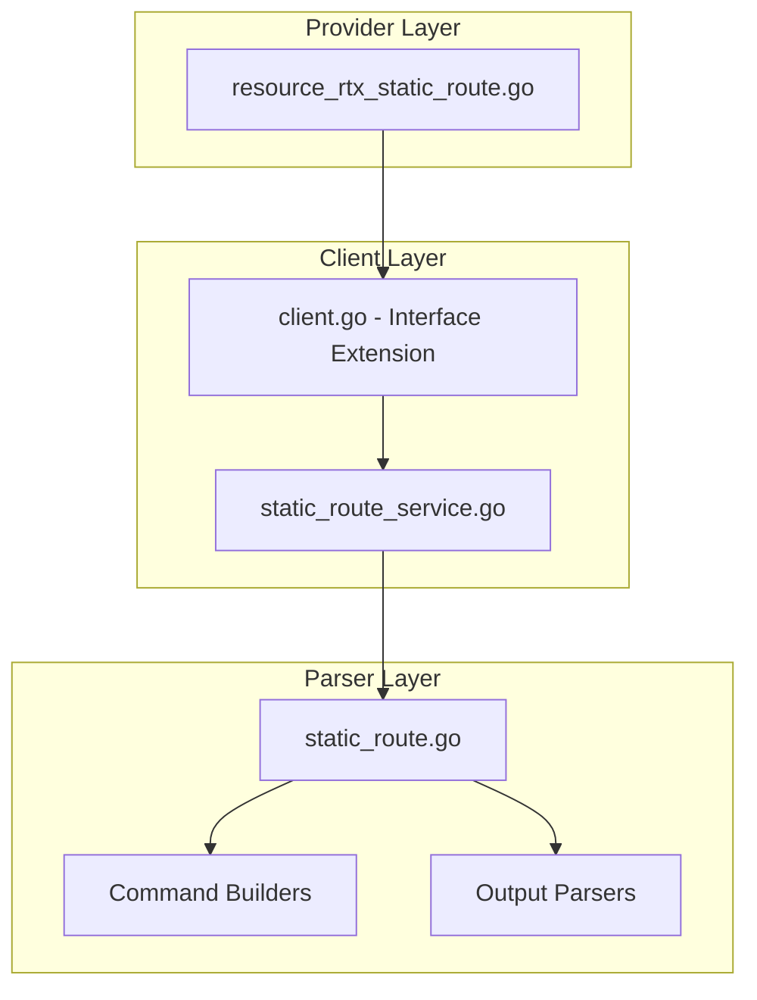

# Design Document: rtx_static_route

## Overview

The `rtx_static_route` resource enables Terraform-based management of static IP routes on Yamaha RTX series routers. Following Cisco IOS XE Terraform provider naming conventions, this resource uses `prefix/mask` notation with `next_hops` list supporting multi-path routing. The implementation follows established patterns from the existing `rtx_dhcp_scope` resource.

## Code Reuse Analysis

### Existing Components to Leverage

- **`internal/client/dhcp_scope_service.go`**: Pattern for service layer implementation with CRUD operations.
- **`internal/client/interfaces.go`**: Extend the `Client` interface with static route methods.
- **`internal/rtx/parsers/dhcp_scope.go`**: Reference for parser implementation and command builders.
- **`internal/provider/resource_rtx_dhcp_scope.go`**: Template for Terraform resource structure.

### Integration Points

- **`rtxClient`**: Add static route methods for CRUD operations
- **`Executor`**: Use existing SSH command execution infrastructure
- **IP validation utilities**: Reuse for prefix/mask validation

## Architecture



### Modular Design Principles

- **Single File Responsibility**: `StaticRouteService` handles all routing CRUD operations
- **Component Isolation**: Parser, service, and resource layers clearly separated
- **Service Layer Separation**: Service encapsulates all route logic
- **Utility Modularity**: Shared validation functions for IP/prefix operations

## Components and Interfaces

### Component 1: StaticRouteService (`internal/client/static_route_service.go`)

- **Purpose:** Handles all static route CRUD operations against the RTX router
- **Interfaces:**
  ```go
  type StaticRouteService struct {
      executor Executor
      client   *rtxClient
  }

  func (s *StaticRouteService) CreateRoute(ctx context.Context, route StaticRoute) error
  func (s *StaticRouteService) GetRoute(ctx context.Context, network string) (*StaticRoute, error)
  func (s *StaticRouteService) UpdateRoute(ctx context.Context, route StaticRoute) error
  func (s *StaticRouteService) DeleteRoute(ctx context.Context, network string) error
  func (s *StaticRouteService) ListRoutes(ctx context.Context) ([]StaticRoute, error)
  ```
- **Dependencies:** `Executor`, `rtxClient`, `parsers.StaticRouteParser`
- **Reuses:** Pattern from `DHCPScopeService`, `Executor` interface

### Component 2: StaticRouteParser (`internal/rtx/parsers/static_route.go`)

- **Purpose:** Parses RTX router output for route configuration and builds commands
- **Interfaces:**
  ```go
  type StaticRoute struct {
      Prefix    string     `json:"prefix"`
      Mask      string     `json:"mask"`
      NextHops  []NextHop  `json:"next_hops"`
  }

  type NextHop struct {
      NextHop   string `json:"next_hop,omitempty"`
      Interface string `json:"interface,omitempty"`
      Distance  int    `json:"distance"`
      Name      string `json:"name,omitempty"`
      Permanent bool   `json:"permanent"`
      Filter    int    `json:"filter,omitempty"`
  }

  func ParseRouteConfig(raw string) ([]StaticRoute, error)
  func BuildIPRouteCommand(route StaticRoute, hop NextHop) string
  func BuildDeleteIPRouteCommand(prefix, mask string) string
  func BuildShowIPRouteCommand() string
  ```
- **Dependencies:** `regexp`, `strings`, `net`
- **Reuses:** IP validation patterns

### Component 3: Terraform Resource (`internal/provider/resource_rtx_static_route.go`)

- **Purpose:** Terraform resource definition implementing CRUD lifecycle
- **Interfaces:**
  ```go
  func resourceRTXStaticRoute() *schema.Resource
  func resourceRTXStaticRouteCreate(ctx, d, meta) diag.Diagnostics
  func resourceRTXStaticRouteRead(ctx, d, meta) diag.Diagnostics
  func resourceRTXStaticRouteUpdate(ctx, d, meta) diag.Diagnostics
  func resourceRTXStaticRouteDelete(ctx, d, meta) diag.Diagnostics
  func resourceRTXStaticRouteImport(ctx, d, meta) ([]*schema.ResourceData, error)
  ```
- **Dependencies:** `Client`, `StaticRoute`, Terraform SDK
- **Reuses:** `resourceRTXDHCPScope` patterns

### Component 4: Client Interface Extension (`internal/client/interfaces.go`)

- **Purpose:** Extend Client interface with static route methods
- **Interfaces:**
  ```go
  // Add to existing Client interface:
  GetStaticRoute(ctx context.Context, network string) (*StaticRoute, error)
  CreateStaticRoute(ctx context.Context, route StaticRoute) error
  UpdateStaticRoute(ctx context.Context, route StaticRoute) error
  DeleteStaticRoute(ctx context.Context, network string) error
  ListStaticRoutes(ctx context.Context) ([]StaticRoute, error)
  ```
- **Dependencies:** Existing Client interface
- **Reuses:** Pattern from existing methods

## Data Models

### StaticRoute

```go
// StaticRoute represents a static route configuration on an RTX router
type StaticRoute struct {
    Prefix   string    `json:"prefix"`           // Route destination (e.g., "0.0.0.0" for default)
    Mask     string    `json:"mask"`             // Subnet mask (e.g., "0.0.0.0" for default)
    NextHops []NextHop `json:"next_hops"`        // List of next hops
}

// NextHop represents a next hop configuration for a static route
type NextHop struct {
    NextHop   string `json:"next_hop,omitempty"`   // Gateway IP address
    Interface string `json:"interface,omitempty"`  // Interface (pp 1, tunnel 1, etc.)
    Distance  int    `json:"distance"`             // Administrative distance (weight)
    Name      string `json:"name,omitempty"`       // Route description
    Permanent bool   `json:"permanent"`            // Keep route when interface down
    Filter    int    `json:"filter,omitempty"`     // IP filter number (RTX-specific)
}
```

### Terraform Schema

```hcl
resource "rtx_static_route" "example" {
  prefix = "0.0.0.0"       # Required, ForceNew
  mask   = "0.0.0.0"       # Required, ForceNew

  next_hops = [
    {
      next_hop  = "192.168.0.1"
      distance  = 1
      name      = "primary_gateway"
      permanent = true
    },
    {
      next_hop  = "192.168.0.2"
      distance  = 10
      name      = "backup_gateway"
    }
  ]
}

# Tunnel interface route
resource "rtx_static_route" "vpn" {
  prefix = "172.16.0.0"
  mask   = "255.255.0.0"

  next_hops = [
    {
      interface = "tunnel 1"
      distance  = 1
      permanent = true
    }
  ]
}
```

## RTX Command Mapping

### Create Route

```
ip route <network> gateway <gateway> [weight <n>] [hide] [filter <n>]
ip route <network> gateway pp <n> [weight <n>] [hide]
ip route <network> gateway tunnel <n> [weight <n>] [hide]
ip route <network> gateway dhcp <interface>
```

Example: `ip route default gateway 192.168.0.1`
Example: `ip route 10.0.0.0/8 gateway 192.168.1.1 weight 10`

### Delete Route

```
no ip route <network> [gateway <gateway>]
```

### Show Route

```
show ip route
show config | grep "ip route"
```

## Error Handling

### Error Scenarios

1. **Invalid Network Format**
   - **Handling:** Validate IP address and mask in Terraform schema
   - **User Impact:** Clear validation error with expected format example

2. **Route Already Exists**
   - **Handling:** Parse RTX output for "already exists" pattern
   - **User Impact:** Return error suggesting import or different prefix

3. **Invalid Gateway**
   - **Handling:** Validate gateway is reachable or interface exists
   - **User Impact:** Error indicating invalid next hop

4. **Invalid Interface**
   - **Handling:** Validate interface name format (pp, tunnel, lan, etc.)
   - **User Impact:** Clear error about valid interface names

5. **Weight Out of Range**
   - **Handling:** Validate weight is within valid range (typically 1-100)
   - **User Impact:** Validation error with valid range

6. **Connection/Command Timeout**
   - **Handling:** Use existing retry logic from `rtxClient`
   - **User Impact:** Standard Terraform timeout error

## Testing Strategy

### Unit Testing

- **Parser Tests** (`static_route_test.go`):
  - Parse various RTX `show ip route` output formats
  - Test command builder functions with different parameters
  - Test network/mask validation functions

- **Service Tests** (`static_route_service_test.go`):
  - Mock executor for service method testing
  - Test error handling for various failure scenarios
  - Test multi-hop route handling

### Integration Testing

- **Resource Tests** (`resource_rtx_static_route_test.go`):
  - Full CRUD lifecycle with mock client
  - Import functionality testing
  - Multi-hop configuration testing

### End-to-End Testing

- **Acceptance Tests** (with real RTX router):
  - Create default route
  - Create network route with multiple next hops
  - Create tunnel/PP interface routes
  - Update route weights
  - Delete routes
  - Import existing routes

## File Structure

```
internal/
├── provider/
│   ├── resource_rtx_static_route.go      # NEW: Terraform resource
│   └── resource_rtx_static_route_test.go # NEW: Resource tests
├── client/
│   ├── interfaces.go                      # MODIFY: Add StaticRoute type and methods
│   ├── client.go                          # MODIFY: Add route service initialization
│   ├── static_route_service.go           # NEW: Route service implementation
│   └── static_route_service_test.go      # NEW: Service tests
└── rtx/
    └── parsers/
        ├── static_route.go               # NEW: Parser and command builders
        └── static_route_test.go          # NEW: Parser tests
```

## Implementation Notes

1. **Network Notation**: RTX uses `ip route <network>/<prefix>` or `ip route <network>` with separate mask. Convert from Terraform's `prefix`/`mask` format.

2. **Default Route**: Handle special case where prefix=0.0.0.0 and mask=0.0.0.0 maps to `ip route default`.

3. **Terraform ID**: Use `prefix/mask` as Terraform resource ID (e.g., "0.0.0.0/0.0.0.0" for default route).

4. **ForceNew**: `prefix` and `mask` are ForceNew. Changes to `next_hops` support in-place updates.

5. **Multi-hop Handling**: Each next_hop becomes a separate RTX command. Delete all then recreate on update.

6. **Configuration Save**: Use existing `SaveConfig()` pattern after modifications.

7. **Provider Registration**: Add `resourceRTXStaticRoute` to provider's resource map.

## State Handling

- Persist only configuration attributes in Terraform state.
- Operational/runtime status must not be stored in state to avoid perpetual diffs.
