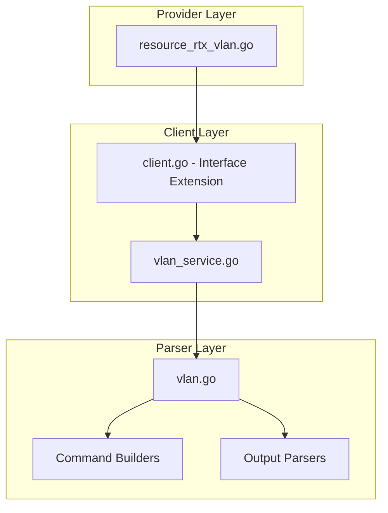

# Design Document: rtx_vlan

## Overview

The `rtx_vlan` resource enables Terraform-based management of VLAN configuration on Yamaha RTX series routers. Following Cisco IOS XE Terraform provider naming conventions, this resource manages VLAN interfaces with 802.1Q tagging, IP address assignment, and port mappings.

## Code Reuse Analysis

### Existing Components to Leverage

- **`internal/client/dhcp_scope_service.go`**: Pattern for service layer implementation with CRUD operations.
- **`internal/client/interfaces.go`**: Extend the `Client` interface with VLAN methods.
- **`internal/rtx/parsers/dhcp_scope.go`**: Reference for parser implementation and command builders.
- **`internal/provider/resource_rtx_dhcp_scope.go`**: Template for Terraform resource structure.

### Integration Points

- **`rtxClient`**: Add VLAN methods for CRUD operations
- **`Executor`**: Use existing SSH command execution infrastructure
- **IP configuration**: Coordinate with interface IP settings

## Architecture



### Modular Design Principles

- **Single File Responsibility**: `VLANService` handles all VLAN CRUD operations
- **Component Isolation**: Parser, service, and resource layers clearly separated
- **Service Layer Separation**: Service encapsulates all VLAN logic
- **Utility Modularity**: Shared validation functions for VLAN ID and IP operations

## Components and Interfaces

### Component 1: VLANService (`internal/client/vlan_service.go`)

- **Purpose:** Handles all VLAN CRUD operations against the RTX router
- **Interfaces:**
  ```go
  type VLANService struct {
      executor Executor
      client   *rtxClient
  }

  func (s *VLANService) Create(ctx context.Context, vlan VLAN) error
  func (s *VLANService) Get(ctx context.Context, iface string, vlanID int) (*VLAN, error)
  func (s *VLANService) Update(ctx context.Context, vlan VLAN) error
  func (s *VLANService) Delete(ctx context.Context, iface string, vlanID int) error
  func (s *VLANService) List(ctx context.Context) ([]VLAN, error)
  ```
- **Dependencies:** `Executor`, `rtxClient`, `parsers.VLANParser`
- **Reuses:** Pattern from `DHCPScopeService`, `Executor` interface

### Component 2: VLANParser (`internal/rtx/parsers/vlan.go`)

- **Purpose:** Parses RTX router output for VLAN configuration and builds commands
- **Interfaces:**
  ```go
  type VLAN struct {
      VlanID       int    `json:"vlan_id"`
      Name         string `json:"name,omitempty"`
      Interface    string `json:"interface"`       // Parent interface (lan1, lan2)
      VlanInterface string `json:"vlan_interface"` // Derived: lan1/1, etc.
      IPAddress    string `json:"ip_address,omitempty"`
      IPMask       string `json:"ip_mask,omitempty"`
      Shutdown     bool   `json:"shutdown"`
  }

  func ParseVLANConfig(raw string) ([]VLAN, error)
  func BuildVLANCommand(vlan VLAN) string
  func BuildVLANIPCommand(vlanIface, ip, mask string) string
  func BuildDeleteVLANCommand(iface string, vlanID int) string
  func BuildShowVLANCommand() string
  ```
- **Dependencies:** `regexp`, `strings`, `strconv`
- **Reuses:** IP validation patterns

### Component 3: Terraform Resource (`internal/provider/resource_rtx_vlan.go`)

- **Purpose:** Terraform resource definition implementing CRUD lifecycle
- **Interfaces:**
  ```go
  func resourceRTXVLAN() *schema.Resource
  func resourceRTXVLANCreate(ctx, d, meta) diag.Diagnostics
  func resourceRTXVLANRead(ctx, d, meta) diag.Diagnostics
  func resourceRTXVLANUpdate(ctx, d, meta) diag.Diagnostics
  func resourceRTXVLANDelete(ctx, d, meta) diag.Diagnostics
  func resourceRTXVLANImport(ctx, d, meta) ([]*schema.ResourceData, error)
  ```
- **Dependencies:** `Client`, `VLAN`, Terraform SDK
- **Reuses:** `resourceRTXDHCPScope` patterns

### Component 4: Client Interface Extension (`internal/client/interfaces.go`)

- **Purpose:** Extend Client interface with VLAN methods
- **Interfaces:**
  ```go
  // Add to existing Client interface:
  GetVLAN(ctx context.Context, iface string, vlanID int) (*VLAN, error)
  CreateVLAN(ctx context.Context, vlan VLAN) error
  UpdateVLAN(ctx context.Context, vlan VLAN) error
  DeleteVLAN(ctx context.Context, iface string, vlanID int) error
  ListVLANs(ctx context.Context) ([]VLAN, error)
  ```
- **Dependencies:** Existing Client interface
- **Reuses:** Pattern from existing methods

## Data Models

### VLAN

```go
// VLAN represents a VLAN configuration on an RTX router
type VLAN struct {
    VlanID        int    `json:"vlan_id"`          // VLAN ID (1-4094)
    Name          string `json:"name,omitempty"`   // VLAN name/description
    Interface     string `json:"interface"`        // Parent interface (lan1, lan2)
    VlanInterface string `json:"vlan_interface"`   // Computed: lan1/1, lan1/2, etc.
    IPAddress     string `json:"ip_address,omitempty"`
    IPMask        string `json:"ip_mask,omitempty"`
    Shutdown      bool   `json:"shutdown"`         // Admin state
}
```

### Terraform Schema

```hcl
resource "rtx_vlan" "management" {
  vlan_id   = 10              # Required, ForceNew
  name      = "Management"    # Optional
  shutdown  = false           # Optional, default false

  # RTX-specific: parent interface
  interface = "lan1"          # Required, ForceNew

  # IP configuration
  ip_address = "192.168.10.1" # Optional
  ip_mask    = "255.255.255.0" # Required if ip_address set
}

resource "rtx_vlan" "users" {
  vlan_id   = 20
  name      = "Users"
  shutdown  = false
  interface = "lan1"

  ip_address = "192.168.20.1"
  ip_mask    = "255.255.255.0"
}
```

## RTX Command Mapping

### Create VLAN Interface

```
vlan <interface>/<n> 802.1q vid=<vlan_id>
```

Example: `vlan lan1/1 802.1q vid=10`

### Configure VLAN IP

```
ip <vlan_interface> address <ip>/<prefix>
```

Example: `ip lan1/1 address 192.168.10.1/24`

### Configure VLAN Description

```
description <vlan_interface> <name>
```

### Shutdown/No Shutdown

```
<vlan_interface> enable
no <vlan_interface> enable
```

### Port Mapping

```
vlan port mapping <interface> <vlan_list>
```

Example: `vlan port mapping lan1 vlan1 vlan2`

### Delete VLAN

```
no vlan <interface>/<n>
```

### Show VLAN Configuration

```
show config | grep vlan
show status lan1
```

## Error Handling

### Error Scenarios

1. **Invalid VLAN ID**
   - **Handling:** Validate VLAN ID is in range 1-4094
   - **User Impact:** Clear validation error with valid range

2. **VLAN Already Exists**
   - **Handling:** Parse RTX output for existing VLAN
   - **User Impact:** Error suggesting import or different ID

3. **Invalid Parent Interface**
   - **Handling:** Validate interface name exists and supports VLAN
   - **User Impact:** Error indicating invalid interface

4. **Invalid IP Configuration**
   - **Handling:** Validate IP address and mask format
   - **User Impact:** Clear error with expected format

5. **VLAN Slot Exhausted**
   - **Handling:** Check available VLAN slots on interface
   - **User Impact:** Error indicating maximum VLANs reached

6. **Connection/Command Timeout**
   - **Handling:** Use existing retry logic from `rtxClient`
   - **User Impact:** Standard Terraform timeout error

## Testing Strategy

### Unit Testing

- **Parser Tests** (`vlan_test.go`):
  - Parse various RTX `show config` output for VLAN configuration
  - Test command builder functions with different parameters
  - Test VLAN ID validation

- **Service Tests** (`vlan_service_test.go`):
  - Mock executor for service method testing
  - Test error handling for various failure scenarios
  - Test IP configuration handling

### Integration Testing

- **Resource Tests** (`resource_rtx_vlan_test.go`):
  - Full CRUD lifecycle with mock client
  - Import functionality testing
  - IP configuration testing

### End-to-End Testing

- **Acceptance Tests** (with real RTX router):
  - Create VLAN with IP address
  - Create VLAN without IP address
  - Update VLAN name
  - Update VLAN IP configuration
  - Toggle shutdown state
  - Delete VLAN
  - Import existing VLAN

## File Structure

```
internal/
├── provider/
│   ├── resource_rtx_vlan.go      # NEW: Terraform resource
│   └── resource_rtx_vlan_test.go # NEW: Resource tests
├── client/
│   ├── interfaces.go              # MODIFY: Add VLAN type and methods
│   ├── client.go                  # MODIFY: Add VLAN service initialization
│   ├── vlan_service.go           # NEW: VLAN service implementation
│   └── vlan_service_test.go      # NEW: Service tests
└── rtx/
    └── parsers/
        ├── vlan.go               # NEW: Parser and command builders
        └── vlan_test.go          # NEW: Parser tests
```

## Implementation Notes

1. **VLAN Interface Naming**: RTX uses `lan1/1`, `lan1/2` format. The `/n` suffix is auto-assigned or can be specified.

2. **VLAN ID vs Interface Number**: VLAN ID (vid) and interface number can be different. `lan1/1 vid=10` creates VLAN 10 on interface slot 1.

3. **Terraform ID**: Use `interface/vlan_id` as Terraform resource ID (e.g., "lan1/10").

4. **ForceNew**: `vlan_id` and `interface` are ForceNew. IP and name support in-place updates.

5. **IP Mask Format**: RTX accepts both dotted decimal (255.255.255.0) and prefix length (/24). Normalize to one format.

6. **Port Mapping**: Consider as separate resource or attribute for tagged/untagged port assignment.

7. **Configuration Save**: Use existing `SaveConfig()` pattern after modifications.

8. **Provider Registration**: Add `resourceRTXVLAN` to provider's resource map.

9. **Computed Attribute**: `vlan_interface` (e.g., "lan1/1") is computed from `interface` and `vlan_id`.

## State Handling

- Persist only configuration attributes in Terraform state.
- Operational/runtime status must not be stored in state to avoid perpetual diffs.
