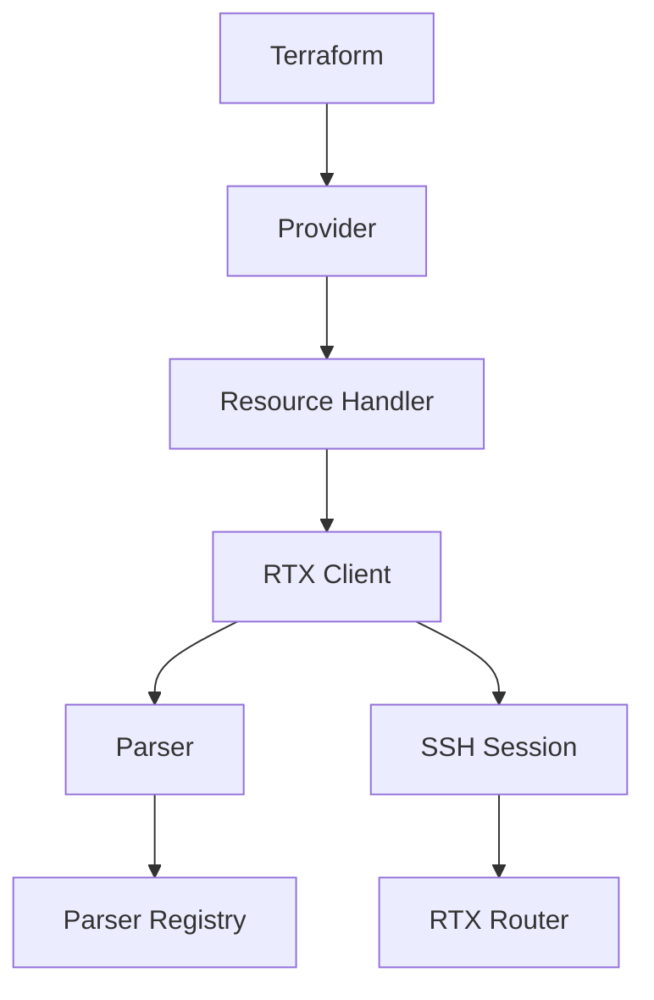

# Design Document: Security and Filter Resources

## Overview

This design document covers the implementation of missing security, filter, and VPN-related resources for the Terraform RTX provider. Based on codebase analysis, some resources already exist while others need to be implemented.

### Existing vs. New Resources

| Resource Type | Status | Notes |
|--------------|--------|-------|
| `rtx_access_list_ip` | **NEW** | Static IP filter (ip filter N action...) |
| `rtx_access_list_ip_dynamic` | EXISTS | Already implemented |
| `rtx_access_list_ipv6` | **NEW** | Static IPv6 filter |
| `rtx_access_list_ipv6_dynamic` | EXISTS | Already implemented |
| `rtx_access_list_mac` | EXISTS | Layer 2 MAC filter (generates `ethernet filter` command) |
| `rtx_l2tp_service` | **NEW** | Global L2TP service on/off |
| `rtx_ipsec_transport` | **NEW** | IPsec transport mode mapping |

**Analysis Notes**:
- `rtx_access_list_extended` uses Cisco IOS-style `ip access-list extended` syntax
- `rtx_access_list_mac` internally generates RTX `ethernet filter` commands (no separate resource needed)
- New `rtx_access_list_ip` uses RTX native `ip filter` syntax (different command from access-list)

## Steering Document Alignment

### Technical Standards (tech.md)

- **Go 1.23**: All implementations use Go 1.23 idioms
- **terraform-plugin-sdk/v2**: Follow existing resource patterns
- **Parser Registry Pattern**: Register parsers in `internal/rtx/parsers/registry.go`
- **Stateless SSH Sessions**: Each CRUD operation opens fresh connection

### Project Structure (structure.md)

```
internal/
├── provider/
│   ├── resource_rtx_access_list_ip.go          # NEW
│   ├── resource_rtx_access_list_ipv6.go        # NEW
│   ├── resource_rtx_l2tp_service.go       # NEW
│   └── resource_rtx_ipsec_transport.go    # NEW
├── rtx/parsers/
│   ├── ip_filter.go                       # EXTEND (add static filter resource support)
│   ├── l2tp.go                            # EXTEND (add service on/off parsing)
│   └── ipsec_transport.go                 # NEW
└── client/
    ├── ip_filter_service.go               # EXTEND
    ├── l2tp_service.go                    # EXTEND
    └── ipsec_transport_service.go         # NEW
```

## Code Reuse Analysis

### Existing Components to Leverage

- **`parsers/ip_filter.go`**: Already contains `IPFilter` struct and parsing logic. Extend for static filters.
- **`parsers/l2tp.go`**: Contains `L2TPConfig` and `BuildL2TPServiceCommand`. Extend for service on/off.
- **`client/ip_filter_service.go`**: Extend with static filter CRUD operations.

### Integration Points

- **Provider Registration**: Add new resources to `internal/provider/provider.go` ResourcesMap
- **Parser Registry**: Register new parsers via `parsers.RegisterParser()`
- **SSH Client**: Use existing `client.Client` for router communication

## Architecture

### Resource Implementation Pattern

All resources follow the established pattern:

```go
func resourceRTXAccessListIP() *schema.Resource {
    return &schema.Resource{
        Create: resourceRTXAccessListIPCreate,
        Read:   resourceRTXAccessListIPRead,
        Update: resourceRTXAccessListIPUpdate,
        Delete: resourceRTXAccessListIPDelete,
        Importer: &schema.ResourceImporter{
            State: resourceRTXAccessListIPImport,
        },
        Schema: map[string]*schema.Schema{...},
    }
}
```

### Component Interaction



## Components and Interfaces

### Component 1: rtx_access_list_ip Resource

- **Purpose**: Manage static IP packet filters
- **File**: `internal/provider/resource_rtx_access_list_ip.go`
- **Interfaces**:
  - `resourceRTXAccessListIPCreate(d, meta)` - Create filter via SSH
  - `resourceRTXAccessListIPRead(d, meta)` - Read filter state
  - `resourceRTXAccessListIPUpdate(d, meta)` - Update filter
  - `resourceRTXAccessListIPDelete(d, meta)` - Delete filter
  - `resourceRTXAccessListIPImport(d, meta)` - Import existing filter
- **Dependencies**: `client.IPFilterService`, `parsers.ParseIPFilterConfig`
- **Reuses**: Existing `IPFilter` struct from `parsers/ip_filter.go`

### Component 2: rtx_access_list_ipv6 Resource

- **Purpose**: Manage static IPv6 packet filters
- **File**: `internal/provider/resource_rtx_access_list_ipv6.go`
- **Interfaces**: Same pattern as rtx_access_list_ip
- **Dependencies**: `client.IPFilterService`, `parsers.ParseIPv6FilterConfig`
- **Reuses**: IPv6 parsing functions already in `parsers/ip_filter.go`

### Component 3: rtx_l2tp_service Resource

- **Purpose**: Manage global L2TP service state (on/off with protocols)
- **File**: `internal/provider/resource_rtx_l2tp_service.go`
- **Interfaces**: Same CRUD pattern
- **Dependencies**: `client.L2TPService`, `parsers.L2TPParser`
- **Reuses**: Existing `BuildL2TPServiceCommand` function

### Component 4: rtx_ipsec_transport Resource

- **Purpose**: Manage IPsec transport mode mappings for L2TP over IPsec
- **File**: `internal/provider/resource_rtx_ipsec_transport.go`
- **Interfaces**: Same CRUD pattern
- **Dependencies**: New `client.IPsecTransportService`, new parser
- **Reuses**: Pattern from `parsers/ipsec_tunnel.go`

## Data Models

### IPFilter (Static)

```go
type IPFilter struct {
    Number      int      // Filter number (1-65534)
    Action      string   // "pass", "reject", "restrict"
    Source      string   // Source address/network or "*"
    Destination string   // Destination address/network or "*"
    Protocol    []string // ["tcp"], ["udp"], ["tcp", "udp"], ["icmp"], etc.
    SourcePort  string   // Port number, range, or "*"
    DestPort    string   // Port number, range, or "*"
    Log         bool     // Whether to log matches
}
```

### IPv6Filter (Static)

```go
type IPv6Filter struct {
    Number      int      // Filter number
    Action      string   // "pass", "reject", "restrict"
    Source      string   // IPv6 address/prefix or "*"
    Destination string   // IPv6 address/prefix or "*"
    Protocol    string   // "tcp", "udp", "icmp6", etc.
    SourcePort  string   // Port or "*"
    DestPort    string   // Port or "*"
    Log         bool     // Whether to log matches
}
```

### L2TPService

```go
type L2TPService struct {
    Enabled   bool     // Service on/off
    Protocols []string // ["l2tpv3", "l2tp"]
}
```

### IPsecTransport

```go
type IPsecTransport struct {
    TransportID int    // Transport number
    TunnelID    int    // Associated tunnel number
    Protocol    string // "udp" typically
    Port        int    // Port number (1701 for L2TP)
}
```

## Terraform Schema Definitions

### rtx_access_list_ip Schema

```hcl
resource "rtx_access_list_ip" "example" {
  filter_id   = 200000                    # Required: 1-65534
  action      = "reject"                  # Required: pass|reject|restrict
  source      = "10.0.0.0/8"             # Required: CIDR or "*"
  destination = "*"                       # Required: CIDR or "*"
  protocol    = ["tcp", "udp"]           # Optional: list of protocols
  source_port = "*"                       # Optional: port or "*"
  dest_port   = "135"                     # Optional: port or "*"
  log         = false                     # Optional: default true
}
```

### rtx_access_list_ipv6 Schema

```hcl
resource "rtx_access_list_ipv6" "example" {
  filter_id   = 101000
  action      = "pass"
  source      = "*"
  destination = "*"
  protocol    = "icmp6"
  source_port = "*"
  dest_port   = "*"
}
```

### rtx_l2tp_service Schema

```hcl
resource "rtx_l2tp_service" "main" {
  enabled   = true
  protocols = ["l2tpv3", "l2tp"]         # Optional
}
```

### rtx_ipsec_transport Schema

```hcl
resource "rtx_ipsec_transport" "l2tp" {
  transport_id = 1
  tunnel_id    = 101
  protocol     = "udp"
  port         = 1701
}
```

## RTX CLI Command Mapping

### IP Filter Commands

| Operation | RTX Command |
|-----------|-------------|
| Create | `ip filter 200000 reject 10.0.0.0/8 * * * *` |
| Read | `show config \| include "ip filter 200000"` |
| Delete | `no ip filter 200000` |

### IPv6 Filter Commands

| Operation | RTX Command |
|-----------|-------------|
| Create | `ipv6 filter 101000 pass * * icmp6 * *` |
| Read | `show config \| include "ipv6 filter 101000"` |
| Delete | `no ipv6 filter 101000` |

### L2TP Service Commands

| Operation | RTX Command |
|-----------|-------------|
| Enable | `l2tp service on l2tpv3 l2tp` |
| Disable | `l2tp service off` |
| Read | `show config \| include "l2tp service"` |

### IPsec Transport Commands

| Operation | RTX Command |
|-----------|-------------|
| Create | `ipsec transport 1 101 udp 1701` |
| Read | `show config \| include "ipsec transport 1"` |
| Delete | `no ipsec transport 1` |

## Error Handling

### Error Scenarios

1. **Invalid Filter Number**
   - **Handling**: Validate in schema (1-65534 for IP, check RTX limits)
   - **User Impact**: Clear validation error before SSH connection

2. **Filter Already Exists**
   - **Handling**: Read existing state, compare, update if different
   - **User Impact**: Terraform shows diff and applies changes

3. **SSH Connection Failure**
   - **Handling**: Use existing retry mechanism in `client/retry.go`
   - **User Impact**: Error with connection details and retry info

4. **Conflicting Filter Numbers**
   - **Handling**: Check for existing filter before create
   - **User Impact**: Error suggesting import or different ID

## Testing Strategy

### Unit Testing

- Test all parser functions with various RTX output formats
- Test command builders produce correct RTX CLI syntax
- Test schema validation functions
- Mock SSH client for resource CRUD tests

### Integration Testing

- Test with real RTX router in isolated environment
- Verify filter creation, read, update, delete cycle
- Test import functionality with pre-existing filters
- Test error handling with invalid configurations

### End-to-End Testing

- Terraform acceptance tests (`TF_ACC=1`)
- Full lifecycle: `terraform plan` → `terraform apply` → `terraform destroy`
- Import scenarios: `terraform import rtx_access_list_ip.example 200000`

### Test File Locations

```
internal/provider/resource_rtx_access_list_ip_test.go
internal/provider/resource_rtx_access_list_ipv6_test.go
internal/provider/resource_rtx_l2tp_service_test.go
internal/provider/resource_rtx_ipsec_transport_test.go
internal/rtx/parsers/ipsec_transport_test.go
```

## Implementation Notes

### Import ID Format

- `rtx_access_list_ip`: Filter number (e.g., `200000`)
- `rtx_access_list_ipv6`: Filter number (e.g., `101000`)
- `rtx_l2tp_service`: Singleton, use `default` as ID
- `rtx_ipsec_transport`: Transport number (e.g., `1`)

### State Management

- Store only configuration attributes, not operational status
- Avoid perpetual diffs by not storing volatile data

### Backward Compatibility

- New resources, no backward compatibility concerns
- Existing `rtx_access_list_*` resources remain unchanged
