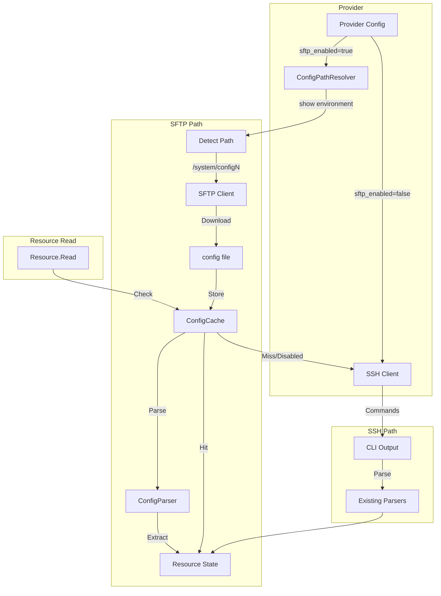
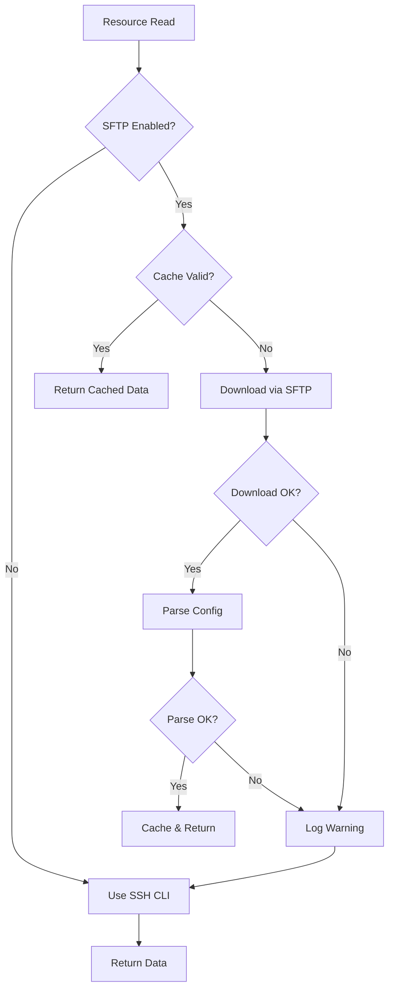

# Design Document: SFTP-Based Configuration Reading

## Overview

This feature adds an optional SFTP-based configuration reading mechanism to the RTX Terraform provider. When enabled, the provider downloads the router's complete configuration file via SFTP, caches it in memory, and parses it to serve resource read operations. This replaces hundreds of individual SSH CLI commands with a single file transfer, reducing read time from ~5 minutes to under 10 seconds.

## Steering Document Alignment

### Technical Standards (tech.md)

- **Language**: Go 1.23 with standard library and established third-party packages
- **Protocol**: SFTP runs over SSH subsystem, using same encryption as existing SSH connections
- **Architecture**: Follows existing parser registry pattern for modular parsing
- **Security**: Credentials handled via Terraform sensitive variables, no disk storage of config data

### Project Structure (structure.md)

New files follow existing package organization:
- `internal/client/sftp_client.go` - SFTP connection and download
- `internal/client/config_cache.go` - In-memory configuration cache
- `internal/rtx/parsers/config_file.go` - Full config file parser

## Code Reuse Analysis

### Existing Components to Leverage

- **`internal/client/Config` struct**: Add `SFTPEnabled bool` field; reuse existing SSH parameters
- **`internal/client/ssh_dialer.go`**: SFTP uses same SSH connection establishment
- **`internal/rtx/parsers/*`**: Existing line-based parsers can be reused for individual command parsing
- **`internal/provider/provider.go`**: Add `sftp_enabled` schema field alongside existing config

### Integration Points

- **Provider Configuration**: New `sftp_enabled` flag in provider schema
- **Client Interface**: Add `GetConfigCache() *ConfigCache` method to Client interface
- **Resource Read Functions**: Check cache before falling back to SSH commands

## Architecture



### Modular Design Principles

- **Single File Responsibility**: SFTP client, cache, and parser are separate files
- **Component Isolation**: ConfigCache is independent of SFTP download mechanism
- **Service Layer Separation**: Parsing logic separate from I/O operations
- **Fallback Strategy**: SFTP failure triggers SSH fallback with warning log

## Components and Interfaces

### Component 1: SFTPClient

- **Purpose**: Download configuration file from RTX router via SFTP
- **File**: `internal/client/sftp_client.go`
- **Interfaces**:
  ```go
  type SFTPClient interface {
      // Download retrieves config file and returns content as bytes
      Download(ctx context.Context, path string) ([]byte, error)
      // Close closes the SFTP connection
      Close() error
  }

  type sftpClient struct {
      sshClient  *ssh.Client
      sftpClient *sftp.Client
  }

  func NewSFTPClient(config *Config) (SFTPClient, error)
  ```
- **Dependencies**: `golang.org/x/crypto/ssh`, `github.com/pkg/sftp`
- **Reuses**: SSH connection parameters from existing `Config` struct

### Component 2: ConfigCache

- **Purpose**: In-memory cache for downloaded configuration, shared across resource reads
- **File**: `internal/client/config_cache.go`
- **Interfaces**:
  ```go
  type ConfigCache struct {
      mu         sync.RWMutex
      content    string           // Raw config file content
      parsed     *ParsedConfig    // Parsed configuration data
      validUntil time.Time        // Cache invalidation timestamp
      dirty      bool             // True if write occurred, requiring refresh
  }

  func NewConfigCache() *ConfigCache
  func (c *ConfigCache) Get() (*ParsedConfig, bool)
  func (c *ConfigCache) Set(content string, parsed *ParsedConfig)
  func (c *ConfigCache) Invalidate()
  func (c *ConfigCache) MarkDirty()
  ```
- **Dependencies**: `sync` for thread-safety
- **Thread Safety**: Uses RWMutex for concurrent read access

### Component 3: ConfigParser

- **Purpose**: Parse full config.txt into structured data for each resource type
- **File**: `internal/rtx/parsers/config_file.go`
- **Interfaces**:
  ```go
  type ParsedConfig struct {
      Raw           string
      StaticRoutes  []StaticRoute
      DHCPScopes    []DHCPScope
      VLANs         []VLAN
      Interfaces    map[string]*InterfaceConfig
      NAT           *NATConfig
      Filters       *FilterConfig
      DNS           *DNSConfig
      Admin         *AdminConfig
      Tunnels       map[int]*TunnelConfig
      // ... other resource types
  }

  type ConfigFileParser struct {
      // Reuses existing parsers
      staticRouteParser *StaticRouteParser
      dhcpParser        *DHCPScopeParser
      // ...
  }

  func NewConfigFileParser() *ConfigFileParser
  func (p *ConfigFileParser) Parse(content string) (*ParsedConfig, error)
  ```
- **Dependencies**: Existing parsers in `internal/rtx/parsers/`
- **Reuses**: `StaticRouteParser`, `DHCPScopeParser`, `VLANParser`, etc.

### Component 4: ConfigPathResolver

- **Purpose**: Determine the correct config file path by querying router's startup config
- **File**: `internal/client/config_path_resolver.go`
- **Interfaces**:
  ```go
  type ConfigPathResolver interface {
      // GetStartupConfigPath returns the SFTP path to the startup config file
      // by parsing "show environment" output
      GetStartupConfigPath(ctx context.Context) (string, error)
  }

  type configPathResolver struct {
      executor Executor
  }

  func NewConfigPathResolver(executor Executor) ConfigPathResolver
  ```
- **Logic**:
  1. Execute `show environment` command via SSH
  2. Parse output to find "デフォルト設定ファイル" (default config file) line
  3. Extract config number (e.g., `config0`, `config1`)
  4. Return SFTP path: `/system/config{N}`
- **Fallback**: If parsing fails, default to `/system/config0`

### Component 5: Provider Configuration Extension

- **Purpose**: Add SFTP configuration options to provider schema
- **File**: `internal/provider/provider.go` (modification)
- **Changes**:
  ```go
  // New schema field
  "sftp_enabled": {
      Type:        schema.TypeBool,
      Optional:    true,
      Default:     false,
      DefaultFunc: schema.EnvDefaultFunc("RTX_SFTP_ENABLED", false),
      Description: "Enable SFTP-based bulk configuration reading for faster refresh operations.",
  },
  "sftp_config_path": {
      Type:        schema.TypeString,
      Optional:    true,
      Default:     "",  // Empty means auto-detect via show environment
      Description: "Path to configuration file on RTX router for SFTP download. " +
                   "If empty, automatically detects startup config via 'show environment'. " +
                   "RTX stores configs at /system/config0 through /system/config4.",
  },
  ```

### Component 6: Client Config Extension

- **Purpose**: Add SFTP fields to client configuration
- **File**: `internal/client/interfaces.go` (modification)
- **Changes**:
  ```go
  type Config struct {
      // ... existing fields ...
      SFTPEnabled    bool   // Enable SFTP-based config reading
      SFTPConfigPath string // Path to config file (empty = auto-detect)
  }
  ```

## Data Models

### ParsedConfig
```go
type ParsedConfig struct {
    // Raw content for debugging
    Raw string

    // Per-resource type parsed data
    StaticRoutes      []StaticRoute           // ip route commands
    DHCPScopes        map[int]*DHCPScope      // dhcp scope N commands
    DHCPBindings      []DHCPBinding           // dhcp scope bind commands
    VLANs             map[int]*VLANConfig     // vlan N commands
    Interfaces        map[string]*InterfaceConfig // ip lanN, ip ppN commands
    NATMasquerades    map[int]*NATMasquerade  // nat descriptor N commands
    NATStatics        []NATStatic             // nat descriptor masquerade static
    IPFilters         map[int]*IPFilter       // ip filter N commands
    IPFilterDynamics  map[int]*IPFilterDynamic // ip filter dynamic N commands
    EthernetFilters   map[int]*EthernetFilter // ethernet filter N commands
    Tunnels           map[int]*TunnelConfig   // tunnel select N context
    IPsecSA           map[int]*IPsecSA        // ipsec sa policy commands
    L2TPConfig        *L2TPConfig             // l2tp commands
    DNSConfig         *DNSConfig              // dns commands
    DHCPService       *DHCPServiceConfig      // dhcp service commands
    AdminConfig       *AdminConfig            // login/administrator commands
    SystemConfig      *SystemConfig           // system commands
    SSHDConfig        *SSHDConfig             // sshd commands
    SFTPDConfig       *SFTPDConfig            // sftpd commands
    HTTPDConfig       *HTTPDConfig            // httpd commands
    SyslogConfig      *SyslogConfig           // syslog commands
    BGPConfig         *BGPConfig              // bgp commands
    OSPFConfig        *OSPFConfig             // ospf commands
    ScheduleConfig    map[string]*Schedule    // schedule commands
    IPv6Prefixes      map[int]*IPv6Prefix     // ipv6 prefix commands
    IPv6Interfaces    map[string]*IPv6InterfaceConfig // ipv6 lanN commands
    Bridges           map[string]*BridgeConfig // bridge commands
}
```

### TunnelConfig (Context-Aware Parsing)
```go
type TunnelConfig struct {
    Number          int
    Encapsulation   string  // l2tpv3, l2tp, ipsec, etc.
    EndpointName    string
    EndpointAddress string
    IPsecTunnel     int     // Associated ipsec tunnel number
    IPsecSAPolicy   *IPsecSAPolicy
    L2TPConfig      *L2TPTunnelConfig
    Enabled         bool
}
```

## Error Handling

### Error Scenarios

1. **SFTP Connection Refused**
   - **Handling**: Log warning with error details, fall back to SSH CLI
   - **User Impact**: Slower operation but still works; warning indicates SFTP not enabled on router

2. **SFTP Authentication Failed**
   - **Handling**: Log warning, fall back to SSH CLI
   - **User Impact**: Warning suggests checking admin_password configuration

3. **Config File Not Found**
   - **Handling**: Log warning with path, fall back to SSH CLI
   - **User Impact**: Warning suggests checking sftp_config_path setting

4. **Config Parse Error**
   - **Handling**: Log error with line number, fall back to SSH CLI
   - **User Impact**: Degraded mode with warning about potential config syntax issue

5. **Cache Invalidation Race**
   - **Handling**: Use mutex to ensure atomic read/write; re-download on dirty flag
   - **User Impact**: Transparent; slight performance impact during concurrent writes

### Fallback Strategy Flow



## Testing Strategy

### Unit Testing

1. **SFTPClient Tests** (`sftp_client_test.go`)
   - Mock SSH connection
   - Test successful download
   - Test connection error handling
   - Test file not found error

2. **ConfigCache Tests** (`config_cache_test.go`)
   - Test concurrent read access
   - Test cache invalidation
   - Test dirty flag behavior
   - Test expiration logic

3. **ConfigFileParser Tests** (`config_file_test.go`)
   - Test parsing sample config files
   - Test context-aware parsing (tunnel select blocks)
   - Test comment handling
   - Test malformed input handling
   - Test password extraction from various formats

### Integration Testing

1. **SFTP Download Integration**
   - Test against mock SFTP server
   - Test real RTX router (acceptance test)

2. **Fallback Integration**
   - Test SFTP failure triggers SSH fallback
   - Verify warning logs are emitted

3. **Cache Integration**
   - Test cache shared across multiple resource reads
   - Test cache invalidation after write operation

### End-to-End Testing

1. **Performance Comparison**
   - Measure refresh time with SFTP enabled vs disabled
   - Target: < 10 seconds with SFTP vs ~5 minutes with SSH

2. **Import Workflow**
   - Test `terraform import` with SFTP-extracted passwords
   - Verify imported state matches router config

3. **Plan/Apply Cycle**
   - Test full workflow with SFTP enabled
   - Verify no diff on unchanged resources

## Implementation Notes

### SFTP Library Choice

Using `github.com/pkg/sftp` (MIT license):
- Mature, widely-used library
- Supports Go's `io.Reader`/`io.Writer` interfaces
- Compatible with Yamaha RTX SFTP implementation

### Password Extraction Patterns

The parser must recognize these password patterns in config.txt:
```
login password <plaintext>
administrator password <plaintext>
pp auth username <user> <password>
ipsec ike pre-shared-key <n> text <secret>
l2tp tunnel auth on <secret>
login user <name> encrypted <hash>  # Cannot extract, mark as unknown
```

### Context-Aware Parsing

RTX config uses hierarchical contexts that must be tracked:
```
tunnel select 1          # Enter tunnel 1 context
 tunnel encapsulation l2tpv3
 ipsec tunnel 101        # Commands apply to tunnel 1's ipsec
  ipsec sa policy 101 1 esp aes-cbc sha-hmac
 tunnel enable 1
tunnel select 2          # Exit tunnel 1, enter tunnel 2 context
```

Parser maintains a context stack to associate commands with the correct parent resource.
