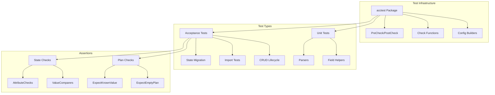

# Design Document: Terraform Provider Testing Patterns

## Overview

This document describes the technical design for implementing comprehensive testing patterns in the Terraform provider for RTX routers. The design establishes reusable test utilities, consistent test structures, and patterns that ensure provider reliability across all resources.

## Steering Document Alignment

### Technical Standards (tech.md)

- **Testing Framework**: Go testing package + stretchr/testify v1.10.0
- **SDK**: terraform-plugin-sdk/v2 v2.37.0 with testing helpers
- **Logging**: Zerolog for test debugging output
- **Code Style**: golangci-lint compliance

### Project Structure (structure.md)

Implementation will follow the established structure:
- Test utilities in `internal/provider/acctest/`
- Resource tests in `internal/provider/resource_*_test.go`
- Parser tests in `internal/rtx/parsers/*_test.go`
- Test fixtures in `internal/provider/testdata/`

## Code Reuse Analysis

### Existing Components to Leverage

- **terraform-plugin-sdk/v2/helper/resource**: Core acceptance test framework
- **terraform-plugin-sdk/v2/helper/acctest**: Random name generation
- **testify/assert and require**: Assertion helpers
- **Existing test patterns**: Current tests in `*_test.go` files

### Integration Points

- **Provider factory**: `testAccProviderFactories` for test provider instantiation
- **SSH client**: Reuse existing client for router connectivity checks
- **Parser utilities**: Reuse parsers for verifying router state

## Architecture



## Components and Interfaces

### Component 1: AccTest Package

- **Purpose:** Provide reusable test utilities and configuration builders
- **Location:** `internal/provider/acctest/acctest.go`
- **Interfaces:**
  ```go
  // PreCheck verifies test prerequisites (router connectivity, credentials)
  func PreCheck(t *testing.T)

  // ConfigBuilder builds HCL configurations for tests
  type ConfigBuilder struct {
      resourceType string
      resourceName string
      attributes   map[string]interface{}
  }

  // NewConfigBuilder creates a new configuration builder
  func NewConfigBuilder(resourceType, resourceName string) *ConfigBuilder

  // Build generates HCL configuration string
  func (b *ConfigBuilder) Build() string

  // RandomName generates a unique resource name for parallel tests
  func RandomName(prefix string) string
  ```
- **Dependencies:** `terraform-plugin-sdk/v2/helper/acctest`

### Component 2: Check Functions

- **Purpose:** Provide reusable check functions for common assertions
- **Location:** `internal/provider/acctest/checks.go`
- **Interfaces:**
  ```go
  // CheckResourceAttrNotEmpty verifies attribute is set and non-empty
  func CheckResourceAttrNotEmpty(resourceName, attrName string) resource.TestCheckFunc

  // CheckNoPlannedChanges verifies no changes in plan (SDK v2 pattern)
  func CheckNoPlannedChanges(resourceName string) resource.TestCheckFunc

  // CheckResourceImportState verifies import populates expected attributes
  func CheckResourceImportState(resourceName string, attrs []string) resource.ImportStateCheckFunc
  ```
- **Dependencies:** `terraform-plugin-sdk/v2/helper/resource`

### Component 3: Test Step Builders

- **Purpose:** Build standard test steps for consistent test structure
- **Location:** `internal/provider/acctest/steps.go`
- **Interfaces:**
  ```go
  // BasicCreateStep returns a TestStep for basic resource creation
  func BasicCreateStep(config string, checks ...resource.TestCheckFunc) resource.TestStep

  // UpdateStep returns a TestStep for resource updates
  func UpdateStep(config string, checks ...resource.TestCheckFunc) resource.TestStep

  // ImportStep returns a TestStep for import testing
  func ImportStep(resourceName string) resource.TestStep

  // NoChangeStep returns a TestStep that verifies no changes (perpetual diff check)
  func NoChangeStep(config string) resource.TestStep
  ```
- **Dependencies:** `terraform-plugin-sdk/v2/helper/resource`

### Component 4: State Migration Test Helpers

- **Purpose:** Provide utilities for testing schema version upgrades
- **Location:** `internal/provider/acctest/migration.go`
- **Interfaces:**
  ```go
  // StateMigrationTestCase defines a state migration test scenario
  type StateMigrationTestCase struct {
      Name          string
      OldState      map[string]interface{}
      ExpectedState map[string]interface{}
      UpgradeFunc   schema.StateUpgradeFunc
  }

  // RunStateMigrationTests executes state migration test cases
  func RunStateMigrationTests(t *testing.T, cases []StateMigrationTestCase)

  // CrossVersionTestStep returns a TestStep using ExternalProviders
  func CrossVersionTestStep(providerVersion, config string) resource.TestStep
  ```
- **Dependencies:** `terraform-plugin-sdk/v2/helper/schema`

## Data Models

### TestConfig

```go
// TestConfig holds configuration for a test resource
type TestConfig struct {
    ResourceType string                 `json:"resource_type"`
    ResourceName string                 `json:"resource_name"`
    Attributes   map[string]interface{} `json:"attributes"`
    DependsOn    []string               `json:"depends_on,omitempty"`
}
```

### TestFixture

```go
// TestFixture represents expected router state for verification
type TestFixture struct {
    ResourceID     string                 `json:"resource_id"`
    ExpectedAttrs  map[string]interface{} `json:"expected_attrs"`
    RouterCommands []string               `json:"router_commands"`
}
```

## Test Pattern Implementations

### Pattern 1: Perpetual Diff Prevention

```go
func TestAccResource_noDiff(t *testing.T) {
    resourceName := "rtx_admin_user.test"
    config := testAccAdminUserConfig_basic()

    resource.Test(t, resource.TestCase{
        PreCheck:          func() { acctest.PreCheck(t) },
        ProviderFactories: testAccProviderFactories,
        Steps: []resource.TestStep{
            // Step 1: Create resource
            {
                Config: config,
                Check: resource.ComposeTestCheckFunc(
                    resource.TestCheckResourceAttrSet(resourceName, "username"),
                ),
            },
            // Step 2: Re-apply same config - should be no-op
            {
                Config:   config,
                PlanOnly: true,
                // In SDK v2, empty plan is verified automatically
                // Test fails if any changes are planned
            },
        },
    })
}
```

### Pattern 2: Import Testing

```go
func TestAccResource_import(t *testing.T) {
    resourceName := "rtx_admin_user.test"
    config := testAccAdminUserConfig_basic()

    resource.Test(t, resource.TestCase{
        PreCheck:          func() { acctest.PreCheck(t) },
        ProviderFactories: testAccProviderFactories,
        Steps: []resource.TestStep{
            // Step 1: Create resource
            {
                Config: config,
            },
            // Step 2: Import and verify
            {
                ResourceName:      resourceName,
                ImportState:       true,
                ImportStateVerify: true,
                // Fields that cannot be imported (e.g., passwords)
                ImportStateVerifyIgnore: []string{"password"},
            },
        },
    })
}
```

### Pattern 3: State Migration Testing

```go
func TestAdminUser_StateUpgradeV0(t *testing.T) {
    cases := []acctest.StateMigrationTestCase{
        {
            Name: "basic upgrade",
            OldState: map[string]interface{}{
                "name": "admin",  // Old field name
            },
            ExpectedState: map[string]interface{}{
                "username": "admin",  // New field name
            },
            UpgradeFunc: resourceAdminUserStateUpgradeV0,
        },
    }
    acctest.RunStateMigrationTests(t, cases)
}
```

### Pattern 4: Optional+Computed Field Preservation

```go
func TestAccAdminUser_preserveAdministrator(t *testing.T) {
    resourceName := "rtx_admin_user.test"

    // Config with administrator=true
    configWithAdmin := `
resource "rtx_admin_user" "test" {
    username      = "testuser"
    password      = "testpass"
    administrator = true
}`

    // Config without administrator (should preserve existing value)
    configWithoutAdmin := `
resource "rtx_admin_user" "test" {
    username = "testuser"
    password = "testpass"
}`

    resource.Test(t, resource.TestCase{
        PreCheck:          func() { acctest.PreCheck(t) },
        ProviderFactories: testAccProviderFactories,
        Steps: []resource.TestStep{
            // Step 1: Create with administrator=true
            {
                Config: configWithAdmin,
                Check: resource.ComposeTestCheckFunc(
                    resource.TestCheckResourceAttr(resourceName, "administrator", "true"),
                ),
            },
            // Step 2: Apply without administrator - should preserve true
            {
                Config: configWithoutAdmin,
                Check: resource.ComposeTestCheckFunc(
                    resource.TestCheckResourceAttr(resourceName, "administrator", "true"),
                ),
            },
        },
    })
}
```

### Pattern 5: WriteOnly Attribute Testing

```go
func TestAccAdminUser_passwordNotInState(t *testing.T) {
    resourceName := "rtx_admin_user.test"

    resource.Test(t, resource.TestCase{
        PreCheck:          func() { acctest.PreCheck(t) },
        ProviderFactories: testAccProviderFactories,
        Steps: []resource.TestStep{
            {
                Config: testAccAdminUserConfig_withPassword("secretpass"),
                Check: resource.ComposeTestCheckFunc(
                    // Password should not be readable from state
                    resource.TestCheckNoResourceAttr(resourceName, "password"),
                    // Or if Sensitive, verify it's set but masked
                    testCheckSensitiveAttrSet(resourceName, "password"),
                ),
            },
        },
    })
}
```

## Error Handling

### Error Scenarios

1. **Router Connectivity Failure in PreCheck**
   - **Handling:** Skip test with clear message
   - **User Impact:** Test marked as skipped, not failed

2. **Resource Creation Failure**
   - **Handling:** Test fails with router error message
   - **User Impact:** Clear error indicating what failed

3. **Import ID Not Found**
   - **Handling:** Test fails with "resource not found" error
   - **User Impact:** Indicates import ID format may be incorrect

4. **State Migration Failure**
   - **Handling:** Test fails with comparison diff
   - **User Impact:** Shows expected vs actual state

## Testing Strategy

### Unit Testing

- Test config builders produce valid HCL
- Test check functions work with mock data
- Test state migration upgraders with various input formats

### Integration Testing

- Full CRUD lifecycle with real router
- Import from existing router resources
- Cross-version state migration

### Test Organization

```
internal/provider/
├── acctest/
│   ├── acctest.go      # PreCheck, provider setup
│   ├── checks.go       # Reusable check functions
│   ├── config.go       # Config builders
│   ├── migration.go    # State migration helpers
│   └── steps.go        # Test step builders
├── resource_rtx_admin_user_test.go
├── resource_rtx_admin_test.go
└── testdata/
    ├── admin_user_basic.tf
    └── fixtures/
        └── admin_user.json
```

## Performance Considerations

- Use `t.Parallel()` for independent tests
- Share provider instance across test steps
- Minimize router commands in tests
- Use test fixtures where possible instead of live router calls

## Security Considerations

- Never log actual passwords in test output
- Use dedicated test users/resources
- Clean up test resources in CheckDestroy
- Don't commit real credentials in test fixtures
