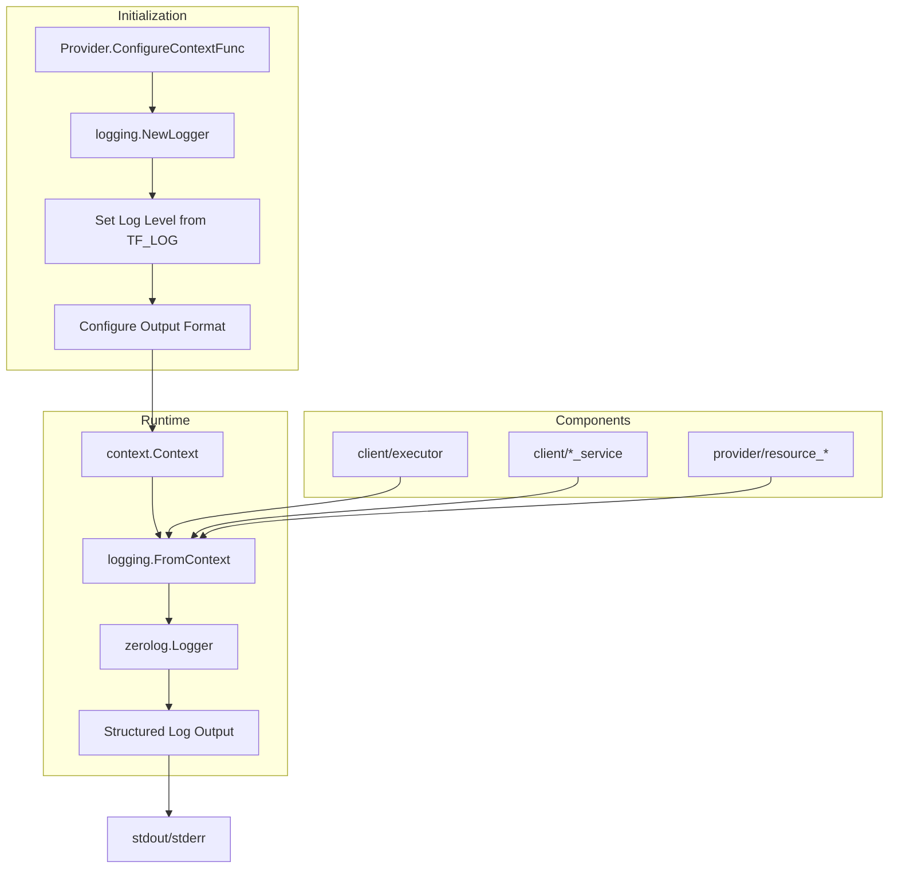

# Design Document

## Overview

このドキュメントでは、terraform-provider-rtxにzerologを導入するための技術設計を定義します。標準`log`パッケージから`zerolog`への移行により、構造化ロギング、パフォーマンス向上、およびより良いデバッグ体験を実現します。

## Steering Document Alignment

### Technical Standards (tech.md)

- **Go 1.23**: zerologはGo 1.23と完全に互換性があります
- **terraform-plugin-log v0.9.0**: zerologはterraform-plugin-logと並行して使用可能（内部ログ用）
- **Parser Registry Pattern**: 既存のパターンを維持しながら、ロガーをコンテキスト経由で伝播

### Project Structure (structure.md)

- `internal/logging/`: 新規ロギングパッケージを追加
- `internal/client/`: SSH/クライアント層のログ移行
- `internal/provider/`: リソース層のログ移行

## Code Reuse Analysis

### Existing Components to Leverage

- **SanitizeCommandForLog**: `internal/client/log_sanitizer.go` - 機密データのマスキングを継続使用
- **sensitivePatterns**: 既存のパターンリストをzerologのフックに統合
- **TF_LOG環境変数**: Terraformの既存のログレベル設定を尊重

### Integration Points

- **Provider ConfigureContextFunc**: ロガーの初期化ポイント
- **context.Context**: ロガーのコンテキスト伝播
- **既存の74ファイル**: 段階的に`log.Printf`を`zerolog`に置換

## Architecture

### Modular Design Principles

- **Single File Responsibility**: `internal/logging/logger.go`がロガー設定を集約
- **Component Isolation**: 各パッケージは`logging.FromContext(ctx)`でロガーを取得
- **Service Layer Separation**: ロギングロジックはビジネスロジックから分離
- **Utility Modularity**: サニタイザーはフックとして再利用



## Components and Interfaces

### Component 1: logging package

- **Purpose:** ロガーの設定、初期化、コンテキスト管理を提供
- **Location:** `internal/logging/logger.go`
- **Interfaces:**
  ```go
  // NewLogger creates a configured zerolog logger
  func NewLogger() zerolog.Logger

  // WithContext adds logger to context
  func WithContext(ctx context.Context, logger zerolog.Logger) context.Context

  // FromContext retrieves logger from context
  func FromContext(ctx context.Context) zerolog.Logger

  // SetLevel sets global log level
  func SetLevel(level string)
  ```
- **Dependencies:** `github.com/rs/zerolog`
- **Reuses:** TF_LOG環境変数の読み取りロジック

### Component 2: Sanitizing Hook

- **Purpose:** ログ出力前に機密データを自動的にマスク
- **Location:** `internal/logging/sanitizer.go`
- **Interfaces:**
  ```go
  // SanitizingHook implements zerolog.Hook
  type SanitizingHook struct{}

  // Run sanitizes sensitive fields before logging
  func (h SanitizingHook) Run(e *zerolog.Event, level zerolog.Level, msg string)
  ```
- **Dependencies:** `internal/client.SanitizeCommandForLog`
- **Reuses:** 既存のsensitivePatterns, redactedMessage

### Component 3: Logger Integration in Client

- **Purpose:** SSH/クライアント層で構造化ログを出力
- **Location:** `internal/client/*.go`（既存ファイルの修正）
- **Interfaces:** コンテキストからロガーを取得し、構造化フィールドでログ出力
- **Dependencies:** `internal/logging`
- **Reuses:** 既存のSanitizeCommandForLog関数

### Component 4: Logger Integration in Provider

- **Purpose:** リソースCRUD操作で構造化ログを出力
- **Location:** `internal/provider/*.go`（既存ファイルの修正）
- **Interfaces:** コンテキストからロガーを取得し、リソース情報をフィールドとして付加
- **Dependencies:** `internal/logging`
- **Reuses:** 既存のリソース識別子

## Data Models

### Logger Configuration

```go
type LogConfig struct {
    Level       zerolog.Level  // Log level (debug, info, warn, error)
    Format      string         // "json" or "console"
    Output      io.Writer      // Output destination (os.Stderr)
    TimeFormat  string         // Timestamp format
}
```

### Log Context Fields

```go
// Common fields added to all logs
type LogContext struct {
    Component   string  // "client", "provider", "parser"
    Operation   string  // "create", "read", "update", "delete", "connect"
    ResourceType string // "rtx_static_route", "rtx_ospf", etc.
    ResourceID  string  // Resource identifier
}
```

## Error Handling

### Error Scenarios

1. **TF_LOG環境変数が不正な値**
   - **Handling:** デフォルトのwarnレベルにフォールバック、警告ログを出力
   - **User Impact:** ログは出力されるが、期待したレベルではない可能性

2. **コンテキストにロガーが存在しない**
   - **Handling:** グローバルロガーにフォールバック
   - **User Impact:** ログは出力されるが、コンテキスト情報が欠落

3. **ログ出力先への書き込み失敗**
   - **Handling:** zerologは内部でエラーをハンドリング、メイン処理は継続
   - **User Impact:** 一部のログが欠落する可能性

## Testing Strategy

### Unit Testing

- **logger_test.go**: ロガー初期化、レベル設定のテスト
- **sanitizer_test.go**: サニタイザーフックが機密データをマスクすることを検証
- **既存テスト**: `log.Printf`の出力に依存するテストの更新

### Integration Testing

- **context propagation**: ロガーがコンテキスト経由で正しく伝播されることを検証
- **TF_LOG integration**: 環境変数によるログレベル制御のテスト

### End-to-End Testing

- **Terraform apply**: 実際のTerraform操作でログが正しく出力されることを確認
- **JSON output**: 運用モードでJSON形式のログが出力されることを確認
- **Console output**: 開発モードで人間が読みやすいログが出力されることを確認

## Migration Strategy

### Phase 1: Infrastructure (REQ-1, REQ-2)

1. zerolog依存関係を追加
2. `internal/logging/`パッケージを作成
3. Provider初期化時にロガーを設定

### Phase 2: Client Layer (REQ-3, REQ-5)

1. `internal/client/`の各ファイルで`log.Printf`を置換
2. SSH接続、コマンド実行に構造化フィールドを追加
3. コンテキスト伝播を実装

### Phase 3: Provider Layer (REQ-4)

1. `internal/provider/`の各リソースファイルで`log.Printf`を置換
2. CRUD操作に構造化フィールドを追加

### Phase 4: Validation (REQ-6)

1. 全テストの実行と修正
2. 既存機能の動作確認
