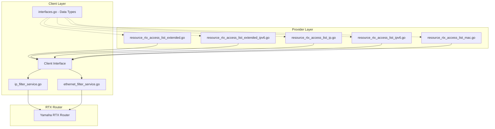

# Master Design: Access List Resources

## Overview

This document describes the technical design and implementation of access list resources in the Terraform RTX Provider. The implementation follows a layered architecture with clear separation between Terraform provider, client services, and RTX command parsing.

## Resource Summary

| Resource Name | Service File | Resource File |
|---------------|--------------|---------------|
| `rtx_access_list_extended` | `internal/client/ip_filter_service.go` | `internal/provider/resource_rtx_access_list_extended.go` |
| `rtx_access_list_extended_ipv6` | `internal/client/ip_filter_service.go` | `internal/provider/resource_rtx_access_list_extended_ipv6.go` |
| `rtx_access_list_ip` | `internal/client/ip_filter_service.go` | `internal/provider/resource_rtx_access_list_ip.go` |
| `rtx_access_list_ipv6` | `internal/client/ip_filter_service.go` | `internal/provider/resource_rtx_access_list_ipv6.go` |
| `rtx_access_list_mac` | `internal/client/ethernet_filter_service.go` | `internal/provider/resource_rtx_access_list_mac.go` |

---

## Architecture



---

## Data Models

### AccessListExtended (IPv4)

```go
// AccessListExtended represents an IPv4 extended access list
type AccessListExtended struct {
    Name    string                    `json:"name"`    // ACL name (identifier)
    Entries []AccessListExtendedEntry `json:"entries"` // List of ACL entries
}

// AccessListExtendedEntry represents a single entry in an IPv4 extended access list
type AccessListExtendedEntry struct {
    Sequence              int    `json:"sequence"`                          // Sequence number (determines order)
    AceRuleAction         string `json:"ace_rule_action"`                   // permit or deny
    AceRuleProtocol       string `json:"ace_rule_protocol"`                 // Protocol: tcp, udp, icmp, ip, etc.
    SourceAny             bool   `json:"source_any,omitempty"`              // Source is any
    SourcePrefix          string `json:"source_prefix,omitempty"`           // Source IP address
    SourcePrefixMask      string `json:"source_prefix_mask,omitempty"`      // Source wildcard mask
    SourcePortEqual       string `json:"source_port_equal,omitempty"`       // Source port equals
    SourcePortRange       string `json:"source_port_range,omitempty"`       // Source port range (e.g., "1024-65535")
    DestinationAny        bool   `json:"destination_any,omitempty"`         // Destination is any
    DestinationPrefix     string `json:"destination_prefix,omitempty"`      // Destination IP address
    DestinationPrefixMask string `json:"destination_prefix_mask,omitempty"` // Destination wildcard mask
    DestinationPortEqual  string `json:"destination_port_equal,omitempty"`  // Destination port equals
    DestinationPortRange  string `json:"destination_port_range,omitempty"`  // Destination port range
    Established           bool   `json:"established,omitempty"`             // Match established TCP connections
    Log                   bool   `json:"log,omitempty"`                     // Enable logging
}
```

### AccessListExtendedIPv6

```go
// AccessListExtendedIPv6 represents an IPv6 extended access list
type AccessListExtendedIPv6 struct {
    Name    string                        `json:"name"`    // ACL name (identifier)
    Entries []AccessListExtendedIPv6Entry `json:"entries"` // List of ACL entries
}

// AccessListExtendedIPv6Entry represents a single entry in an IPv6 extended access list
type AccessListExtendedIPv6Entry struct {
    Sequence                int    `json:"sequence"`                            // Sequence number
    AceRuleAction           string `json:"ace_rule_action"`                     // permit or deny
    AceRuleProtocol         string `json:"ace_rule_protocol"`                   // Protocol: tcp, udp, icmpv6, ipv6, etc.
    SourceAny               bool   `json:"source_any,omitempty"`                // Source is any
    SourcePrefix            string `json:"source_prefix,omitempty"`             // Source IPv6 address/prefix
    SourcePrefixLength      int    `json:"source_prefix_length,omitempty"`      // Source prefix length (0-128)
    SourcePortEqual         string `json:"source_port_equal,omitempty"`         // Source port equals
    SourcePortRange         string `json:"source_port_range,omitempty"`         // Source port range
    DestinationAny          bool   `json:"destination_any,omitempty"`           // Destination is any
    DestinationPrefix       string `json:"destination_prefix,omitempty"`        // Destination IPv6 address/prefix
    DestinationPrefixLength int    `json:"destination_prefix_length,omitempty"` // Destination prefix length
    DestinationPortEqual    string `json:"destination_port_equal,omitempty"`    // Destination port equals
    DestinationPortRange    string `json:"destination_port_range,omitempty"`    // Destination port range
    Established             bool   `json:"established,omitempty"`               // Match established TCP
    Log                     bool   `json:"log,omitempty"`                       // Enable logging
}
```

### IPFilter (Native IPv4/IPv6)

```go
// IPFilter represents a static IP filter rule on an RTX router
type IPFilter struct {
    Number        int    `json:"number"`                // Filter number (1-2147483647)
    Action        string `json:"action"`                // pass, reject, restrict, restrict-log
    SourceAddress string `json:"source_address"`        // Source IP/network or "*"
    SourceMask    string `json:"source_mask,omitempty"` // Source mask (for non-CIDR format)
    DestAddress   string `json:"dest_address"`          // Destination IP/network or "*"
    DestMask      string `json:"dest_mask,omitempty"`   // Destination mask
    Protocol      string `json:"protocol"`              // tcp, udp, icmp, ip, * (any)
    SourcePort    string `json:"source_port,omitempty"` // Source port(s) or "*"
    DestPort      string `json:"dest_port,omitempty"`   // Destination port(s) or "*"
    Established   bool   `json:"established,omitempty"` // Match established TCP connections
}
```

### AccessListMAC

```go
// AccessListMAC represents a MAC address access list
type AccessListMAC struct {
    Name     string               `json:"name"`                // ACL name (identifier)
    FilterID int                  `json:"filter_id,omitempty"` // Optional RTX filter number mode
    Entries  []AccessListMACEntry `json:"entries"`             // List of MAC ACL entries
    Apply    *MACApply            `json:"apply,omitempty"`     // Optional apply settings
}

// AccessListMACEntry represents a single entry in a MAC access list
type AccessListMACEntry struct {
    Sequence               int      `json:"sequence"`                           // Sequence number
    AceAction              string   `json:"ace_action"`                         // permit/deny or RTX action
    SourceAny              bool     `json:"source_any,omitempty"`               // Source is any
    SourceAddress          string   `json:"source_address,omitempty"`           // Source MAC address
    SourceAddressMask      string   `json:"source_address_mask,omitempty"`      // Source MAC wildcard mask
    DestinationAny         bool     `json:"destination_any,omitempty"`          // Destination is any
    DestinationAddress     string   `json:"destination_address,omitempty"`      // Destination MAC address
    DestinationAddressMask string   `json:"destination_address_mask,omitempty"` // Destination MAC wildcard
    EtherType              string   `json:"ether_type,omitempty"`               // Ethernet type (0x0800, etc.)
    VlanID                 int      `json:"vlan_id,omitempty"`                  // VLAN ID
    Log                    bool     `json:"log,omitempty"`                      // Enable logging (legacy)
    FilterID               int      `json:"filter_id,omitempty"`                // Explicit RTX filter number
    DHCPType               string   `json:"dhcp_type,omitempty"`                // dhcp-bind / dhcp-not-bind
    DHCPScope              int      `json:"dhcp_scope,omitempty"`               // DHCP scope number
    Offset                 int      `json:"offset,omitempty"`                   // Offset for byte match
    ByteList               []string `json:"byte_list,omitempty"`                // Byte list for offset match
}

// MACApply represents interface application for ethernet filters
type MACApply struct {
    Interface string `json:"interface"` // Interface name (lan1, etc.)
    Direction string `json:"direction"` // in/out
    FilterIDs []int  `json:"filter_ids"`
}
```

---

## Components and Interfaces

### Component 1: IP Filter Service (`internal/client/ip_filter_service.go`)

**Purpose:** Manages IP filter operations (IPv4, IPv6, Extended ACLs)

**Client Interface Methods:**

```go
// IPv4 Filter methods
GetIPFilter(ctx context.Context, number int) (*IPFilter, error)
CreateIPFilter(ctx context.Context, filter IPFilter) error
UpdateIPFilter(ctx context.Context, filter IPFilter) error
DeleteIPFilter(ctx context.Context, number int) error
ListIPFilters(ctx context.Context) ([]IPFilter, error)

// IPv6 Filter methods
GetIPv6Filter(ctx context.Context, number int) (*IPFilter, error)
CreateIPv6Filter(ctx context.Context, filter IPFilter) error
UpdateIPv6Filter(ctx context.Context, filter IPFilter) error
DeleteIPv6Filter(ctx context.Context, number int) error
ListIPv6Filters(ctx context.Context) ([]IPFilter, error)

// Extended ACL methods (IPv4)
GetAccessListExtended(ctx context.Context, name string) (*AccessListExtended, error)
CreateAccessListExtended(ctx context.Context, acl AccessListExtended) error
UpdateAccessListExtended(ctx context.Context, acl AccessListExtended) error
DeleteAccessListExtended(ctx context.Context, name string) error
ListAccessListsExtended(ctx context.Context) ([]AccessListExtended, error)

// Extended ACL methods (IPv6)
GetAccessListExtendedIPv6(ctx context.Context, name string) (*AccessListExtendedIPv6, error)
CreateAccessListExtendedIPv6(ctx context.Context, acl AccessListExtendedIPv6) error
UpdateAccessListExtendedIPv6(ctx context.Context, acl AccessListExtendedIPv6) error
DeleteAccessListExtendedIPv6(ctx context.Context, name string) error
ListAccessListsExtendedIPv6(ctx context.Context) ([]AccessListExtendedIPv6, error)
```

### Component 2: Ethernet Filter Service (`internal/client/ethernet_filter_service.go`)

**Purpose:** Manages MAC/Ethernet filter operations

**Client Interface Methods:**

```go
// Ethernet Filter methods
GetEthernetFilter(ctx context.Context, number int) (*EthernetFilter, error)
CreateEthernetFilter(ctx context.Context, filter EthernetFilter) error
UpdateEthernetFilter(ctx context.Context, filter EthernetFilter) error
DeleteEthernetFilter(ctx context.Context, number int) error
ListEthernetFilters(ctx context.Context) ([]EthernetFilter, error)

// MAC ACL methods
GetAccessListMAC(ctx context.Context, name string) (*AccessListMAC, error)
CreateAccessListMAC(ctx context.Context, acl AccessListMAC) error
UpdateAccessListMAC(ctx context.Context, acl AccessListMAC) error
DeleteAccessListMAC(ctx context.Context, name string, filterNums []int) error
```

### Component 3: Terraform Resources

Each resource follows the same pattern:

```go
// Resource schema definition
func resourceRTX{ResourceName}() *schema.Resource {
    return &schema.Resource{
        Description:   "...",
        CreateContext: resourceRTX{ResourceName}Create,
        ReadContext:   resourceRTX{ResourceName}Read,
        UpdateContext: resourceRTX{ResourceName}Update,
        DeleteContext: resourceRTX{ResourceName}Delete,
        Importer: &schema.ResourceImporter{
            StateContext: resourceRTX{ResourceName}Import,
        },
        Schema: map[string]*schema.Schema{...},
        CustomizeDiff: validate{ResourceName}Entries, // Optional validation
    }
}

// Builder: Terraform state -> Go struct
func build{ResourceName}FromResourceData(d *schema.ResourceData) client.{Type}

// Flattener: Go struct -> Terraform state
func flatten{ResourceName}Entries(entries []client.{EntryType}) []interface{}
```

---

## RTX Command Mapping

### Extended Access List (IPv4)

**Create/Update:**
```
ip access-list extended <name>
  <seq> permit|deny <protocol> any|<src> <src-mask> [eq <port>|range <start>-<end>] any|<dst> <dst-mask> [eq <port>|range <start>-<end>] [established] [log]
```

**Example:**
```
ip access-list extended web-acl
  10 permit tcp any 192.168.1.0 0.0.0.255 eq 443
  20 deny ip any any log
```

**Delete:**
```
no ip access-list extended <name>
```

### Extended Access List (IPv6)

**Create/Update:**
```
ipv6 access-list extended <name>
  <seq> permit|deny <protocol> any|<src>/<len> [eq <port>] any|<dst>/<len> [eq <port>] [established] [log]
```

**Example:**
```
ipv6 access-list extended ipv6-web
  10 permit tcp any 2001:db8:1::/64 eq 443
  20 permit icmpv6 any any
```

### Native IP Filter

**Create:**
```
ip filter <number> pass|reject|restrict|restrict-log <src> <dest> <proto> [<src-port> <dst-port>] [established]
```

**Example:**
```
ip filter 100 reject 10.0.0.0/8 * tcp * 135
ip filter 200 pass * 192.168.1.0/24 tcp * * established
```

**Delete:**
```
no ip filter <number>
```

### Native IPv6 Filter

**Create:**
```
ipv6 filter <number> pass|reject|restrict|restrict-log <src> <dest> <proto> [<src-port> <dst-port>]
```

**Example:**
```
ipv6 filter 101000 pass * * icmp6
ipv6 filter 101001 reject 2001:db8::/32 * tcp * 135
```

**Delete:**
```
no ipv6 filter <number>
```

### Ethernet Filter (MAC)

**Create:**
```
ethernet filter <number> pass-log|pass-nolog|reject-log|reject-nolog <src-mac> <dst-mac> [<ether-type>] [vlan <id>]
```

**Example:**
```
ethernet filter 100 pass-log 00:11:22:33:44:55 * 0x0800
ethernet filter 200 reject-nolog * * * vlan 100
```

**Apply to Interface:**
```
ethernet <interface> filter in|out <filter-list>
```

**Example:**
```
ethernet lan1 filter in 100 101 102
```

**Delete:**
```
no ethernet filter <number>
no ethernet <interface> filter in|out
```

---

## Terraform Schema Examples

### rtx_access_list_extended

```hcl
resource "rtx_access_list_extended" "example" {
  name = "my-acl"

  entry {
    sequence          = 10
    ace_rule_action   = "permit"
    ace_rule_protocol = "tcp"
    source_any        = true
    destination_prefix      = "192.168.1.0"
    destination_prefix_mask = "0.0.0.255"
    destination_port_equal  = "443"
  }

  entry {
    sequence          = 20
    ace_rule_action   = "permit"
    ace_rule_protocol = "tcp"
    source_prefix           = "10.0.0.0"
    source_prefix_mask      = "0.255.255.255"
    destination_any         = true
    established             = true
    log                     = true
  }
}
```

### rtx_access_list_extended_ipv6

```hcl
resource "rtx_access_list_extended_ipv6" "example" {
  name = "my-ipv6-acl"

  entry {
    sequence                  = 10
    ace_rule_action           = "permit"
    ace_rule_protocol         = "tcp"
    source_any                = true
    destination_prefix        = "2001:db8:1::"
    destination_prefix_length = 64
    destination_port_equal    = "443"
  }

  entry {
    sequence          = 20
    ace_rule_action   = "permit"
    ace_rule_protocol = "icmpv6"
    source_any        = true
    destination_any   = true
  }
}
```

### rtx_access_list_ip

```hcl
resource "rtx_access_list_ip" "block_netbios" {
  sequence    = 200000
  action      = "reject"
  source      = "10.0.0.0/8"
  destination = "*"
  protocol    = "tcp"
  source_port = "*"
  dest_port   = "135"
}

resource "rtx_access_list_ip" "allow_established" {
  sequence    = 200001
  action      = "pass"
  source      = "*"
  destination = "192.168.1.0/24"
  protocol    = "tcp"
  source_port = "*"
  dest_port   = "*"
  established = true
}
```

### rtx_access_list_ipv6

```hcl
resource "rtx_access_list_ipv6" "allow_icmpv6" {
  sequence    = 101000
  action      = "pass"
  source      = "*"
  destination = "*"
  protocol    = "icmp6"
}

resource "rtx_access_list_ipv6" "web_server" {
  sequence    = 101001
  action      = "pass"
  source      = "*"
  destination = "2001:db8:1::/64"
  protocol    = "tcp"
  dest_port   = "80"
}
```

### rtx_access_list_mac

```hcl
resource "rtx_access_list_mac" "secure_lan" {
  name      = "secure-lan-mac"
  sequence  = 100

  entry {
    sequence            = 10
    ace_action          = "pass-log"
    source_address      = "00:11:22:33:44:55"
    source_address_mask = "ff:ff:ff:ff:ff:ff"
    destination_any     = true
    sequence            = 101
  }

  entry {
    sequence       = 20
    ace_action     = "pass-nolog"
    source_any     = true
    destination_any = true
    ether_type     = "0x0800"
    sequence       = 102
  }

  entry {
    sequence        = 30
    ace_action      = "reject-nolog"
    source_any      = true
    destination_any = true
    sequence        = 103
  }

  apply {
    interface  = "lan1"
    direction  = "in"
    filter_ids = [101, 102, 103]
  }
}
```

---

## Error Handling

### Error Scenarios

1. **ACL Not Found**
   - **Handling:** Return nil and clear state ID
   - **User Impact:** Resource removed from state; next apply recreates

2. **Invalid Filter ID**
   - **Handling:** Return validation error before API call
   - **User Impact:** Clear error message indicating valid range

3. **Protocol Mismatch**
   - **Handling:** CustomizeDiff validates established only with TCP
   - **User Impact:** Error during plan, not apply

4. **Address Format Error**
   - **Handling:** Router returns error, propagated to user
   - **User Impact:** Apply fails with descriptive error

5. **Duplicate Filter ID**
   - **Handling:** Router replaces existing; Terraform detects drift
   - **User Impact:** State shows unexpected changes

6. **Connection Timeout**
   - **Handling:** Context timeout, error returned
   - **User Impact:** Retry required

---

## Testing Strategy

### Unit Testing

**Resource Tests** (`resource_rtx_access_list_*_test.go`):
- `TestBuild{Resource}FromResourceData` - Verifies correct struct building
- `TestFlatten{Resource}Entries` - Verifies correct state flattening
- `TestResource{Resource}Schema` - Validates schema constraints
- `TestResource{Resource}SchemaValidation` - Tests validation functions

**Test Categories:**
1. Basic entry creation
2. Multiple entry handling
3. Optional field handling
4. Protocol-specific constraints
5. Port specifications (equal, range)
6. Address wildcards
7. Established flag (TCP only)
8. CRUD lifecycle functions

### Test Examples from Implementation

```go
// From resource_rtx_access_list_extended_test.go
func TestBuildAccessListExtendedFromResourceData(t *testing.T) {
    tests := []struct {
        name     string
        input    map[string]interface{}
        expected client.AccessListExtended
    }{
        {
            name: "basic extended ACL with source any",
            input: map[string]interface{}{
                "name": "test-acl",
                "entry": []interface{}{
                    map[string]interface{}{
                        "sequence":          10,
                        "ace_rule_action":   "permit",
                        "ace_rule_protocol": "tcp",
                        "source_any":        true,
                        // ...
                    },
                },
            },
            expected: client.AccessListExtended{
                Name: "test-acl",
                Entries: []client.AccessListExtendedEntry{
                    {
                        Sequence:        10,
                        AceRuleAction:   "permit",
                        // ...
                    },
                },
            },
        },
    }
    // ...
}
```

### Acceptance Testing

**With Real RTX Router:**
- Create ACL, verify in show config
- Update entries, verify changes
- Delete ACL, verify removal
- Import existing configuration
- Test multiple ACLs simultaneously

---

## File Structure

```
internal/
├── provider/
│   ├── resource_rtx_access_list_extended.go
│   ├── resource_rtx_access_list_extended_test.go
│   ├── resource_rtx_access_list_extended_ipv6.go
│   ├── resource_rtx_access_list_extended_ipv6_test.go
│   ├── resource_rtx_access_list_ip.go
│   ├── resource_rtx_access_list_ip_test.go
│   ├── resource_rtx_access_list_ipv6.go
│   ├── resource_rtx_access_list_ipv6_test.go
│   ├── resource_rtx_access_list_mac.go
│   └── resource_rtx_access_list_mac_test.go
└── client/
    ├── interfaces.go              # Data types and Client interface
    ├── ip_filter_service.go       # IP/IPv6 filter service implementation
    └── ethernet_filter_service.go # Ethernet/MAC filter service implementation
```

---

## Implementation Notes

1. **Sequence Numbers:** Entry order in Terraform configuration doesn't matter; sequence numbers determine evaluation order on router.

2. **Filter ID vs Sequence:** In MAC ACL, `filter_id` overrides `sequence` for RTX filter number. If `filter_id` is not specified, `sequence` is used.

3. **Computed Fields:** For native filters (`rtx_access_list_ip`, `rtx_access_list_ipv6`), optional fields like `protocol`, `source_port`, `dest_port` are marked `Computed: true` to handle import cases.

4. **Established Flag:** Only valid for TCP protocol. CustomizeDiff validates this constraint before apply.

5. **IPv6 Protocol Names:** Use `icmpv6` for extended ACLs, `icmp6` for native filters.

6. **MAC ACL Actions:** Support both standard (permit/deny) and RTX native (pass-log, reject-nolog, etc.) action formats.

7. **Apply Block:** MAC ACL's apply block is optional. When specified, it configures `ethernet <interface> filter` command.

8. **Delete Behavior:** MAC ACL delete collects filter numbers from entries (using `filter_id` or `sequence`) to issue `no ethernet filter` commands.

9. **Import ID Format:**
   - Extended ACLs: Use ACL name
   - Native filters: Use filter number (integer)
   - MAC ACL: Use ACL name

10. **State Reconciliation:** Read operations fetch current configuration from router; any drift will be detected by Terraform.

---

## State Handling

- Only configuration attributes persisted in state
- No runtime statistics (hit counters) stored
- Entry list ordering maintained via sequence numbers
- Resource ID is the unique identifier:
  - ACL name for named lists
  - Filter number (string) for native filters

---

## Change History

| Date | Source | Changes |
|------|--------|---------|
| 2026-01-23 | Implementation Analysis | Initial master design created from implementation |
| 2026-02-01 | Implementation Audit | Verified alignment with Terraform Plugin Framework implementation |
