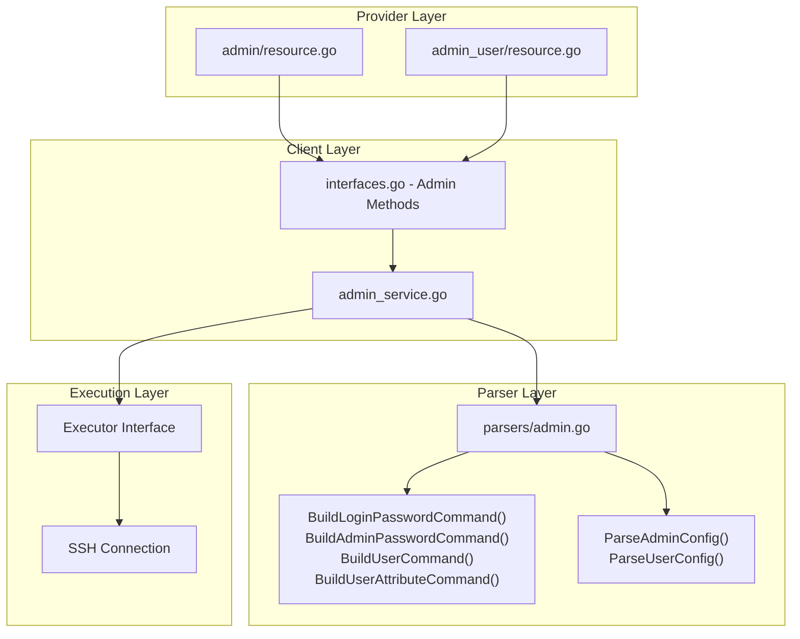
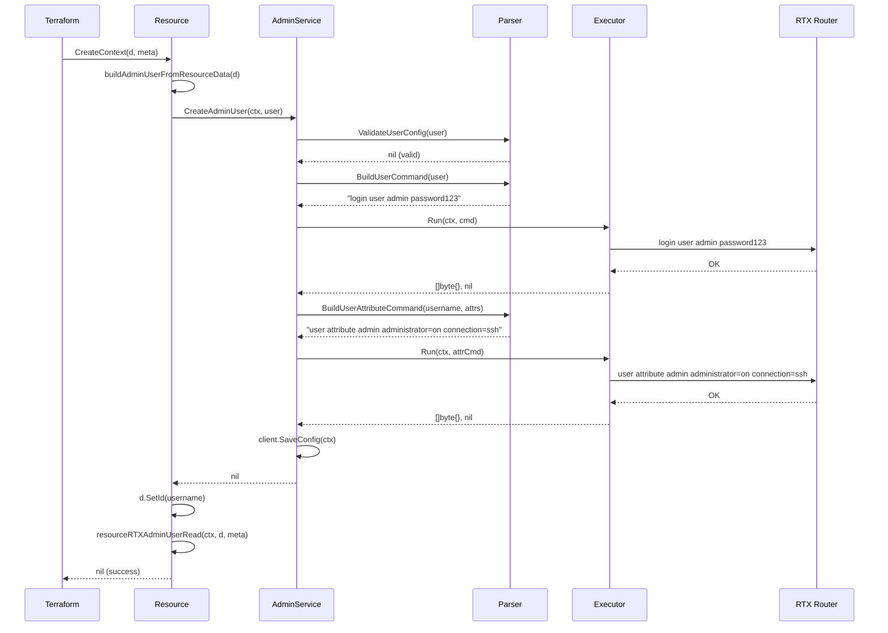
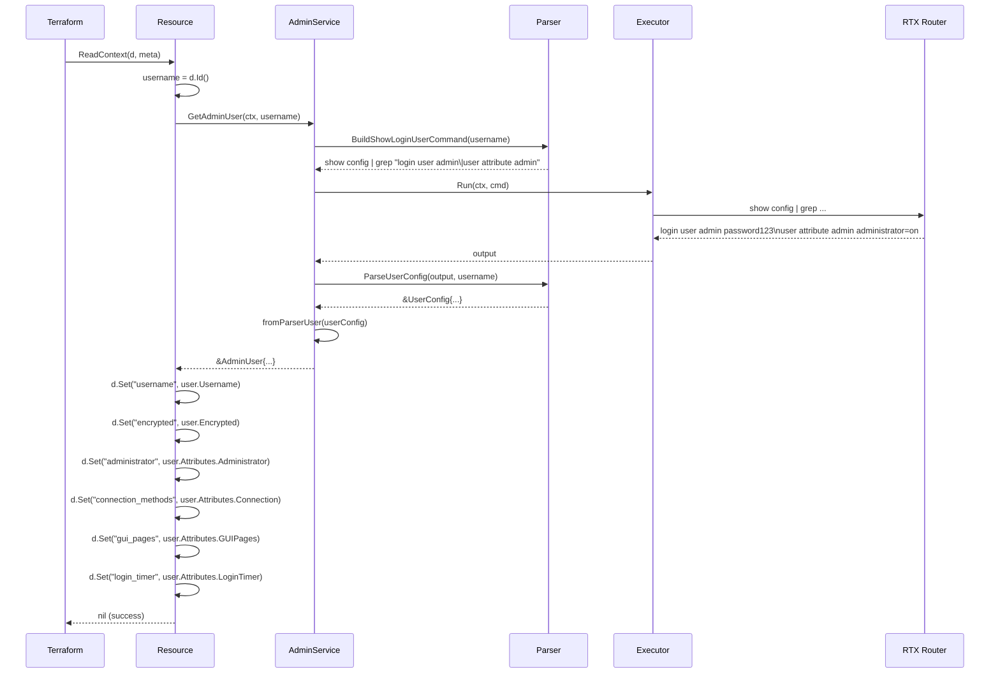

# Master Design: Admin Resources

## Overview

Admin resources provide Terraform management for RTX router authentication and user access control. The implementation follows the standard three-layer architecture (Provider -> Client -> Parser) used throughout the terraform-provider-rtx project.

## Resources Covered

### 1. rtx_admin

| Attribute | Value |
|-----------|-------|
| Resource Name | `rtx_admin` |
| Service File | `internal/client/admin_service.go` |
| Parser File | `internal/rtx/parsers/admin.go` |
| Resource Directory | `internal/provider/resources/admin/` |

### 2. rtx_admin_user

| Attribute | Value |
|-----------|-------|
| Resource Name | `rtx_admin_user` |
| Service File | `internal/client/admin_service.go` |
| Parser File | `internal/rtx/parsers/admin.go` |
| Resource Directory | `internal/provider/resources/admin_user/` |

---

## Steering Document Alignment

### Technical Standards (tech.md)
- Uses **Terraform Plugin Framework** (NOT Plugin SDK v2)
- Follows Go idiomatic error handling patterns
- Implements context-aware operations with cancellation support
- Password fields marked as sensitive for security

### Project Structure (structure.md)
- Resources in `internal/provider/resources/{name}/` (resource.go + model.go pattern)
- Client services in `internal/client/`
- Parsers in `internal/rtx/parsers/`
- Tests co-located with implementation files

---

## Code Reuse Analysis

### Existing Components to Leverage
- **Executor Interface**: Used for command execution via SSH
- **rtxClient**: Provides `SaveConfig()` for configuration persistence
- **SanitizeCommandForLog()**: Used for safe password logging

### Integration Points
- **Client Interface**: Extended with admin-related methods in `interfaces.go`
- **Provider Registration**: Resources registered in provider schema

---

## Architecture

The admin resources follow the standard three-layer architecture with clear separation of concerns.



### Modular Design Principles

- **Single File Responsibility**: Each file handles one specific concern
  - `resource_rtx_admin.go`: Singleton password resource
  - `resource_rtx_admin_user.go`: User collection resource
  - `admin_service.go`: All admin CRUD operations
  - `admin.go`: All parsing and command building

- **Component Isolation**: Service layer decoupled from provider layer
- **Service Layer Separation**: Parser handles data transformation, Service handles business logic
- **Utility Modularity**: Command builders and parsers are separate functions

---

## Components and Interfaces

### Component 1: AdminService (`internal/client/admin_service.go`)

**Purpose:** Handles all admin-related operations including password management and user CRUD.

**Interfaces:**
```go
type AdminService struct {
    executor Executor
    client   *rtxClient
}

// Password management (singleton)
func (s *AdminService) GetAdminConfig(ctx context.Context) (*AdminConfig, error)
func (s *AdminService) ConfigureAdmin(ctx context.Context, config AdminConfig) error
func (s *AdminService) UpdateAdminConfig(ctx context.Context, config AdminConfig) error
func (s *AdminService) ResetAdmin(ctx context.Context) error

// User management (collection)
func (s *AdminService) GetAdminUser(ctx context.Context, username string) (*AdminUser, error)
func (s *AdminService) CreateAdminUser(ctx context.Context, user AdminUser) error
func (s *AdminService) UpdateAdminUser(ctx context.Context, user AdminUser) error
func (s *AdminService) DeleteAdminUser(ctx context.Context, username string) error
func (s *AdminService) ListAdminUsers(ctx context.Context) ([]AdminUser, error)

// Internal conversion
func (s *AdminService) toParserUser(user AdminUser) parsers.UserConfig
func (s *AdminService) fromParserUser(pu parsers.UserConfig) AdminUser
```

**Dependencies:** Executor interface, rtxClient for SaveConfig

**Reuses:** Standard service pattern from other resources

### Component 2: AdminParser (`internal/rtx/parsers/admin.go`)

**Purpose:** Parses RTX router output and builds commands for admin configuration.

**Interfaces:**
```go
type AdminParser interface {
    ParseAdminConfig(raw string) (*AdminConfig, error)
    ParseUserConfig(raw string, username string) (*UserConfig, error)
}

// Command builders
func BuildLoginPasswordCommand(password string) string
func BuildAdminPasswordCommand(password string) string
func BuildUserCommand(user UserConfig) string
func BuildUserAttributeCommand(username string, attrs UserAttributes) string
func BuildDeleteUserCommand(username string) string
func BuildDeleteUserAttributeCommand(username string) string
func BuildShowLoginUserCommand(username string) string
func BuildShowAllUsersCommand() string

// Validation
func ValidateUserConfig(user UserConfig) error
```

**Dependencies:** None (pure functions)

**Reuses:** Standard regex parsing patterns

### Component 3: rtx_admin Resource (`internal/provider/resources/admin/`)

**Purpose:** Terraform resource definition for router-level password management.

**resource.go:**
```go
type AdminResource struct {
    client client.Client
}

func (r *AdminResource) Metadata(ctx context.Context, req resource.MetadataRequest, resp *resource.MetadataResponse)
func (r *AdminResource) Schema(ctx context.Context, req resource.SchemaRequest, resp *resource.SchemaResponse)
func (r *AdminResource) Configure(ctx context.Context, req resource.ConfigureRequest, resp *resource.ConfigureResponse)
func (r *AdminResource) Create(ctx context.Context, req resource.CreateRequest, resp *resource.CreateResponse)
func (r *AdminResource) Read(ctx context.Context, req resource.ReadRequest, resp *resource.ReadResponse)
func (r *AdminResource) Update(ctx context.Context, req resource.UpdateRequest, resp *resource.UpdateResponse)
func (r *AdminResource) Delete(ctx context.Context, req resource.DeleteRequest, resp *resource.DeleteResponse)
func (r *AdminResource) ImportState(ctx context.Context, req resource.ImportStateRequest, resp *resource.ImportStateResponse)
```

**model.go:**
```go
type AdminModel struct {
    LoginPassword types.String `tfsdk:"login_password"`
    AdminPassword types.String `tfsdk:"admin_password"`
}

func (m *AdminModel) ToClient() client.AdminConfig
func (m *AdminModel) FromClient(c *client.AdminConfig)
```

**Dependencies:** client.AdminConfig

### Component 4: rtx_admin_user Resource (`internal/provider/resources/admin_user/`)

**Purpose:** Terraform resource definition for user account management.

**resource.go:**
```go
type AdminUserResource struct {
    client client.Client
}

func (r *AdminUserResource) Metadata(ctx context.Context, req resource.MetadataRequest, resp *resource.MetadataResponse)
func (r *AdminUserResource) Schema(ctx context.Context, req resource.SchemaRequest, resp *resource.SchemaResponse)
func (r *AdminUserResource) Configure(ctx context.Context, req resource.ConfigureRequest, resp *resource.ConfigureResponse)
func (r *AdminUserResource) Create(ctx context.Context, req resource.CreateRequest, resp *resource.CreateResponse)
func (r *AdminUserResource) Read(ctx context.Context, req resource.ReadRequest, resp *resource.ReadResponse)
func (r *AdminUserResource) Update(ctx context.Context, req resource.UpdateRequest, resp *resource.UpdateResponse)
func (r *AdminUserResource) Delete(ctx context.Context, req resource.DeleteRequest, resp *resource.DeleteResponse)
func (r *AdminUserResource) ImportState(ctx context.Context, req resource.ImportStateRequest, resp *resource.ImportStateResponse)
```

**model.go:**
```go
type AdminUserModel struct {
    Username          types.String `tfsdk:"username"`
    Password          types.String `tfsdk:"password"`
    Encrypted         types.Bool   `tfsdk:"encrypted"`
    Administrator     types.Bool   `tfsdk:"administrator"`
    ConnectionMethods types.Set    `tfsdk:"connection_methods"`
    GUIPages          types.Set    `tfsdk:"gui_pages"`
    LoginTimer        types.Int64  `tfsdk:"login_timer"`
}

func (m *AdminUserModel) ToClient() client.AdminUser
func (m *AdminUserModel) FromClient(u *client.AdminUser)
```

**Dependencies:** client.AdminUser, client.AdminUserAttributes

### Component 5: Client Interface Extension (`internal/client/interfaces.go`)

**Purpose:** Defines Admin methods on the Client interface.

**Interfaces:**
```go
// Admin methods (singleton resource)
GetAdminConfig(ctx context.Context) (*AdminConfig, error)
ConfigureAdmin(ctx context.Context, config AdminConfig) error
UpdateAdminConfig(ctx context.Context, config AdminConfig) error
ResetAdmin(ctx context.Context) error

// Admin User methods
GetAdminUser(ctx context.Context, username string) (*AdminUser, error)
CreateAdminUser(ctx context.Context, user AdminUser) error
UpdateAdminUser(ctx context.Context, user AdminUser) error
DeleteAdminUser(ctx context.Context, username string) error
ListAdminUsers(ctx context.Context) ([]AdminUser, error)
```

---

## Data Models

### AdminConfig (Password Configuration)

```go
// AdminConfig represents the admin configuration on an RTX router
type AdminConfig struct {
    LoginPassword string `json:"login_password"` // Login password (sensitive)
    AdminPassword string `json:"admin_password"` // Administrator password (sensitive)
}
```

### AdminUser (User Account)

```go
// AdminUser represents a user account on an RTX router
type AdminUser struct {
    Username   string              `json:"username"`   // Username
    Password   string              `json:"password"`   // Password (sensitive)
    Encrypted  bool                `json:"encrypted"`  // Whether password is encrypted
    Attributes AdminUserAttributes `json:"attributes"` // User attributes
}

// AdminUserAttributes represents user attribute configuration
type AdminUserAttributes struct {
    Administrator bool     `json:"administrator"` // Administrator privileges
    Connection    []string `json:"connection"`    // Allowed connection types
    GUIPages      []string `json:"gui_pages"`     // Allowed GUI pages
    LoginTimer    int      `json:"login_timer"`   // Login timeout in seconds
}
```

### Parser Data Models

```go
// AdminConfig (parser layer - includes Users for parsing)
type AdminConfig struct {
    LoginPassword string       `json:"login_password"`
    AdminPassword string       `json:"admin_password"`
    Users         []UserConfig `json:"users"`
}

// UserConfig (parser layer)
type UserConfig struct {
    Username   string         `json:"username"`
    Password   string         `json:"password"`
    Encrypted  bool           `json:"encrypted"`
    Attributes UserAttributes `json:"attributes"`
}

// UserAttributes (parser layer)
type UserAttributes struct {
    Administrator bool     `json:"administrator"`
    Connection    []string `json:"connection"`
    GUIPages      []string `json:"gui_pages"`
    LoginTimer    int      `json:"login_timer"`
}
```

### Terraform Schema

#### rtx_admin

```hcl
resource "rtx_admin" "main" {
  login_password = string  # Optional, Sensitive
  admin_password = string  # Optional, Sensitive
}
```

#### rtx_admin_user

```hcl
resource "rtx_admin_user" "example" {
  username           = string      # Required, ForceNew
  password           = string      # Optional, Sensitive (required for create)
  encrypted          = bool        # Optional, Computed
  administrator      = bool        # Optional, Computed
  connection_methods = set(string) # Optional, values: serial/telnet/remote/ssh/sftp/http
  gui_pages          = set(string) # Optional, values: dashboard/lan-map/config
  login_timer        = number      # Optional, Computed, >= 0
}
```

---

## RTX Command Mapping

### Set Login Password

```
login password <password>
```

Example: `login password mySecurePassword123`

### Set Administrator Password

```
administrator password <password>
```

Example: `administrator password adminPass456`

### Remove Login Password

```
no login password
```

### Remove Administrator Password

```
no administrator password
```

### Create User (Plaintext)

```
login user <username> <password>
```

Example: `login user admin password123`

### Create User (Encrypted)

```
login user <username> encrypted <hash>
```

Example: `login user admin encrypted $1$abcdef123456`

### Set User Attributes

```
user attribute <username> administrator=on|off [connection=<types>] [gui-page=<pages>] [login-timer=<seconds>]
```

Example: `user attribute admin administrator=on connection=ssh,telnet gui-page=dashboard,config login-timer=3600`

### Delete User

```
no login user <username>
```

Example: `no login user guest`

### Delete User Attributes

```
no user attribute <username>
```

Example: `no user attribute guest`

### Show User Configuration

```
# Note: RTX routers do not support grep \| OR operator
# Use separate grep commands instead
show config | grep "login user <username>"
show config | grep "user attribute <username>"
```

### Show All Users

```
# Note: RTX routers do not support grep \| OR operator
show config | grep "login user"
show config | grep "user attribute"
```

---

## Error Handling

### Error Scenarios

1. **Command Execution Failure**
   - **Handling:** Returns error with command output
   - **User Impact:** `Failed to configure admin: <error>`

2. **Configuration Save Failure**
   - **Handling:** Returns error indicating partial success
   - **User Impact:** `admin config set but failed to save configuration: <error>`

3. **User Not Found (Read)**
   - **Handling:** Sets resource ID to empty, removes from state
   - **User Impact:** Resource will be recreated on next apply

4. **User Not Found (Delete)**
   - **Handling:** Ignores error, returns success
   - **User Impact:** None (idempotent deletion)

5. **Validation Error (Create/Update)**
   - **Handling:** Returns validation error before command execution
   - **User Impact:** `invalid user config: <validation message>`

6. **Context Cancellation**
   - **Handling:** Returns context error immediately
   - **User Impact:** Operation cancelled

### Error Messages

| Scenario | Error Message |
|----------|---------------|
| Set login password failed | `failed to set login password: <error>` |
| Set admin password failed | `failed to set administrator password: <error>` |
| Save failed | `admin config set but failed to save configuration: <error>` |
| Get user failed | `failed to get admin user: <error>` |
| Create user failed | `failed to create admin user: <error>` |
| Set attributes failed | `failed to set user attributes: <error>` |
| Update failed | `failed to update admin user: <error>` |
| Delete failed | `failed to delete admin user: <error>` |
| Parse failed | `failed to parse admin user: <error>` |
| Invalid username | `username is required` / `username must start with a letter` |
| Invalid password | `password is required` |
| Invalid connection | `invalid connection type: <type>` |
| Invalid GUI page | `invalid GUI page: <page>` |
| Invalid timer | `login timer cannot be negative` |

---

## Testing Strategy

### Unit Testing

#### Parser Tests (`admin_test.go`)

- **ParseAdminConfig**: Tests parsing of various user configurations
  - Single user with plaintext password
  - User with encrypted password
  - Multiple users
  - User with all connection types
  - Empty config
  - User with login-timer variations
  - User with gui-page variations

- **ParseUserConfig**: Tests finding specific user
  - Find existing user
  - User not found error

- **Command Builders**:
  - BuildLoginPasswordCommand
  - BuildAdminPasswordCommand
  - BuildUserCommand (plaintext and encrypted)
  - BuildUserAttributeCommand (various attribute combinations)
  - BuildDeleteUserCommand
  - BuildDeleteUserAttributeCommand

- **ValidateUserConfig**: Tests validation rules
  - Valid user
  - Empty username
  - Empty password
  - Invalid username format
  - Invalid connection type
  - Invalid GUI page
  - Negative login timer

- **parseUserAttributeString**: Tests attribute parsing
  - login-timer only
  - gui-page only
  - All attributes
  - Attributes in different order
  - connection=none / gui-page=none

#### Service Tests (`admin_service_test.go`)

- **GetAdminConfig**: Verifies empty config returned (passwords not readable)
- **ConfigureAdmin**: Tests password setting
  - Both passwords
  - Only login password
  - Only admin password
  - Empty config
- **GetAdminUser**: Tests user retrieval
  - Existing user
  - User not found
- **CreateAdminUser**: Tests user creation
  - Basic user
  - Admin user with attributes
  - User with encrypted password
  - Invalid username
  - Invalid password
- **UpdateAdminUser**: Tests user update
- **DeleteAdminUser**: Tests user deletion
- **ListAdminUsers**: Tests listing all users

### Integration Testing

#### Resource Tests (`resource_rtx_admin_test.go`)

- **Schema Validation**:
  - login_password: TypeString, Optional, Sensitive
  - admin_password: TypeString, Optional, Sensitive
- **CRUD Functions Exist**: CreateContext, ReadContext, UpdateContext, DeleteContext
- **Importer**: StateContext defined

#### Resource Tests (`resource_rtx_admin_user_test.go`)

- **Schema Validation**:
  - username: TypeString, Required, ForceNew
  - password: TypeString, Optional, Sensitive
  - encrypted: TypeBool, Optional, Computed
  - administrator: TypeBool, Optional, Computed
  - connection_methods: TypeSet, Optional
  - gui_pages: TypeSet, Optional
  - login_timer: TypeInt, Optional, Computed
- **CRUD Functions Exist**: CreateContext, ReadContext, UpdateContext, DeleteContext
- **Importer**: StateContext defined
- **validateUsername**: Tests username validation rules

### End-to-End Testing

- **Acceptance Tests** (with real RTX router):
  - Create admin configuration with both passwords
  - Update admin password only
  - Delete admin configuration
  - Import existing admin configuration
  - Create user with minimal attributes
  - Create user with full attributes
  - Update user attributes
  - Delete user
  - Import existing user

---

## File Structure

```
internal/
├── provider/
│   └── resources/
│       ├── admin/
│       │   ├── resource.go             # Singleton password resource implementation
│       │   └── model.go                # Data model with ToClient/FromClient
│       └── admin_user/
│           ├── resource.go             # User collection resource implementation
│           └── model.go                # Data model with ToClient/FromClient
├── client/
│   ├── interfaces.go                   # AdminConfig, AdminUser types + interface methods
│   ├── client.go                       # Service initialization
│   ├── admin_service.go                # Admin CRUD operations
│   └── admin_service_test.go           # Service unit tests
└── rtx/
    └── parsers/
        ├── admin.go                    # Parser and command builders
        └── admin_test.go               # Parser and validation tests
```

---

## Implementation Notes

1. **Singleton Pattern**: `rtx_admin` uses fixed ID `admin` to ensure only one instance exists per router

2. **Password Security**: Passwords cannot be read from router; they are stored in Terraform state and must be provided in configuration after import

3. **Encrypted Password Support**: Users can be created with pre-hashed passwords by setting `encrypted=true`

4. **Attribute Command Ordering**: User attributes are set in a specific order: `administrator`, `connection`, `gui-page`, `login-timer`

5. **Delete Order**: When deleting a user, attributes are deleted first (`no user attribute`), then the user (`no login user`)

6. **Error Tolerance**: Delete operations ignore "not found" errors for idempotency

7. **Computed Fields**: `encrypted`, `administrator`, and `login_timer` are computed to support import scenarios where values are read from router

8. **ForceNew on Username**: Changing username forces resource recreation since username is the identity

9. **Set vs List**: `connection_methods` and `gui_pages` use TypeSet to avoid ordering issues

10. **Validation Levels**: Username validation occurs both at schema level (ValidateFunc) and parser level (ValidateUserConfig)

11. **RTX Grep Compatibility**: RTX routers do not support the `\|` OR operator in grep patterns. Commands use separate grep calls instead of combined patterns.

12. **Attribute-Only Updates**: For imported users where password may not be known, `ValidateUserConfigForAttributeUpdate()` allows updating only attributes without requiring a password. This enables managing attributes of imported users that have encrypted passwords.

---

## State Handling

- Persist only configuration attributes in Terraform state
- Passwords stored in state (cannot be read from router for security)
- All other attributes (encrypted, administrator, connection_methods, gui_pages, login_timer) readable from router
- Operational/runtime status must not be stored in state

### State Attributes

| Attribute | Stored | Readable from Router | Notes |
|-----------|--------|---------------------|-------|
| `login_password` | Yes | No | Security - not displayed |
| `admin_password` | Yes | No | Security - not displayed |
| `username` | Yes | Yes | From `login user` line |
| `password` | Yes | No | Security - not displayed |
| `encrypted` | Yes | Yes | From `encrypted` keyword |
| `administrator` | Yes | Yes | From `administrator=` |
| `connection_methods` | Yes | Yes | From `connection=` |
| `gui_pages` | Yes | Yes | From `gui-page=` |
| `login_timer` | Yes | Yes | From `login-timer=` |

---

## Sequence Diagrams

### Create Admin User



### Read Admin User



---

## Change History

| Date | Source Spec | Changes |
|------|-------------|---------|
| 2026-01-23 | Implementation Analysis | Initial master design created from implementation code |
| 2026-01-23 | terraform-plan-differences-fix | RTX grep compatibility (no OR operator); documented attribute-only updates for imported users |
| 2026-02-01 | Implementation Audit | Update to Plugin Framework |
| 2026-02-01 | Structure Sync | Updated file paths to resources/{name}/ modular structure |
