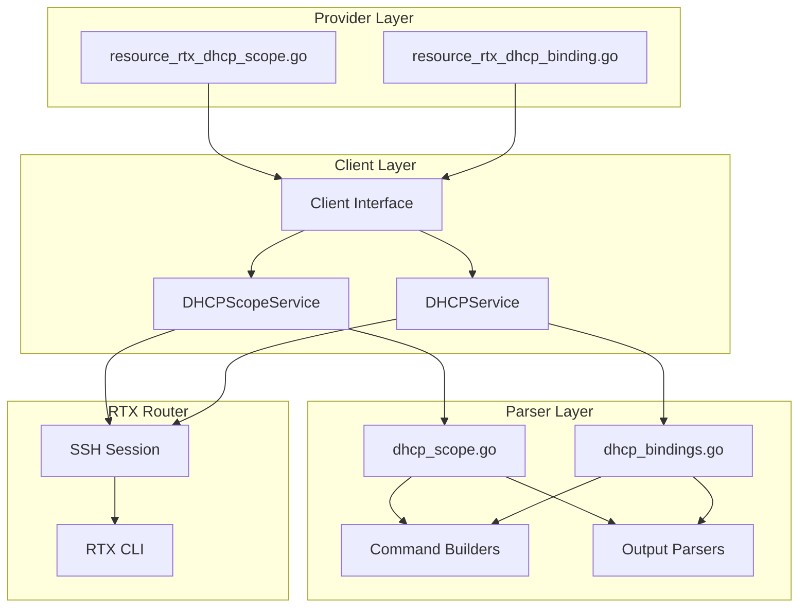
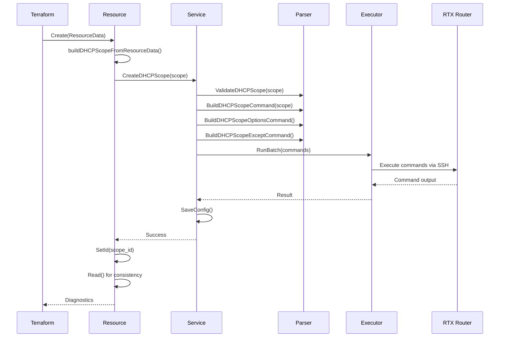

# Master Design: DHCP Resources

## Overview

The DHCP resources (`rtx_dhcp_scope` and `rtx_dhcp_binding`) implement complete DHCP server management for Yamaha RTX routers through Terraform. The implementation follows a three-layer architecture: Provider Layer (Terraform integration), Client Layer (service abstraction), and Parser Layer (RTX CLI handling).

## Resource Summary

| Attribute | Value |
|-----------|-------|
| Resource Names | `rtx_dhcp_scope`, `rtx_dhcp_binding` |
| Service Files | `internal/client/dhcp_scope_service.go`, `internal/client/dhcp_service.go` |
| Parser Files | `internal/rtx/parsers/dhcp_scope.go`, `internal/rtx/parsers/dhcp_bindings.go` |
| Resource Files | `internal/provider/resource_rtx_dhcp_scope.go`, `internal/provider/resource_rtx_dhcp_binding.go` |
| Last Updated | 2026-01-23 |
| Source Specs | Implementation code analysis |

## Steering Document Alignment

### Technical Standards (tech.md)
- Uses **Terraform Plugin Framework** (NOT terraform-plugin-sdk/v2)
- Follows Go 1.23 module patterns
- SSH-based communication with RTX routers
- Stateless SSH sessions (new connection per operation)
- Configuration persisted to router memory after each operation

### Project Structure (structure.md)
- Provider resources in `internal/provider/`
- Client services in `internal/client/`
- RTX parsers in `internal/rtx/parsers/`
- Clear separation between layers

## Code Reuse Analysis

### Existing Components to Leverage
- **Executor Interface**: Used by services for command execution
- **Client Interface**: Extended with DHCP methods
- **SaveConfig**: Reused for persistent configuration
- **Validation Helpers**: Standard IP/CIDR validation functions

### Integration Points
- **SSH Session**: Shared SSH connection management
- **Logging**: Structured logging via `logging.FromContext()`
- **Terraform State**: Standard SDK state management

---

# Architecture

## Layer Architecture



## Data Flow

### Create Operation Flow



---

# Component Designs

## Component 1: DHCPScopeService (`internal/client/dhcp_scope_service.go`)

### Purpose
Handles DHCP scope CRUD operations, coordinating between Terraform resources and RTX CLI commands.

### Interfaces
```go
type DHCPScopeService struct {
    executor Executor
    client   *rtxClient
}

func NewDHCPScopeService(executor Executor, client *rtxClient) *DHCPScopeService

func (s *DHCPScopeService) CreateScope(ctx context.Context, scope DHCPScope) error
func (s *DHCPScopeService) GetScope(ctx context.Context, scopeID int) (*DHCPScope, error)
func (s *DHCPScopeService) UpdateScope(ctx context.Context, scope DHCPScope) error
func (s *DHCPScopeService) DeleteScope(ctx context.Context, scopeID int) error
func (s *DHCPScopeService) ListScopes(ctx context.Context) ([]DHCPScope, error)
```

### Dependencies
- `Executor`: For running SSH commands
- `rtxClient`: For SaveConfig operations
- `parsers`: For command building and output parsing

### Key Implementation Details
1. **Batch Command Execution**: Create/Update operations batch multiple commands for efficiency
2. **Differential Updates**: Exclusion range updates only add/remove changed ranges
3. **Context Cancellation**: Checks context before expensive operations
4. **Type Conversion**: Converts between client.DHCPScope and parsers.DHCPScope

## Component 2: DHCPService (`internal/client/dhcp_service.go`)

### Purpose
Handles DHCP binding CRUD operations for static IP reservations.

### Interfaces
```go
type DHCPService struct {
    executor Executor
    client   *rtxClient
}

func NewDHCPService(executor Executor, client *rtxClient) *DHCPService

func (s *DHCPService) CreateBinding(ctx context.Context, binding DHCPBinding) error
func (s *DHCPService) DeleteBinding(ctx context.Context, scopeID int, ipAddress string) error
func (s *DHCPService) ListBindings(ctx context.Context, scopeID int) ([]DHCPBinding, error)
```

### Dependencies
- `Executor`: For running SSH commands
- `rtxClient`: For SaveConfig operations
- `parsers`: For command building and output parsing

### Key Implementation Details
1. **Validation**: Validates binding parameters including client identifier format
2. **Error Detection**: Checks command output for error patterns
3. **No Update Operation**: Bindings are immutable (ForceNew for all attributes)

## Component 3: DHCP Scope Parser (`internal/rtx/parsers/dhcp_scope.go`)

### Purpose
Parses RTX router DHCP scope output and builds RTX CLI commands.

### Data Structures
```go
type DHCPScope struct {
    ScopeID       int              `json:"scope_id"`
    Network       string           `json:"network"`
    RangeStart    string           `json:"range_start,omitempty"`
    RangeEnd      string           `json:"range_end,omitempty"`
    LeaseTime     string           `json:"lease_time,omitempty"`
    ExcludeRanges []ExcludeRange   `json:"exclude_ranges,omitempty"`
    Options       DHCPScopeOptions `json:"options,omitempty"`
}

type DHCPScopeOptions struct {
    DNSServers []string `json:"dns_servers,omitempty"`
    Routers    []string `json:"routers,omitempty"`
    DomainName string   `json:"domain_name,omitempty"`
}

type ExcludeRange struct {
    Start string `json:"start"`
    End   string `json:"end"`
}
```

### Command Builders
```go
func BuildDHCPScopeCommand(scope DHCPScope) string
func BuildDHCPScopeOptionsCommand(scopeID int, opts DHCPScopeOptions) string
func BuildDHCPScopeExceptCommand(scopeID int, excludeRange ExcludeRange) string
func BuildDeleteDHCPScopeCommand(scopeID int) string
func BuildDeleteDHCPScopeOptionsCommand(scopeID int) string
func BuildDeleteDHCPScopeExceptCommand(scopeID int, excludeRange ExcludeRange) string
func BuildShowDHCPScopeCommand(scopeID int) string
func BuildShowAllDHCPScopesCommand() string
```

### Output Parsers
```go
type DHCPScopeParser struct{}

func NewDHCPScopeParser() *DHCPScopeParser
func (p *DHCPScopeParser) ParseScopeConfig(raw string) ([]DHCPScope, error)
func (p *DHCPScopeParser) ParseSingleScope(raw string, scopeID int) (*DHCPScope, error)
```

### Validation
```go
func ValidateDHCPScope(scope DHCPScope) error
```

### Supported Input Formats
1. **Basic scope**: `dhcp scope 1 192.168.1.0/24`
2. **Scope with gateway (legacy)**: `dhcp scope 1 192.168.1.0/24 gateway 192.168.1.1`
3. **Scope with expire only**: `dhcp scope 1 192.168.0.0/16 expire 24:00`
4. **IP range format**: `dhcp scope 1 192.168.1.20-192.168.1.99/16 gateway 192.168.1.253 expire 12:00`
5. **Options line**: `dhcp scope option 1 dns=8.8.8.8,8.8.4.4 router=192.168.1.1 domain=example.com`
6. **Exclusion line**: `dhcp scope 1 except 192.168.1.1-192.168.1.10`

### Lease Time Conversion
```go
// Go duration to RTX format
func convertGoLeaseTimeToRTX(goDuration string) string
// "72h" -> "72:00"
// "30m" -> "0:30"
// "infinite" -> "infinite"

// RTX format to Go duration
func convertRTXLeaseTimeToGo(rtxTime string) string
// "72:00" -> "72h"
// "24:00" -> "24h"
// "infinite" -> "infinite"
```

## Component 4: DHCP Bindings Parser (`internal/rtx/parsers/dhcp_bindings.go`)

### Purpose
Parses RTX router DHCP binding output and builds binding commands.

### Data Structures
```go
type DHCPBinding struct {
    ScopeID             int    `json:"scope_id"`
    IPAddress           string `json:"ip_address"`
    MACAddress          string `json:"mac_address"`
    ClientIdentifier    string `json:"client_identifier,omitempty"`
    UseClientIdentifier bool   `json:"use_client_identifier"`
}
```

### Command Builders
```go
func BuildDHCPBindCommand(binding DHCPBinding) string
func BuildDHCPUnbindCommand(scopeID int, ipAddress string) error
func BuildShowDHCPBindingsCommand(scopeID int) string
func BuildDHCPBindCommandWithValidation(binding DHCPBinding) (string, error)
```

### Output Parsers
```go
type DHCPBindingsParser interface {
    ParseBindings(raw string, scopeID int) ([]DHCPBinding, error)
}

func NewDHCPBindingsParser() DHCPBindingsParser
```

### MAC Address Normalization
```go
func NormalizeMACAddress(mac string) (string, error)
// "001122334455" -> "00:11:22:33:44:55"
// "00-11-22-33-44-55" -> "00:11:22:33:44:55"
// "00:AA:BB:CC:DD:EE" -> "00:aa:bb:cc:dd:ee"
```

### Supported Input Formats
1. **RTX830 format**: `192.168.1.100    00:11:22:33:44:55`
2. **RTX830 ethernet**: `192.168.1.110    ethernet 00:12:34:56:78:90`
3. **RTX1210 format**: `192.168.1.50     00:a0:c5:12:34:56   MAC`
4. **Config format colon**: `dhcp scope bind 1 192.168.1.28 24:59:e5:54:5e:5a`
5. **Config format space**: `dhcp scope bind 1 192.168.1.20 01 00 30 93 11 0e 33`
6. **Config format ethernet**: `dhcp scope bind 1 192.168.1.23 ethernet b6:1a:27:ea:28:29`

## Component 5: Terraform DHCP Scope Resource (`internal/provider/resource_rtx_dhcp_scope.go`)

### Purpose
Terraform resource definition implementing DHCP scope CRUD lifecycle.

### Schema Definition
```go
func resourceRTXDHCPScope() *schema.Resource
```

| Attribute | Type | Required | ForceNew | Description |
|-----------|------|----------|----------|-------------|
| `scope_id` | Int | Yes | Yes | DHCP scope ID (>= 1) |
| `network` | String | Yes | Yes | Network in CIDR notation |
| `range_start` | String | No | No | Start of allocation range (computed) |
| `range_end` | String | No | No | End of allocation range (computed) |
| `lease_time` | String | No | No | Lease duration (Go format or "infinite") |
| `exclude_ranges` | List | No | No | IP ranges to exclude |
| `exclude_ranges.start` | String | Yes | - | Start IP of exclusion |
| `exclude_ranges.end` | String | Yes | - | End IP of exclusion |
| `options` | List(1) | No | No | DHCP options block |
| `options.routers` | List(3) | No | - | Default gateway IPs |
| `options.dns_servers` | List(3) | No | - | DNS server IPs |
| `options.domain_name` | String | No | - | DNS domain name |

### CRUD Functions
```go
func resourceRTXDHCPScopeCreate(ctx context.Context, d *schema.ResourceData, meta interface{}) diag.Diagnostics
func resourceRTXDHCPScopeRead(ctx context.Context, d *schema.ResourceData, meta interface{}) diag.Diagnostics
func resourceRTXDHCPScopeUpdate(ctx context.Context, d *schema.ResourceData, meta interface{}) diag.Diagnostics
func resourceRTXDHCPScopeDelete(ctx context.Context, d *schema.ResourceData, meta interface{}) diag.Diagnostics
func resourceRTXDHCPScopeImport(ctx context.Context, d *schema.ResourceData, meta interface{}) ([]*schema.ResourceData, error)
```

### Validation Functions
```go
func validateCIDR(v interface{}, k string) ([]string, []error)
func validateIPAddress(v interface{}, k string) ([]string, []error)
func validateLeaseTime(v interface{}, k string) ([]string, []error)
```

## Component 6: Terraform DHCP Binding Resource (`internal/provider/resource_rtx_dhcp_binding.go`)

### Purpose
Terraform resource definition implementing DHCP binding CRUD lifecycle.

### Schema Definition
```go
func resourceRTXDHCPBinding() *schema.Resource
```

| Attribute | Type | Required | ForceNew | Description |
|-----------|------|----------|----------|-------------|
| `scope_id` | Int | Yes | Yes | Parent scope ID |
| `ip_address` | String | Yes | Yes | IP address to reserve |
| `mac_address` | String | Optional | Yes | Device MAC address |
| `use_mac_as_client_id` | Bool | Optional | Yes | Use ethernet prefix |
| `client_identifier` | String | Optional | Yes | Custom client identifier |
| `hostname` | String | Optional | Yes | Device hostname (Terraform-only, not sent to router) |
| `description` | String | Optional | Yes | Binding description (Terraform-only, not sent to router) |

### Conflicts Configuration
- `mac_address` conflicts with `client_identifier`
- `use_mac_as_client_id` requires `mac_address`
- `use_mac_as_client_id` conflicts with `client_identifier`

### CRUD Functions
```go
func resourceRTXDHCPBindingCreate(ctx context.Context, d *schema.ResourceData, meta interface{}) diag.Diagnostics
func resourceRTXDHCPBindingRead(ctx context.Context, d *schema.ResourceData, meta interface{}) diag.Diagnostics
func resourceRTXDHCPBindingDelete(ctx context.Context, d *schema.ResourceData, meta interface{}) diag.Diagnostics
func resourceRTXDHCPBindingImport(ctx context.Context, d *schema.ResourceData, meta interface{}) ([]*schema.ResourceData, error)
```

Note: No Update function - all attributes are ForceNew.

### Custom Validation (CustomizeDiff)
```go
func validateClientIdentification(ctx context.Context, d *schema.ResourceDiff, meta interface{}) error
```

### Helper Functions
```go
func parseDHCPBindingID(id string) (int, string, error)
func normalizeIPAddress(val interface{}) string
func normalizeMACAddress(val interface{}) string
func normalizeClientIdentifier(val interface{}) string
func normalizeMACAddressParser(mac string) (string, error)
func validateClientIdentifierFormat(v interface{}, k string) ([]string, []error)
```

---

# Data Models

## DHCPScope (Client Layer)

```go
// internal/client/interfaces.go
type DHCPScope struct {
    ScopeID       int              `json:"scope_id"`
    Network       string           `json:"network"`
    RangeStart    string           `json:"range_start,omitempty"`
    RangeEnd      string           `json:"range_end,omitempty"`
    LeaseTime     string           `json:"lease_time,omitempty"`
    ExcludeRanges []ExcludeRange   `json:"exclude_ranges,omitempty"`
    Options       DHCPScopeOptions `json:"options,omitempty"`
}

type DHCPScopeOptions struct {
    DNSServers []string `json:"dns_servers,omitempty"`
    Routers    []string `json:"routers,omitempty"`
    DomainName string   `json:"domain_name,omitempty"`
}

type ExcludeRange struct {
    Start string `json:"start"`
    End   string `json:"end"`
}
```

## DHCPBinding (Client Layer)

```go
// internal/client/interfaces.go
type DHCPBinding struct {
    ScopeID             int    `json:"scope_id"`
    IPAddress           string `json:"ip_address"`
    MACAddress          string `json:"mac_address"`
    ClientIdentifier    string `json:"client_identifier,omitempty"`
    UseClientIdentifier bool   `json:"use_client_identifier"`
}
```

---

# RTX Command Mapping

## DHCP Scope Commands

### Create Scope
```
dhcp scope <id> <network>/<prefix> [expire <time>]
```
Example: `dhcp scope 1 192.168.1.0/24 expire 72:00`

### Configure Options
```
dhcp scope option <id> [dns=<ip1>,<ip2>] [router=<ip1>,<ip2>] [domain=<name>]
```
Example: `dhcp scope option 1 dns=8.8.8.8,8.8.4.4 router=192.168.1.1 domain=example.local`

### Add Exclusion Range
```
dhcp scope <id> except <start_ip>-<end_ip>
```
Example: `dhcp scope 1 except 192.168.1.1-192.168.1.10`

### Delete Exclusion Range
```
no dhcp scope <id> except <start_ip>-<end_ip>
```
Example: `no dhcp scope 1 except 192.168.1.1-192.168.1.10`

### Delete Options
```
no dhcp scope option <id>
```
Example: `no dhcp scope option 1`

### Delete Scope
```
no dhcp scope <id>
```
Example: `no dhcp scope 1`

### Show Configuration
```
show config | grep "dhcp scope"
```

## DHCP Binding Commands

### Create Binding (MAC only)
```
dhcp scope bind <scope_id> <ip_address> <mac_address>
```
Example: `dhcp scope bind 1 192.168.1.100 00:11:22:33:44:55`

### Create Binding (ethernet/client-id mode)
```
dhcp scope bind <scope_id> <ip_address> ethernet <mac_address>
```
Example: `dhcp scope bind 1 192.168.1.100 ethernet 00:11:22:33:44:55`

### Create Binding (custom client identifier)
```
dhcp scope bind <scope_id> <ip_address> client-id <type:hex:hex:...>
```
Example: `dhcp scope bind 1 192.168.1.100 client-id 01:00:11:22:33:44:55`

### Delete Binding
```
no dhcp scope bind <scope_id> <ip_address>
```
Example: `no dhcp scope bind 1 192.168.1.100`

### Show Bindings
```
show config | grep "dhcp scope bind <scope_id>"
```

---

# Error Handling

## Error Scenarios

### 1. Invalid Scope ID
- **Condition**: scope_id < 1
- **Handling**: Validation error at plan time
- **User Impact**: `scope_id must be positive`

### 2. Invalid Network Format
- **Condition**: Network not in CIDR notation
- **Handling**: Validation error at plan time
- **User Impact**: `network must be a valid CIDR notation (e.g., '192.168.1.0/24')`

### 3. Too Many DNS Servers
- **Condition**: More than 3 DNS servers specified
- **Handling**: Validation error at apply time
- **User Impact**: `maximum 3 DNS servers allowed`

### 4. Scope Not Found
- **Condition**: Read/Delete on non-existent scope
- **Handling**: Resource removed from state (Read), silent success (Delete)
- **User Impact**: None for Delete; resource marked for recreation on next apply

### 5. Network Change Attempted
- **Condition**: Update tries to change network
- **Handling**: ForceNew triggers recreation
- **User Impact**: Resource destroyed and recreated

### 6. Invalid MAC Address Format
- **Condition**: MAC address not 12 hex digits
- **Handling**: Validation error
- **User Impact**: `MAC address must be 12 hex digits`

### 7. Missing Client Identification
- **Condition**: Neither mac_address nor client_identifier specified
- **Handling**: CustomizeDiff validation error
- **User Impact**: `exactly one of 'mac_address' or 'client_identifier' must be specified`

### 8. Conflicting Client Identification
- **Condition**: Both mac_address and client_identifier specified
- **Handling**: Schema ConflictsWith validation
- **User Impact**: `only one of 'mac_address' or 'client_identifier' can be specified`

### 9. Invalid Client Identifier Prefix
- **Condition**: Prefix not 01, 02, or FF
- **Handling**: Validation error
- **User Impact**: `client identifier prefix must be 01 (MAC), 02 (ASCII), or ff (vendor-specific)`

---

# Testing Strategy

## Unit Testing

### Parser Tests (`internal/rtx/parsers/dhcp_scope_test.go`)
- Parse basic scope definition
- Parse scope with gateway (legacy format)
- Parse scope with expire only
- Parse scope with IP range format
- Parse scope with DNS options
- Parse scope with router options
- Parse scope with exclusion ranges
- Parse full scope configuration
- Parse multiple scopes
- Handle empty input
- Build scope command
- Build options command
- Build exclusion command
- Validate scope configuration
- Test lease time conversion

### Parser Tests (`internal/rtx/parsers/dhcp_bindings_test.go`)
- Parse RTX830 format bindings
- Parse RTX1210 format bindings
- Parse config format (colon-separated MAC)
- Parse config format (space-separated MAC)
- Parse config format (ethernet prefix)
- Handle empty bindings
- Normalize MAC addresses

### Validation Tests (`internal/provider/dhcp_identifier_validate_test.go`)
- Test mac_address only
- Test client_identifier only
- Test both specified (error)
- Test neither specified (error)
- Test use_mac_as_client_id with mac_address
- Test use_mac_as_client_id with client_identifier (error)
- Test client identifier format validation
- Test client identifier prefix validation

## Service Tests

### DHCP Scope Service Tests (`internal/client/dhcp_scope_service_test.go`)
- Test CreateScope success
- Test CreateScope with options
- Test GetScope success
- Test GetScope not found
- Test UpdateScope success
- Test UpdateScope network change error
- Test DeleteScope success
- Test DeleteScope not found

### DHCP Service Tests (`internal/client/dhcp_service_test.go`)
- Test CreateBinding success
- Test CreateBinding with client identifier
- Test DeleteBinding success
- Test ListBindings success

## Integration Testing

### Resource Tests (`internal/provider/resource_rtx_dhcp_scope_test.go`)
- Test basic scope creation
- Test scope with options
- Test scope with exclusions
- Test scope import
- Test scope update
- Test scope destruction

### Resource Tests (`internal/provider/resource_rtx_dhcp_binding_test.go`)
- Test basic binding creation
- Test binding with use_mac_as_client_id
- Test binding with client_identifier
- Test binding import by MAC
- Test binding import by IP (legacy)
- Test binding destruction

## Acceptance Testing

### DHCP Scope Acceptance Tests (`internal/provider/resource_rtx_dhcp_scope_acc_test.go`)
- End-to-end scope creation on real router
- Verify configuration via SSH
- Test import from existing configuration
- Test update operations
- Test destroy cleanup

---

# File Structure

```
internal/
├── provider/
│   ├── resource_rtx_dhcp_scope.go           # Terraform DHCP scope resource
│   ├── resource_rtx_dhcp_scope_test.go      # Unit tests
│   ├── resource_rtx_dhcp_scope_acc_test.go  # Acceptance tests
│   ├── resource_rtx_dhcp_binding.go         # Terraform DHCP binding resource
│   ├── resource_rtx_dhcp_binding_test.go    # Unit tests
│   ├── dhcp_binding_schema_test.go          # Schema tests
│   └── dhcp_identifier_validate_test.go     # Validation tests
├── client/
│   ├── interfaces.go                         # DHCP types and Client interface
│   ├── client.go                             # Client implementation (DHCP methods)
│   ├── dhcp_scope_service.go                 # DHCP scope service
│   ├── dhcp_scope_service_test.go            # Service tests
│   ├── dhcp_service.go                       # DHCP binding service
│   └── dhcp_service_test.go                  # Service tests
└── rtx/
    └── parsers/
        ├── dhcp_scope.go                     # Scope parser and command builders
        ├── dhcp_scope_test.go                # Parser tests
        ├── dhcp_bindings.go                  # Binding parser and command builders
        ├── dhcp_bindings_test.go             # Parser tests
        └── dhcp_commands_test.go             # Command builder tests
```

---

# Implementation Notes

1. **Batch Command Execution**: DHCP scope creation batches multiple commands (scope, options, exclusions) to minimize SSH round-trips. This improves performance and reduces the window for partial failures.

2. **Differential Updates**: When updating exclusion ranges, the service compares old and new ranges to only execute necessary add/remove commands rather than deleting all and recreating.

3. **MAC Address Normalization**: All MAC addresses are normalized to lowercase colon-separated format in state functions to ensure consistent state matching regardless of input format.

4. **ID Format Migration**: DHCP binding supports both old format (`scope_id:ip_address`) and new format (`scope_id:mac_address`) for backward compatibility during migration.

5. **Client Identifier Types**: The implementation supports three DHCP client identifier types:
   - `01`: MAC-based (most common, same as ethernet prefix)
   - `02`: ASCII-based (hostname or other text converted to hex)
   - `FF`: Vendor-specific

6. **ForceNew Strategy**: DHCP bindings mark all attributes as ForceNew because RTX routers don't support modifying existing bindings - they must be deleted and recreated.

7. **Options Block MaxItems**: The `options` block has MaxItems=1 to ensure a single options configuration per scope, matching RTX router behavior.

8. **Lease Time Format Conversion**: Go duration format ("72h", "30m") is converted to RTX format ("72:00", "0:30") for commands and back for state.

9. **Network Address Calculation**: When parsing RTX output with IP range format (e.g., `192.168.1.20-192.168.1.99/16`), the network address is calculated from the range start IP and prefix length using bitwise AND operation. For example, `192.168.1.20/16` becomes network `192.168.0.0/16`.

10. **RTX Terminal Line Wrapping**: RTX router terminal output wraps at approximately 80 characters. Regex patterns use `.*$` instead of `\s*$` to handle trailing characters from line wrapping in multi-line output.

11. **Range Format Support**: The parser supports both CIDR notation (`192.168.1.0/24`) and IP range format (`192.168.1.20-192.168.1.99/16 gateway 192.168.1.253`). When range format is detected, `range_start` and `range_end` fields are populated.

---

# State Handling

- **DHCP Scope State**: Persists scope_id, network, lease_time, exclude_ranges, options
- **DHCP Binding State**: Persists scope_id, ip_address, mac_address, use_mac_as_client_id, client_identifier
- **Operational Data Excluded**: Current lease counts, active clients, lease expiration times
- **Resource IDs**:
  - Scope: `<scope_id>` (string representation of integer)
  - Binding: `<scope_id>:<normalized_mac_address>`

---

## Change History

| Date | Source Spec | Changes |
|------|-------------|---------|
| 2026-01-23 | Implementation analysis | Initial master design creation from implementation code |
| 2026-01-23 | terraform-plan-differences-fix | Added network address calculation from IP range; documented line wrapping handling; added range_start/range_end to data model |
| 2026-02-01 | Implementation Audit | Update to Plugin Framework, clarify hostname/description are Terraform-only |
