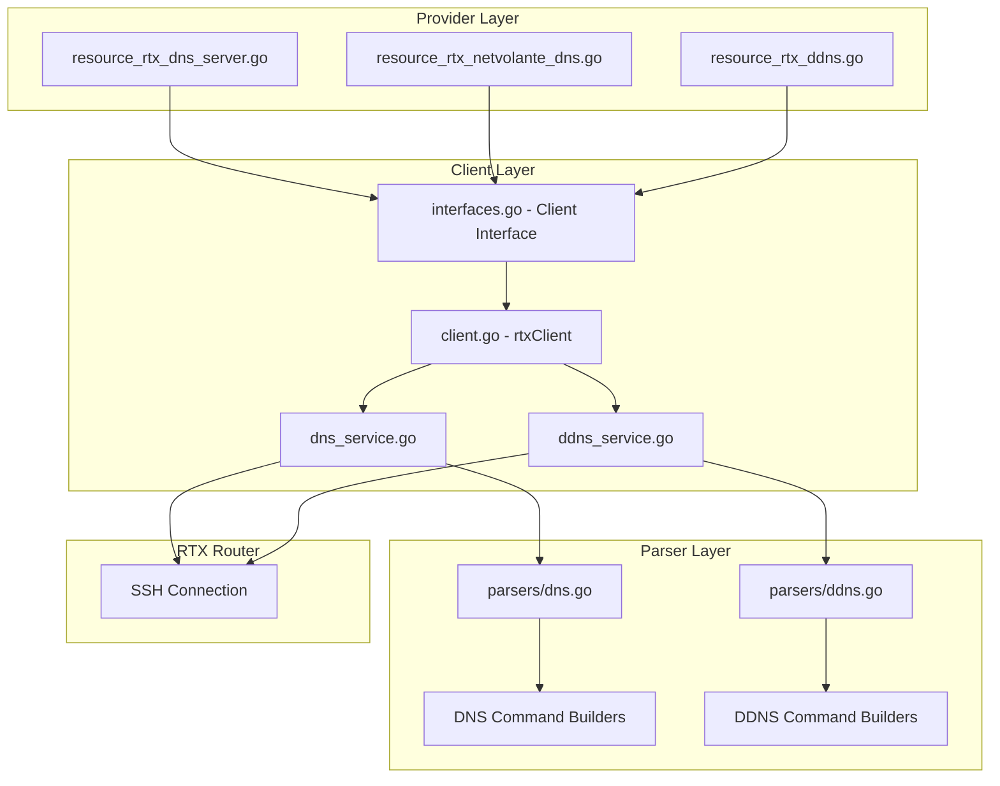

# Master Design: DNS Resources

## Overview

This document describes the design and implementation of DNS-related resources in the Terraform provider for Yamaha RTX routers. The implementation follows a three-layer architecture: Provider Layer (Terraform resource definitions), Client Layer (service abstraction), and Parser Layer (RTX command building/parsing).

## Resource Summary

| Resource | Service File | Parser File | Resource File |
|----------|--------------|-------------|---------------|
| rtx_dns_server | `internal/client/dns_service.go` | `internal/rtx/parsers/dns.go` | `internal/provider/resource_rtx_dns_server.go` |
| rtx_netvolante_dns | `internal/client/ddns_service.go` | `internal/rtx/parsers/ddns.go` | `internal/provider/resource_rtx_netvolante_dns.go` |
| rtx_ddns | `internal/client/ddns_service.go` | `internal/rtx/parsers/ddns.go` | `internal/provider/resource_rtx_ddns.go` |

## Steering Document Alignment

### Technical Standards (tech.md)

- Uses Terraform Plugin SDK v2 for resource definitions
- Follows Go project layout conventions
- Implements context-aware operations for cancellation support
- Uses structured logging with zerolog

### Project Structure (structure.md)

- Parser layer in `internal/rtx/parsers/` - RTX-specific command building and output parsing
- Service layer in `internal/client/` - High-level CRUD operations
- Provider layer in `internal/provider/` - Terraform schema and lifecycle

## Code Reuse Analysis

### Existing Components to Leverage

- **Executor Interface**: Used by services for command execution
- **rtxClient.SaveConfig()**: Configuration persistence after changes
- **validateIPAddress/validateIPAddressAny**: IP validation helpers in provider
- **logging.FromContext()**: Structured logging

### Integration Points

- **Client Interface**: Extended with DNS/DDNS methods in `internal/client/interfaces.go`
- **Provider Registration**: Resources registered in provider factory

## Architecture



## Components and Interfaces

### Component 1: DNSService (`internal/client/dns_service.go`)

- **Purpose:** Manages DNS server configuration operations
- **Interfaces:**
  ```go
  type DNSService struct {
      executor Executor
      client   *rtxClient
  }

  func NewDNSService(executor Executor, client *rtxClient) *DNSService
  func (s *DNSService) Get(ctx context.Context) (*DNSConfig, error)
  func (s *DNSService) Configure(ctx context.Context, config DNSConfig) error
  func (s *DNSService) Update(ctx context.Context, config DNSConfig) error
  func (s *DNSService) Reset(ctx context.Context) error
  ```
- **Dependencies:** Executor interface, parsers package
- **Behavior Notes:**
  - Configure() only sets `domain_lookup` to false if explicitly disabled (defaults to on)
  - Update() compares current vs desired state to minimize commands
  - Reset() removes all server_select and hosts before resetting base config

### Component 2: DDNSService (`internal/client/ddns_service.go`)

- **Purpose:** Manages NetVolante DNS and custom DDNS provider operations
- **Interfaces:**
  ```go
  type DDNSService struct {
      executor Executor
      client   *rtxClient
  }

  // NetVolante DNS Operations
  func (s *DDNSService) GetNetVolante(ctx context.Context) ([]NetVolanteConfig, error)
  func (s *DDNSService) GetNetVolanteByInterface(ctx context.Context, iface string) (*NetVolanteConfig, error)
  func (s *DDNSService) ConfigureNetVolante(ctx context.Context, config NetVolanteConfig) error
  func (s *DDNSService) UpdateNetVolante(ctx context.Context, config NetVolanteConfig) error
  func (s *DDNSService) DeleteNetVolante(ctx context.Context, iface string) error

  // Custom DDNS Operations
  func (s *DDNSService) GetDDNS(ctx context.Context) ([]DDNSServerConfig, error)
  func (s *DDNSService) GetDDNSByID(ctx context.Context, id int) (*DDNSServerConfig, error)
  func (s *DDNSService) ConfigureDDNS(ctx context.Context, config DDNSServerConfig) error
  func (s *DDNSService) UpdateDDNS(ctx context.Context, config DDNSServerConfig) error
  func (s *DDNSService) DeleteDDNS(ctx context.Context, id int) error

  // Status Operations
  func (s *DDNSService) GetNetVolanteStatus(ctx context.Context) ([]DDNSStatus, error)
  func (s *DDNSService) GetDDNSStatus(ctx context.Context) ([]DDNSStatus, error)
  ```
- **Dependencies:** Executor interface, parsers package
- **Behavior Notes:**
  - Update operations delete-and-recreate for clean state
  - Context cancellation is checked before executing commands

### Component 3: DNS Parser (`internal/rtx/parsers/dns.go`)

- **Purpose:** Parses DNS configuration output and builds RTX commands
- **Interfaces:**
  ```go
  type DNSParser struct{}
  type DNSConfig struct {
      DomainLookup bool
      DomainName   string
      NameServers  []string
      ServerSelect []DNSServerSelect
      Hosts        []DNSHost
      ServiceOn    bool
      PrivateSpoof bool
  }
  type DNSServerSelect struct {
      ID             int
      Servers        []DNSServer
      RecordType     string
      QueryPattern   string
      OriginalSender string
      RestrictPP     int
  }
  type DNSServer struct {
      Address string
      EDNS    bool
  }
  type DNSHost struct {
      Name    string
      Address string
  }

  func NewDNSParser() *DNSParser
  func (p *DNSParser) ParseDNSConfig(raw string) (*DNSConfig, error)
  func ValidateDNSConfig(config DNSConfig) error

  // Command Builders
  func BuildDNSServerCommand(servers []string) string
  func BuildDeleteDNSServerCommand() string
  func BuildDNSServerSelectCommand(sel DNSServerSelect) string
  func BuildDeleteDNSServerSelectCommand(id int) string
  func BuildDNSStaticCommand(host DNSHost) string
  func BuildDeleteDNSStaticCommand(hostname string) string
  func BuildDNSServiceCommand(enable bool) string
  func BuildDNSPrivateSpoofCommand(enable bool) string
  func BuildDNSDomainLookupCommand(enable bool) string
  func BuildDNSDomainNameCommand(name string) string
  func BuildDeleteDNSDomainNameCommand() string
  func BuildDeleteDNSCommand() []string
  func BuildShowDNSConfigCommand() string
  ```
- **Parser Behavior:**
  - Handles line wrapping (RTX wraps at ~80 chars, continuation lines start with `=`)
  - Defaults: `DomainLookup=true`, `ServiceOn=false`, `PrivateSpoof=false`
  - Server select parsing: servers -> [edns] -> [record_type] -> query_pattern -> [original_sender] -> [restrict pp n]

### Component 4: DDNS Parser (`internal/rtx/parsers/ddns.go`)

- **Purpose:** Parses DDNS configuration output and builds RTX commands
- **Interfaces:**
  ```go
  type DDNSParser struct{}
  type NetVolanteConfig struct {
      Hostname     string
      Interface    string
      Server       int
      Timeout      int
      IPv6         bool
      AutoHostname bool
      Use          bool
  }
  type DDNSServerConfig struct {
      ID       int
      URL      string
      Hostname string
      Username string
      Password string
  }
  type DDNSStatus struct {
      Type         string
      Interface    string
      ServerID     int
      Hostname     string
      CurrentIP    string
      LastUpdate   string
      Status       string
      ErrorMessage string
  }

  func NewDDNSParser() *DDNSParser
  func (p *DDNSParser) ParseNetVolanteDNS(raw string) ([]NetVolanteConfig, error)
  func (p *DDNSParser) ParseDDNSConfig(raw string) ([]DDNSServerConfig, error)
  func (p *DDNSParser) ParseDDNSStatus(raw string, statusType string) ([]DDNSStatus, error)

  func ValidateNetVolanteConfig(config NetVolanteConfig) error
  func ValidateDDNSServerConfig(config DDNSServerConfig) error
  func ValidateHostname(hostname string) error
  func ValidateDDNSURL(url string) error

  // NetVolante Command Builders
  func BuildNetVolanteHostnameCommand(iface, hostname string) string
  func BuildNetVolanteServerCommand(server int) string
  func BuildNetVolanteGoCommand(iface string) string
  func BuildNetVolanteTimeoutCommand(seconds int) string
  func BuildNetVolanteIPv6Command(iface string, enable bool) string
  func BuildNetVolanteAutoHostnameCommand(iface string, enable bool) string
  func BuildNetVolanteUseCommand(iface string, enable bool) string
  func BuildDeleteNetVolanteHostnameCommand(iface string) string
  func BuildNetVolanteCommand(config NetVolanteConfig) []string

  // Custom DDNS Command Builders
  func BuildDDNSURLCommand(id int, url string) string
  func BuildDDNSHostnameCommand(id int, hostname string) string
  func BuildDDNSUserCommand(id int, username, password string) string
  func BuildDDNSGoCommand(id int) string
  func BuildDeleteDDNSURLCommand(id int) string
  func BuildDeleteDDNSHostnameCommand(id int) string
  func BuildDeleteDDNSUserCommand(id int) string
  func BuildDDNSCommand(config DDNSServerConfig) []string
  func BuildDeleteDDNSCommand(id int) []string
  ```
- **Parser Behavior:**
  - Interface normalization: "pp1" -> "pp 1"
  - Global settings (server, timeout) applied to all interfaces
  - Default server=1, timeout=90

### Component 5: Terraform Resources (`internal/provider/resource_rtx_*.go`)

- **Purpose:** Terraform resource definitions implementing CRUD lifecycle
- **rtx_dns_server:**
  ```go
  func resourceRTXDNSServer() *schema.Resource
  func resourceRTXDNSServerCreate(ctx, d, meta) diag.Diagnostics
  func resourceRTXDNSServerRead(ctx, d, meta) diag.Diagnostics
  func resourceRTXDNSServerUpdate(ctx, d, meta) diag.Diagnostics
  func resourceRTXDNSServerDelete(ctx, d, meta) diag.Diagnostics
  func resourceRTXDNSServerImport(ctx, d, meta) ([]*schema.ResourceData, error)
  func buildDNSConfigFromResourceData(d *schema.ResourceData) client.DNSConfig
  ```
- **rtx_netvolante_dns:**
  ```go
  func resourceRTXNetVolanteDNS() *schema.Resource
  func resourceRTXNetVolanteDNSCreate(ctx, d, meta) diag.Diagnostics
  func resourceRTXNetVolanteDNSRead(ctx, d, meta) diag.Diagnostics
  func resourceRTXNetVolanteDNSUpdate(ctx, d, meta) diag.Diagnostics
  func resourceRTXNetVolanteDNSDelete(ctx, d, meta) diag.Diagnostics
  func resourceRTXNetVolanteDNSImport(ctx, d, meta) ([]*schema.ResourceData, error)
  func buildNetVolanteConfigFromResourceData(d *schema.ResourceData) client.NetVolanteConfig
  ```
- **rtx_ddns:**
  ```go
  func resourceRTXDDNS() *schema.Resource
  func resourceRTXDDNSCreate(ctx, d, meta) diag.Diagnostics
  func resourceRTXDDNSRead(ctx, d, meta) diag.Diagnostics
  func resourceRTXDDNSUpdate(ctx, d, meta) diag.Diagnostics
  func resourceRTXDDNSDelete(ctx, d, meta) diag.Diagnostics
  func resourceRTXDDNSImport(ctx, d, meta) ([]*schema.ResourceData, error)
  func buildDDNSServerConfigFromResourceData(d *schema.ResourceData) client.DDNSServerConfig
  ```

## Data Models

### DNSConfig (Client Layer)

```go
// DNSConfig represents DNS server configuration
type DNSConfig struct {
    DomainLookup bool              `json:"domain_lookup"` // dns domain lookup enable/disable
    DomainName   string            `json:"domain_name"`   // dns domain name
    NameServers  []string          `json:"name_servers"`  // dns server <ip1> [<ip2>] [<ip3>]
    ServerSelect []DNSServerSelect `json:"server_select"` // dns server select entries
    Hosts        []DNSHost         `json:"hosts"`         // dns static entries
    ServiceOn    bool              `json:"service_on"`    // dns service on/off
    PrivateSpoof bool              `json:"private_spoof"` // dns private address spoof on/off
}

// DNSServerSelect represents a domain-based DNS server selection entry
type DNSServerSelect struct {
    ID             int      `json:"id"`              // Selector ID (1-65535)
    Servers        []string `json:"servers"`         // DNS server IPs
    EDNS           bool     `json:"edns"`            // Enable EDNS
    RecordType     string   `json:"record_type"`     // DNS record type
    QueryPattern   string   `json:"query_pattern"`   // Domain pattern
    OriginalSender string   `json:"original_sender"` // Source IP/CIDR restriction
    RestrictPP     int      `json:"restrict_pp"`     // PP session restriction
}

// DNSHost represents a static DNS host entry
type DNSHost struct {
    Name    string `json:"name"`    // Hostname
    Address string `json:"address"` // IP address
}
```

### NetVolanteConfig (Client Layer)

```go
// NetVolanteConfig represents NetVolante DNS configuration
type NetVolanteConfig struct {
    Hostname     string `json:"hostname"`      // NetVolante DNS hostname
    Interface    string `json:"interface"`     // Interface for DDNS
    Server       int    `json:"server"`        // Server number (1 or 2)
    Timeout      int    `json:"timeout"`       // Update timeout in seconds
    IPv6         bool   `json:"ipv6"`          // Enable IPv6 registration
    AutoHostname bool   `json:"auto_hostname"` // Auto hostname generation
    Use          bool   `json:"use"`           // Enable for interface
}
```

### DDNSServerConfig (Client Layer)

```go
// DDNSServerConfig represents custom DDNS provider configuration
type DDNSServerConfig struct {
    ID       int    `json:"id"`       // DDNS server ID (1-4)
    URL      string `json:"url"`      // DDNS update URL
    Hostname string `json:"hostname"` // DDNS hostname
    Username string `json:"username"` // Account username
    Password string `json:"password"` // Account password (sensitive)
}
```

## RTX Command Mapping

### DNS Server Configuration

| Operation | RTX Command |
|-----------|-------------|
| Set DNS servers | `dns server <ip1> [<ip2>] [<ip3>]` |
| Remove DNS servers | `no dns server` |
| Set domain name | `dns domain <name>` |
| Remove domain name | `no dns domain` |
| Enable domain lookup | `dns domain lookup on` |
| Disable domain lookup | `no dns domain lookup` |
| Enable DNS service | `dns service recursive` |
| Disable DNS service | `dns service off` |
| Enable private spoof | `dns private address spoof on` |
| Disable private spoof | `dns private address spoof off` |

### DNS Server Select

| Operation | RTX Command |
|-----------|-------------|
| Add server select | `dns server select <id> <server1> [edns=on] [<server2> [edns=on]] [type] <query-pattern> [original-sender] [restrict pp n]` |
| Remove server select | `no dns server select <id>` |

**Command Format Details:**
- `<id>`: Positive integer (1-65535)
- `<server>`: IPv4 or IPv6 address
- `edns=on`: Optional, per-server EDNS flag
- `[type]`: Optional record type (a, aaaa, ptr, mx, ns, cname, any), omitted if "a" (default)
- `<query-pattern>`: Required, domain pattern (".", "*.example.com", "internal.net")
- `[original-sender]`: Optional IP/CIDR for source restriction
- `[restrict pp n]`: Optional PP session restriction

### DNS Static Hosts

| Operation | RTX Command |
|-----------|-------------|
| Add static host | `dns static <hostname> <ip>` |
| Remove static host | `no dns static <hostname>` |

### NetVolante DNS

| Operation | RTX Command |
|-----------|-------------|
| Set hostname | `netvolante-dns hostname host <interface> <hostname>` |
| Remove hostname | `no netvolante-dns hostname host <interface>` |
| Select server | `netvolante-dns server <1\|2>` |
| Set timeout | `netvolante-dns timeout <seconds>` |
| Enable IPv6 | `netvolante-dns use ipv6 <interface> on` |
| Disable IPv6 | `netvolante-dns use ipv6 <interface> off` |
| Enable auto hostname | `netvolante-dns auto hostname <interface> on` |
| Enable interface | `netvolante-dns use <interface> on` |
| Trigger registration | `netvolante-dns go <interface>` |

### Custom DDNS

| Operation | RTX Command |
|-----------|-------------|
| Set URL | `ddns server url <id> <url>` |
| Remove URL | `no ddns server url <id>` |
| Set hostname | `ddns server hostname <id> <hostname>` |
| Remove hostname | `no ddns server hostname <id>` |
| Set credentials | `ddns server user <id> <username> <password>` |
| Remove credentials | `no ddns server user <id>` |
| Trigger update | `ddns server go <id>` |

## Error Handling

### Error Scenarios

1. **Invalid IP Address**
   - **Handling:** Validation error returned before command execution
   - **User Impact:** Clear error message indicating which IP is invalid

2. **Too Many DNS Servers**
   - **Handling:** Validation error if more than 3 name servers
   - **User Impact:** Error message indicating maximum 3 servers allowed

3. **Invalid Server Select ID**
   - **Handling:** Validation error if ID < 1 or > 65535
   - **User Impact:** Error message with valid range

4. **Invalid DDNS Server ID**
   - **Handling:** Validation error if ID outside 1-4
   - **User Impact:** Error message indicating valid range 1-4

5. **Command Execution Failure**
   - **Handling:** Error wrapped with context (e.g., "failed to set DNS servers")
   - **User Impact:** Error message includes original error

6. **Configuration Not Found (Import/Read)**
   - **Handling:** Resource marked for recreation (SetId(""))
   - **User Impact:** Terraform plans to create the resource

7. **Context Cancellation**
   - **Handling:** Check context before each command, return ctx.Err()
   - **User Impact:** Operation cancelled gracefully

## Testing Strategy

### Unit Testing

#### Parser Tests (`internal/rtx/parsers/dns_test.go`, `ddns_test.go`)

- Test parsing of various configuration outputs
- Test command building functions
- Test validation functions
- Test edge cases (empty config, line wrapping, etc.)

#### Service Tests (`internal/client/dns_service_test.go`, `ddns_service_test.go`)

- Mock executor for command verification
- Test CRUD operations with various configurations
- Test error handling scenarios
- Test context cancellation
- Test slice comparison helper

### Integration Testing

#### Resource Tests (`internal/provider/resource_rtx_*_test.go`)

- Test `buildDNSConfigFromResourceData` with various inputs
- Test `buildNetVolanteConfigFromResourceData` with various inputs
- Test `buildDDNSServerConfigFromResourceData` with various inputs
- Test schema validation

### End-to-End Testing (Acceptance Tests)

With real RTX router:

1. **rtx_dns_server**
   - Create with basic config (name_servers, service_on)
   - Update to add server_select entries
   - Update to add static hosts
   - Import existing configuration
   - Destroy and verify reset

2. **rtx_netvolante_dns**
   - Create with required fields
   - Update timeout and server
   - Enable/disable IPv6
   - Import existing configuration
   - Destroy

3. **rtx_ddns**
   - Create with all fields
   - Update URL and hostname
   - Create without credentials
   - Import existing configuration
   - Destroy

## File Structure

```
internal/
├── provider/
│   ├── resource_rtx_dns_server.go
│   ├── resource_rtx_dns_server_test.go
│   ├── resource_rtx_netvolante_dns.go
│   ├── resource_rtx_netvolante_dns_test.go
│   ├── resource_rtx_ddns.go
│   └── resource_rtx_ddns_test.go
├── client/
│   ├── interfaces.go          # DNSConfig, NetVolanteConfig, DDNSServerConfig types
│   ├── client.go              # GetDNS, ConfigureDNS, etc. method dispatch
│   ├── dns_service.go
│   ├── dns_service_test.go
│   ├── ddns_service.go
│   └── ddns_service_test.go
└── rtx/
    └── parsers/
        ├── dns.go
        ├── dns_test.go
        ├── ddns.go
        └── ddns_test.go
```

## Implementation Notes

1. **Singleton Resource Pattern (rtx_dns_server)**
   - Resource ID is always "dns"
   - Only one instance can exist per router
   - Import only accepts "dns" as ID

2. **Per-Interface Resource Pattern (rtx_netvolante_dns)**
   - Resource ID is the interface name (e.g., "pp 1")
   - Interface is ForceNew - changing it recreates the resource
   - Multiple interfaces can have separate configurations

3. **Numbered Slot Pattern (rtx_ddns)**
   - Resource ID is the server_id (1-4)
   - server_id is ForceNew - changing it recreates the resource
   - Maximum 4 DDNS configurations per router

4. **EDNS Handling**
   - Parser layer uses per-server EDNS (DNSServer struct with EDNS bool)
   - Client layer simplifies to single EDNS bool per select entry
   - When converting from parser to client, EDNS is true if any server has it
   - When converting from client to parser, EDNS is applied to all servers

5. **Line Wrapping in Parser**
   - RTX router wraps output at ~80 characters
   - Lines starting with `=` are continuation lines
   - Parser joins continuation lines before processing

6. **Password Security**
   - DDNS password is marked Sensitive in schema
   - Password is not read back from router (security)
   - Password changes require sending new value

7. **Configuration Persistence**
   - All services call SaveConfig() after changes
   - Uses existing rtxClient.SaveConfig() method

## State Handling

- Persist only configuration attributes in Terraform state
- Do NOT store operational status (current IP, last update time, registration status)
- Password values are stored in state but marked sensitive (not displayed in output)
- Server select entries use ID for identification in update operations
- Static hosts use hostname for identification in update operations

## Change History

| Date | Source Spec | Changes |
|------|-------------|---------|
| 2026-01-23 | Implementation code | Initial master design document |
