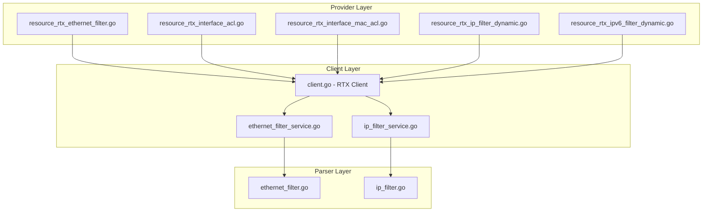
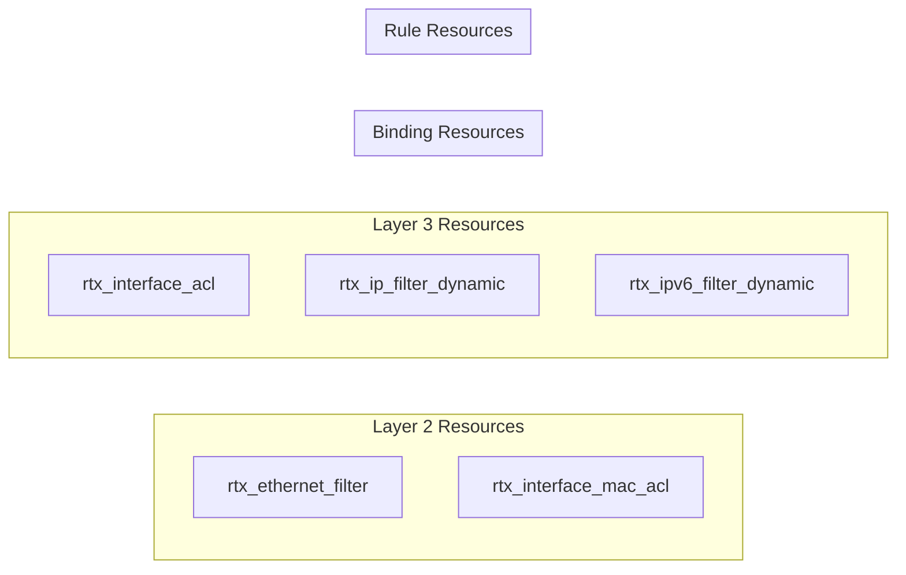

# Master Design: Filter Resources

## Overview

This document describes the technical design and architecture for filter-related Terraform resources in the RTX provider. The filter resources provide comprehensive packet filtering capabilities at both Layer 2 (Ethernet/MAC) and Layer 3 (IP/IPv6), supporting static rules and stateful (dynamic) inspection.

## Resource Summary

| Attribute | Value |
|-----------|-------|
| Resource Names | `rtx_ethernet_filter`, `rtx_interface_acl`, `rtx_interface_mac_acl`, `rtx_ip_filter_dynamic`, `rtx_ipv6_filter_dynamic` |
| Service Files | `internal/client/ethernet_filter_service.go`, `internal/client/ip_filter_service.go` |
| Parser Files | `internal/rtx/parsers/ethernet_filter.go`, `internal/rtx/parsers/ip_filter.go` |
| Resource Files | `internal/provider/resource_rtx_ethernet_filter.go`, `resource_rtx_interface_acl.go`, `resource_rtx_interface_mac_acl.go`, `resource_rtx_ip_filter_dynamic.go`, `resource_rtx_ipv6_filter_dynamic.go` |
| Last Updated | 2025-01-23 |
| Source Specs | Implementation code, Test files |

## Steering Document Alignment

### Technical Standards (tech.md)
- Follows provider framework patterns using terraform-plugin-framework
- Uses service layer abstraction for RTX client operations
- Implements parser layer for command building and output parsing
- Consistent error handling using `diag.Diagnostics`

### Project Structure (structure.md)
- Resource files in `internal/provider/`
- Service files in `internal/client/`
- Parser files in `internal/rtx/parsers/`
- Test files co-located with implementation files

## Code Reuse Analysis

### Existing Components to Leverage
- **rtxClient**: Base client providing SSH execution and configuration management
- **Executor Interface**: Shared command execution abstraction
- **Parser Utilities**: Common parsing patterns for RTX output
- **Validation Helpers**: Shared validators for interface names, numbers

### Integration Points
- **Client Interface**: Service methods registered in `interfaces.go`
- **Provider Registration**: Resources registered in `provider.go`
- **Command Execution**: Uses existing `Execute()` and `ExecuteCommand()` methods

## Architecture

The filter resources follow a three-layer architecture pattern consistent with other RTX provider resources:

1. **Provider Layer**: Terraform resource definitions handling CRUD lifecycle
2. **Service Layer**: Business logic and RTX client operations
3. **Parser Layer**: Command building and output parsing

### Modular Design Principles
- **Single File Responsibility**: Each resource file handles one specific Terraform resource
- **Component Isolation**: Parsers separated from services, services from resources
- **Service Layer Separation**: Clear boundary between Terraform state management and RTX operations
- **Utility Modularity**: Shared parsing utilities extracted to common functions



### Resource Type Classification



## Components and Interfaces

### Component 1: EthernetFilterService (`internal/client/ethernet_filter_service.go`)

- **Purpose:** Manages Ethernet (Layer 2) filter CRUD operations
- **Interfaces:**
  ```go
  type EthernetFilterService struct {
      executor Executor
      client   *rtxClient
  }

  func (s *EthernetFilterService) CreateEthernetFilter(ctx context.Context, filter parsers.EthernetFilter) error
  func (s *EthernetFilterService) GetEthernetFilter(ctx context.Context, number int) (*parsers.EthernetFilter, error)
  func (s *EthernetFilterService) DeleteEthernetFilter(ctx context.Context, number int) error
  func (s *EthernetFilterService) GetInterfaceMacFilter(ctx context.Context, iface string, direction string) (*parsers.InterfaceMacFilter, error)
  func (s *EthernetFilterService) SetInterfaceMacFilter(ctx context.Context, iface string, direction string, filterNums []int) error
  func (s *EthernetFilterService) DeleteInterfaceMacFilter(ctx context.Context, iface string, direction string) error
  ```
- **Dependencies:** Executor, rtxClient
- **Reuses:** Shared executor interface, common save pattern

### Component 2: IPFilterService (`internal/client/ip_filter_service.go`)

- **Purpose:** Manages IP/IPv6 filter and secure filter CRUD operations
- **Interfaces:**
  ```go
  type IPFilterService struct {
      executor Executor
      client   *rtxClient
  }

  // Dynamic Filter Operations
  func (s *IPFilterService) CreateIPFilterDynamic(ctx context.Context, filter parsers.IPFilterDynamic) error
  func (s *IPFilterService) GetIPFilterDynamic(ctx context.Context, filterID int) (*parsers.IPFilterDynamic, error)
  func (s *IPFilterService) DeleteIPFilterDynamic(ctx context.Context, filterID int) error

  // IPv6 Dynamic Filter Operations
  func (s *IPFilterService) CreateIPv6FilterDynamic(ctx context.Context, filter parsers.IPv6FilterDynamic) error
  func (s *IPFilterService) GetIPv6FilterDynamic(ctx context.Context, filterID int) (*parsers.IPv6FilterDynamic, error)
  func (s *IPFilterService) DeleteIPv6FilterDynamic(ctx context.Context, filterID int) error
  func (s *IPFilterService) GetAllIPv6FilterDynamic(ctx context.Context) ([]parsers.IPv6FilterDynamic, error)
  func (s *IPFilterService) DeleteAllIPv6FilterDynamic(ctx context.Context) error

  // Secure Filter Operations
  func (s *IPFilterService) GetSecureFilter(ctx context.Context, iface string, direction string) (*parsers.SecureFilter, error)
  func (s *IPFilterService) SetSecureFilter(ctx context.Context, iface string, direction string, filter parsers.SecureFilter) error
  func (s *IPFilterService) DeleteSecureFilter(ctx context.Context, iface string, direction string) error
  func (s *IPFilterService) GetIPv6SecureFilter(ctx context.Context, iface string, direction string) (*parsers.SecureFilter, error)
  func (s *IPFilterService) SetIPv6SecureFilter(ctx context.Context, iface string, direction string, filter parsers.SecureFilter) error
  func (s *IPFilterService) DeleteIPv6SecureFilter(ctx context.Context, iface string, direction string) error
  ```
- **Dependencies:** Executor, rtxClient
- **Reuses:** Shared executor interface, common save pattern

### Component 3: Ethernet Filter Parser (`internal/rtx/parsers/ethernet_filter.go`)

- **Purpose:** Parses RTX Ethernet filter output and builds commands
- **Interfaces:**
  ```go
  type EthernetFilter struct {
      Number         int
      Action         string
      SourceMAC      string
      DestinationMAC string
      EtherType      string
      VlanID         int
      DHCPType       string
      DHCPScope      int
      Offset         int
      ByteList       []string
  }

  type InterfaceMacFilter struct {
      Interface   string
      Direction   string
      FilterNums  []int
  }

  func ParseEthernetFilter(line string) (*EthernetFilter, error)
  func ParseInterfaceMacFilter(line string) (*InterfaceMacFilter, error)
  func BuildEthernetFilterCommand(f EthernetFilter) string
  func BuildDeleteEthernetFilterCommand(number int) string
  func BuildInterfaceMacFilterCommand(iface, direction string, nums []int) string
  func BuildDeleteInterfaceMacFilterCommand(iface, direction string) string
  ```
- **Dependencies:** regexp, strings, strconv
- **Reuses:** Common regex patterns

### Component 4: IP Filter Parser (`internal/rtx/parsers/ip_filter.go`)

- **Purpose:** Parses RTX IP filter output and builds commands
- **Interfaces:**
  ```go
  type IPFilterDynamic struct {
      Number        int
      Source        string
      Destination   string
      Protocol      string      // Form 1
      FilterList    []int       // Form 2
      InFilterList  []int       // Form 2
      OutFilterList []int       // Form 2
      Syslog        bool
      Timeout       int
  }

  type IPv6FilterDynamic struct {
      Number      int
      Source      string
      Destination string
      Protocol    string
      Syslog      bool
  }

  type SecureFilter struct {
      Interface      string
      Direction      string
      FilterNums     []int
      DynamicNums    []int
  }

  func ParseIPFilterDynamic(line string) (*IPFilterDynamic, error)
  func ParseIPv6FilterDynamic(line string) (*IPv6FilterDynamic, error)
  func ParseSecureFilter(line string) (*SecureFilter, error)
  func BuildIPFilterDynamicCommand(f IPFilterDynamic) string
  func BuildDeleteIPFilterDynamicCommand(number int) string
  func BuildIPv6FilterDynamicCommand(f IPv6FilterDynamic) string
  func BuildDeleteIPv6FilterDynamicCommand(number int) string
  func BuildSecureFilterCommand(iface, direction string, f SecureFilter) string
  func BuildDeleteSecureFilterCommand(iface, direction string) string
  ```
- **Dependencies:** regexp, strings, strconv
- **Reuses:** Common regex patterns, int list parsing

### Component 5: Terraform Resources (`internal/provider/resource_rtx_*.go`)

- **Purpose:** Terraform resource definitions implementing CRUD lifecycle
- **Common Pattern:**
  ```go
  func (r *rtxEthernetFilterResource) Schema(ctx context.Context, req resource.SchemaRequest, resp *resource.SchemaResponse)
  func (r *rtxEthernetFilterResource) Create(ctx context.Context, req resource.CreateRequest, resp *resource.CreateResponse)
  func (r *rtxEthernetFilterResource) Read(ctx context.Context, req resource.ReadRequest, resp *resource.ReadResponse)
  func (r *rtxEthernetFilterResource) Update(ctx context.Context, req resource.UpdateRequest, resp *resource.UpdateResponse)
  func (r *rtxEthernetFilterResource) Delete(ctx context.Context, req resource.DeleteRequest, resp *resource.DeleteResponse)
  func (r *rtxEthernetFilterResource) ImportState(ctx context.Context, req resource.ImportStateRequest, resp *resource.ImportStateResponse)
  ```
- **Dependencies:** terraform-plugin-framework, client services
- **Reuses:** Common diagnostic helpers, attribute conversion utilities

## Data Models

### EthernetFilter (Layer 2 Filter Model)

```go
// EthernetFilter represents a Layer 2 filter rule on an RTX router
type EthernetFilter struct {
    Number         int      `json:"number"`
    Action         string   `json:"action"`
    SourceMAC      string   `json:"source_mac,omitempty"`
    DestinationMAC string   `json:"destination_mac,omitempty"`
    EtherType      string   `json:"ether_type,omitempty"`
    VlanID         int      `json:"vlan_id,omitempty"`
    DHCPType       string   `json:"dhcp_type,omitempty"`
    DHCPScope      int      `json:"dhcp_scope,omitempty"`
    Offset         int      `json:"offset,omitempty"`
    ByteList       []string `json:"byte_list,omitempty"`
}
```

### IPFilterDynamic (Layer 3 Stateful Filter Model)

```go
// IPFilterDynamic represents an IPv4 dynamic (stateful) filter
type IPFilterDynamic struct {
    Number        int    `json:"number"`
    Source        string `json:"source"`
    Destination   string `json:"destination"`
    Protocol      string `json:"protocol,omitempty"`       // Form 1
    FilterList    []int  `json:"filter_list,omitempty"`    // Form 2
    InFilterList  []int  `json:"in_filter_list,omitempty"` // Form 2
    OutFilterList []int  `json:"out_filter_list,omitempty"` // Form 2
    Syslog        bool   `json:"syslog,omitempty"`
    Timeout       int    `json:"timeout,omitempty"`
}
```

### IPv6FilterDynamic (IPv6 Stateful Filter Model)

```go
// IPv6FilterDynamic represents an IPv6 dynamic (stateful) filter entry
type IPv6FilterDynamic struct {
    Number      int    `json:"number"`
    Source      string `json:"source"`
    Destination string `json:"destination"`
    Protocol    string `json:"protocol"`
    Syslog      bool   `json:"syslog,omitempty"`
}
```

### SecureFilter (Interface Filter Binding Model)

```go
// SecureFilter represents secure filter bindings on an interface
type SecureFilter struct {
    Interface   string `json:"interface"`
    Direction   string `json:"direction"`
    FilterNums  []int  `json:"filter_nums,omitempty"`
    DynamicNums []int  `json:"dynamic_nums,omitempty"`
}
```

## RTX Command Mapping

### Ethernet Filter Commands

#### Create/Update Ethernet Filter (MAC-based)
```
ethernet filter <n> <action> <src_mac> <dst_mac> [<eth_type>] [vlan <vlan_id>]
```
Example: `ethernet filter 100 pass-log 00:11:22:33:44:55 * 0x0800`

#### Create/Update Ethernet Filter (DHCP-based)
```
ethernet filter <n> <action> dhcp-bind|dhcp-not-bind [<scope>]
```
Example: `ethernet filter 200 pass-log dhcp-bind 1`

#### Create/Update Ethernet Filter (Byte-match)
```
ethernet filter <n> <action> <src_mac> [<dst_mac>] offset=<N> <byte1> <byte2> ...
```
Example: `ethernet filter 300 reject-log * * offset=14 0x08 0x00`

#### Delete Ethernet Filter
```
no ethernet filter <n>
```
Example: `no ethernet filter 100`

#### Read Ethernet Filter
```
show config | grep "ethernet filter <n>"
```

### Interface MAC Filter Commands

#### Set Interface MAC Filter
```
ethernet <interface> filter <direction> <filter_numbers...>
```
Example: `ethernet lan1 filter in 100 200 300`

#### Delete Interface MAC Filter
```
no ethernet <interface> filter <direction>
```
Example: `no ethernet lan1 filter in`

### IP Filter Dynamic Commands

#### Create/Update Dynamic Filter (Form 1 - Protocol)
```
ip filter dynamic <n> <src> <dst> <protocol> [syslog on] [timeout=<N>]
```
Example: `ip filter dynamic 100 * * www syslog on timeout=60`

#### Create/Update Dynamic Filter (Form 2 - Filter Reference)
```
ip filter dynamic <n> <src> <dst> filter <list> [in <in_list>] [out <out_list>] [syslog on] [timeout=<N>]
```
Example: `ip filter dynamic 200 * * filter 1000 1001 in 2000 out 3000 syslog on`

#### Delete Dynamic Filter
```
no ip filter dynamic <n>
```
Example: `no ip filter dynamic 100`

### IPv6 Filter Dynamic Commands

#### Create/Update IPv6 Dynamic Filter
```
ipv6 filter dynamic <n> <src> <dst> <protocol> [syslog on]
```
Example: `ipv6 filter dynamic 100 * * www syslog on`

#### Delete IPv6 Dynamic Filter
```
no ipv6 filter dynamic <n>
```
Example: `no ipv6 filter dynamic 100`

### Interface Secure Filter Commands

#### Set IPv4 Secure Filter
```
ip <interface> secure filter <direction> <filter_numbers...> [dynamic <dynamic_numbers...>]
```
Example: `ip lan1 secure filter in 100 101 dynamic 200 201`

#### Delete IPv4 Secure Filter
```
no ip <interface> secure filter <direction>
```
Example: `no ip lan1 secure filter in`

#### Set IPv6 Secure Filter
```
ipv6 <interface> secure filter <direction> <filter_numbers...> [dynamic <dynamic_numbers...>]
```
Example: `ipv6 lan1 secure filter in 100 101 dynamic 200`

#### Delete IPv6 Secure Filter
```
no ipv6 <interface> secure filter <direction>
```
Example: `no ipv6 lan1 secure filter in`

## Error Handling

### Error Scenarios

1. **Filter Number Out of Range**
   - **Handling:** Schema validation rejects values outside allowed range (1-512 for Ethernet, 1-65535 for IP)
   - **User Impact:** Terraform plan fails with validation error message

2. **Invalid Interface Name**
   - **Handling:** Regex validator rejects non-matching interface names
   - **User Impact:** Terraform plan fails with pattern match error

3. **Conflicting Attributes**
   - **Handling:** ConflictsWith validators prevent incompatible attribute combinations
   - **User Impact:** Terraform plan fails identifying conflicting attributes

4. **Filter Not Found During Read**
   - **Handling:** Resource removed from state (returns nil diagnostic)
   - **User Impact:** Terraform reports resource will be recreated on next apply

5. **SSH Connection Failure**
   - **Handling:** Error propagated from client layer with connection details
   - **User Impact:** Terraform reports SSH connection error with troubleshooting hints

6. **RTX Command Execution Error**
   - **Handling:** Error from RTX command parsed and wrapped in diagnostic
   - **User Impact:** Terraform reports specific RTX error message

7. **Invalid MAC Address Format**
   - **Handling:** Parser validates MAC format (colon-separated, dot notation, or wildcard)
   - **User Impact:** Clear error message indicating expected MAC format

8. **Form 1/Form 2 Conflict for Dynamic Filters**
   - **Handling:** Validation ensures either `protocol` OR `filter_list` is specified, not both
   - **User Impact:** Terraform plan fails with conflict message

### Error Recovery

| Error Type | Recovery Strategy |
|------------|-------------------|
| Validation Error | Fix configuration and re-run plan |
| Connection Error | Check network/credentials, retry |
| Filter Not Found | Resource recreated on next apply |
| Command Error | Check RTX logs, adjust configuration |
| State Drift | Run terraform refresh to sync state |

## Testing Strategy

### Unit Testing

- **Parser Tests** (`ethernet_filter_test.go`, `ip_filter_test.go`):
  - Parse valid Ethernet filter lines (MAC, DHCP, byte-match variants)
  - Parse valid IP filter dynamic lines (Form 1, Form 2)
  - Parse valid IPv6 filter dynamic lines
  - Parse secure filter configurations
  - Handle malformed input gracefully
  - Command builder output verification

- **Service Tests** (`ethernet_filter_service_test.go`, `ip_filter_service_test.go`):
  - Mock executor for CRUD operations
  - Verify correct commands are executed
  - Error propagation from executor
  - Configuration save after modifications

### Integration Testing

- **Resource Tests** (`resource_rtx_ethernet_filter_test.go`, etc.):
  - Create/Read/Update/Delete lifecycle
  - Import state verification
  - Attribute conflict validation
  - Range validation
  - Interface pattern validation

### Test Coverage Matrix

| Resource | Unit Tests | Integration Tests | Import Tests |
|----------|------------|-------------------|--------------|
| rtx_ethernet_filter | Parser, Service | CRUD lifecycle | Filter by number |
| rtx_interface_acl | Parser, Service | CRUD lifecycle | Filter by interface |
| rtx_interface_mac_acl | Parser, Service | CRUD lifecycle | Filter by interface |
| rtx_ip_filter_dynamic | Parser, Service | CRUD lifecycle, Form 1/2 | Filter by ID |
| rtx_ipv6_filter_dynamic | Parser, Service | CRUD lifecycle | Static ID |

### End-to-End Testing

- **Acceptance Tests** (with real RTX router):
  - Full CRUD cycle with actual RTX router
  - Verify configuration persistence
  - Test filter interaction with traffic (manual verification)
  - Import existing configuration

## File Structure

```
internal/
├── provider/
│   ├── resource_rtx_ethernet_filter.go
│   ├── resource_rtx_ethernet_filter_test.go
│   ├── resource_rtx_interface_acl.go
│   ├── resource_rtx_interface_acl_test.go
│   ├── resource_rtx_interface_mac_acl.go
│   ├── resource_rtx_interface_mac_acl_test.go
│   ├── resource_rtx_ip_filter_dynamic.go
│   ├── resource_rtx_ip_filter_dynamic_test.go
│   ├── resource_rtx_ipv6_filter_dynamic.go
│   └── resource_rtx_ipv6_filter_dynamic_test.go
├── client/
│   ├── interfaces.go                    # Interface definitions
│   ├── client.go                        # Service initialization
│   ├── ethernet_filter_service.go
│   ├── ethernet_filter_service_test.go
│   ├── ip_filter_service.go
│   └── ip_filter_service_test.go
└── rtx/
    └── parsers/
        ├── ethernet_filter.go
        ├── ethernet_filter_test.go
        ├── ip_filter.go
        └── ip_filter_test.go
```

## Implementation Notes

1. **MAC Address Normalization**: The Ethernet filter parser supports multiple MAC address formats (colon-separated `00:11:22:33:44:55`, Cisco dot notation `0011.2233.4455`, hyphen-separated `00-11-22-33-44-55`). Commands are built using colon-separated format.

2. **Dynamic Filter Form Detection**: When reading IP filter dynamic configuration, the parser must detect whether it's Form 1 (protocol-based) or Form 2 (filter-reference) by checking for the presence of `filter` keyword.

3. **IPv6 Filter Dynamic Singleton Pattern**: The `rtx_ipv6_filter_dynamic` resource manages all IPv6 dynamic filter entries as a single resource. This simplifies state management but requires careful handling during updates.

4. **Interface Binding Resources**: Interface ACL and MAC ACL resources bind filter rules to interfaces. They don't create filters themselves but reference existing filter configurations.

5. **Configuration Persistence**: All filter modifications automatically trigger a configuration save to ensure changes persist across router reboots.

6. **Wildcard Handling**: The `*` character is used as a wildcard for addresses (MAC, IP) and protocols. This must be properly quoted in RTX commands.

7. **Filter Number Uniqueness**: Each filter number must be unique within its category (Ethernet filters: 1-512, IP filters: 1-65535).

8. **Direction Semantics**: `in` refers to traffic entering the router through the interface, `out` refers to traffic leaving through the interface.

9. **Line Wrapping in RTX Output**: The RTX router wraps output lines at approximately 80 characters. When filter numbers span line boundaries, the `preprocessWrappedLines` function in `interface_config.go` uses smart line joining:
   - If a line ends with a digit AND the next continuation line starts with a digit, join without a space (mid-number wrap detected)
   - Otherwise, join with a space (normal word boundary wrap)
   - This prevents filter numbers like `200100` from being incorrectly split into `20010` and `0`

## State Handling

- Persist only configuration attributes in Terraform state
- Operational/runtime status (hit counters, active sessions) must not be stored in state
- Filter numbers and interface names serve as resource identifiers
- List attributes (filter_list, dynamic_filters) maintain order as configured

## Change History

| Date | Source Spec | Changes |
|------|-------------|---------|
| 2025-01-23 | Implementation Code | Initial master design created from implementation analysis |
| 2026-01-23 | filter-number-parsing-fix | Documented smart line joining for RTX output line wrapping in preprocessWrappedLines |
