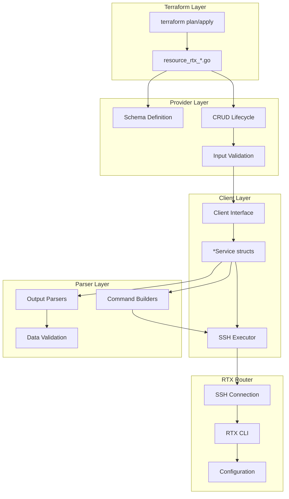

# Master Design: Interface Resources

## Overview

This document describes the technical design and implementation of network interface resources for the Terraform RTX provider. These resources follow a layered architecture with clear separation between Terraform resource handling, client service operations, and RTX command parsing.

## Resource Summary

| Resource | Resource Directory | Service File | Parser File |
|----------|---------------------|--------------|-------------|
| rtx_interface | `internal/provider/resources/interface/` | interface_service.go | interface_config.go |
| rtx_ipv6_interface | `internal/provider/resources/ipv6_interface/` | ipv6_interface_service.go | ipv6_interface.go |
| rtx_pp_interface | `internal/provider/resources/pp_interface/` | ppp_service.go | ppp.go |
| rtx_vlan | `internal/provider/resources/vlan/` | vlan_service.go | vlan.go |
| rtx_bridge | `internal/provider/resources/bridge/` | bridge_service.go | bridge.go |

## Steering Document Alignment

### Technical Standards (tech.md)

- Go 1.21+ with **Terraform Plugin Framework** (NOT Plugin SDK v2)
- SSH-based communication with RTX routers
- Layered architecture: Provider -> Client -> Parser
- Comprehensive unit and acceptance testing

### Project Structure (structure.md)

```
internal/
├── provider/
│   └── resources/                    # Terraform resource definitions
│       ├── interface/
│       │   ├── resource.go           # Resource implementation
│       │   └── model.go              # Terraform model with ToClient/FromClient
│       ├── ipv6_interface/
│       │   ├── resource.go
│       │   └── model.go
│       ├── pp_interface/
│       │   ├── resource.go
│       │   └── model.go
│       ├── vlan/
│       │   ├── resource.go
│       │   └── model.go
│       └── bridge/
│           ├── resource.go
│           └── model.go
├── client/                           # RTX client services
│   ├── interfaces.go                 # Type definitions
│   ├── interface_service.go
│   ├── ipv6_interface_service.go
│   ├── vlan_service.go
│   └── bridge_service.go
└── rtx/
    └── parsers/                      # RTX output parsers
        ├── interface_config.go
        ├── ipv6_interface.go
        ├── vlan.go
        └── bridge.go
```

## Architecture



## Code Reuse Analysis

### Existing Components to Leverage

- **Executor Interface**: Shared SSH command execution
- **containsError()**: Common error detection in command output
- **intSliceEqual()**: Filter list comparison utility
- **Validation Functions**: Shared interface name validation patterns

### Integration Points

- **Client Interface** (`interfaces.go`): All type definitions centralized
- **rtxClient**: Main client with SaveConfig() for persistence
- **logging.FromContext()**: Structured logging throughout

---

## Component Details

### Component 1: InterfaceService (`internal/client/interface_service.go`)

**Purpose:** Handles IPv4 interface configuration operations

**Interface:**
```go
type InterfaceService struct {
    executor Executor
    client   *rtxClient
}

func NewInterfaceService(executor Executor, client *rtxClient) *InterfaceService
func (s *InterfaceService) Configure(ctx context.Context, config InterfaceConfig) error
func (s *InterfaceService) Get(ctx context.Context, interfaceName string) (*InterfaceConfig, error)
func (s *InterfaceService) Update(ctx context.Context, config InterfaceConfig) error
func (s *InterfaceService) Reset(ctx context.Context, interfaceName string) error
func (s *InterfaceService) List(ctx context.Context) ([]InterfaceConfig, error)
```

**Key Implementation Details:**
- Converts between `client.InterfaceConfig` and `parsers.InterfaceConfig`
- Update method compares current vs desired state to minimize commands
- Reset removes all configuration attributes one by one
- Automatic config save after each operation

### Component 2: IPv6InterfaceService (`internal/client/ipv6_interface_service.go`)

**Purpose:** Handles IPv6 interface configuration with RTADV/DHCPv6 support

**Interface:**
```go
type IPv6InterfaceService struct {
    executor Executor
    client   *rtxClient
}

func NewIPv6InterfaceService(executor Executor, client *rtxClient) *IPv6InterfaceService
func (s *IPv6InterfaceService) Configure(ctx context.Context, config IPv6InterfaceConfig) error
func (s *IPv6InterfaceService) Get(ctx context.Context, interfaceName string) (*IPv6InterfaceConfig, error)
func (s *IPv6InterfaceService) Update(ctx context.Context, config IPv6InterfaceConfig) error
func (s *IPv6InterfaceService) Reset(ctx context.Context, interfaceName string) error
```

**Key Implementation Details:**
- Supports multiple addresses per interface
- Handles prefix-based addresses (ra-prefix@, dhcp-prefix@)
- RTADV configuration with flags (O, M) and lifetime
- DHCPv6 service modes: server, client

### Component 3: VLANService (`internal/client/vlan_service.go`)

**Purpose:** Manages 802.1Q VLAN interfaces

**Interface:**
```go
type VLANService struct {
    executor Executor
    client   *rtxClient
}

func NewVLANService(executor Executor, client *rtxClient) *VLANService
func (s *VLANService) CreateVLAN(ctx context.Context, vlan VLAN) error
func (s *VLANService) GetVLAN(ctx context.Context, iface string, vlanID int) (*VLAN, error)
func (s *VLANService) UpdateVLAN(ctx context.Context, vlan VLAN) error
func (s *VLANService) DeleteVLAN(ctx context.Context, iface string, vlanID int) error
func (s *VLANService) ListVLANs(ctx context.Context) ([]VLAN, error)
```

**Key Implementation Details:**
- Automatic slot number assignment via `FindNextAvailableSlot()`
- VLAN interface naming: `<parent>/<slot>` (e.g., `lan1/1`)
- IP address and mask configured together
- Shutdown state management

### Component 4: BridgeService (`internal/client/bridge_service.go`)

**Purpose:** Manages Layer 2 bridge configurations

**Interface:**
```go
type BridgeService struct {
    executor Executor
    client   *rtxClient
}

func NewBridgeService(executor Executor, client *rtxClient) *BridgeService
func (s *BridgeService) CreateBridge(ctx context.Context, bridge BridgeConfig) error
func (s *BridgeService) GetBridge(ctx context.Context, name string) (*BridgeConfig, error)
func (s *BridgeService) UpdateBridge(ctx context.Context, bridge BridgeConfig) error
func (s *BridgeService) DeleteBridge(ctx context.Context, name string) error
func (s *BridgeService) ListBridges(ctx context.Context) ([]BridgeConfig, error)
```

**Key Implementation Details:**
- Member list replaced entirely on update
- Supports various member types (LAN, VLAN, tunnel, PP, loopback)
- Existence check before create/update

---

## Data Models

### InterfaceConfig

```go
type InterfaceConfig struct {
    Name          string       `json:"name"`                   // Interface name
    Description   string       `json:"description,omitempty"`
    IPAddress     *InterfaceIP `json:"ip_address,omitempty"`
    NATDescriptor int          `json:"nat_descriptor,omitempty"`
    ProxyARP      bool         `json:"proxyarp"`
    MTU           int          `json:"mtu,omitempty"`
    // Note: Filter attributes (SecureFilterIn/Out, DynamicFilterOut, EthernetFilterIn/Out)
    // are not yet implemented
}

type InterfaceIP struct {
    Address string `json:"address,omitempty"` // CIDR notation
    DHCP    bool   `json:"dhcp"`
}
```

### IPv6InterfaceConfig

```go
type IPv6InterfaceConfig struct {
    Interface        string        `json:"interface"`
    Addresses        []IPv6Address `json:"addresses,omitempty"`
    RTADV            *RTADVConfig  `json:"rtadv,omitempty"`
    DHCPv6Service    string        `json:"dhcpv6_service,omitempty"`
    MTU              int           `json:"mtu,omitempty"`
    SecureFilterIn   []int         `json:"secure_filter_in,omitempty"`
    SecureFilterOut  []int         `json:"secure_filter_out,omitempty"`
    DynamicFilterOut []int         `json:"dynamic_filter_out,omitempty"`
}

type IPv6Address struct {
    Address     string `json:"address,omitempty"`      // Full IPv6/prefix
    PrefixRef   string `json:"prefix_ref,omitempty"`   // e.g., "ra-prefix@lan2"
    InterfaceID string `json:"interface_id,omitempty"` // e.g., "::1/64"
}

type RTADVConfig struct {
    Enabled  bool `json:"enabled"`
    PrefixID int  `json:"prefix_id"`
    OFlag    bool `json:"o_flag"`
    MFlag    bool `json:"m_flag"`
    Lifetime int  `json:"lifetime,omitempty"`
}
```

### PPIPConfig

```go
type PPIPConfig struct {
    Address         string `json:"address,omitempty"`     // "ipcp" or CIDR
    MTU             int    `json:"mtu,omitempty"`
    TCPMSSLimit     int    `json:"tcp_mss_limit,omitempty"`
    NATDescriptor   int    `json:"nat_descriptor,omitempty"`
    SecureFilterIn  []int  `json:"secure_filter_in,omitempty"`
    SecureFilterOut []int  `json:"secure_filter_out,omitempty"`
}
```

### VLAN

```go
type VLAN struct {
    VlanID        int    `json:"vlan_id"`        // 1-4094
    Name          string `json:"name,omitempty"`
    Interface     string `json:"interface"`      // Parent (lan1)
    VlanInterface string `json:"vlan_interface"` // Computed (lan1/1)
    IPAddress     string `json:"ip_address,omitempty"`
    IPMask        string `json:"ip_mask,omitempty"`
    Shutdown      bool   `json:"shutdown"`
}
```

### BridgeConfig

```go
type BridgeConfig struct {
    Name          string   `json:"name"`           // bridge1, bridge2, etc.
    Members       []string `json:"members"`        // lan1, tunnel1, etc.
    InterfaceName string   `json:"interface_name"` // Computed: same as Name
}
```

---

## RTX Command Mapping

### Interface Commands

| Operation | RTX Command |
|-----------|-------------|
| Set IP Address | `ip <iface> address <cidr>` |
| Set DHCP | `ip <iface> address dhcp` |
| Set Description | `ip <iface> description <text>` |
| Set Inbound Filter | `ip <iface> secure filter in <nums...>` |
| Set Outbound Filter | `ip <iface> secure filter out <nums...> [dynamic <nums...>]` |
| Set NAT Descriptor | `ip <iface> nat descriptor <id>` |
| Enable ProxyARP | `ip <iface> proxyarp on` |
| Set MTU | `ip <iface> mtu <value>` |
| Set Ethernet Filter In | `ethernet <iface> filter in <nums...>` |
| Set Ethernet Filter Out | `ethernet <iface> filter out <nums...>` |
| Show Config | `show config \| grep "^ip <iface>\|^ethernet <iface>"` |

### IPv6 Interface Commands

| Operation | RTX Command |
|-----------|-------------|
| Set Address | `ipv6 <iface> address <cidr>` |
| Set Prefix Address | `ipv6 <iface> address <prefix-ref>::<iface-id>/<len>` |
| Enable RTADV | `ipv6 <iface> rtadv send <prefix-id> [o_flag=on] [m_flag=on]` |
| Set DHCPv6 | `ipv6 <iface> dhcp service <server\|client>` |
| Set MTU | `ipv6 <iface> mtu <value>` |
| Set IPv6 Filter | `ipv6 <iface> secure filter <in\|out> <nums...>` |

### PP Interface Commands

| Operation | RTX Command |
|-----------|-------------|
| Select PP | `pp select <num>` |
| Set Address | `ip pp address <cidr>` or `ip pp address ipcp` |
| Set MTU | `ip pp mtu <value>` |
| Set TCP MSS | `ip pp tcp mss limit <value>` |
| Set NAT | `ip pp nat descriptor <id>` |
| Set Filter | `ip pp secure filter <in\|out> <nums...>` |
| Deselect | `pp select none` |

### VLAN Commands

| Operation | RTX Command |
|-----------|-------------|
| Create VLAN | `vlan <iface>/<slot> 802.1q vid=<id>` |
| Set IP | `ip <iface>/<slot> address <ip> <mask>` |
| Set Description | `description <iface>/<slot> <name>` |
| Disable | `<iface>/<slot> use off` |
| Enable | `<iface>/<slot> use on` |
| Delete | `no vlan <iface>/<slot>` |
| Show | `show config \| grep "vlan <iface>/"` |

### Bridge Commands

| Operation | RTX Command |
|-----------|-------------|
| Create/Update | `bridge member <name> <iface1> [<iface2>...]` |
| Delete | `no bridge member <name>` |
| Show | `show config \| grep "^bridge member <name>"` |

---

## Error Handling

### Error Scenarios

1. **Invalid Interface Name**
   - **Detection**: Regex validation in schema
   - **Handling**: Return validation error before API call
   - **User Impact**: Clear error message with expected format

2. **Interface Not Found**
   - **Detection**: Error string contains "not found"
   - **Handling**: For Read/Delete, return nil and clear ID; For Update, fall back to Create
   - **User Impact**: Resource removed from state

3. **Command Execution Failure**
   - **Detection**: SSH error or `containsError()` on output
   - **Handling**: Return wrapped error with command context
   - **User Impact**: Operation fails with descriptive error

4. **Configuration Save Failure**
   - **Detection**: SaveConfig() returns error
   - **Handling**: Return error indicating partial success
   - **User Impact**: Warning that config may not persist reboot

5. **VLAN Slot Exhaustion**
   - **Detection**: `FindNextAvailableSlot()` returns -1
   - **Handling**: Return error before attempting create
   - **User Impact**: Clear error about slot availability

6. **Duplicate Resource**
   - **Detection**: Existence check before create
   - **Handling**: Return error for bridge/VLAN duplicates
   - **User Impact**: Prompted to import existing resource

---

## Testing Strategy

### Unit Testing

**Parser Tests** (`*_test.go` in parsers/):
- Command building verification
- Output parsing with various formats
- Edge cases (empty output, malformed data)
- Validation function coverage

**Service Tests** (`*_service_test.go` in client/):
- Mock executor for command verification
- CRUD operation flow testing
- Error handling scenarios

### Integration Testing

**Resource Tests** (`resource_rtx_*_test.go` in provider/):
- Schema validation
- ResourceData building
- Validation function testing
- Import ID parsing

Example test cases from implementation:

```go
// Interface name validation
func TestValidateInterfaceConfigName(t *testing.T) {
    tests := []struct {
        name    string
        input   string
        wantErr bool
    }{
        {"valid lan1", "lan1", false},
        {"valid bridge1", "bridge1", false},
        {"valid pp1", "pp1", false},
        {"valid tunnel1", "tunnel1", false},
        {"invalid empty", "", true},
        {"invalid eth0", "eth0", true},
        {"invalid vlan1", "vlan1", true},
    }
}

// VLAN ID parsing
func TestParseVLANID(t *testing.T) {
    tests := []struct {
        id         string
        wantIface  string
        wantVlanID int
        wantErr    bool
    }{
        {"lan1/10", "lan1", 10, false},
        {"lan2/100", "lan2", 100, false},
        {"lan1", "", 0, true},       // missing VLAN ID
        {"lan1/abc", "", 0, true},   // non-numeric
    }
}

// Bridge member validation
func TestValidateBridgeMember(t *testing.T) {
    tests := []struct {
        value   string
        wantErr bool
    }{
        {"lan1", false},
        {"lan1/1", false},        // VLAN interface
        {"tunnel1", false},
        {"pp1", false},
        {"loopback1", false},
        {"eth0", true},           // invalid
        {"lan", true},            // missing number
    }
}
```

### Acceptance Testing

**Acceptance Tests** (`*_acc_test.go`):
- Requires real RTX router
- Full CRUD lifecycle
- Import verification
- Environment: `TF_ACC=1`

---

## File Structure

```
internal/
├── provider/
│   ├── resource_rtx_interface.go
│   ├── resource_rtx_interface_test.go
│   ├── resource_rtx_ipv6_interface.go
│   ├── resource_rtx_ipv6_interface_test.go
│   ├── resource_rtx_ipv6_interface_acc_test.go
│   ├── resource_rtx_pp_interface.go
│   ├── resource_rtx_pp_interface_test.go
│   ├── resource_rtx_vlan.go
│   ├── resource_rtx_vlan_test.go
│   ├── resource_rtx_vlan_acc_test.go
│   ├── resource_rtx_bridge.go
│   ├── resource_rtx_bridge_test.go
│   └── resource_rtx_bridge_acc_test.go
├── client/
│   ├── interfaces.go               # All type definitions
│   ├── client.go                   # Main client with SaveConfig
│   ├── interface_service.go
│   ├── interface_service_test.go
│   ├── ipv6_interface_service.go
│   ├── ipv6_interface_service_test.go
│   ├── vlan_service.go
│   ├── vlan_service_test.go
│   ├── bridge_service.go
│   └── bridge_service_test.go
└── rtx/
    └── parsers/
        ├── interface_config.go
        ├── interface_config_test.go
        ├── ipv6_interface.go
        ├── ipv6_interface_test.go
        ├── vlan.go
        ├── vlan_test.go
        ├── bridge.go
        └── bridge_test.go
```

---

## Implementation Notes

1. **Filter Order Matters**: Security filter lists are ordered - first match wins. The implementation preserves order using `[]int` slices.

2. **PP Interface Context**: PP commands require `pp select <num>` before configuration and `pp select none` after. The service handles this automatically.

3. **VLAN Slot Management**: RTX routers assign VLAN interfaces sequential slot numbers (`lan1/1`, `lan1/2`). The service tracks existing slots and assigns the next available.

4. **Bridge Member Replacement**: RTX replaces the entire member list with each `bridge member` command rather than supporting incremental add/remove.

5. **Computed Fields**:
   - `vlan_interface` computed from parent interface and slot
   - `interface_name` computed for `rtx_interface` and `rtx_bridge` (same as `name`, for resource reference consistency)
   - `pp_interface` computed for `rtx_pp_interface` (e.g., "pp1" from `pp_number=1`)
   - `ip_address.dhcp` defaults computed for import compatibility

6. **Import Compatibility**: All resources support import. Computed fields are marked as such to avoid plan diffs after import.

7. **Idempotent Delete**: Delete operations succeed silently if the resource is already gone, supporting `terraform destroy` retries.

8. **Configuration Persistence**: Every modifying operation ends with `SaveConfig()` to persist changes to router flash.

---

## State Handling

- Persist only configuration attributes in Terraform state
- Operational status (link state, counters) not stored
- Computed values derived fresh from router on Read
- Import uses same Read logic to populate state

---

## Terraform Schema Examples

### rtx_interface

```hcl
resource "rtx_interface" "lan1" {
  name        = "lan1"
  description = "Internal LAN"

  ip_address {
    address = "192.168.1.1/24"
  }

  secure_filter_in  = [1, 2, 3]
  secure_filter_out = [10, 11, 12]
  dynamic_filter_out = [100]
  nat_descriptor    = 1000
  proxyarp          = true
  mtu               = 1500
  ethernet_filter_in  = [1, 2]
  ethernet_filter_out = [3, 4]
}
```

### rtx_ipv6_interface

```hcl
resource "rtx_ipv6_interface" "lan1" {
  interface = "lan1"

  address {
    address = "2001:db8::1/64"
  }

  address {
    prefix_ref   = "ra-prefix@lan2"
    interface_id = "::1/64"
  }

  rtadv {
    enabled   = true
    prefix_id = 1
    o_flag    = true
    m_flag    = false
    lifetime  = 1800
  }

  dhcpv6_service   = "server"
  mtu              = 1500
  secure_filter_in  = [1, 2]
  secure_filter_out = [10, 11]
}
```

### rtx_pp_interface

```hcl
resource "rtx_pp_interface" "wan" {
  pp_number      = 1
  ip_address     = "ipcp"
  mtu            = 1454
  tcp_mss        = 1414
  nat_descriptor = 1000

  secure_filter_in  = [200020, 200021, 200099]
  secure_filter_out = [200020, 200021, 200099]
}
```

### rtx_vlan

```hcl
resource "rtx_vlan" "guest" {
  vlan_id    = 10
  interface  = "lan1"
  name       = "Guest Network"
  ip_address = "192.168.10.1"
  ip_mask    = "255.255.255.0"
  shutdown   = false
}
```

### rtx_bridge

```hcl
resource "rtx_bridge" "internal" {
  name    = "bridge1"
  members = ["lan1", "lan2", "tunnel1"]
}
```

---

## Change History

| Date | Source | Changes |
|------|--------|---------|
| 2025-01-23 | Implementation Analysis | Initial master design from codebase analysis |
| 2026-01-25 | Implementation Sync | Add computed `interface_name` for rtx_interface/rtx_bridge, `pp_interface` for rtx_pp_interface |
| 2026-02-01 | Implementation Audit | Update to Plugin Framework, modular file structure, mark filter attributes as not implemented |
