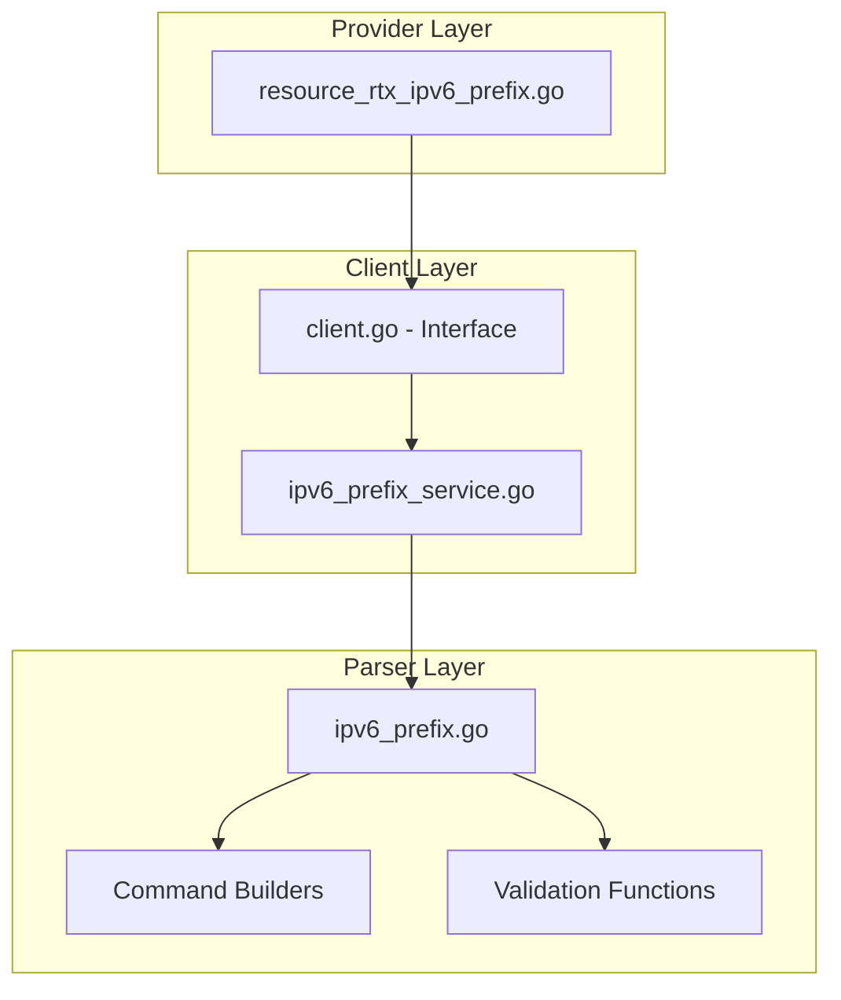

# Master Design: IPv6 Prefix

## Overview

The `rtx_ipv6_prefix` resource manages IPv6 prefix definitions on Yamaha RTX routers. It follows the standard three-layer architecture pattern used throughout the provider, with a dedicated service and parser for IPv6 prefix operations.

## Resource Summary

| Attribute | Value |
|-----------|-------|
| Resource Name | `rtx_ipv6_prefix` |
| Service File | `internal/client/ipv6_prefix_service.go` |
| Parser File | `internal/rtx/parsers/ipv6_prefix.go` |
| Resource File | `internal/provider/resource_rtx_ipv6_prefix.go` |
| Last Updated | 2026-01-23 |

## Architecture



## Components and Interfaces

### Component 1: IPv6PrefixService (`internal/client/ipv6_prefix_service.go`)

- **Purpose:** Handles all IPv6 prefix CRUD operations against the RTX router
- **Interfaces:**
  ```go
  type IPv6PrefixService struct {
      executor Executor
      client   *rtxClient
  }

  func (s *IPv6PrefixService) CreatePrefix(ctx context.Context, prefix IPv6Prefix) error
  func (s *IPv6PrefixService) GetPrefix(ctx context.Context, prefixID int) (*IPv6Prefix, error)
  func (s *IPv6PrefixService) UpdatePrefix(ctx context.Context, prefix IPv6Prefix) error
  func (s *IPv6PrefixService) DeletePrefix(ctx context.Context, prefixID int) error
  func (s *IPv6PrefixService) ListPrefixes(ctx context.Context) ([]IPv6Prefix, error)
  ```
- **Dependencies:** `Executor`, `rtxClient`, `parsers.IPv6PrefixParser`
- **Reuses:** Standard service pattern, SaveConfig for persistence

### Component 2: IPv6PrefixParser (`internal/rtx/parsers/ipv6_prefix.go`)

- **Purpose:** Parses RTX router output and builds IPv6 prefix commands
- **Interfaces:**
  ```go
  type IPv6Prefix struct {
      ID           int    `json:"id"`
      Prefix       string `json:"prefix"`
      PrefixLength int    `json:"prefix_length"`
      Source       string `json:"source"`
      Interface    string `json:"interface,omitempty"`
  }

  type IPv6PrefixParser struct{}

  func (p *IPv6PrefixParser) ParseIPv6PrefixConfig(raw string) ([]IPv6Prefix, error)
  func (p *IPv6PrefixParser) ParseSinglePrefix(raw string, prefixID int) (*IPv6Prefix, error)

  func BuildIPv6PrefixCommand(prefix IPv6Prefix) string
  func BuildDeleteIPv6PrefixCommand(prefixID int) string
  func BuildShowIPv6PrefixCommand(prefixID int) string
  func BuildShowAllIPv6PrefixesCommand() string
  func ValidateIPv6Prefix(prefix IPv6Prefix) error
  ```
- **Dependencies:** `regexp`, `strconv`, `net`

### Component 3: Terraform Resource (`internal/provider/resource_rtx_ipv6_prefix.go`)

- **Purpose:** Terraform resource definition implementing CRUD lifecycle
- **Interfaces:**
  ```go
  func resourceRTXIPv6Prefix() *schema.Resource
  func resourceRTXIPv6PrefixCreate(ctx, d, meta) diag.Diagnostics
  func resourceRTXIPv6PrefixRead(ctx, d, meta) diag.Diagnostics
  func resourceRTXIPv6PrefixUpdate(ctx, d, meta) diag.Diagnostics
  func resourceRTXIPv6PrefixDelete(ctx, d, meta) diag.Diagnostics
  func resourceRTXIPv6PrefixImport(ctx, d, meta) ([]*schema.ResourceData, error)
  func validateIPv6PrefixConfig(ctx, d, meta) error  // CustomizeDiff
  ```
- **Dependencies:** `client.Client`, Terraform SDK

## Data Models

### IPv6Prefix

```go
// IPv6Prefix represents an IPv6 prefix definition on an RTX router
type IPv6Prefix struct {
    ID           int    `json:"id"`              // Prefix ID (1-255)
    Prefix       string `json:"prefix"`          // Static prefix value
    PrefixLength int    `json:"prefix_length"`   // Prefix length (1-128)
    Source       string `json:"source"`          // "static", "ra", "dhcpv6-pd"
    Interface    string `json:"interface"`       // Source interface for ra/pd
}
```

### Terraform Schema

```hcl
resource "rtx_ipv6_prefix" "example" {
  prefix_id     = 1           # Required, ForceNew, 1-255
  prefix        = "2001:db8::" # Optional, for static source
  prefix_length = 48          # Required, 1-128
  source        = "static"    # Required, ForceNew
  interface     = "lan2"      # Optional, for ra/dhcpv6-pd sources
}
```

## RTX Command Mapping

### Create/Update Prefix

| Source Type | Command Format |
|-------------|----------------|
| static | `ipv6 prefix <id> <prefix>::/<length>` |
| ra | `ipv6 prefix <id> ra-prefix@<interface>::/<length>` |
| dhcpv6-pd | `ipv6 prefix <id> dhcp-prefix@<interface>::/<length>` |

### Delete Prefix

```
no ipv6 prefix <id>
```

### Read Prefix

```
show config | grep "ipv6 prefix <id>"
show config | grep "ipv6 prefix"
```

## Error Handling

### Error Scenarios

1. **Invalid Prefix ID**
   - **Handling:** Validation rejects ID outside 1-255 range
   - **User Impact:** Clear validation error message

2. **Missing Required Field**
   - **Handling:** CustomizeDiff validates source-specific requirements
   - **User Impact:** Error indicating which field is required for source type

3. **Invalid IPv6 Format**
   - **Handling:** validateIPv6Prefix function checks format
   - **User Impact:** Clear format error with expected pattern

4. **Prefix Not Found**
   - **Handling:** Read returns nil, resource removed from state
   - **User Impact:** Resource will be recreated on next apply

5. **Source/Interface Change Attempted**
   - **Handling:** ForceNew triggers resource recreation
   - **User Impact:** Plan shows destroy and recreate

## Testing Strategy

### Unit Testing

- **Parser Tests** (`ipv6_prefix_test.go`):
  - Parse static, RA, and DHCPv6-PD prefix formats
  - Test command builder functions
  - Test validation functions

- **Service Tests** (`ipv6_prefix_service_test.go`):
  - Mock executor for CRUD operations
  - Test error handling scenarios

### Integration Testing

- **Resource Tests** (`resource_rtx_ipv6_prefix_test.go`):
  - Full CRUD lifecycle with mock client
  - Import functionality
  - CustomizeDiff validation

### End-to-End Testing

- **Acceptance Tests** (with real RTX router):
  - Create static prefix
  - Create RA-derived prefix
  - Create DHCPv6-PD prefix
  - Update prefix length
  - Delete prefix
  - Import existing prefix

## File Structure

```
internal/
├── provider/
│   ├── resource_rtx_ipv6_prefix.go
│   └── resource_rtx_ipv6_prefix_test.go
├── client/
│   ├── interfaces.go              # IPv6Prefix type definition
│   ├── client.go                  # IPv6Prefix method implementations
│   ├── ipv6_prefix_service.go
│   └── ipv6_prefix_service_test.go
└── rtx/
    └── parsers/
        ├── ipv6_prefix.go
        └── ipv6_prefix_test.go
```

## Implementation Notes

1. **Prefix ID as Resource ID**: The Terraform resource ID is the prefix_id converted to string.

2. **ForceNew Attributes**: `prefix_id`, `source`, and `interface` trigger resource recreation when changed.

3. **CustomizeDiff Validation**: Cross-field validation ensures:
   - Static source requires prefix, forbids interface
   - RA/DHCPv6-PD sources require interface, forbid prefix

4. **Dynamic Prefix Values**: For RA and DHCPv6-PD sources, the actual prefix is assigned dynamically by the router and not stored in Terraform state.

5. **Configuration Save**: All operations call SaveConfig to persist changes to router flash.

6. **Parser Regex Patterns**:
   - Static: `ipv6\s+prefix\s+(\d+)\s+([0-9a-fA-F:]+)::/(\d+)`
   - RA: `ipv6\s+prefix\s+(\d+)\s+ra-prefix@([^:]+)::/(\d+)`
   - DHCPv6-PD: `ipv6\s+prefix\s+(\d+)\s+dhcp-prefix@([^:]+)::/(\d+)`

7. **Interface Format**: Interface names can include spaces (e.g., "pp 1"), handled correctly by parser.

8. **RTX Terminal Line Wrapping**: RTX router terminal output wraps at approximately 80 characters. Regex patterns use `.*$` instead of `\s*$` at the end to handle trailing characters from line wrapping.

9. **IPv6 Filter Dynamic Service**: The `rtx_ipv6_filter_dynamic` resource operations delegate to `IPFilterService`. The client layer methods (`CreateIPv6FilterDynamic`, `GetIPv6FilterDynamic`, `DeleteIPv6FilterDynamic`, etc.) in `client.go` properly delegate to `IPFilterService` instead of returning "not implemented" errors.

## Change History

| Date | Source Spec | Changes |
|------|-------------|---------|
| 2026-01-23 | Implementation analysis | Initial master design creation from implementation code |
| 2026-01-23 | terraform-plan-differences-fix | Documented IPv6 filter dynamic service delegation; added line wrapping handling notes |
