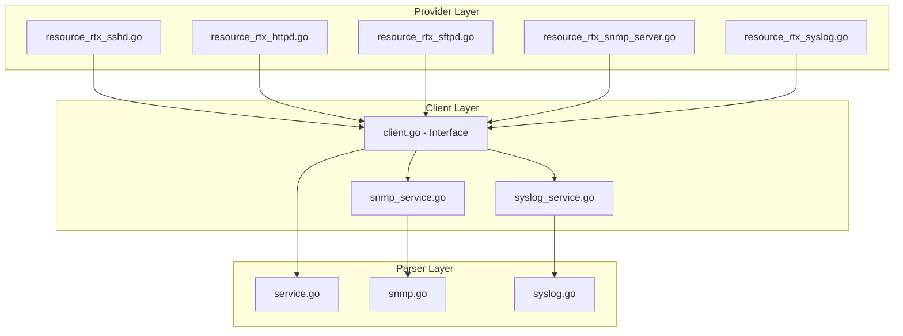
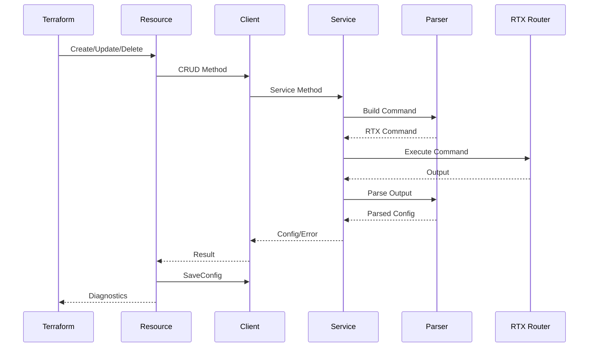

# Master Design: Management Services

## Overview

This document describes the technical design and implementation details for the management service resources in the Terraform RTX provider. These resources (rtx_sshd, rtx_httpd, rtx_sftpd, rtx_snmp_server, rtx_syslog) follow a consistent architectural pattern with three layers: Provider (Terraform resource), Client (service abstraction), and Parser (RTX command handling).

## Resources Summary

| Resource Name | Service File | Parser File | Resource File |
|--------------|--------------|-------------|---------------|
| `rtx_sshd` | `internal/client/client.go` (embedded) | `internal/rtx/parsers/service.go` | `internal/provider/resource_rtx_sshd.go` |
| `rtx_httpd` | `internal/client/client.go` (embedded) | `internal/rtx/parsers/service.go` | `internal/provider/resource_rtx_httpd.go` |
| `rtx_sftpd` | `internal/client/client.go` (embedded) | `internal/rtx/parsers/service.go` | `internal/provider/resource_rtx_sftpd.go` |
| `rtx_snmp_server` | `internal/client/snmp_service.go` | `internal/rtx/parsers/snmp.go` | `internal/provider/resource_rtx_snmp_server.go` |
| `rtx_syslog` | `internal/client/syslog_service.go` | `internal/rtx/parsers/syslog.go` | `internal/provider/resource_rtx_syslog.go` |

## Steering Document Alignment

### Technical Standards (tech.md)

- Terraform Plugin SDK v2 for resource definitions
- Go standard library for core functionality
- Structured logging with zerolog
- Context-aware operations with cancellation support

### Project Structure (structure.md)

- Provider resources in `internal/provider/`
- Client services in `internal/client/`
- Parsers in `internal/rtx/parsers/`
- Tests alongside implementation files

## Architecture

All management service resources follow a three-layer architecture:



### Data Flow



---

## Component Details

### Component: Service Parser (`internal/rtx/parsers/service.go`)

**Purpose:** Parses SSHD, HTTPD, and SFTPD configuration from router output and builds configuration commands.

**Data Models:**

```go
// HTTPDConfig represents HTTP daemon configuration
type HTTPDConfig struct {
    Host        string `json:"host"`         // "any" or specific interface
    ProxyAccess bool   `json:"proxy_access"` // L2MS proxy access enabled
}

// SSHDConfig represents SSH daemon configuration
type SSHDConfig struct {
    Enabled bool     `json:"enabled"`            // sshd service on/off
    Hosts   []string `json:"hosts,omitempty"`    // Interface list
    HostKey string   `json:"host_key,omitempty"` // RSA host key (sensitive)
}

// SFTPDConfig represents SFTP daemon configuration
type SFTPDConfig struct {
    Hosts []string `json:"hosts,omitempty"` // Interface list
}
```

**Parser Functions:**

```go
// ServiceParser parses service daemon configuration output
type ServiceParser struct{}

func NewServiceParser() *ServiceParser
func (p *ServiceParser) ParseHTTPDConfig(raw string) (*HTTPDConfig, error)
func (p *ServiceParser) ParseSSHDConfig(raw string) (*SSHDConfig, error)
func (p *ServiceParser) ParseSFTPDConfig(raw string) (*SFTPDConfig, error)
```

**Command Builders:**

```go
// HTTPD Commands
func BuildHTTPDHostCommand(host string) string
func BuildHTTPDProxyAccessCommand(enabled bool) string
func BuildDeleteHTTPDHostCommand() string
func BuildDeleteHTTPDProxyAccessCommand() string
func BuildShowHTTPDConfigCommand() string

// SSHD Commands
func BuildSSHDServiceCommand(enabled bool) string
func BuildSSHDHostCommand(hosts []string) string
func BuildSSHDHostKeyGenerateCommand() string
func BuildDeleteSSHDServiceCommand() string
func BuildDeleteSSHDHostCommand() string
func BuildShowSSHDConfigCommand() string

// SFTPD Commands
func BuildSFTPDHostCommand(hosts []string) string
func BuildDeleteSFTPDHostCommand() string
func BuildShowSFTPDConfigCommand() string

// Validation
func ValidateHTTPDConfig(config HTTPDConfig) error
func ValidateSSHDConfig(config SSHDConfig) error
func ValidateSFTPDConfig(config SFTPDConfig) error
```

---

### Component: SNMP Service (`internal/client/snmp_service.go`)

**Purpose:** Handles SNMP configuration CRUD operations with differential updates.

**Interfaces:**

```go
type SNMPService struct {
    executor Executor
    client   *rtxClient
}

func NewSNMPService(executor Executor, client *rtxClient) *SNMPService
func (s *SNMPService) Get(ctx context.Context) (*SNMPConfig, error)
func (s *SNMPService) Create(ctx context.Context, config SNMPConfig) error
func (s *SNMPService) Update(ctx context.Context, config SNMPConfig) error
func (s *SNMPService) Delete(ctx context.Context) error
```

**Update Strategy:**

1. Get current configuration
2. Compare communities - remove old, add new
3. Compare hosts - remove old, add new
4. Update system information if changed
5. Update trap settings if changed
6. Save configuration

---

### Component: SNMP Parser (`internal/rtx/parsers/snmp.go`)

**Purpose:** Parses SNMP configuration from router output and builds SNMP commands.

**Data Models:**

```go
// SNMPConfig represents SNMP configuration
type SNMPConfig struct {
    SysName     string          `json:"sysname,omitempty"`
    SysLocation string          `json:"syslocation,omitempty"`
    SysContact  string          `json:"syscontact,omitempty"`
    Communities []SNMPCommunity `json:"communities,omitempty"`
    Hosts       []SNMPHost      `json:"hosts,omitempty"`
    TrapEnable  []string        `json:"trap_enable,omitempty"`
}

// SNMPCommunity represents an SNMP community
type SNMPCommunity struct {
    Name       string `json:"name"`
    Permission string `json:"permission"` // "ro" or "rw"
    ACL        string `json:"acl,omitempty"`
}

// SNMPHost represents an SNMP trap host
type SNMPHost struct {
    Address   string `json:"address"`
    Community string `json:"community,omitempty"`
    Version   string `json:"version,omitempty"` // "1" or "2c"
}
```

**Command Builders:**

```go
// System Information
func BuildSNMPSysNameCommand(name string) string
func BuildSNMPSysLocationCommand(location string) string
func BuildSNMPSysContactCommand(contact string) string
func BuildDeleteSNMPSysNameCommand() string
func BuildDeleteSNMPSysLocationCommand() string
func BuildDeleteSNMPSysContactCommand() string

// Communities
func BuildSNMPCommunityCommand(community SNMPCommunity) string
func BuildDeleteSNMPCommunityCommand(community SNMPCommunity) string

// Hosts and Traps
func BuildSNMPHostCommand(host SNMPHost) string
func BuildSNMPTrapCommunityCommand(community string) string
func BuildSNMPTrapEnableCommand(trapTypes []string) string
func BuildDeleteSNMPHostCommand(address string) string
func BuildDeleteSNMPTrapCommunityCommand() string
func BuildDeleteSNMPTrapEnableCommand() string

// Show and Validation
func BuildShowSNMPConfigCommand() string
func ValidateSNMPConfig(config SNMPConfig) error
func ValidateSNMPCommunity(community SNMPCommunity) error
func ValidateSNMPHost(host SNMPHost) error
```

---

### Component: Syslog Service (`internal/client/syslog_service.go`)

**Purpose:** Handles Syslog configuration CRUD operations.

**Interfaces:**

```go
type SyslogService struct {
    executor Executor
    client   *rtxClient
}

func NewSyslogService(executor Executor, client *rtxClient) *SyslogService
func (s *SyslogService) Configure(ctx context.Context, config SyslogConfig) error
func (s *SyslogService) Get(ctx context.Context) (*SyslogConfig, error)
func (s *SyslogService) Update(ctx context.Context, config SyslogConfig) error
func (s *SyslogService) Reset(ctx context.Context) error
```

**Update Strategy:**

1. Get current configuration
2. Compare hosts - remove missing, add new, update port changes
3. Update local address if changed
4. Update facility if changed
5. Update log levels if changed
6. Save configuration

---

### Component: Syslog Parser (`internal/rtx/parsers/syslog.go`)

**Purpose:** Parses Syslog configuration from router output and builds syslog commands.

**Data Models:**

```go
// SyslogConfig represents syslog configuration
type SyslogConfig struct {
    Hosts        []SyslogHost `json:"hosts,omitempty"`
    LocalAddress string       `json:"local_address,omitempty"`
    Facility     string       `json:"facility,omitempty"`
    Notice       bool         `json:"notice"`
    Info         bool         `json:"info"`
    Debug        bool         `json:"debug"`
}

// SyslogHost represents a syslog destination
type SyslogHost struct {
    Address string `json:"address"`
    Port    int    `json:"port,omitempty"` // 0 = default (514)
}
```

**Command Builders:**

```go
// Host Commands
func BuildSyslogHostCommand(host SyslogHost) string
func BuildDeleteSyslogHostCommand(address string) string

// Configuration Commands
func BuildSyslogLocalAddressCommand(address string) string
func BuildDeleteSyslogLocalAddressCommand() string
func BuildSyslogFacilityCommand(facility string) string
func BuildDeleteSyslogFacilityCommand() string

// Log Level Commands
func BuildSyslogLevelCommand(level string, enabled bool) string
func BuildSyslogNoticeCommand(enabled bool) string
func BuildSyslogInfoCommand(enabled bool) string
func BuildSyslogDebugCommand(enabled bool) string

// Bulk Operations
func BuildDeleteSyslogCommand(config *SyslogConfig) []string
func BuildShowSyslogConfigCommand() string

// Validation
func ValidateSyslogConfig(config *SyslogConfig) error
```

---

## Client Interface Methods

The Client interface in `internal/client/interfaces.go` defines methods for all management services:

```go
// HTTPD methods (singleton resource)
GetHTTPD(ctx context.Context) (*HTTPDConfig, error)
ConfigureHTTPD(ctx context.Context, config HTTPDConfig) error
UpdateHTTPD(ctx context.Context, config HTTPDConfig) error
ResetHTTPD(ctx context.Context) error

// SSHD methods (singleton resource)
GetSSHD(ctx context.Context) (*SSHDConfig, error)
ConfigureSSHD(ctx context.Context, config SSHDConfig) error
UpdateSSHD(ctx context.Context, config SSHDConfig) error
ResetSSHD(ctx context.Context) error

// SFTPD methods (singleton resource)
GetSFTPD(ctx context.Context) (*SFTPDConfig, error)
ConfigureSFTPD(ctx context.Context, config SFTPDConfig) error
UpdateSFTPD(ctx context.Context, config SFTPDConfig) error
ResetSFTPD(ctx context.Context) error

// SNMP methods (singleton resource)
GetSNMP(ctx context.Context) (*SNMPConfig, error)
CreateSNMP(ctx context.Context, config SNMPConfig) error
UpdateSNMP(ctx context.Context, config SNMPConfig) error
DeleteSNMP(ctx context.Context) error

// Syslog methods (singleton resource)
GetSyslogConfig(ctx context.Context) (*SyslogConfig, error)
ConfigureSyslog(ctx context.Context, config SyslogConfig) error
UpdateSyslogConfig(ctx context.Context, config SyslogConfig) error
ResetSyslog(ctx context.Context) error
```

---

## Terraform Resources

### Resource: rtx_sshd (`internal/provider/resource_rtx_sshd.go`)

**Schema:**

```go
Schema: map[string]*schema.Schema{
    "enabled": {
        Type:        schema.TypeBool,
        Required:    true,
        Description: "Enable or disable the SSH service",
    },
    "hosts": {
        Type:        schema.TypeList,
        Optional:    true,
        Description: "List of interfaces to listen on",
        Elem: &schema.Schema{
            Type: schema.TypeString,
            ValidateFunc: validation.StringMatch(
                regexp.MustCompile(`^(lan\d+|pp\d+|bridge\d+|tunnel\d+)$`),
                "must be a valid interface name",
            ),
        },
    },
    "host_key": {
        Type:        schema.TypeString,
        Computed:    true,
        Sensitive:   true,
        Description: "SSH host key (read-only, generated by router)",
    },
}
```

**Helper Function:**

```go
func buildSSHDConfigFromResourceData(d *schema.ResourceData) client.SSHDConfig
```

---

### Resource: rtx_httpd (`internal/provider/resource_rtx_httpd.go`)

**Schema:**

```go
Schema: map[string]*schema.Schema{
    "host": {
        Type:        schema.TypeString,
        Required:    true,
        Description: "Interface to listen on",
        ValidateFunc: validation.StringMatch(
            regexp.MustCompile(`^(any|lan\d+|pp\d+|bridge\d+|tunnel\d+)$`),
            "must be 'any' or a valid interface name",
        ),
    },
    "proxy_access": {
        Type:        schema.TypeBool,
        Optional:    true,
        Computed:    true,
        Description: "Enable L2MS proxy access for HTTP",
    },
}
```

**Helper Function:**

```go
func buildHTTPDConfigFromResourceData(d *schema.ResourceData) client.HTTPDConfig
```

---

### Resource: rtx_sftpd (`internal/provider/resource_rtx_sftpd.go`)

**Schema:**

```go
Schema: map[string]*schema.Schema{
    "hosts": {
        Type:        schema.TypeList,
        Required:    true,
        MinItems:    1,
        Description: "List of interfaces to listen on",
        Elem: &schema.Schema{
            Type: schema.TypeString,
            ValidateFunc: validation.StringMatch(
                regexp.MustCompile(`^(lan\d+|pp\d+|bridge\d+|tunnel\d+)$`),
                "must be a valid interface name",
            ),
        },
    },
}
```

**Helper Function:**

```go
func buildSFTPDConfigFromResourceData(d *schema.ResourceData) client.SFTPDConfig
```

---

### Resource: rtx_snmp_server (`internal/provider/resource_rtx_snmp_server.go`)

**Schema:**

```go
Schema: map[string]*schema.Schema{
    "location": {
        Type:        schema.TypeString,
        Optional:    true,
        Description: "System location (SNMP sysLocation)",
    },
    "contact": {
        Type:        schema.TypeString,
        Optional:    true,
        Description: "System contact (SNMP sysContact)",
    },
    "chassis_id": {
        Type:        schema.TypeString,
        Optional:    true,
        Description: "System name (SNMP sysName)",
    },
    "community": {
        Type:        schema.TypeList,
        Optional:    true,
        Description: "SNMP community configuration",
        Elem: &schema.Resource{
            Schema: map[string]*schema.Schema{
                "name": {
                    Type:        schema.TypeString,
                    Required:    true,
                    Sensitive:   true,
                    Description: "Community string name",
                },
                "permission": {
                    Type:         schema.TypeString,
                    Required:     true,
                    Description:  "Access permission: 'ro' or 'rw'",
                    ValidateFunc: validation.StringInSlice([]string{"ro", "rw"}, false),
                },
                "acl": {
                    Type:        schema.TypeString,
                    Optional:    true,
                    Description: "Access control list number",
                },
            },
        },
    },
    "host": {
        Type:        schema.TypeList,
        Optional:    true,
        Description: "SNMP trap host configuration",
        Elem: &schema.Resource{
            Schema: map[string]*schema.Schema{
                "ip_address": {
                    Type:         schema.TypeString,
                    Required:     true,
                    Description:  "IP address of SNMP trap receiver",
                    ValidateFunc: validateIPAddress,
                },
                "community": {
                    Type:        schema.TypeString,
                    Optional:    true,
                    Sensitive:   true,
                    Description: "Community string for traps",
                },
                "version": {
                    Type:         schema.TypeString,
                    Optional:     true,
                    Description:  "SNMP version: '1' or '2c'",
                    ValidateFunc: validation.StringInSlice([]string{"1", "2c"}, false),
                },
            },
        },
    },
    "enable_traps": {
        Type:        schema.TypeList,
        Optional:    true,
        Elem:        &schema.Schema{Type: schema.TypeString},
        Description: "List of trap types to enable",
    },
}
```

**Helper Function:**

```go
func buildSNMPConfigFromResourceData(d *schema.ResourceData) client.SNMPConfig
```

---

### Resource: rtx_syslog (`internal/provider/resource_rtx_syslog.go`)

**Schema:**

```go
Schema: map[string]*schema.Schema{
    "host": {
        Type:        schema.TypeSet,
        Required:    true,
        Description: "Syslog destination hosts",
        Elem: &schema.Resource{
            Schema: map[string]*schema.Schema{
                "address": {
                    Type:         schema.TypeString,
                    Required:     true,
                    Description:  "IP address or hostname of syslog server",
                    ValidateFunc: validateSyslogHostAddress,
                },
                "port": {
                    Type:         schema.TypeInt,
                    Optional:     true,
                    Computed:     true,
                    Description:  "UDP port (default 514)",
                    ValidateFunc: validation.IntBetween(0, 65535),
                },
            },
        },
    },
    "local_address": {
        Type:         schema.TypeString,
        Optional:     true,
        Description:  "Source IP address for syslog messages",
        ValidateFunc: validateIPAddress,
    },
    "facility": {
        Type:         schema.TypeString,
        Optional:     true,
        Computed:     true,
        Description:  "Syslog facility (user, local0-local7)",
        ValidateFunc: validateSyslogFacility,
    },
    "notice": {
        Type:        schema.TypeBool,
        Optional:    true,
        Computed:    true,
        Description: "Enable notice level logging",
    },
    "info": {
        Type:        schema.TypeBool,
        Optional:    true,
        Computed:    true,
        Description: "Enable info level logging",
    },
    "debug": {
        Type:        schema.TypeBool,
        Optional:    true,
        Computed:    true,
        Description: "Enable debug level logging",
    },
}
```

**Helper Functions:**

```go
func buildSyslogConfigFromResourceData(d *schema.ResourceData) client.SyslogConfig
func validateSyslogHostAddress(v interface{}, k string) ([]string, []error)
func validateSyslogFacility(v interface{}, k string) ([]string, []error)
func isValidIPv4(ip string) bool
func isValidIPv6(ip string) bool
func isValidHostname(hostname string) bool
func isAlphanumeric(c rune) bool
```

---

## RTX Command Mapping

### SSHD Commands

| Operation | Command |
|-----------|---------|
| Enable service | `sshd service on` |
| Disable service | `sshd service off` |
| Set interfaces | `sshd host lan1 lan2` |
| Remove interfaces | `no sshd host` |
| Show config | `show config \| grep sshd` |

### HTTPD Commands

| Operation | Command |
|-----------|---------|
| Set host | `httpd host any` or `httpd host lan1` |
| Enable proxy | `httpd proxy-access l2ms permit on` |
| Disable proxy | `httpd proxy-access l2ms permit off` |
| Remove config | `no httpd host` |
| Show config | `show config \| grep httpd` |

### SFTPD Commands

| Operation | Command |
|-----------|---------|
| Set hosts | `sftpd host lan1 lan2` |
| Remove config | `no sftpd host` |
| Show config | `show config \| grep sftpd` |

### SNMP Commands

| Operation | Command |
|-----------|---------|
| Set sysname | `snmp sysname <name>` |
| Set location | `snmp syslocation <location>` |
| Set contact | `snmp syscontact <contact>` |
| Add RO community | `snmp community read-only <name> [<acl>]` |
| Add RW community | `snmp community read-write <name> [<acl>]` |
| Set trap community | `snmp trap community <name>` |
| Add trap host | `snmp host <ip>` |
| Enable traps | `snmp trap enable snmp <types>` |
| Delete sysname | `no snmp sysname` |
| Delete location | `no snmp syslocation` |
| Delete contact | `no snmp syscontact` |
| Delete community | `no snmp community read-only/read-write <name>` |
| Delete trap community | `no snmp trap community` |
| Delete host | `no snmp host <ip>` |
| Delete traps | `no snmp trap enable snmp` |
| Show config | `show config \| grep snmp` |

### Syslog Commands

| Operation | Command |
|-----------|---------|
| Add host | `syslog host <address> [<port>]` |
| Remove host | `no syslog host <address>` |
| Set local address | `syslog local address <ip>` |
| Remove local address | `no syslog local address` |
| Set facility | `syslog facility <facility>` |
| Remove facility | `no syslog facility` |
| Set notice | `syslog notice on\|off` |
| Set info | `syslog info on\|off` |
| Set debug | `syslog debug on\|off` |
| Show config | `show config \| grep syslog` |

---

## Error Handling

### Error Scenarios

1. **Connection Error**
   - **Handling:** Return error with connection details
   - **User Impact:** Terraform shows connection failure

2. **Command Execution Error**
   - **Handling:** Check output for error patterns, return detailed error
   - **User Impact:** Terraform shows command that failed

3. **Parse Error**
   - **Handling:** Return error with raw output for debugging
   - **User Impact:** Terraform shows parse failure

4. **Validation Error**
   - **Handling:** Return validation error before command execution
   - **User Impact:** Terraform shows validation failure with specific field

5. **Resource Not Found**
   - **Handling:** Clear resource ID, remove from state
   - **User Impact:** Resource will be recreated on next apply

6. **Lockout Warning (SSHD)**
   - **Handling:** Log warning message
   - **User Impact:** Warning in logs about potential SSH lockout

---

## Testing Strategy

### Unit Testing

**Parser Tests** (`*_test.go`):
- Parse valid configuration output
- Parse empty/minimal configuration
- Parse complex multi-entry configurations
- Validate command builder output
- Test validation functions

**Service Tests** (`*_service_test.go`):
- Mock executor for command execution
- Test CRUD operations
- Test differential updates (for SNMP/Syslog)
- Test error handling paths

### Integration Testing

**Resource Tests** (`resource_*_test.go`):
- Schema validation tests
- Input validation tests
- Build helper function tests

### Acceptance Testing

**End-to-End Tests** (with `TF_ACC=1`):
- Create resource with minimal config
- Create resource with full config
- Update resource configuration
- Import existing configuration
- Delete/reset configuration

---

## File Structure

```
internal/
├── provider/
│   ├── resource_rtx_sshd.go
│   ├── resource_rtx_sshd_test.go
│   ├── resource_rtx_httpd.go
│   ├── resource_rtx_httpd_test.go
│   ├── resource_rtx_sftpd.go
│   ├── resource_rtx_sftpd_test.go
│   ├── resource_rtx_snmp_server.go
│   ├── resource_rtx_snmp_server_test.go
│   ├── resource_rtx_syslog.go
│   └── resource_rtx_syslog_test.go
├── client/
│   ├── interfaces.go              # Client interface with all methods
│   ├── client.go                  # Client implementation (includes service daemon methods)
│   ├── snmp_service.go            # SNMP service implementation
│   ├── snmp_service_test.go
│   ├── syslog_service.go          # Syslog service implementation
│   └── syslog_service_test.go
└── rtx/
    └── parsers/
        ├── service.go             # SSHD/HTTPD/SFTPD parsers
        ├── service_test.go
        ├── snmp.go                # SNMP parser
        ├── snmp_test.go
        ├── syslog.go              # Syslog parser
        └── syslog_test.go
```

---

## Implementation Notes

1. **Singleton Pattern**: All management resources use fixed IDs (sshd, httpd, sftpd, snmp, syslog) to enforce singleton behavior.

2. **Import ID Validation**: Import functions validate that the import ID matches the expected singleton ID.

3. **Read-after-Write**: All create/update operations perform a read-back to ensure Terraform state matches actual router configuration.

4. **Idempotent Deletes**: Delete operations ignore "not found" errors to handle already-deleted resources gracefully.

5. **Configuration Save**: All configuration changes are followed by `SaveConfig()` to persist to router flash memory.

6. **Lockout Prevention**: SSHD resource logs warnings when disabling SSH service to alert users about potential lockout scenarios.

7. **Sensitive Data Handling**: Community strings, passwords, and host keys are marked as sensitive in Terraform schema.

8. **Differential Updates**: SNMP and Syslog services compare current vs desired configuration to minimize command execution.

9. **TypeSet for Hosts**: Syslog uses TypeSet for hosts to allow unordered comparisons and automatic deduplication.

10. **Computed Attributes**: Some attributes (proxy_access, facility, log levels) are both optional and computed to handle router defaults.

---

## State Handling

- Persist only configuration attributes in Terraform state
- Operational/runtime status is not stored in state
- Singleton resources use fixed IDs for consistent state management
- Computed attributes are updated on every read operation

---

## Change History

| Date | Source Spec | Changes |
|------|-------------|---------|
| 2026-01-23 | Initial | Created from implementation code analysis |
