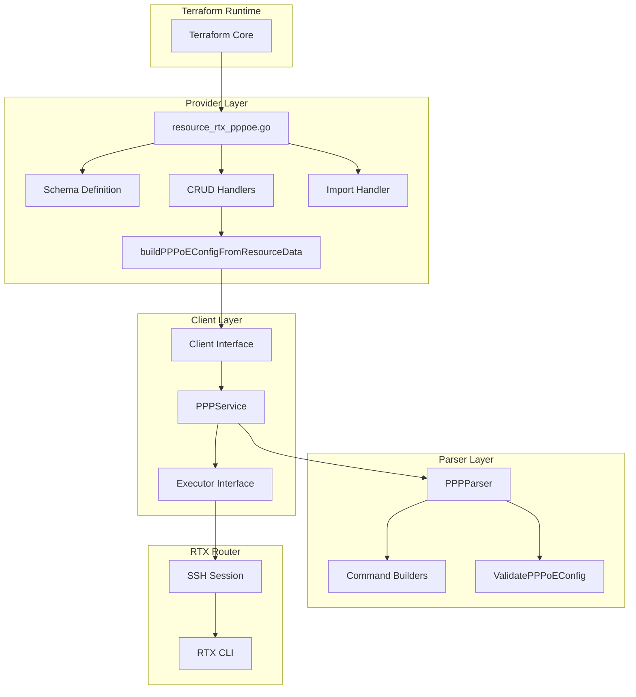
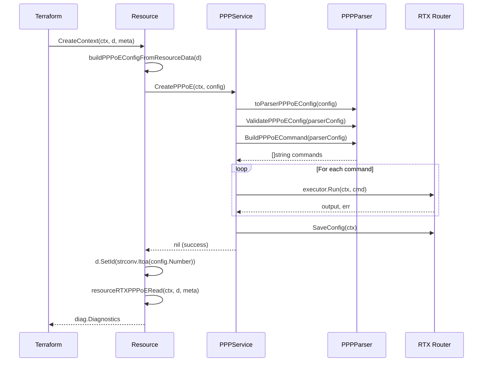

# Master Design: PPP/PPPoE Resources

## Overview

The PPPoE resource implementation enables Terraform-based management of PPP over Ethernet connections on Yamaha RTX routers. The architecture follows the standard three-layer pattern: Provider Layer (Terraform resource), Client Layer (service abstraction), and Parser Layer (RTX CLI parsing). This design ensures separation of concerns, testability, and maintainability.

## Resource Summary

| Attribute | Value |
|-----------|-------|
| Resource Name | `rtx_pppoe` |
| Service File | `internal/client/ppp_service.go` |
| Parser File | `internal/rtx/parsers/ppp.go` |
| Resource File | `internal/provider/resource_rtx_pppoe.go` |
| Last Updated | 2026-01-23 |
| Source Specs | Implementation-based (primary source) |

## Steering Document Alignment

### Technical Standards (tech.md)

- **Go 1.23**: Implementation uses standard Go patterns
- **Terraform Plugin Framework**: Resource uses modern Plugin Framework schema and CRUD contexts
- **Stateless Communication**: Each operation establishes fresh SSH connection
- **Credential Security**: Password marked sensitive; not logged or read from router
- **State Handling**: Only configuration attributes persisted; no operational status

### Project Structure (structure.md)

- **File Naming**: `resource_rtx_pppoe.go`, `ppp_service.go`, `ppp.go` follow conventions
- **Package Organization**: Provider, Client, Parsers packages properly separated
- **Test Files**: `*_test.go` files present for all components
- **Dependency Rules**: Parser has no internal dependencies; client depends on parser

## Code Reuse Analysis

### Existing Components to Leverage

- **`Executor` Interface**: Abstracts command execution; enables mock testing
- **`rtxClient` Base**: Provides `SaveConfig()` and connection management
- **Logging Package**: `logging.FromContext(ctx)` for structured debug logging
- **Validation Patterns**: `validation.IntAtLeast`, `validation.StringInSlice` from SDK

### Integration Points

- **Provider Registration**: Resource registered in `provider.go` ResourcesMap
- **Client Interface**: Methods added to `Client` interface in `interfaces.go`
- **Parser Registry**: Parser instantiated directly (not using registry pattern)

## Architecture

The PPPoE resource follows the standard three-layer architecture with clear separation of concerns.



### Data Flow: Create Operation



## Components and Interfaces

### Component 1: PPPService (`internal/client/ppp_service.go`)

- **Purpose:** Orchestrates PPPoE CRUD operations, translates between client and parser types
- **Interfaces:**
  ```go
  type PPPService struct {
      executor Executor
      client   *rtxClient
  }

  // CRUD Operations
  func (s *PPPService) List(ctx context.Context) ([]PPPoEConfig, error)
  func (s *PPPService) Get(ctx context.Context, ppNum int) (*PPPoEConfig, error)
  func (s *PPPService) Create(ctx context.Context, config PPPoEConfig) error
  func (s *PPPService) Update(ctx context.Context, config PPPoEConfig) error
  func (s *PPPService) Delete(ctx context.Context, ppNum int) error

  // IP Configuration Operations
  func (s *PPPService) GetIPConfig(ctx context.Context, ppNum int) (*PPIPConfig, error)
  func (s *PPPService) ConfigureIPConfig(ctx context.Context, ppNum int, config PPIPConfig) error

  // Status Operations
  func (s *PPPService) GetConnectionStatus(ctx context.Context, ppNum int) (*PPConnectionStatus, error)

  // Type Conversion
  func (s *PPPService) toParserPPPoEConfig(config PPPoEConfig) parsers.PPPoEConfig
  func (s *PPPService) fromParserPPPoEConfig(config parsers.PPPoEConfig) PPPoEConfig
  ```
- **Dependencies:** `Executor` interface, `*rtxClient`, `parsers` package
- **Reuses:** Standard service pattern from other resources (DHCP, NAT, etc.)

### Component 2: PPPParser (`internal/rtx/parsers/ppp.go`)

- **Purpose:** Parses RTX CLI output for PPPoE configurations; builds CLI commands
- **Interfaces:**
  ```go
  type PPPParser struct{}

  func NewPPPParser() *PPPParser
  func (p *PPPParser) ParsePPPoEConfig(raw string) ([]PPPoEConfig, error)
  func (p *PPPParser) ParsePPInterfaceConfig(raw string, ppNum int) (*PPIPConfig, error)

  // Command Builders
  func BuildPPSelectCommand(ppNum int) string
  func BuildPPDescriptionCommand(description string) string
  func BuildPPPoEUseCommand(iface string) string
  func BuildPPBindCommand(iface string) string
  func BuildPPPoEServiceNameCommand(serviceName string) string
  func BuildPPPoEACNameCommand(acName string) string
  func BuildPPPAuthAcceptCommand(method string) string
  func BuildPPPAuthMynameCommand(username, password string) string
  func BuildPPAlwaysOnCommand(enabled bool) string
  func BuildPPDisconnectTimeCommand(seconds int) string
  func BuildPPEnableCommand(ppNum int) string
  func BuildPPDisableCommand(ppNum int) string
  func BuildPPReconnectCommand(interval int, attempts int) string

  // IP PP Commands
  func BuildIPPPAddressCommand(address string) string
  func BuildIPPPMTUCommand(mtu int) string
  func BuildIPPPTCPMSSLimitCommand(mss int) string
  func BuildIPPPNATDescriptorCommand(descriptorID int) string
  func BuildIPPPSecureFilterInCommand(filterIDs []int) string
  func BuildIPPPSecureFilterOutCommand(filterIDs []int) string

  // Delete Commands
  func BuildDeleteIPPPAddressCommand() string
  func BuildDeleteIPPPMTUCommand() string
  func BuildDeleteIPPPNATDescriptorCommand() string

  // Full Command Builders
  func BuildPPPoECommand(config PPPoEConfig) []string
  func BuildDeletePPPoECommand(ppNum int) []string

  // Validation
  func ValidatePPPoEConfig(config PPPoEConfig) error
  func ValidatePPIPConfig(config PPIPConfig) error
  ```
- **Dependencies:** None (leaf package)
- **Reuses:** Standard regex parsing patterns

### Component 3: Terraform Resource (`internal/provider/resource_rtx_pppoe.go`)

- **Purpose:** Terraform resource definition implementing CRUD lifecycle
- **Interfaces:**
  ```go
  func resourceRTXPPPoE() *schema.Resource
  func resourceRTXPPPoECreate(ctx context.Context, d *schema.ResourceData, meta interface{}) diag.Diagnostics
  func resourceRTXPPPoERead(ctx context.Context, d *schema.ResourceData, meta interface{}) diag.Diagnostics
  func resourceRTXPPPoEUpdate(ctx context.Context, d *schema.ResourceData, meta interface{}) diag.Diagnostics
  func resourceRTXPPPoEDelete(ctx context.Context, d *schema.ResourceData, meta interface{}) diag.Diagnostics
  func resourceRTXPPPoEImport(ctx context.Context, d *schema.ResourceData, meta interface{}) ([]*schema.ResourceData, error)
  func buildPPPoEConfigFromResourceData(d *schema.ResourceData) client.PPPoEConfig
  ```
- **Dependencies:** `client` package, `schema` package, `diag` package
- **Reuses:** Standard Terraform resource patterns

### Component 4: Client Interface Extension (`internal/client/interfaces.go`)

- **Purpose:** Extend Client interface with PPPoE methods
- **Interfaces:**
  ```go
  // Added to existing Client interface:
  ListPPPoE(ctx context.Context) ([]PPPoEConfig, error)
  GetPPPoE(ctx context.Context, ppNum int) (*PPPoEConfig, error)
  CreatePPPoE(ctx context.Context, config PPPoEConfig) error
  UpdatePPPoE(ctx context.Context, config PPPoEConfig) error
  DeletePPPoE(ctx context.Context, ppNum int) error
  GetPPConnectionStatus(ctx context.Context, ppNum int) (*PPConnectionStatus, error)
  GetPPInterfaceConfig(ctx context.Context, ppNum int) (*PPIPConfig, error)
  ConfigurePPInterface(ctx context.Context, ppNum int, config PPIPConfig) error
  UpdatePPInterfaceConfig(ctx context.Context, ppNum int, config PPIPConfig) error
  ResetPPInterfaceConfig(ctx context.Context, ppNum int) error
  ```
- **Dependencies:** Existing Client interface
- **Reuses:** Pattern from existing interface methods

## Data Models

### PPPoEConfig (Primary Configuration Model)

```go
// PPPoEConfig represents PPPoE connection configuration on an RTX router
type PPPoEConfig struct {
    Number            int                 `json:"number"`                       // PP interface number (1-based)
    Name              string              `json:"name,omitempty"`               // Connection name/description
    Interface         string              `json:"interface,omitempty"`          // PP interface name (e.g., "pp 1")
    PPInterface       string              `json:"pp_interface,omitempty"`       // Computed: "pp{Number}" (e.g., "pp1")
    BindInterface     string              `json:"bind_interface"`               // Physical interface to bind (lan2, etc.)
    ServiceName       string              `json:"service_name,omitempty"`       // PPPoE service name filter
    ACName            string              `json:"ac_name,omitempty"`            // PPPoE AC name filter
    Authentication    *PPPAuth            `json:"authentication,omitempty"`     // PPP authentication settings
    AlwaysOn          bool                `json:"always_on,omitempty"`          // Keep connection always active
    IPConfig          *PPIPConfig         `json:"ip_config,omitempty"`          // IP configuration for PP interface
    Enabled           bool                `json:"enabled"`                      // PP interface enabled
    DisconnectTimeout int                 `json:"disconnect_timeout,omitempty"` // Idle disconnect timeout in seconds
    LCPReconnect      *LCPReconnectConfig `json:"lcp_reconnect,omitempty"`      // Reconnect/backoff settings
}

// PPPAuth represents PPP authentication configuration
type PPPAuth struct {
    Method   string `json:"method,omitempty"`   // Auth method: pap, chap, mschap, mschap-v2
    Username string `json:"username,omitempty"` // Username (pp auth myname)
    Password string `json:"password,omitempty"` // Password (sensitive)
}

// LCPReconnectConfig represents reconnect/backoff settings
type LCPReconnectConfig struct {
    ReconnectInterval int `json:"reconnect_interval"` // Seconds between reconnect attempts
    ReconnectAttempts int `json:"reconnect_attempts"` // Max attempts (0 = unlimited)
}

// PPIPConfig represents PP interface IP configuration
type PPIPConfig struct {
    Address         string `json:"address,omitempty"`           // IP address or "ipcp" for dynamic
    MTU             int    `json:"mtu,omitempty"`               // MTU size (64-1500)
    TCPMSSLimit     int    `json:"tcp_mss_limit,omitempty"`     // TCP MSS limit (1-1460)
    NATDescriptor   int    `json:"nat_descriptor,omitempty"`    // NAT descriptor number
    SecureFilterIn  []int  `json:"secure_filter_in,omitempty"`  // Inbound filter numbers
    SecureFilterOut []int  `json:"secure_filter_out,omitempty"` // Outbound filter numbers
}

// PPConnectionStatus represents PPPoE connection status (read-only)
type PPConnectionStatus struct {
    PPNumber  int    `json:"pp_number"`            // PP interface number
    Connected bool   `json:"connected"`            // Connection established
    State     string `json:"state,omitempty"`      // "connected", "disconnected", "unknown"
    RawStatus string `json:"raw_status,omitempty"` // Raw status output
}
```

### Terraform Schema

```hcl
resource "rtx_pppoe" "example" {
  # Required
  pp_number      = 1                    # PP interface number (1-based), ForceNew
  bind_interface = "lan2"               # Physical interface (lan2, lan3, etc.)
  username       = "user@provider.ne.jp" # PPPoE username
  password       = "secret"             # PPPoE password (sensitive)

  # Optional
  name               = "ISP Connection" # Connection description
  service_name       = "FLET'S"         # PPPoE service name filter
  ac_name            = "BRAS"           # PPPoE AC name filter
  auth_method        = "chap"           # pap, chap, mschap, mschap-v2 (default: chap)
  always_on          = true             # Keep connection active (default: true)
  disconnect_timeout = 0                # Idle timeout seconds (default: 0 = off)
  reconnect_interval = 10               # Keepalive interval seconds
  reconnect_attempts = 3                # Max reconnect attempts
  enabled            = true             # Enable PP interface (default: true)
}
```

## RTX Command Mapping

### Create PPPoE Configuration

```
# Select PP interface context
pp select 1

# Set description
description pp NTT FLET'S NGN

# Bind physical interface
pppoe use lan2
# OR
pp bind lan2

# Set service/AC name filters (optional)
pppoe service-name FLET'S HIKARI
pppoe ac-name BRAS001

# Configure authentication
pp auth accept chap
pp auth myname user@example.ne.jp secretpassword

# Set connection behavior
pp always-on on
pp disconnect time off
# OR
pp disconnect time 300

# Configure reconnection (optional)
pp keepalive interval 10 retry-interval 3

# Enable the interface
pp enable 1
```

Example: `pp select 1` followed by `pppoe use lan2`

### Read Configuration

```
show config
```

Parses output for patterns:
- `pp select <num>` - PP interface context start
- `description pp <text>` - Interface description
- `pppoe use <iface>` - Physical interface binding
- `pp bind <iface>` - Alternative binding
- `pppoe service-name <name>` - Service filter
- `pppoe ac-name <name>` - AC filter
- `pp auth accept <method>` - Auth method
- `pp auth myname <user> <pass>` - Credentials
- `pp always-on on|off` - Connection persistence
- `pp disconnect time <sec>|off` - Idle timeout
- `pp keepalive interval <n> retry-interval <m>` - Reconnection
- `pp enable <num>` - Interface enabled
- `ip pp address <addr>` - IP address
- `ip pp mtu <size>` - MTU
- `ip pp tcp mss limit <size>` - TCP MSS
- `ip pp nat descriptor <id>` - NAT binding
- `ip pp secure filter in <ids...>` - Inbound filters
- `ip pp secure filter out <ids...>` - Outbound filters

### Update Configuration

```
# Select the PP interface
pp select 1

# Update individual settings (each command sent separately)
description pp Updated Description
pp auth accept pap
pp auth myname newuser@isp.jp newpassword
pp always-on off

# Enable or disable
pp enable 1
# OR
pp disable 1
```

### Delete Configuration

```
# Disable first
pp disable 1

# Select context
pp select 1

# Remove all configuration
no description
no pppoe use
no pp bind
no pppoe service-name
no pp auth accept
no pp auth myname
pp always-on off
no ip pp address
no ip pp mtu
no ip pp nat descriptor
no ip pp secure filter in
no ip pp secure filter out
```

## Error Handling

### Error Scenarios

1. **Invalid PP Number**
   - **Handling:** Validation rejects pp_number < 1
   - **User Impact:** Terraform validation error before apply

2. **Missing Interface Binding**
   - **Handling:** Validation requires either `interface` or `bind_interface`
   - **User Impact:** Terraform validation error

3. **Invalid Authentication Method**
   - **Handling:** Schema validation via `StringInSlice`
   - **User Impact:** Terraform validation error listing valid methods

4. **Invalid MTU Value**
   - **Handling:** Validation checks 64 <= MTU <= 1500
   - **User Impact:** Error message with valid range

5. **Invalid TCP MSS Value**
   - **Handling:** Validation checks 1 <= MSS <= 1460
   - **User Impact:** Error message with valid range

6. **Configuration Not Found on Read**
   - **Handling:** If error contains "not found", clear resource ID
   - **User Impact:** Resource removed from state; Terraform plans to recreate

7. **SSH Connection Failure**
   - **Handling:** Error propagated from executor
   - **User Impact:** Apply fails with connection error

8. **Context Cancellation**
   - **Handling:** Context checked before each command
   - **User Impact:** Operation aborted cleanly

9. **Save Configuration Failure**
   - **Handling:** Error returned after commands executed
   - **User Impact:** Commands applied but not persisted; re-run should work

## Testing Strategy

### Unit Testing

- **Parser Tests** (`ppp_test.go`):
  - `TestParsePPPoEConfig_BasicConfiguration` - Parse single PP config
  - `TestParsePPPoEConfig_MultipleInterfaces` - Parse multiple PP configs
  - `TestParsePPPoEConfig_WithServiceName` - Parse service-name
  - `TestParsePPPoEConfig_WithTCPMSSLimit` - Parse TCP MSS
  - `TestParsePPPoEConfig_WithSecureFilter` - Parse filters
  - `TestParsePPPoEConfig_DisconnectTime` - Parse disconnect timeout
  - `TestParsePPPoEConfig_Reconnect` - Parse reconnect settings
  - `TestParsePPPoEConfig_Empty` - Handle empty input
  - `TestParsePPPoEConfig_CommentsIgnored` - Ignore # and ! comments
  - `TestBuildPP*Command` - Test all command builders
  - `TestValidatePPPoEConfig` - Validation test cases
  - `TestPPPoERoundTrip` - Build commands then parse back

- **Service Tests** (`ppp_service_test.go`):
  - `TestPPPService_List` - List configurations
  - `TestPPPService_Get` - Get by PP number
  - `TestPPPService_Get_ExecutorError` - Handle executor errors
  - `TestPPPService_Create_InvalidConfig` - Validation failure
  - `TestPPPService_Create_ContextCanceled` - Context cancellation
  - `TestPPPService_Delete_InvalidPPNumber` - Invalid PP number
  - `TestPPPService_GetConnectionStatus` - Connection status parsing
  - `TestPPPService_ConversionFunctions` - Type conversions

- **Resource Tests** (`resource_rtx_pppoe_test.go`):
  - `TestBuildPPPoEConfigFromResourceData_BasicConfig` - Basic conversion
  - `TestBuildPPPoEConfigFromResourceData_WithServiceName` - With service name
  - `TestBuildPPPoEConfigFromResourceData_WithACName` - With AC name
  - `TestBuildPPPoEConfigFromResourceData_WithDisconnectTimeout` - With timeout
  - `TestBuildPPPoEConfigFromResourceData_DefaultValues` - Default handling
  - `TestBuildPPPoEConfigFromResourceData_AllAuthMethods` - All auth methods
  - `TestResourceRTXPPPoESchema` - Schema validation

### Integration Testing

- **Resource Tests** (with mock executor):
  - Full CRUD lifecycle test
  - Import test
  - Error handling tests

### End-to-End Testing

- **Acceptance Tests** (with real RTX router, TF_ACC=1):
  - Create PPPoE connection, verify on router
  - Update settings, verify changes
  - Import existing configuration
  - Delete and verify removal
  - Reconnection behavior test

## File Structure

```
internal/
├── provider/
│   ├── resource_rtx_pppoe.go          # Terraform resource implementation
│   └── resource_rtx_pppoe_test.go     # Resource unit tests
├── client/
│   ├── interfaces.go                   # MODIFIED: PPPoE methods added
│   ├── client.go                       # MODIFIED: PPPService initialization
│   ├── ppp_service.go                  # PPP/PPPoE service implementation
│   └── ppp_service_test.go             # Service unit tests
└── rtx/
    └── parsers/
        ├── ppp.go                      # PPPoE parser and command builders
        └── ppp_test.go                 # Parser unit tests
```

## Implementation Notes

1. **Password Handling**: The password is never read from the router because RTX stores it encrypted. On import, password is set to empty string and user must provide actual value in HCL.

2. **PP Number as ID**: The resource ID is simply the PP number (e.g., "1", "2"). This is parsed with `strconv.Atoi()` and validated to be >= 1.

3. **ForceNew on pp_number**: Changing the PP number requires destroying and recreating the resource because PP interfaces are identified by number.

4. **Enabled State**: The `enabled` attribute maps to `pp enable <num>` / `pp disable <num>`. The enable command must come after all other configuration.

5. **Delete Best-Effort**: Delete operations continue even if individual commands fail (e.g., if a setting wasn't configured). This ensures cleanup completes.

6. **Connection Status Not in State**: The `GetConnectionStatus` method exists for potential data source use but connection state is NOT stored in Terraform state to avoid perpetual diffs.

7. **Authentication Method Order**: The `pp auth accept` command supports multiple methods (e.g., `pp auth accept pap chap`). Current implementation uses single method only.

8. **Interface Binding**: Both `pppoe use <iface>` and `pp bind <iface>` are supported. The resource uses `bind_interface` which maps to `pp bind` in current implementation.

9. **LCP Reconnect**: Uses `pp keepalive interval <n> retry-interval <m>` syntax which differs from some documentation. Parser handles this format.

10. **Japanese Status Detection**: Connection status parsing handles both English ("PP[ON]") and Japanese ("接続中") status indicators.

11. **Computed `pp_interface`**: The `pp_interface` attribute is computed from `pp_number` as `fmt.Sprintf("pp%d", config.Number)`. This enables Terraform resource references like `rtx_pppoe.primary.pp_interface` instead of hardcoded strings like `"pp1"`.

## State Handling

- Persist only configuration attributes in Terraform state
- Operational/runtime status (connected/disconnected) must not be stored in state
- Password stored in state (marked sensitive) to detect configuration drift
- PP number stored as resource ID

## Change History

| Date | Source Spec | Changes |
|------|-------------|---------|
| 2026-01-23 | Implementation-based | Initial master design created from existing implementation |
| 2026-01-25 | Implementation Sync | Add computed `pp_interface` attribute for resource references |
| 2026-02-01 | Implementation Audit | Update to Terraform Plugin Framework (not SDK v2) |
