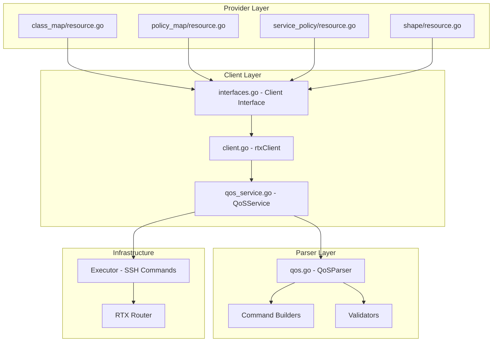

# Master Design: QoS Resources

## Overview

This document specifies the technical design and implementation details for Quality of Service (QoS) resources in the Terraform Provider for Yamaha RTX routers. The QoS subsystem follows a three-layer architecture: Provider Layer (Terraform resource definitions), Client Layer (service abstraction and API), and Parser Layer (RTX command building and output parsing).

## Resource Summary

| Attribute | Value |
|-----------|-------|
| Resources | `rtx_class_map`, `rtx_policy_map`, `rtx_service_policy`, `rtx_shape` |
| Service File | `internal/client/qos_service.go` |
| Parser File | `internal/rtx/parsers/qos.go` |
| Resource Directories | `internal/provider/resources/class_map/`, `policy_map/`, `service_policy/`, `shape/` |
| Last Updated | 2026-02-01 |
| Source Specs | Implementation code analysis |

## Steering Document Alignment

### Technical Standards (tech.md)

- Uses **Terraform Plugin Framework** for resource definitions
- Follows Go naming conventions and project coding standards
- Implements context-aware operations with proper cancellation support
- Uses structured logging via the `logging` package

### Project Structure (structure.md)

- Provider layer: `internal/provider/resources/{name}/` (resource.go + model.go pattern)
- Client layer: `internal/client/`
- Parser layer: `internal/rtx/parsers/`
- Tests co-located with implementation files

## Code Reuse Analysis

### Existing Components to Leverage

- **Executor Interface**: Reuses the `Executor` interface for SSH command execution
- **rtxClient**: Integrates with existing client for `SaveConfig()` operations
- **logging.FromContext**: Uses project-wide structured logging
- **validation helpers**: Uses Terraform SDK validation functions

### Integration Points

- **Client Interface** (`internal/client/interfaces.go`): Extended with QoS method signatures
- **rtxClient** (`internal/client/client.go`): Delegates QoS operations to QoSService
- **Provider** (`internal/provider/provider.go`): Registers QoS resources

---

## Architecture

The QoS implementation follows a clean layered architecture with clear separation of concerns.



### Data Flow

```mermaid
sequenceDiagram
    participant TF as Terraform
    participant Res as Resource
    participant Svc as QoSService
    participant Par as Parser
    participant Exe as Executor
    participant RTX as Router

    TF->>Res: Create/Update/Delete
    Res->>Svc: Service Method Call
    Svc->>Par: Validate Input
    Par-->>Svc: Validation Result
    Svc->>Par: Build Command
    Par-->>Svc: RTX Command String
    Svc->>Exe: Execute Command
    Exe->>RTX: SSH Command
    RTX-->>Exe: Output
    Exe-->>Svc: Raw Output
    Svc->>Par: Parse Output
    Par-->>Svc: Structured Data
    Svc-->>Res: Result
    Res-->>TF: Diagnostics
```

---

## Components and Interfaces

### Component 1: QoSService (`internal/client/qos_service.go`)

- **Purpose**: Orchestrates QoS CRUD operations, coordinates between executor and parser
- **Dependencies**: `Executor` interface, `rtxClient` for SaveConfig, `parsers` package
- **Reuses**: Executor pattern from other services

```go
// QoSService handles QoS operations (class-map, policy-map, service-policy, shape)
type QoSService struct {
    executor Executor
    client   *rtxClient
}

func NewQoSService(executor Executor, client *rtxClient) *QoSService

// Class Map Methods
func (s *QoSService) CreateClassMap(ctx context.Context, cm ClassMap) error
func (s *QoSService) GetClassMap(ctx context.Context, name string) (*ClassMap, error)
func (s *QoSService) UpdateClassMap(ctx context.Context, cm ClassMap) error
func (s *QoSService) DeleteClassMap(ctx context.Context, name string) error
func (s *QoSService) ListClassMaps(ctx context.Context) ([]ClassMap, error)

// Policy Map Methods
func (s *QoSService) CreatePolicyMap(ctx context.Context, pm PolicyMap) error
func (s *QoSService) GetPolicyMap(ctx context.Context, name string) (*PolicyMap, error)
func (s *QoSService) UpdatePolicyMap(ctx context.Context, pm PolicyMap) error
func (s *QoSService) DeletePolicyMap(ctx context.Context, name string) error
func (s *QoSService) ListPolicyMaps(ctx context.Context) ([]PolicyMap, error)

// Service Policy Methods
func (s *QoSService) CreateServicePolicy(ctx context.Context, sp ServicePolicy) error
func (s *QoSService) GetServicePolicy(ctx context.Context, iface, direction string) (*ServicePolicy, error)
func (s *QoSService) UpdateServicePolicy(ctx context.Context, sp ServicePolicy) error
func (s *QoSService) DeleteServicePolicy(ctx context.Context, iface, direction string) error
func (s *QoSService) ListServicePolicies(ctx context.Context) ([]ServicePolicy, error)

// Shape Methods
func (s *QoSService) CreateShape(ctx context.Context, sc ShapeConfig) error
func (s *QoSService) GetShape(ctx context.Context, iface, direction string) (*ShapeConfig, error)
func (s *QoSService) UpdateShape(ctx context.Context, sc ShapeConfig) error
func (s *QoSService) DeleteShape(ctx context.Context, iface, direction string) error
func (s *QoSService) ListShapes(ctx context.Context) ([]ShapeConfig, error)
```

### Component 2: QoS Parser (`internal/rtx/parsers/qos.go`)

- **Purpose**: Parses RTX router output and builds configuration commands
- **Dependencies**: Standard library only (regexp, strconv, strings, fmt)
- **Reuses**: Regex parsing patterns from other parsers

```go
// Data Models
type QoSConfig struct {
    Interface    string     `json:"interface"`
    QueueType    string     `json:"queue_type,omitempty"`
    Classes      []QoSClass `json:"classes,omitempty"`
    ShapeAverage int        `json:"shape_average,omitempty"`
    ShapeBurst   int        `json:"shape_burst,omitempty"`
    Speed        int        `json:"speed,omitempty"`
}

type ClassMap struct {
    Name                 string `json:"name"`
    MatchProtocol        string `json:"match_protocol,omitempty"`
    MatchDestinationPort []int  `json:"match_destination_port,omitempty"`
    MatchSourcePort      []int  `json:"match_source_port,omitempty"`
    MatchDSCP            string `json:"match_dscp,omitempty"`
    MatchFilter          int    `json:"match_filter,omitempty"`
}

type PolicyMap struct {
    Name    string           `json:"name"`
    Classes []PolicyMapClass `json:"classes,omitempty"`
}

type PolicyMapClass struct {
    Name             string `json:"name"`
    Priority         string `json:"priority,omitempty"`
    BandwidthPercent int    `json:"bandwidth_percent,omitempty"`
    PoliceCIR        int    `json:"police_cir,omitempty"`
    QueueLimit       int    `json:"queue_limit,omitempty"`
}

type ServicePolicy struct {
    Interface string `json:"interface"`
    Direction string `json:"direction"`
    PolicyMap string `json:"policy_map"`
}

type ShapeConfig struct {
    Interface    string `json:"interface"`
    Direction    string `json:"direction"`
    ShapeAverage int    `json:"shape_average"`
    ShapeBurst   int    `json:"shape_burst,omitempty"`
}

// Parser Methods
type QoSParser struct{}
func NewQoSParser() *QoSParser
func (p *QoSParser) ParseQoSConfig(raw string, iface string) (*QoSConfig, error)
func (p *QoSParser) ParseClassMap(raw string, name string) (*ClassMap, error)
func (p *QoSParser) ParseServicePolicy(raw string, iface string) (*ServicePolicy, error)
func (p *QoSParser) ParseShapeConfig(raw string, iface string) (*ShapeConfig, error)

// Command Builders
func BuildQueueTypeCommand(iface, queueType string) string
func BuildQueueClassFilterCommand(iface string, classNum, filterNum int) string
func BuildQueueClassPriorityCommand(iface string, classNum int, priority string) string
func BuildQueueLengthCommand(iface string, classNum, length int) string
func BuildSpeedCommand(iface string, bandwidth int) string
func BuildDeleteQueueTypeCommand(iface string) string
func BuildDeleteSpeedCommand(iface string) string
func BuildShowQoSCommand(iface string) string
func BuildShowAllQoSCommand() string

// Validators
func ValidateQoSConfig(config QoSConfig) error
func ValidateClassMap(cm ClassMap) error
func ValidatePolicyMap(pm PolicyMap) error
func ValidateServicePolicy(sp ServicePolicy) error
func ValidateShapeConfig(sc ShapeConfig) error
```

### Component 3: Terraform Resources (`internal/provider/resource_rtx_*.go`)

- **Purpose**: Terraform resource definitions implementing CRUD lifecycle
- **Dependencies**: terraform-plugin-sdk/v2, client package
- **Reuses**: Standard Terraform resource patterns

#### rtx_class_map Resource

```go
func resourceRTXClassMap() *schema.Resource
func resourceRTXClassMapCreate(ctx context.Context, d *schema.ResourceData, meta interface{}) diag.Diagnostics
func resourceRTXClassMapRead(ctx context.Context, d *schema.ResourceData, meta interface{}) diag.Diagnostics
func resourceRTXClassMapUpdate(ctx context.Context, d *schema.ResourceData, meta interface{}) diag.Diagnostics
func resourceRTXClassMapDelete(ctx context.Context, d *schema.ResourceData, meta interface{}) diag.Diagnostics
func resourceRTXClassMapImport(ctx context.Context, d *schema.ResourceData, meta interface{}) ([]*schema.ResourceData, error)

// Helper functions
func buildClassMapFromResourceData(d *schema.ResourceData) client.ClassMap
func validateClassMapName(v interface{}, k string) ([]string, []error)
```

#### rtx_policy_map Resource

```go
func resourceRTXPolicyMap() *schema.Resource
func resourceRTXPolicyMapCreate(ctx context.Context, d *schema.ResourceData, meta interface{}) diag.Diagnostics
func resourceRTXPolicyMapRead(ctx context.Context, d *schema.ResourceData, meta interface{}) diag.Diagnostics
func resourceRTXPolicyMapUpdate(ctx context.Context, d *schema.ResourceData, meta interface{}) diag.Diagnostics
func resourceRTXPolicyMapDelete(ctx context.Context, d *schema.ResourceData, meta interface{}) diag.Diagnostics
func resourceRTXPolicyMapImport(ctx context.Context, d *schema.ResourceData, meta interface{}) ([]*schema.ResourceData, error)

// Helper functions
func buildPolicyMapFromResourceData(d *schema.ResourceData) client.PolicyMap
func validatePolicyMapName(v interface{}, k string) ([]string, []error)

// CustomizeDiff validates total bandwidth_percent <= 100%
```

#### rtx_service_policy Resource

```go
func resourceRTXServicePolicy() *schema.Resource
func resourceRTXServicePolicyCreate(ctx context.Context, d *schema.ResourceData, meta interface{}) diag.Diagnostics
func resourceRTXServicePolicyRead(ctx context.Context, d *schema.ResourceData, meta interface{}) diag.Diagnostics
func resourceRTXServicePolicyUpdate(ctx context.Context, d *schema.ResourceData, meta interface{}) diag.Diagnostics
func resourceRTXServicePolicyDelete(ctx context.Context, d *schema.ResourceData, meta interface{}) diag.Diagnostics
func resourceRTXServicePolicyImport(ctx context.Context, d *schema.ResourceData, meta interface{}) ([]*schema.ResourceData, error)

// Helper functions
func buildServicePolicyFromResourceData(d *schema.ResourceData) client.ServicePolicy
func parseServicePolicyID(id string) (iface, direction string, err error)
```

#### rtx_shape Resource

```go
func resourceRTXShape() *schema.Resource
func resourceRTXShapeCreate(ctx context.Context, d *schema.ResourceData, meta interface{}) diag.Diagnostics
func resourceRTXShapeRead(ctx context.Context, d *schema.ResourceData, meta interface{}) diag.Diagnostics
func resourceRTXShapeUpdate(ctx context.Context, d *schema.ResourceData, meta interface{}) diag.Diagnostics
func resourceRTXShapeDelete(ctx context.Context, d *schema.ResourceData, meta interface{}) diag.Diagnostics
func resourceRTXShapeImport(ctx context.Context, d *schema.ResourceData, meta interface{}) ([]*schema.ResourceData, error)

// Helper functions
func buildShapeConfigFromResourceData(d *schema.ResourceData) client.ShapeConfig
func parseShapeID(id string) (iface, direction string, err error)
```

### Component 4: Client Interface Extension (`internal/client/interfaces.go`)

- **Purpose**: Define QoS method contracts on Client interface
- **Dependencies**: context package
- **Reuses**: Pattern from existing interface methods

```go
// QoS methods added to Client interface:

// Class Map methods
GetClassMap(ctx context.Context, name string) (*ClassMap, error)
CreateClassMap(ctx context.Context, cm ClassMap) error
UpdateClassMap(ctx context.Context, cm ClassMap) error
DeleteClassMap(ctx context.Context, name string) error
ListClassMaps(ctx context.Context) ([]ClassMap, error)

// Policy Map methods
GetPolicyMap(ctx context.Context, name string) (*PolicyMap, error)
CreatePolicyMap(ctx context.Context, pm PolicyMap) error
UpdatePolicyMap(ctx context.Context, pm PolicyMap) error
DeletePolicyMap(ctx context.Context, name string) error
ListPolicyMaps(ctx context.Context) ([]PolicyMap, error)

// Service Policy methods
GetServicePolicy(ctx context.Context, iface, direction string) (*ServicePolicy, error)
CreateServicePolicy(ctx context.Context, sp ServicePolicy) error
UpdateServicePolicy(ctx context.Context, sp ServicePolicy) error
DeleteServicePolicy(ctx context.Context, iface, direction string) error
ListServicePolicies(ctx context.Context) ([]ServicePolicy, error)

// Shape methods
GetShape(ctx context.Context, iface, direction string) (*ShapeConfig, error)
CreateShape(ctx context.Context, sc ShapeConfig) error
UpdateShape(ctx context.Context, sc ShapeConfig) error
DeleteShape(ctx context.Context, iface, direction string) error
ListShapes(ctx context.Context) ([]ShapeConfig, error)
```

---

## Data Models

### ClassMap (Client Layer)

```go
// ClassMap represents a class-map configuration for traffic classification
type ClassMap struct {
    Name                 string `json:"name"`                             // Class map name
    MatchProtocol        string `json:"match_protocol,omitempty"`         // Protocol to match
    MatchDestinationPort []int  `json:"match_destination_port,omitempty"` // Destination ports to match
    MatchSourcePort      []int  `json:"match_source_port,omitempty"`      // Source ports to match
    MatchDSCP            string `json:"match_dscp,omitempty"`             // DSCP value to match
    MatchFilter          int    `json:"match_filter,omitempty"`           // IP filter number to match
}
```

### PolicyMap (Client Layer)

```go
// PolicyMap represents a policy-map configuration
type PolicyMap struct {
    Name    string           `json:"name"`              // Policy map name
    Classes []PolicyMapClass `json:"classes,omitempty"` // Policy map classes
}

// PolicyMapClass represents a class within a policy map
type PolicyMapClass struct {
    Name             string `json:"name"`                        // Class name (references class-map)
    Priority         string `json:"priority,omitempty"`          // Priority level (high, normal, low)
    BandwidthPercent int    `json:"bandwidth_percent,omitempty"` // Bandwidth percentage
    PoliceCIR        int    `json:"police_cir,omitempty"`        // Committed Information Rate in bps
    QueueLimit       int    `json:"queue_limit,omitempty"`       // Queue limit (depth)
}
```

### ServicePolicy (Client Layer)

```go
// ServicePolicy represents a service-policy attachment to an interface
type ServicePolicy struct {
    Interface string `json:"interface"`  // Interface name
    Direction string `json:"direction"`  // input or output
    PolicyMap string `json:"policy_map"` // Policy map name
}
```

### ShapeConfig (Client Layer)

```go
// ShapeConfig represents traffic shaping configuration
type ShapeConfig struct {
    Interface    string `json:"interface"`             // Interface name
    Direction    string `json:"direction"`             // input or output
    ShapeAverage int    `json:"shape_average"`         // Average rate in bps
    ShapeBurst   int    `json:"shape_burst,omitempty"` // Burst size in bytes
}
```

### Terraform Schema Examples

#### rtx_class_map Schema

```hcl
resource "rtx_class_map" "voip" {
  name                   = "voip-traffic"
  match_protocol         = "sip"
  match_destination_port = [5060, 5061]
  match_source_port      = []
  match_dscp             = "ef"
  match_filter           = 100
}
```

#### rtx_policy_map Schema

```hcl
resource "rtx_policy_map" "corporate" {
  name = "corporate-qos"

  class {
    name              = "voip-traffic"
    priority          = "high"
    bandwidth_percent = 20
    police_cir        = 1000000
    queue_limit       = 64
  }

  class {
    name              = "default"
    priority          = "normal"
    bandwidth_percent = 80
  }
}
```

#### rtx_service_policy Schema

```hcl
resource "rtx_service_policy" "lan1_qos" {
  interface  = "lan1"
  direction  = "output"
  policy_map = "priority"
}
```

#### rtx_shape Schema

```hcl
resource "rtx_shape" "wan_shaping" {
  interface     = "wan1"
  direction     = "output"
  shape_average = 100000000  # 100 Mbps
  shape_burst   = 15000      # 15KB
}
```

---

## RTX Command Mapping

### Service Policy - Create/Update

**Command**: `queue {interface} type {queue_type}`

```
queue lan1 type priority
queue lan2 type cbq
queue wan1 type fifo
```

### Service Policy - Delete

**Command**: `no queue {interface} type`

```
no queue lan1 type
```

### Shape - Create/Update

**Command**: `speed {interface} {bandwidth}`

```
speed lan1 1000000
speed wan1 100000000
```

### Shape - Delete

**Command**: `no speed {interface}`

```
no speed lan1
```

### Queue Class Filter

**Command**: `queue {interface} class filter {class_num} {filter_num}`

```
queue lan1 class filter 1 100
queue lan1 class filter 2 200
```

### Queue Class Priority

**Command**: `queue {interface} class priority {class_num} {priority}`

```
queue lan1 class priority 1 high
queue lan1 class priority 2 normal
queue lan1 class priority 3 low
```

### Queue Length

**Command**: `queue {interface} length {class_num} {length}`

```
queue lan1 length 1 64
queue lan1 length 2 128
```

### Show QoS Configuration

**Command**: `show config | grep "queue {interface}\|speed {interface}"`

Example output:
```
queue lan1 type priority
queue lan1 class filter 1 100
queue lan1 class priority 1 high
queue lan1 length 1 64
speed lan1 1000000
```

---

## Error Handling

### Error Scenarios

1. **Invalid Class Map Name**
   - **Trigger**: Name doesn't start with letter or contains invalid characters
   - **Handling**: Return validation error during plan phase
   - **User Impact**: Clear error message with naming requirements

2. **Bandwidth Exceeds 100%**
   - **Trigger**: Sum of bandwidth_percent in policy-map classes > 100
   - **Handling**: CustomizeDiff returns error during plan
   - **User Impact**: Error shows total percentage and limit

3. **Resource Not Found During Read**
   - **Trigger**: Resource deleted outside Terraform
   - **Handling**: Clear resource ID, remove from state
   - **User Impact**: Next apply will recreate resource

4. **Command Execution Failure**
   - **Trigger**: SSH error, router rejects command
   - **Handling**: Return diag.Errorf with command output
   - **User Impact**: Error message includes router response

5. **Invalid Direction**
   - **Trigger**: Direction not "input" or "output"
   - **Handling**: Validation error during plan
   - **User Impact**: Clear error with valid options

6. **Context Cancellation**
   - **Trigger**: User cancels operation, timeout
   - **Handling**: Check ctx.Done() before operations, return ctx.Err()
   - **User Impact**: Clean cancellation without partial state

7. **Save Configuration Failure**
   - **Trigger**: Router fails to persist configuration
   - **Handling**: Return error with "created but failed to save" message
   - **User Impact**: Warning that changes may not persist across reboot

---

## Testing Strategy

### Unit Testing

#### Parser Tests (`internal/rtx/parsers/qos_test.go`)

- **ParseQoSConfig**: Test parsing of various queue configurations
- **ParseServicePolicy**: Test extraction of queue type from config
- **ParseShapeConfig**: Test extraction of speed settings
- **BuildQueueTypeCommand**: Test command generation for all queue types
- **BuildSpeedCommand**: Test speed command generation
- **ValidateClassMap**: Test all validation rules
- **ValidatePolicyMap**: Test bandwidth sum validation
- **ValidateServicePolicy**: Test direction validation
- **ValidateShapeConfig**: Test rate validation

Coverage targets:
- Valid inputs with expected outputs
- Edge cases (empty strings, boundary values)
- Invalid inputs with expected errors
- Multi-interface configurations

#### Service Tests (`internal/client/qos_service_test.go`)

- **CreateClassMap**: Test creation with various match criteria
- **CreatePolicyMap**: Test creation with multiple classes
- **CreateServicePolicy**: Test queue type command execution
- **CreateShape**: Test speed command execution
- **GetServicePolicy**: Test parsing of retrieved configuration
- **GetShape**: Test parsing of speed configuration
- **DeleteServicePolicy**: Test deletion command execution
- **DeleteShape**: Test speed removal command
- **List***: Test bulk retrieval operations

Uses mock executor to verify:
- Correct commands are generated
- Correct parsing of mock outputs
- Error handling for command failures

### Integration Testing

#### Resource Tests (`internal/provider/resource_rtx_*_test.go`)

- **validateClassMapName**: Test name validation function
- **validatePolicyMapName**: Test name validation function
- **parseServicePolicyID**: Test ID parsing for import
- **parseShapeID**: Test ID parsing for import

### End-to-End Testing

#### Acceptance Tests (with real RTX router)

Prerequisites:
- RTX router accessible via SSH
- TF_ACC=1 environment variable set
- Test router configuration backup

Test scenarios:
1. **Basic CRUD Cycle**
   - Create class-map, verify on router
   - Update match criteria, verify changes
   - Delete, verify removal

2. **Policy Map with Classes**
   - Create policy-map with multiple classes
   - Verify all class parameters on router
   - Update bandwidth percentages
   - Delete policy-map

3. **Service Policy Lifecycle**
   - Apply queue type to interface
   - Change queue type (update)
   - Remove service policy

4. **Shape Configuration**
   - Configure traffic shaping
   - Update rate values
   - Remove shaping

5. **Import Testing**
   - Configure QoS manually on router
   - Import each resource type
   - Verify state matches router config

---

## File Structure

```
internal/
├── provider/
│   └── resources/
│       ├── class_map/
│       │   ├── resource.go              # Class-map resource implementation
│       │   └── model.go                 # Data model with ToClient/FromClient
│       ├── policy_map/
│       │   ├── resource.go              # Policy-map resource implementation
│       │   └── model.go                 # Data model with ToClient/FromClient
│       ├── service_policy/
│       │   ├── resource.go              # Service-policy resource implementation
│       │   └── model.go                 # Data model with ToClient/FromClient
│       └── shape/
│           ├── resource.go              # Shape resource implementation
│           └── model.go                 # Data model with ToClient/FromClient
├── client/
│   ├── interfaces.go                    # Client interface with QoS methods
│   ├── client.go                        # rtxClient delegates to QoSService
│   ├── qos_service.go                   # QoS service implementation
│   └── qos_service_test.go              # QoS service tests
└── rtx/
    └── parsers/
        ├── qos.go                       # QoS parser and command builders
        └── qos_test.go                  # Parser tests
```

---

## Implementation Notes

1. **Class Maps as Logical Constructs**: In RTX routers, class-maps are not directly configurable as named entities. They are implemented through IP filters and queue class configurations. The Terraform resource provides an abstraction layer.

2. **Policy Maps Reference Classes**: Policy-map classes reference class-maps by name. Terraform does not enforce this dependency at plan time - runtime errors will occur if referencing non-existent class-maps.

3. **Service Policy Updates**: Updates to service-policy involve delete and recreate because RTX requires removing the queue type before changing it.

4. **Shape Default Direction**: RTX primarily supports output shaping. The direction attribute is included for interface consistency but "output" is the typical use case.

5. **Configuration Persistence**: All QoS operations call `SaveConfig()` to persist changes to router flash memory. This ensures configurations survive reboots.

6. **Context Cancellation**: All service methods check `ctx.Done()` before executing commands to support clean cancellation.

7. **Error Message Parsing**: Delete operations check for "not found" in error messages to handle idempotent deletes gracefully.

8. **Queue Types**: RTX supports queue types: `priority`, `cbq`, `fifo`, `shaping`. Custom policy-map names are also supported.

9. **Bandwidth Validation**: The CustomizeDiff function on policy-map validates that total bandwidth_percent across all classes does not exceed 100%.

---

## State Handling

- **Configuration Only**: Only configuration attributes are stored in Terraform state
- **No Runtime Data**: Queue statistics, drop counts, and current queue depths are NOT stored
- **Resource IDs**:
  - `rtx_class_map`: ID = name
  - `rtx_policy_map`: ID = name
  - `rtx_service_policy`: ID = "{interface}:{direction}"
  - `rtx_shape`: ID = "{interface}:{direction}"

---

## Change History

| Date | Source | Changes |
|------|--------|---------|
| 2026-01-23 | Implementation analysis | Initial master design from existing code |
| 2026-02-01 | Implementation Audit | Update to Terraform Plugin Framework (not SDK v2) |
| 2026-02-01 | Structure Sync | Updated file paths to resources/{name}/ modular structure |
| 2026-02-07 | Implementation Audit | Full audit against implementation code |
