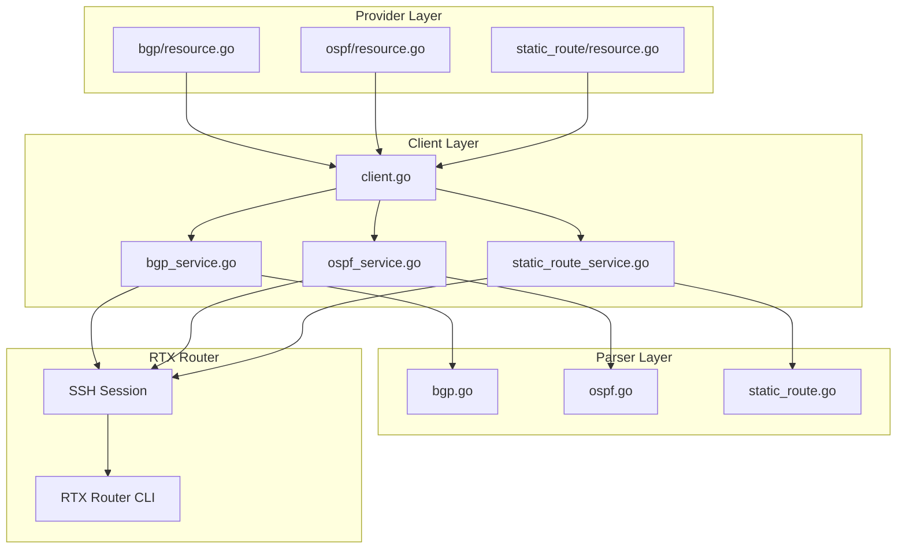

# Master Design: Routing Resources

## Overview

The routing resources provide comprehensive IP routing management for Yamaha RTX routers through Terraform. This design document describes the implementation architecture for three routing resources: `rtx_bgp`, `rtx_ospf`, and `rtx_static_route`. Each follows the provider's layered architecture pattern with Terraform resource definitions, service layer for business logic, and parser layer for RTX CLI command generation and output parsing.

## Resource Summary

### rtx_bgp

| Attribute | Value |
|-----------|-------|
| Resource Name | `rtx_bgp` |
| Service File | `internal/client/bgp_service.go` |
| Parser File | `internal/rtx/parsers/bgp.go` |
| Resource Directory | `internal/provider/resources/bgp/` |
| Last Updated | 2026-02-01 |
| Source Specs | Implementation code analysis |

### rtx_ospf

| Attribute | Value |
|-----------|-------|
| Resource Name | `rtx_ospf` |
| Service File | `internal/client/ospf_service.go` |
| Parser File | `internal/rtx/parsers/ospf.go` |
| Resource Directory | `internal/provider/resources/ospf/` |
| Last Updated | 2026-02-01 |
| Source Specs | Implementation code analysis |

### rtx_static_route

| Attribute | Value |
|-----------|-------|
| Resource Name | `rtx_static_route` |
| Service File | `internal/client/static_route_service.go` |
| Parser File | `internal/rtx/parsers/static_route.go` |
| Resource Directory | `internal/provider/resources/static_route/` |
| Last Updated | 2026-02-01 |
| Source Specs | Implementation code analysis |

## Steering Document Alignment

### Technical Standards (tech.md)
- **Terraform Plugin Framework**: All resources use Plugin Framework for CRUD operations and schema definition
- **SSH Communication**: Commands executed via SSH session using Executor interface
- **Stateless Sessions**: Each operation creates fresh SSH connection for reliability
- **Parser Registry Pattern**: Parsers are modular and isolated for testability

### Project Structure (structure.md)
- **File Naming**: `resources/{name}/resource.go + model.go`, `<feature>_service.go`, `<feature>.go` (parser)
- **Package Organization**: `provider/resources/` -> `client/` -> `rtx/parsers/`
- **Import Order**: Standard library, external dependencies, internal packages
- **No Circular Dependencies**: Parsers have no internal dependencies

## Code Reuse Analysis

### Existing Components to Leverage
- **Executor Interface**: Common command execution interface for all services
- **containsError()**: Shared error detection in command output
- **validateIPv4Address()**: Reused for BGP, OSPF, and static route IP validation
- **validateRouteMask()**: Shared subnet mask validation
- **apiClient wrapper**: Common provider client wrapper

### Integration Points
- **SSH Session**: All services use `Executor.Run()` and `Executor.RunBatch()` for command execution
- **Configuration Save**: All services call `client.SaveConfig()` after modifications
- **Logging**: All services use `logging.FromContext(ctx)` for structured logging

## Architecture

The routing resources follow a consistent three-layer architecture pattern used throughout the provider.

### Modular Design Principles
- **Single File Responsibility**: Each file handles one specific resource or concern
- **Component Isolation**: Services and parsers are independently testable
- **Service Layer Separation**: Business logic isolated from Terraform schema handling
- **Utility Modularity**: Validation functions shared across resources



## Components and Interfaces

### Component 1: BGPService (`internal/client/bgp_service.go`)

- **Purpose:** Manages BGP configuration CRUD operations
- **Interfaces:**
  ```go
  type BGPService struct {
      executor Executor
      client   *rtxClient
  }

  func (s *BGPService) Get(ctx context.Context) (*BGPConfig, error)
  func (s *BGPService) Configure(ctx context.Context, config BGPConfig) error
  func (s *BGPService) Update(ctx context.Context, config BGPConfig) error
  func (s *BGPService) Reset(ctx context.Context) error
  ```
- **Dependencies:** Executor interface, parsers package
- **Reuses:** containsError() for output validation

### Component 2: OSPFService (`internal/client/ospf_service.go`)

- **Purpose:** Manages OSPF configuration CRUD operations
- **Interfaces:**
  ```go
  type OSPFService struct {
      executor Executor
      client   *rtxClient
  }

  func (s *OSPFService) Get(ctx context.Context) (*OSPFConfig, error)
  func (s *OSPFService) Create(ctx context.Context, config OSPFConfig) error
  func (s *OSPFService) Update(ctx context.Context, config OSPFConfig) error
  func (s *OSPFService) Delete(ctx context.Context) error
  ```
- **Dependencies:** Executor interface, parsers package
- **Reuses:** containsError() for output validation

### Component 3: StaticRouteService (`internal/client/static_route_service.go`)

- **Purpose:** Manages static route CRUD operations
- **Interfaces:**
  ```go
  type StaticRouteService struct {
      executor Executor
      client   *rtxClient
  }

  func (s *StaticRouteService) GetRoute(ctx context.Context, prefix, mask string) (*StaticRoute, error)
  func (s *StaticRouteService) CreateRoute(ctx context.Context, route StaticRoute) error
  func (s *StaticRouteService) UpdateRoute(ctx context.Context, route StaticRoute) error
  func (s *StaticRouteService) DeleteRoute(ctx context.Context, prefix, mask string) error
  func (s *StaticRouteService) ListRoutes(ctx context.Context) ([]StaticRoute, error)
  ```
- **Dependencies:** Executor interface, parsers package
- **Reuses:** containsError() for output validation

### Component 4: BGP Parser (`internal/rtx/parsers/bgp.go`)

- **Purpose:** Parses BGP configuration output and builds RTX commands
- **Interfaces:**
  ```go
  type BGPParser struct{}

  func (p *BGPParser) ParseBGPConfig(raw string) (*BGPConfig, error)
  func BuildBGPUseCommand(enable bool) string
  func BuildBGPASNCommand(asn string) string
  func BuildBGPRouterIDCommand(routerID string) string
  func BuildBGPNeighborCommand(neighbor BGPNeighbor) string
  func BuildBGPNeighborPreSharedKeyCommand(neighborID int, password string) string
  func BuildBGPNeighborPasswordCommand(neighborID int, password string) string  // Alias for PreSharedKey
  func BuildBGPNetworkCommand(filterID int, network BGPNetwork) string
  func BuildBGPRedistributeCommand(routeType string) string
  func BuildDeleteBGPNeighborCommand(id int) string
  func BuildDeleteBGPNetworkCommand(filterID int) string
  func BuildDeleteBGPRedistributeCommand(routeType string) string
  func ValidateBGPConfig(config BGPConfig) error
  ```
- **Dependencies:** Standard library only (regexp, strconv, strings)
- **Reuses:** isValidIP() helper function
- **Note:** Neighbor options (hold-time, local-address, passive) are inline parameters in BuildBGPNeighborCommand

### Component 5: OSPF Parser (`internal/rtx/parsers/ospf.go`)

- **Purpose:** Parses OSPF configuration output and builds RTX commands
- **Interfaces:**
  ```go
  type OSPFParser struct{}

  func (p *OSPFParser) ParseOSPFConfig(raw string) (*OSPFConfig, error)
  func BuildOSPFEnableCommand() string
  func BuildOSPFDisableCommand() string
  func BuildOSPFRouterIDCommand(routerID string) string
  func BuildOSPFAreaCommand(area OSPFArea) string
  func BuildIPOSPFAreaCommand(iface, area string) string
  func BuildOSPFImportCommand(routeType string) string
  func BuildDeleteOSPFAreaCommand(areaID string) string
  func BuildDeleteOSPFImportCommand(routeType string) string
  func ValidateOSPFConfig(config OSPFConfig) error
  ```
- **Dependencies:** Standard library only
- **Reuses:** isValidIP(), isValidAreaID() helper functions

### Component 6: Static Route Parser (`internal/rtx/parsers/static_route.go`)

- **Purpose:** Parses static route configuration output and builds RTX commands
- **Interfaces:**
  ```go
  type StaticRouteParser struct{}

  func (p *StaticRouteParser) ParseRouteConfig(raw string) ([]StaticRoute, error)
  func (p *StaticRouteParser) ParseSingleRoute(raw, prefix, mask string) (*StaticRoute, error)
  func BuildIPRouteCommand(route StaticRoute, hop NextHop) string
  func BuildDeleteIPRouteCommand(prefix, mask string, hop *NextHop) string
  func BuildShowIPRouteConfigCommand() string
  func BuildShowSingleRouteConfigCommand(prefix, mask string) string
  func ValidateStaticRoute(route StaticRoute) error
  ```
- **Dependencies:** Standard library only
- **Reuses:** isValidIP(), isValidInterface(), cidrToMask(), maskToCIDR()

## Data Models

### BGPConfig (Client Layer)

```go
type BGPConfig struct {
    Enabled               bool          `json:"enabled"`
    ASN                   string        `json:"asn"`                  // String for 4-byte ASN
    RouterID              string        `json:"router_id,omitempty"`
    DefaultIPv4Unicast    bool          `json:"default_ipv4_unicast"` // Default: true
    LogNeighborChanges    bool          `json:"log_neighbor_changes"` // Default: true
    Neighbors             []BGPNeighbor `json:"neighbors,omitempty"`
    Networks              []BGPNetwork  `json:"networks,omitempty"`
    RedistributeStatic    bool          `json:"redistribute_static,omitempty"`
    RedistributeConnected bool          `json:"redistribute_connected,omitempty"`
}

type BGPNeighbor struct {
    Index        int    `json:"index"`                   // Neighbor index (1-based)
    IP           string `json:"ip"`                      // Neighbor IP address
    RemoteAS     string `json:"remote_as"`               // Remote AS number (1-65535)
    HoldTime     int    `json:"hold_time,omitempty"`     // 3-28800 seconds
    Keepalive    int    `json:"keepalive,omitempty"`     // 1-21845 seconds
    Multihop     int    `json:"multihop,omitempty"`      // 1-255 TTL
    Password     string `json:"password,omitempty"`      // MD5 authentication (pre-shared-key)
    LocalAddress string `json:"local_address,omitempty"` // Local source address
    Passive      bool   `json:"passive,omitempty"`       // Passive mode
}

type BGPNetwork struct {
    Prefix string `json:"prefix"` // Network prefix (e.g., "192.168.1.0")
    Mask   string `json:"mask"`   // Dotted decimal mask (e.g., "255.255.255.0")
}
```

### OSPFConfig (Client Layer)

```go
type OSPFConfig struct {
    Enabled               bool           `json:"enabled"`
    ProcessID             int            `json:"process_id,omitempty"`  // Default: 1
    RouterID              string         `json:"router_id"`             // Required
    Distance              int            `json:"distance,omitempty"`    // Default: 110
    DefaultOriginate      bool           `json:"default_originate,omitempty"`
    Networks              []OSPFNetwork  `json:"networks,omitempty"`
    Areas                 []OSPFArea     `json:"areas,omitempty"`
    Neighbors             []OSPFNeighbor `json:"neighbors,omitempty"`
    RedistributeStatic    bool           `json:"redistribute_static,omitempty"`
    // Note: RedistributeConnected is NOT supported by RTX (only static/rip/bgp)
}

type OSPFNetwork struct {
    IP       string `json:"ip"`       // Interface name (e.g., "lan1")
    Wildcard string `json:"wildcard"` // Wildcard mask (e.g., "0.0.0.255")
    Area     string `json:"area"`     // Area ID
}

type OSPFArea struct {
    AreaID    string `json:"area_id"`              // "0" or "0.0.0.0"
    Type      string `json:"type,omitempty"`       // "normal", "stub" (RTX does not support NSSA)
    NoSummary bool   `json:"no_summary,omitempty"` // Totally stubby
}

type OSPFNeighbor struct {
    IP       string `json:"ip"`
    Priority int    `json:"priority,omitempty"` // 0-255
    Cost     int    `json:"cost,omitempty"`
}
```

### StaticRoute (Client Layer)

```go
type StaticRoute struct {
    Prefix   string           `json:"prefix"`    // "0.0.0.0" for default
    Mask     string           `json:"mask"`      // Dotted decimal
    NextHops []StaticRouteHop `json:"next_hops"`
}

type StaticRouteHop struct {
    NextHop   string `json:"next_hop,omitempty"`  // Gateway IP
    Interface string `json:"interface,omitempty"` // "pp 1", "tunnel 1"
    Distance  int    `json:"distance"`            // 1-100 (weight)
    Name      string `json:"name,omitempty"`      // Description
    Permanent bool   `json:"permanent"`           // keepalive flag
    Filter    int    `json:"filter,omitempty"`    // IP filter number
}
```

### Terraform Schemas

#### rtx_bgp Schema

```hcl
resource "rtx_bgp" "example" {
  asn       = "65001"                    # Required, string, 1-65535 (2-byte ASN only)
  router_id = "10.0.0.1"                 # Optional, IPv4 address

  neighbor {
    index         = 1                    # Required, int >= 1
    ip            = "10.0.0.2"           # Required, IPv4 address
    remote_as     = "65002"              # Required, string, 1-65535
    hold_time     = 90                   # Optional, 3-28800
    keepalive     = 30                   # Optional, 1-21845
    multihop      = 2                    # Optional, 1-255
    password      = "secret"             # Optional, sensitive (uses pre-shared-key)
    local_address = "10.0.0.1"           # Optional, IPv4 address
    passive       = false                # Optional, passive mode
  }

  network {
    prefix = "192.168.1.0"               # Required, IPv4 address
    mask   = "255.255.255.0"             # Required, dotted decimal (output as CIDR)
  }

  redistribute_static    = true          # Optional, computed
  redistribute_connected = true          # Optional, computed
}
```

#### rtx_ospf Schema

```hcl
resource "rtx_ospf" "example" {
  router_id  = "1.1.1.1"                 # Required, IPv4 address
  process_id = 1                         # Optional, computed
  distance   = 110                       # Optional, 1-255, computed

  area {
    area_id    = "0"                     # Required, decimal or dotted
    type       = "normal"                # Optional: normal/stub (NSSA not supported by RTX)
    no_summary = false                   # Optional, computed
  }

  network {
    ip       = "lan1"                    # Required, interface or IP
    wildcard = "0.0.0.255"               # Required
    area     = "0"                       # Required
  }

  neighbor {
    ip       = "2.2.2.2"                 # Required, IPv4 address
    priority = 10                        # Optional, 0-255, computed
    cost     = 100                       # Optional, computed
  }

  default_information_originate = false  # Optional, computed
  redistribute_static           = true   # Optional, computed
  # Note: redistribute_connected is NOT supported by RTX (only static/rip/bgp)
}
```

#### rtx_static_route Schema

```hcl
resource "rtx_static_route" "example" {
  prefix = "10.0.0.0"                    # Required, ForceNew
  mask   = "255.0.0.0"                   # Required, ForceNew

  next_hop {
    gateway   = "192.168.1.1"            # Optional, one of gateway/interface
    interface = ""                       # Optional, "pp 1", "tunnel 1"
    distance  = 1                        # Optional, 1-100, computed
    permanent = false                    # Optional, computed
    filter    = 0                        # Optional, computed
  }

  next_hop {
    gateway  = "192.168.2.1"
    distance = 10                        # Higher = failover priority
  }
}
```

## RTX Command Mapping

### BGP Commands

| Operation | RTX Command | Example |
|-----------|-------------|---------|
| Enable BGP | `bgp use on` | `bgp use on` |
| Disable BGP | `bgp use off` | `bgp use off` |
| Set ASN | `bgp autonomous-system <asn>` | `bgp autonomous-system 65001` |
| Set Router ID | `bgp router id <ip>` | `bgp router id 10.0.0.1` |
| Add Neighbor | `bgp neighbor <n> <as> <ip> [options...]` | `bgp neighbor 1 65002 10.0.0.2` |
| Neighbor with Options | `bgp neighbor <n> <as> <ip> hold-time=<sec> local-address=<ip> passive=on` | `bgp neighbor 1 65002 10.0.0.2 hold-time=90 local-address=10.0.0.1` |
| Set Password | `bgp neighbor pre-shared-key <n> text <password>` | `bgp neighbor pre-shared-key 1 text secret` |
| Announce Network | `bgp import filter <n> include <prefix>/<cidr>` | `bgp import filter 1 include 192.168.1.0/24` |
| Redistribute | `bgp import from <type>` | `bgp import from static` |
| Delete Neighbor | `no bgp neighbor <n>` | `no bgp neighbor 1` |
| Delete Redistribute | `no bgp import from <type>` | `no bgp import from static` |
| Show Config | `show config \| grep bgp` | `show config \| grep bgp` |

### OSPF Commands

| Operation | RTX Command | Example |
|-----------|-------------|---------|
| Enable OSPF | `ospf use on` | `ospf use on` |
| Disable OSPF | `ospf use off` | `ospf use off` |
| Set Router ID | `ospf router id <ip>` | `ospf router id 1.1.1.1` |
| Add Normal Area | `ospf area <id>` | `ospf area 0` |
| Add Stub Area | `ospf area <id> stub` | `ospf area 1 stub` |
| Add Totally Stubby | `ospf area <id> stub no-summary` | `ospf area 1 stub no-summary` |
| Interface to Area | `ip <iface> ospf area <id>` | `ip lan1 ospf area 0` |
| Redistribute | `ospf import from <type>` | `ospf import from static` |
| Delete Area | `no ospf area <id>` | `no ospf area 1` |
| Delete Redistribute | `no ospf import from <type>` | `no ospf import from static` |
| Show Config | `show config \| grep ospf` | `show config \| grep ospf` |

### Static Route Commands

| Operation | RTX Command | Example |
|-----------|-------------|---------|
| Default Route | `ip route default gateway <gw>` | `ip route default gateway 192.168.0.1` |
| Network Route | `ip route <prefix>/<cidr> gateway <gw>` | `ip route 10.0.0.0/8 gateway 192.168.1.1` |
| With Weight | `... weight <n>` | `ip route 10.0.0.0/8 gateway 192.168.1.1 weight 10` |
| With Filter | `... filter <n>` | `ip route 10.0.0.0/8 gateway 192.168.1.1 filter 100` |
| With Keepalive | `... keepalive` | `ip route 10.0.0.0/8 gateway 192.168.1.1 keepalive` |
| Via PP Interface | `ip route <prefix>/<cidr> gateway pp <n>` | `ip route 172.16.0.0/12 gateway pp 1` |
| Via Tunnel | `ip route <prefix>/<cidr> gateway tunnel <n>` | `ip route 192.168.100.0/24 gateway tunnel 1` |
| Via DHCP | `ip route <prefix>/<cidr> gateway dhcp <iface>` | `ip route default gateway dhcp lan1` |
| Delete Route | `no ip route <prefix>/<cidr>` | `no ip route 10.0.0.0/8` |
| Delete Specific | `no ip route <prefix>/<cidr> gateway <gw>` | `no ip route 10.0.0.0/8 gateway 192.168.1.1` |
| Show Config | `show config \| grep "ip route"` | `show config \| grep "ip route"` |
| Show Single | `show config \| grep "ip route <prefix>"` | `show config \| grep "ip route 10.0.0.0/8"` |

## Error Handling

### Error Scenarios

1. **Invalid Configuration**
   - **Handling:** Validation in parser layer before command execution
   - **User Impact:** Clear validation error message with field name and constraint

2. **Command Execution Failure**
   - **Handling:** Check containsError() in command output
   - **User Impact:** Error message includes raw router output

3. **Resource Not Found (Read/Delete)**
   - **Handling:** Check for "not found" in error message
   - **User Impact:** For Read: resource removed from state. For Delete: success (idempotent)

4. **Connection Timeout**
   - **Handling:** Context cancellation check before each operation
   - **User Impact:** Timeout error with retry guidance

5. **Configuration Save Failure**
   - **Handling:** Log warning but report as success if commands executed
   - **User Impact:** Warning that config may not persist after reboot

## Testing Strategy

### Unit Testing

- **Parser Tests** (`bgp_test.go`, `ospf_test.go`, `static_route_test.go`):
  - Test parsing of various RTX output formats
  - Test command building for all operations
  - Test validation functions with valid/invalid inputs
  - Test edge cases (empty input, malformed output)

### Integration Testing

- **Service Tests** (`bgp_service_test.go`, `ospf_service_test.go`, `static_route_service_test.go`):
  - Mock Executor interface for command execution
  - Test CRUD lifecycle with expected command sequences
  - Test error handling scenarios
  - Test configuration conversion between layers

### End-to-End Testing

- **Acceptance Tests** (with real RTX router):
  - Create/Read/Update/Delete full lifecycle
  - Import existing configuration
  - Multiple resources interaction
  - Error recovery scenarios

### Test Coverage Goals

| Component | Target Coverage |
|-----------|-----------------|
| Parser parsing functions | >= 90% |
| Parser command builders | >= 95% |
| Parser validation | >= 90% |
| Service CRUD operations | >= 80% |
| Resource lifecycle | >= 70% |

## File Structure

```
internal/
├── provider/
│   └── resources/
│       ├── bgp/
│       │   ├── resource.go           # BGP resource CRUD
│       │   ├── resource_test.go      # BGP resource tests
│       │   └── model.go              # Data model with ToClient/FromClient
│       ├── ospf/
│       │   ├── resource.go           # OSPF resource CRUD
│       │   ├── resource_test.go      # OSPF resource tests
│       │   └── model.go              # Data model with ToClient/FromClient
│       └── static_route/
│           ├── resource.go           # Static route resource CRUD
│           ├── resource_test.go      # Static route resource tests
│           └── model.go              # Data model with ToClient/FromClient
├── client/
│   ├── interfaces.go                  # Data models (BGPConfig, etc.)
│   ├── bgp_service.go                 # BGP service implementation
│   ├── bgp_service_test.go
│   ├── ospf_service.go                # OSPF service implementation
│   ├── ospf_service_test.go
│   ├── static_route_service.go        # Static route service
│   └── static_route_service_test.go
└── rtx/
    └── parsers/
        ├── bgp.go                     # BGP parser and commands
        ├── bgp_test.go
        ├── ospf.go                    # OSPF parser and commands
        ├── ospf_test.go
        ├── static_route.go            # Static route parser
        ├── static_route_test.go
        ├── routes.go                  # Legacy/shared route utilities
        └── common.go                  # Shared validation functions
```

## Implementation Notes

1. **Singleton Resources (BGP, OSPF)**: Use fixed ID ("bgp", "ospf") since only one configuration per router
2. **Collection Resources (Static Route)**: Use composite ID ("prefix/mask") for unique identification
3. **ForceNew Attributes**: Static route prefix/mask trigger recreation since they form the resource ID
4. **Sensitive Fields**: BGP neighbor passwords marked Sensitive in schema
5. **Computed Fields**: Default values like distance, process_id are Computed to allow router defaults
6. **Batch Commands**: Use RunBatch() for multi-command operations to improve reliability
7. **Configuration Save**: Always call SaveConfig() after modifications to persist to flash
8. **Network Notation**: Static routes use CIDR in commands but dotted decimal in Terraform schema
9. **Area ID Format**: OSPF accepts both decimal ("0") and dotted decimal ("0.0.0.0") formats

## State Handling

- Persist only configuration attributes in Terraform state
- Do NOT persist operational status (neighbor state, route active/inactive)
- BGP/OSPF "enabled" tracked through resource existence, not state attribute
- Password fields not readable from router - Import requires manual entry
- Computed fields populated from router defaults on first Read

## Change History

| Date | Source Spec | Changes |
|------|-------------|---------|
| 2025-01-23 | Implementation | Initial design from code analysis |
| 2026-02-01 | Implementation Audit | Update to Plugin Framework, fix attribute names (neighbor.index, area.area_id) |
| 2026-02-01 | Structure Sync | Updated file paths to resources/{name}/ modular structure |
| 2026-02-07 | Implementation Audit | Full audit against implementation code |
| 2026-02-07 | RTX Reference Sync | BGP commands updated to match RTX reference: neighbor inline format, pre-shared-key, CIDR notation, 2-byte ASN only, hold-time 3-28800 |
| 2026-02-07 | RTX Reference Sync | OSPF: removed NSSA area type (RTX supports normal/stub only), removed redistribute_connected (RTX supports static/rip/bgp only) |
