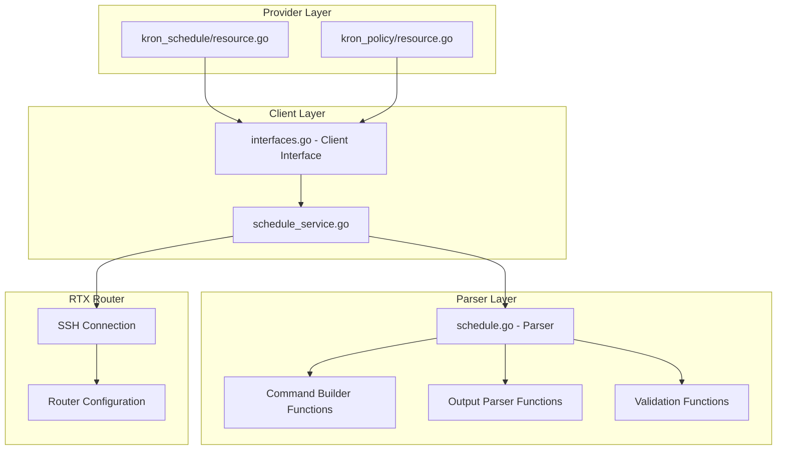

# Master Design: Schedule Resources

## Overview

The Schedule resources (rtx_kron_schedule and rtx_kron_policy) provide Terraform management for scheduled task execution on Yamaha RTX routers. The implementation follows the standard three-layer architecture: Provider (Terraform resource), Client (service layer), and Parser (command building/parsing).

## Resource Summary

| Attribute | Value |
|-----------|-------|
| Resource Names | `rtx_kron_schedule`, `rtx_kron_policy` |
| Service File | `internal/client/schedule_service.go` |
| Parser File | `internal/rtx/parsers/schedule.go` |
| Resource Directories | `internal/provider/resources/kron_schedule/`, `internal/provider/resources/kron_policy/` |
| Last Updated | 2026-02-01 |
| Source | Implementation code analysis |

## Steering Document Alignment

### Technical Standards (tech.md)
- Follows standard CRUD pattern for Terraform resources
- Uses context-aware operations with cancellation support
- Implements proper error handling with descriptive messages
- Configuration is saved after each modification

### Project Structure (structure.md)
- Resource files in `internal/provider/resources/{name}/resource.go + model.go`
- Service files in `internal/client/`
- Parser files in `internal/rtx/parsers/`
- Test files alongside implementation files

## Code Reuse Analysis

### Existing Components to Leverage
- **Executor interface**: Used for command execution abstraction
- **rtxClient.SaveConfig()**: Used for persisting configuration changes
- **containsError()**: Used for detecting errors in command output
- **logging.FromContext()**: Used for structured logging

### Integration Points
- **Client Interface**: Extended with Schedule and KronPolicy methods
- **ScheduleService**: Provides CRUD operations using executor
- **ScheduleParser**: Handles command building and output parsing

## Architecture

The implementation follows a three-layer architecture with clear separation of concerns:



## Components and Interfaces

### Component 1: ScheduleService (`internal/client/schedule_service.go`)

- **Purpose:** Provides CRUD operations for schedules and kron policies
- **Interfaces:**
  ```go
  type ScheduleService struct {
      executor Executor
      client   *rtxClient  // For SaveConfig functionality
  }

  func NewScheduleService(executor Executor, client *rtxClient) *ScheduleService

  // Schedule operations
  func (s *ScheduleService) CreateSchedule(ctx context.Context, schedule Schedule) error
  func (s *ScheduleService) GetSchedule(ctx context.Context, id int) (*Schedule, error)
  func (s *ScheduleService) UpdateSchedule(ctx context.Context, schedule Schedule) error
  func (s *ScheduleService) DeleteSchedule(ctx context.Context, id int) error
  func (s *ScheduleService) ListSchedules(ctx context.Context) ([]Schedule, error)

  // KronPolicy operations (Terraform-level only)
  func (s *ScheduleService) CreateKronPolicy(ctx context.Context, policy KronPolicy) error
  func (s *ScheduleService) GetKronPolicy(ctx context.Context, name string) (*KronPolicy, error)
  func (s *ScheduleService) UpdateKronPolicy(ctx context.Context, policy KronPolicy) error
  func (s *ScheduleService) DeleteKronPolicy(ctx context.Context, name string) error
  func (s *ScheduleService) ListKronPolicies(ctx context.Context) ([]KronPolicy, error)
  ```
- **Dependencies:** Executor interface, rtxClient (for SaveConfig)
- **Reuses:** Standard executor pattern, logging utilities

### Component 2: ScheduleParser (`internal/rtx/parsers/schedule.go`)

- **Purpose:** Parses RTX router output and builds commands for schedule operations
- **Interfaces:**
  ```go
  type ScheduleParser struct{}

  func NewScheduleParser() *ScheduleParser
  func (p *ScheduleParser) ParseScheduleConfig(raw string) ([]Schedule, error)
  func (p *ScheduleParser) ParseSingleSchedule(raw string, id int) (*Schedule, error)
  func (p *ScheduleParser) ParseKronPolicyConfig(raw string) ([]KronPolicy, error)

  // Command builders
  func BuildScheduleAtCommand(id int, time, command string) string
  func BuildScheduleAtStartupCommand(id int, command string) string
  func BuildScheduleAtDateTimeCommand(id int, date, time, command string) string
  func BuildSchedulePPCommand(ppNum int, dayOfWeek, time, action string) string
  func BuildDeleteScheduleCommand(id int) string
  func BuildDeleteSchedulePPCommand(ppNum int, dayOfWeek, time string) string
  func BuildShowScheduleCommand() string
  func BuildShowScheduleByIDCommand(id int) string

  // Validators
  func ValidateSchedule(schedule Schedule) error
  func ValidateTimeFormat(timeStr string) error
  func ValidateDateFormat(dateStr string) error
  func ValidateDayOfWeek(dayStr string) error
  func ValidateKronPolicy(policy KronPolicy) error
  ```
- **Dependencies:** Standard library (regexp, strconv, strings)
- **Reuses:** None (self-contained parser module)

### Component 3: Terraform Resources

#### rtx_kron_schedule (`internal/provider/resources/kron_schedule/`)

- **Purpose:** Terraform resource definition for scheduled tasks using Plugin Framework
- **Files:**
  - `resource.go` - Resource implementation with CRUD methods
  - `model.go` - Data model with ToClient/FromClient conversion
- **Interfaces:**
  ```go
  type KronScheduleResource struct {
      client client.Client
  }

  func (r *KronScheduleResource) Metadata(ctx, req, resp)
  func (r *KronScheduleResource) Schema(ctx, req, resp)
  func (r *KronScheduleResource) Configure(ctx, req, resp)
  func (r *KronScheduleResource) Create(ctx, req, resp)
  func (r *KronScheduleResource) Read(ctx, req, resp)
  func (r *KronScheduleResource) Update(ctx, req, resp)
  func (r *KronScheduleResource) Delete(ctx, req, resp)
  func (r *KronScheduleResource) ImportState(ctx, req, resp)
  ```
- **Dependencies:** Terraform Plugin Framework, client package
- **Reuses:** Standard Plugin Framework resource patterns

#### rtx_kron_policy (`internal/provider/resources/kron_policy/`)

- **Purpose:** Terraform resource definition for command lists using Plugin Framework
- **Files:**
  - `resource.go` - Resource implementation with CRUD methods
  - `model.go` - Data model with ToClient/FromClient conversion
- **Interfaces:**
  ```go
  type KronPolicyResource struct {
      client client.Client
  }

  func (r *KronPolicyResource) Metadata(ctx, req, resp)
  func (r *KronPolicyResource) Schema(ctx, req, resp)
  func (r *KronPolicyResource) Configure(ctx, req, resp)
  func (r *KronPolicyResource) Create(ctx, req, resp)
  func (r *KronPolicyResource) Read(ctx, req, resp)
  func (r *KronPolicyResource) Update(ctx, req, resp)
  func (r *KronPolicyResource) Delete(ctx, req, resp)
  func (r *KronPolicyResource) ImportState(ctx, req, resp)
  ```
- **Dependencies:** Terraform Plugin Framework, client package
- **Reuses:** Standard Plugin Framework resource patterns

### Component 4: Client Interface Extension (`internal/client/interfaces.go`)

- **Purpose:** Defines Schedule and KronPolicy types and client interface methods
- **Types:**
  ```go
  // Schedule represents a schedule configuration on an RTX router
  type Schedule struct {
      ID          int      `json:"id"`                     // Schedule ID (1-65535)
      Name        string   `json:"name,omitempty"`         // Schedule name/description
      AtTime      string   `json:"at_time,omitempty"`      // Time in HH:MM format
      DayOfWeek   string   `json:"day_of_week,omitempty"`  // Day(s) of week
      Date        string   `json:"date,omitempty"`         // Specific date YYYY/MM/DD
      Recurring   bool     `json:"recurring"`              // Whether schedule repeats
      OnStartup   bool     `json:"on_startup"`             // Execute at startup
      PolicyList  string   `json:"policy_list,omitempty"`  // Policy name reference
      Commands    []string `json:"commands,omitempty"`     // Commands to execute
      Enabled     bool     `json:"enabled"`                // Whether enabled
      PPInterface int      `json:"pp_interface,omitempty"` // PP interface number
  }

  // KronPolicy represents a kron policy (command list)
  type KronPolicy struct {
      Name     string   `json:"name"`               // Policy name
      Commands []string `json:"commands,omitempty"` // Commands in policy
  }
  ```
- **Dependencies:** Existing Client interface
- **Reuses:** Pattern from existing resource types

## Data Models

### Schedule (Parser Layer)

```go
// internal/rtx/parsers/schedule.go
type Schedule struct {
    ID         int      `json:"id"`                    // Schedule ID (1-65535)
    Name       string   `json:"name,omitempty"`        // Schedule name/description
    AtTime     string   `json:"at_time,omitempty"`     // Time in HH:MM format
    DayOfWeek  string   `json:"day_of_week,omitempty"` // Day(s) of week
    Date       string   `json:"date,omitempty"`        // Specific date YYYY/MM/DD
    Recurring  bool     `json:"recurring"`             // Whether schedule repeats
    OnStartup  bool     `json:"on_startup"`            // Execute at startup
    PolicyList string   `json:"policy_list,omitempty"` // Policy name reference
    Commands   []string `json:"commands,omitempty"`    // Commands to execute
    Enabled    bool     `json:"enabled"`               // Whether enabled
}
```

### KronPolicy (Parser Layer)

```go
// internal/rtx/parsers/schedule.go
type KronPolicy struct {
    Name     string   `json:"name"`               // Policy name
    Commands []string `json:"commands,omitempty"` // Commands in policy
}
```

### Terraform Schema

#### rtx_kron_schedule

```hcl
resource "rtx_kron_schedule" "example" {
  schedule_id = 1                    # Required, ForceNew, int (1-65535)
  name        = "daily_backup"       # Optional, string

  # One of these three must be specified:
  at_time     = "3:00"               # Optional, string (HH:MM format)
  # OR
  on_startup  = true                 # Optional, bool
  # OR
  date        = "2025/12/31"         # Optional, string (YYYY/MM/DD format)

  day_of_week = "mon-fri"            # Optional, string
  recurring   = true                 # Optional, Computed, bool

  # One of these must be specified:
  policy_list = "my_policy"          # Optional, string
  # OR
  command_lines = [                  # Optional, list(string)
    "save",
    "show ip route"
  ]
}
```

#### rtx_kron_policy

```hcl
resource "rtx_kron_policy" "example" {
  name = "daily_backup"              # Required, ForceNew, string

  command_lines = [                  # Required, list(string), MinItems=1
    "save",
    "show ip route"
  ]
}
```

## RTX Command Mapping

### Create Schedule (Time-based)

```
Command: schedule at <id> <HH:MM> <command>
Example: schedule at 1 12:00 save
Builder: BuildScheduleAtCommand(1, "12:00", "save")
```

### Create Schedule (Startup)

```
Command: schedule at <id> startup <command>
Example: schedule at 2 startup dhcp service server
Builder: BuildScheduleAtStartupCommand(2, "dhcp service server")
```

### Create Schedule (Date/Time)

```
Command: schedule at <id> <YYYY/MM/DD> <HH:MM> <command>
Example: schedule at 3 2025/01/15 09:00 save
Builder: BuildScheduleAtDateTimeCommand(3, "2025/01/15", "09:00", "save")
```

### Create Schedule (PP Interface)

```
Command: schedule pp <pp-num> <day-spec> <HH:MM> <action>
Example: schedule pp 1 mon-fri 8:00 connect
Builder: BuildSchedulePPCommand(1, "mon-fri", "8:00", "connect")
```

### Delete Schedule

```
Command: no schedule at <id>
Example: no schedule at 1
Builder: BuildDeleteScheduleCommand(1)
```

### Show Schedule

```
Command: show config | grep schedule
Builder: BuildShowScheduleCommand()

Command: show config | grep "schedule at <id>"
Example: show config | grep "schedule at 1"
Builder: BuildShowScheduleByIDCommand(1)
```

## Error Handling

### Error Scenarios

1. **Schedule Already Exists**
   - **Detection:** GetSchedule returns existing schedule before create
   - **Handling:** Return error "schedule %d already exists"
   - **User Impact:** User sees error and must choose different ID or import

2. **Invalid Schedule ID**
   - **Detection:** Terraform validation (IntBetween 1, 65535)
   - **Handling:** Terraform plan fails with validation error
   - **User Impact:** Clear error message about valid ID range

3. **Invalid Time Format**
   - **Detection:** validateTimeFormat checks HH:MM pattern
   - **Handling:** Terraform validation error
   - **User Impact:** Error shows expected format (HH:MM, 0-23 hour, 0-59 minute)

4. **Invalid Date Format**
   - **Detection:** validateDateFormat checks YYYY/MM/DD pattern
   - **Handling:** Terraform validation error
   - **User Impact:** Error shows expected format and valid ranges

5. **Conflicting Attributes**
   - **Detection:** Terraform ConflictsWith schema validation
   - **Handling:** Terraform plan fails with conflict error
   - **User Impact:** Clear error about which attributes conflict

6. **Missing Required Trigger**
   - **Detection:** CustomizeDiff function
   - **Handling:** Error "one of 'at_time', 'on_startup', or 'date' must be specified"
   - **User Impact:** Clear guidance on required attributes

7. **Missing Commands or Policy**
   - **Detection:** CustomizeDiff function
   - **Handling:** Error "either 'policy_list' or 'command_lines' must be specified"
   - **User Impact:** Clear guidance on required attributes

8. **Schedule Not Found (Read/Delete)**
   - **Detection:** Error message contains "not found"
   - **Handling:** For Read: remove from state; For Delete: succeed silently
   - **User Impact:** Resource removed from state, no error shown

9. **Command Execution Error**
   - **Detection:** containsError() checks output
   - **Handling:** Return descriptive error with command output
   - **User Impact:** Error shows what went wrong on router

10. **Configuration Save Failed**
    - **Detection:** SaveConfig returns error
    - **Handling:** Return error with details
    - **User Impact:** Error indicates change made but not persisted

## Testing Strategy

### Unit Testing

- **Parser Tests** (`schedule_test.go`):
  - ParseScheduleConfig with various schedule types
  - ParseSingleSchedule for specific ID lookup
  - Command builder functions (all types)
  - Validation functions (time, date, day_of_week)
  - ValidateSchedule with valid and invalid inputs
  - ValidateKronPolicy with valid and invalid inputs

- **Resource Schema Tests** (`resource_rtx_kron_schedule_test.go`, `resource_rtx_kron_policy_test.go`):
  - Schema field presence and types
  - Required/Optional/ForceNew attributes
  - ConflictsWith relationships
  - Validation function behavior

### Integration Testing

- **Service Tests** (`schedule_service_test.go`):
  - CreateSchedule with mock executor
  - GetSchedule with various outputs
  - UpdateSchedule (delete + create sequence)
  - DeleteSchedule including idempotent behavior
  - ListSchedules with multiple schedules
  - KronPolicy CRUD operations

### End-to-End Testing

- **Acceptance Tests** (with real RTX router):
  - Create time-based schedule and verify on router
  - Create startup schedule and verify behavior
  - Create date-specific schedule
  - Update schedule and verify changes
  - Delete schedule and verify removal
  - Import existing schedule
  - Test multiple schedules with same ID (error case)

## File Structure

```
internal/
├── provider/
│   └── resources/
│       ├── kron_schedule/
│       │   ├── resource.go                 # Schedule resource CRUD
│       │   ├── resource_test.go            # Schema and validation tests
│       │   └── model.go                    # Data model with ToClient/FromClient
│       └── kron_policy/
│           ├── resource.go                 # Policy resource CRUD
│           ├── resource_test.go            # Schema and validation tests
│           └── model.go                    # Data model with ToClient/FromClient
├── client/
│   ├── interfaces.go                       # Schedule and KronPolicy types
│   ├── client.go                           # Service initialization
│   ├── schedule_service.go                 # CRUD operations
│   └── schedule_service_test.go            # Service tests
└── rtx/
    └── parsers/
        ├── schedule.go                     # Parser and command builders
        └── schedule_test.go                # Parser and validation tests
```

## Implementation Notes

1. **RTX doesn't have native kron policy support**: Unlike Cisco IOS, RTX routers don't have a `kron policy-list` command. Policies are managed at the Terraform level only and their commands are expanded when referenced by a schedule.

2. **Update is delete-and-recreate**: Since RTX schedules don't support in-place modification, updates delete the existing schedule and create a new one with the same ID.

3. **PP schedules use negative IDs internally**: When parsing `schedule pp` commands, the parser uses negative PP numbers as IDs to differentiate them from regular `schedule at` commands.

4. **Multiple commands per schedule**: Multiple commands can be added to the same schedule ID by executing multiple `schedule at <id> <time> <command>` commands.

5. **Configuration must be saved**: After any schedule modification, `SaveConfig` is called to persist changes to the router's non-volatile memory.

6. **Context cancellation**: All service methods check for context cancellation before executing commands.

7. **Enabled is always true**: When managed by Terraform, schedules are always enabled. The `no schedule at` command is used for deletion, not disabling.

8. **Date-based schedules are non-recurring**: When a `date` is specified, `recurring` is automatically set to `false`.

## State Handling

- Persist only configuration attributes in Terraform state
- Operational/runtime status is not stored in state
- Import populates all attributes for schedules
- Import for policies only gets name; commands must be added manually
- Policy commands exist only in Terraform state (not on router)

## Change History

| Date | Source Spec | Changes |
|------|-------------|---------|
| 2026-01-23 | Implementation analysis | Initial master spec creation from existing code |
| 2026-02-01 | Structure Sync | Updated to Plugin Framework and resources/{name}/ modular structure |
