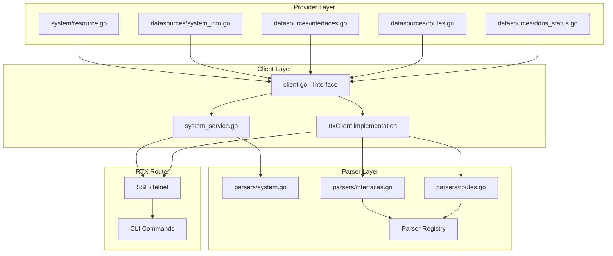

# Master Design: System Resources

## Overview

This document describes the architecture and implementation design for system-level resources in the Terraform RTX provider. The system resource group manages router identity, timing, console settings, and provides read-only access to system status, interfaces, routes, and DDNS status.

## Resource Summary

| Attribute | Value |
|-----------|-------|
| Resource Name | `rtx_system`, `rtx_system_info`, `rtx_interfaces`, `rtx_routes`, `rtx_ddns_status` |
| Service File | `internal/client/system_service.go` |
| Parser File | `internal/rtx/parsers/system.go`, `interfaces.go`, `routes.go` |
| Resource Directory | `internal/provider/resources/system/`, `datasources/` |
| Last Updated | 2026-01-23 |
| Source Specs | Initial implementation |

## Steering Document Alignment

### Technical Standards (tech.md)
- Uses Terraform Plugin Framework with resource.Resource pattern
- Implements standard CRUD lifecycle (Create, Read, Update, Delete)
- Follows Go idioms and error handling patterns
- Context propagation for cancellation support

### Project Structure (structure.md)
- Provider layer in `internal/provider/`
- Client layer in `internal/client/`
- Parser layer in `internal/rtx/parsers/`

## Code Reuse Analysis

### Existing Components to Leverage
- **Executor Interface**: Reuses command execution abstraction
- **rtxClient**: Leverages base client for SSH connectivity and SaveConfig
- **Parser Registry**: Uses model-based parser registration pattern

### Integration Points
- **SSH Session**: Connects via authenticated SSH session
- **Configuration Persistence**: Uses client.SaveConfig() for atomic saves

## Architecture

The system resources follow a three-layer architecture with clear separation of concerns:



## Components and Interfaces

### Component 1: SystemService (`internal/client/system_service.go`)

- **Purpose:** Handles system configuration CRUD operations
- **Interfaces:**
  ```go
  type SystemService struct {
      executor Executor
      client   *rtxClient
  }

  func NewSystemService(executor Executor, client *rtxClient) *SystemService
  func (s *SystemService) Configure(ctx context.Context, config SystemConfig) error
  func (s *SystemService) Get(ctx context.Context) (*SystemConfig, error)
  func (s *SystemService) Update(ctx context.Context, config SystemConfig) error
  func (s *SystemService) Reset(ctx context.Context) error
  ```
- **Dependencies:** Executor interface, parsers package
- **Reuses:** Executor pattern from other services

### Component 2: SystemParser (`internal/rtx/parsers/system.go`)

- **Purpose:** Parses RTX system configuration output and builds CLI commands
- **Interfaces:**
  ```go
  type SystemParser struct{}

  func NewSystemParser() *SystemParser
  func (p *SystemParser) ParseSystemConfig(raw string) (*SystemConfig, error)

  // Command builders
  func BuildTimezoneCommand(tz string) string
  func BuildDeleteTimezoneCommand() string
  func BuildConsoleCharacterCommand(encoding string) string
  func BuildConsoleLinesCommand(lines string) string
  func BuildConsolePromptCommand(prompt string) string
  func BuildPacketBufferCommand(config PacketBufferConfig) string
  func BuildStatisticsTrafficCommand(enabled bool) string
  func BuildStatisticsNATCommand(enabled bool) string
  func BuildShowSystemConfigCommand() string
  func BuildDeleteSystemCommands(config *SystemConfig) []string
  func ValidateSystemConfig(config *SystemConfig) error
  ```
- **Dependencies:** regexp, strconv, strings standard library
- **Reuses:** None (standalone parser)

### Component 3: InterfacesParser (`internal/rtx/parsers/interfaces.go`)

- **Purpose:** Parses RTX interface status output with model-specific patterns
- **Interfaces:**
  ```go
  type InterfacesParser interface {
      Parser
      ParseInterfaces(raw string) ([]Interface, error)
  }

  type rtx830InterfacesParser struct {
      BaseInterfacesParser
  }

  type rtx12xxInterfacesParser struct {
      BaseInterfacesParser
  }
  ```
- **Dependencies:** Parser registry for model detection
- **Reuses:** Parser interface pattern, registry pattern

### Component 4: RoutesParser (`internal/rtx/parsers/routes.go`)

- **Purpose:** Parses RTX routing table output with model-specific patterns
- **Interfaces:**
  ```go
  type RoutesParser interface {
      Parser
      ParseRoutes(raw string) ([]Route, error)
  }

  type rtx830RoutesParser struct {
      BaseRoutesParser
  }

  type rtx12xxRoutesParser struct {
      BaseRoutesParser
  }
  ```
- **Dependencies:** Parser registry for model detection
- **Reuses:** Parser interface pattern, registry pattern

### Component 5: Terraform Resource (`internal/provider/resources/system/`)

- **Purpose:** Terraform resource definition implementing CRUD lifecycle using Plugin Framework
- **Files:**
  - `resource.go` - Resource implementation with CRUD methods
  - `model.go` - Data model with ToClient/FromClient conversion
- **Interfaces:**
  ```go
  type SystemResource struct {
      client client.Client
  }

  func (r *SystemResource) Metadata(ctx, req, resp)
  func (r *SystemResource) Schema(ctx, req, resp)
  func (r *SystemResource) Configure(ctx, req, resp)
  func (r *SystemResource) Create(ctx, req, resp)
  func (r *SystemResource) Read(ctx, req, resp)
  func (r *SystemResource) Update(ctx, req, resp)
  func (r *SystemResource) Delete(ctx, req, resp)
  func (r *SystemResource) ImportState(ctx, req, resp)
  ```
- **Dependencies:** Terraform Plugin Framework, client.SystemConfig
- **Reuses:** Standard Plugin Framework patterns

### Component 6: Terraform Data Sources

- **Purpose:** Read-only access to router status information
- **Files:**
  - `data_source_rtx_system_info.go` - System information
  - `data_source_rtx_interfaces.go` - Interface status
  - `data_source_rtx_routes.go` - Routing table
  - `data_source_rtx_ddns_status.go` - DDNS registration status

## Data Models

### SystemConfig (Primary Configuration Model)

```go
// SystemConfig represents system-level configuration on an RTX router
type SystemConfig struct {
    Timezone      string               `json:"timezone,omitempty"`       // UTC offset (e.g., "+09:00")
    Console       *ConsoleConfig       `json:"console,omitempty"`        // Console settings
    PacketBuffers []PacketBufferConfig `json:"packet_buffers,omitempty"` // Packet buffer tuning
    Statistics    *StatisticsConfig    `json:"statistics,omitempty"`     // Statistics collection
}

// ConsoleConfig represents console settings
type ConsoleConfig struct {
    Character string `json:"character,omitempty"` // Character encoding (ja.utf8, ascii, ja.sjis, euc-jp)
    Lines     string `json:"lines,omitempty"`     // Lines per page (number or "infinity")
    Prompt    string `json:"prompt,omitempty"`    // Custom prompt string
}

// PacketBufferConfig represents packet buffer tuning for each size
type PacketBufferConfig struct {
    Size      string `json:"size"`       // "small", "middle", or "large"
    MaxBuffer int    `json:"max_buffer"` // Maximum buffer count
    MaxFree   int    `json:"max_free"`   // Maximum free buffer count
}

// StatisticsConfig represents statistics collection settings
type StatisticsConfig struct {
    Traffic bool `json:"traffic"` // Traffic statistics
    NAT     bool `json:"nat"`     // NAT statistics
}
```

### Interface (Read-only Data Model)

```go
// Interface represents a network interface on an RTX router
type Interface struct {
    Name        string            `json:"name"`
    Kind        string            `json:"kind"`        // lan, wan, pp, vlan
    AdminUp     bool              `json:"admin_up"`
    LinkUp      bool              `json:"link_up"`
    MAC         string            `json:"mac,omitempty"`
    IPv4        string            `json:"ipv4,omitempty"`
    IPv6        string            `json:"ipv6,omitempty"`
    MTU         int               `json:"mtu,omitempty"`
    Description string            `json:"description,omitempty"`
    Attributes  map[string]string `json:"attributes,omitempty"` // Model-specific fields
}
```

### Route (Read-only Data Model)

```go
// Route represents a routing table entry on an RTX router
type Route struct {
    Destination string `json:"destination"`      // Network prefix
    Gateway     string `json:"gateway"`          // Next hop ("*" for connected)
    Interface   string `json:"interface"`        // Outgoing interface
    Protocol    string `json:"protocol"`         // S, C, R, O, B, D
    Metric      *int   `json:"metric,omitempty"` // Route metric
}
```

### DDNSStatus (Read-only Data Model)

```go
// DDNSStatus represents DDNS registration status
type DDNSStatus struct {
    Type         string `json:"type"`                    // "netvolante" or "custom"
    Interface    string `json:"interface,omitempty"`     // Interface (for NetVolante)
    ServerID     int    `json:"server_id,omitempty"`     // Server ID (for custom)
    Hostname     string `json:"hostname,omitempty"`      // Registered hostname
    CurrentIP    string `json:"current_ip,omitempty"`    // Currently registered IP
    LastUpdate   string `json:"last_update,omitempty"`   // Last update time
    Status       string `json:"status,omitempty"`        // success, error, pending
    ErrorMessage string `json:"error_message,omitempty"` // Error if failed
}
```

## RTX Command Mapping

### System Configuration Commands

| Operation | RTX Command |
|-----------|-------------|
| Set timezone | `timezone +09:00` |
| Remove timezone | `no timezone` |
| Set console character | `console character ja.utf8` |
| Set console lines | `console lines 24` or `console lines infinity` |
| Set console prompt | `console prompt "RTX>"` |
| Remove console settings | `no console character`, `no console lines`, `no console prompt` |
| Set packet buffer | `system packet-buffer small max-buffer=5000 max-free=1300` |
| Remove packet buffer | `no system packet-buffer small` |
| Set statistics | `statistics traffic on`, `statistics nat on` |
| Remove statistics | `no statistics traffic`, `no statistics nat` |
| Show config | `show config \| grep -E "(timezone\|console\|packet-buffer\|statistics)"` |

### Status Commands (Read-only)

| Data Source | RTX Command |
|-------------|-------------|
| System Info | `show environment` |
| Interfaces | `show status lan1`, `show status wan1`, etc. |
| Routes | `show ip route` |
| DDNS Status | `show status netvolante-dns`, `show status ddns` |

## Error Handling

### Error Scenarios

1. **Invalid Configuration**
   - **Handling:** Validation in parser layer before command execution
   - **User Impact:** Clear error message with field name and expected format

2. **Command Execution Failure**
   - **Handling:** Returns error from executor, wrapped with context
   - **User Impact:** Terraform shows error with command details

3. **Parse Failure**
   - **Handling:** Returns error with raw output for debugging
   - **User Impact:** Error message indicates parsing issue

4. **Save Configuration Failure**
   - **Handling:** Returns error noting config applied but not saved
   - **User Impact:** User informed to manually save or retry

5. **Reset Partial Failure**
   - **Handling:** Continues with remaining deletions, logs warnings
   - **User Impact:** Best-effort reset, state may need reconciliation

## Testing Strategy

### Unit Testing

- **Parser Tests** (`system_test.go`, `interfaces_test.go`, `routes_test.go`):
  - Parse various RTX output formats
  - Test command builders produce correct syntax
  - Validate configuration constraints
  - Test model-specific parsing patterns

- **Service Tests** (`system_service_test.go`):
  - Mock executor for command verification
  - Test Configure, Get, Update, Reset flows
  - Verify correct command sequences
  - Test error handling paths

### Integration Testing

- **Resource Tests** (`resource_rtx_system_test.go`):
  - Test Terraform lifecycle (create, read, update, delete)
  - Test import functionality
  - Test state management

- **Data Source Tests** (`data_source_rtx_*_test.go`):
  - Test data retrieval and schema mapping
  - Test filtering (for rtx_ddns_status)
  - Test ID generation consistency

### End-to-End Testing

- **Acceptance Tests** (with real RTX router):
  - Full configuration workflow
  - State consistency verification
  - Import from existing configuration

## File Structure

```
internal/
├── provider/
│   ├── resources/
│   │   └── system/
│   │       ├── resource.go             # System resource CRUD
│   │       ├── resource_test.go        # Resource tests
│   │       └── model.go                # Data model with ToClient/FromClient
│   └── datasources/
│       ├── system_info.go              # System info data source
│       ├── system_info_test.go
│       ├── interfaces.go               # Interfaces data source
│       ├── interfaces_test.go
│       ├── routes.go                   # Routes data source
│       ├── routes_test.go
│       ├── ddns_status.go              # DDNS status data source
│       └── ddns_status_test.go
├── client/
│   ├── interfaces.go                   # SystemConfig, Interface, Route types
│   ├── client.go                       # Client interface & rtxClient
│   ├── system_service.go               # SystemService implementation
│   └── system_service_test.go          # Service tests
└── rtx/
    └── parsers/
        ├── system.go                   # System config parser & commands
        ├── system_test.go
        ├── interfaces.go               # Interface parser (model-specific)
        ├── interfaces_test.go
        ├── routes.go                   # Routes parser (model-specific)
        └── routes_test.go
```

## Implementation Notes

1. **Singleton Pattern**: The rtx_system resource uses a fixed ID "system" since there's only one system configuration per router. Import only accepts "system" as the import ID.

2. **Batch Command Execution**: System service collects all commands and executes them in batch via `executor.RunBatch()` to minimize SSH round-trips and ensure atomic-like behavior.

3. **Configuration Persistence**: After successful command execution, `client.SaveConfig()` is called to persist changes to flash memory. This ensures configuration survives reboots.

4. **Model-Specific Parsers**: Interface and route parsers are registered per RTX model (RTX830, RTX1210, RTX1220) to handle output format differences. The registry pattern allows easy extension for new models.

5. **Incremental Updates**: The Update operation compares current and desired states, generating only the commands needed for changed settings. This minimizes router impact and avoids unnecessary configuration churn.

6. **Data Source ID Generation**: Data sources generate unique IDs using MD5 hashes of their content. This allows Terraform to detect changes without requiring router-side identifiers.

7. **Type Conversions**: The system service maintains type conversion functions (`toParserConfig`, `fromParserConfig`) to translate between client and parser layer models, maintaining layer isolation.

8. **Reset Best Effort**: The Reset operation continues even if individual delete commands fail (some settings may not exist), logging warnings rather than failing completely.

## State Handling

- Persist only configuration attributes in Terraform state
- Runtime/operational status (uptime, link state) are read-only via data sources
- Data source IDs are content-based hashes (change when data changes)
- Resource ID is fixed "system" for singleton pattern

## Change History

| Date | Source Spec | Changes |
|------|-------------|---------|
| 2026-01-23 | Initial | Created master design from implementation |
| 2026-02-01 | Structure Sync | Updated to Plugin Framework and resources/{name}/ modular structure |
| 2026-02-07 | Implementation Audit | Full audit against implementation code; note data sources not registered in provider |
