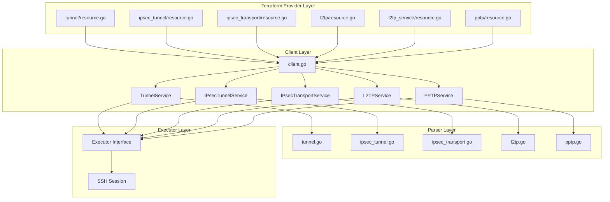
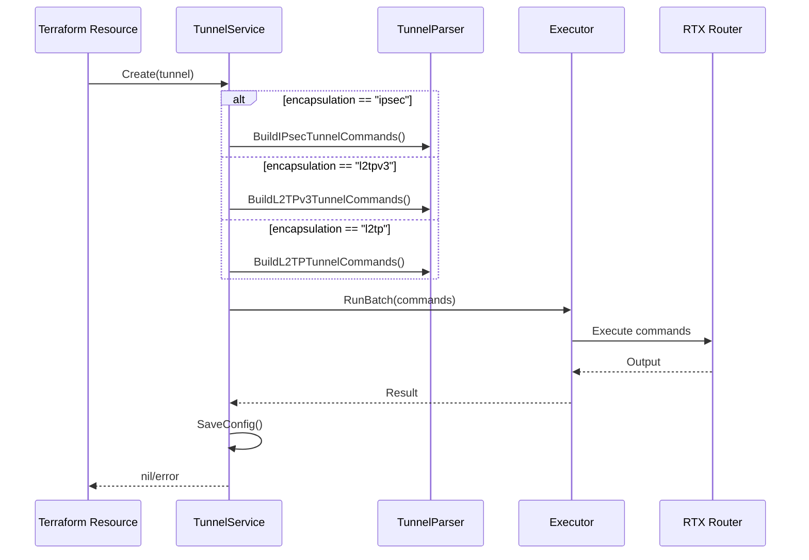
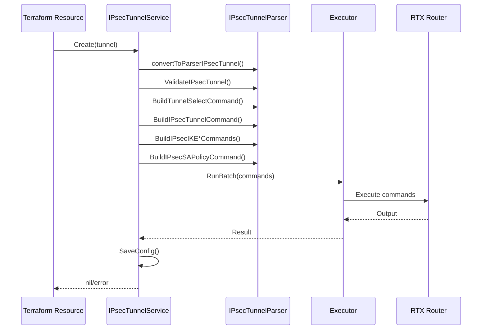

# Master Design: VPN Resources

## Overview

This document describes the technical design and implementation of VPN resources in the Terraform RTX Provider. The VPN subsystem supports IPsec tunnels, IPsec transport mode, L2TP/L2TPv3 tunnels, and PPTP for comprehensive VPN connectivity on Yamaha RTX routers.

## Resources Summary

| Resource | Service File | Parser File | Resource Directory | Status |
|----------|--------------|-------------|-------------------|--------|
| `rtx_tunnel` | `tunnel_service.go` | `tunnel.go` | `resources/tunnel/` | **Recommended** |
| `rtx_ipsec_tunnel` | `ipsec_tunnel_service.go` | `ipsec_tunnel.go` | `resources/ipsec_tunnel/` | Deprecated |
| `rtx_ipsec_transport` | `ipsec_transport_service.go` | `ipsec_transport.go` | `resources/ipsec_transport/` | - |
| `rtx_l2tp` | `l2tp_service.go` | `l2tp.go` | `resources/l2tp/` | Deprecated |
| `rtx_l2tp_service` | `l2tp_service.go` | `l2tp.go` | `resources/l2tp_service/` | - |
| `rtx_pptp` | `pptp_service.go` | `pptp.go` | `resources/pptp/` | - |

---

## Architecture

### Component Diagram



### Design Principles

1. **Layered Architecture**: Clear separation between Terraform resource, client service, and parser layers
2. **Type Safety**: Dedicated types for each VPN protocol with proper Go structs
3. **Command Builders**: Parser layer provides command builders for consistent RTX command generation
4. **Batch Execution**: IPsec operations use batch command execution for atomicity
5. **Validation**: Configuration validation at both parser and service layers

---

## Component 0: Tunnel Service (Unified)

### File: `internal/client/tunnel_service.go`

**Purpose:** Manages unified tunnel CRUD operations supporting IPsec, L2TPv3, and L2TPv2 encapsulations

### Service Interface

```go
type TunnelService struct {
    executor Executor
    client   *rtxClient
}

func NewTunnelService(executor Executor, client *rtxClient) *TunnelService
func (s *TunnelService) Get(ctx context.Context, tunnelID int) (*Tunnel, error)
func (s *TunnelService) Create(ctx context.Context, tunnel Tunnel) error
func (s *TunnelService) Update(ctx context.Context, tunnel Tunnel) error
func (s *TunnelService) Delete(ctx context.Context, tunnelID int) error
```

### Data Flow



### Encapsulation-Specific Command Sequences

#### IPsec Tunnel Creation

1. `tunnel select <n>` - Select/create tunnel context
2. `tunnel encapsulation ipsec` - Set encapsulation
3. `ipsec tunnel <n>` - Associate IPsec
4. `ipsec ike local address <n> <ip>` - Set local endpoint
5. `ipsec ike remote address <n> <ip>` - Set remote endpoint
6. `ipsec ike pre-shared-key <n> text <key>` - Set PSK
7. `ipsec ike nat-traversal <n> on/off` - NAT traversal
8. `ipsec sa policy <pol> <tun> <proto> <enc> <hash>` - SA policy
9. `ipsec ike keepalive use <n> on dpd <int> [retry]` - DPD (if enabled)

#### L2TPv3 Tunnel Creation

1. `tunnel select <n>` - Select tunnel
2. `tunnel encapsulation l2tpv3` - Set encapsulation
3. `ipsec tunnel <n>` - Associate IPsec for transport
4. IPsec configuration commands (as above)
5. `l2tp local router-id <ip>` - Set local router ID
6. `l2tp remote router-id <ip>` - Set remote router ID
7. `l2tp hostname <name>` - Set hostname
8. `l2tp always-on on/off` - Always-on mode
9. `l2tp keepalive use on <int> <retry>` - Keepalive

#### L2TPv2 Tunnel Creation

1. `tunnel select <n>` - Select tunnel
2. `tunnel encapsulation l2tp` - Set encapsulation
3. `l2tp hostname <name>` - Set hostname
4. `l2tp always-on on/off` - Always-on mode
5. `l2tp keepalive use on <int> <retry>` - Keepalive

---

## Component 1: IPsec Tunnel Service

### File: `internal/client/ipsec_tunnel_service.go`

**Purpose:** Manages IPsec tunnel CRUD operations with batch command execution

### Service Interface

```go
type IPsecTunnelService struct {
    executor Executor
    client   *rtxClient
}

func NewIPsecTunnelService(executor Executor, client *rtxClient) *IPsecTunnelService
func (s *IPsecTunnelService) Get(ctx context.Context, tunnelID int) (*IPsecTunnel, error)
func (s *IPsecTunnelService) List(ctx context.Context) ([]IPsecTunnel, error)
func (s *IPsecTunnelService) Create(ctx context.Context, tunnel IPsecTunnel) error
func (s *IPsecTunnelService) Update(ctx context.Context, tunnel IPsecTunnel) error
func (s *IPsecTunnelService) Delete(ctx context.Context, tunnelID int) error
```

### Data Flow



### Command Sequence for IPsec Tunnel Creation

1. `tunnel select <n>` - Select/create tunnel context
2. `ipsec tunnel <n>` - Associate IPsec with tunnel
3. `ipsec ike local address <n> <ip>` - Set local endpoint
4. `ipsec ike remote address <n> <ip>` - Set remote endpoint
5. `ipsec ike pre-shared-key <n> text <key>` - Set PSK
6. `ipsec ike encryption <n> <alg>` - Set IKE encryption
7. `ipsec ike hash <n> <alg>` - Set IKE integrity
8. `ipsec ike group <n> <group>` - Set DH group
9. `ipsec sa policy <pol> <tun> <proto> <enc> <hash>` - Set SA policy
10. `ipsec ike keepalive use <n> on dpd <int> [retry]` - Enable DPD (if enabled)

---

## Component 2: IPsec Transport Service

### File: `internal/client/ipsec_transport_service.go`

**Purpose:** Manages IPsec transport mode configurations for L2TP/IPsec

### Service Interface

```go
type IPsecTransportService struct {
    executor Executor
    client   *rtxClient
}

func NewIPsecTransportService(executor Executor, client *rtxClient) *IPsecTransportService
func (s *IPsecTransportService) Get(ctx context.Context, transportID int) (*parsers.IPsecTransport, error)
func (s *IPsecTransportService) List(ctx context.Context) ([]parsers.IPsecTransport, error)
func (s *IPsecTransportService) Create(ctx context.Context, t parsers.IPsecTransport) error
func (s *IPsecTransportService) Update(ctx context.Context, t parsers.IPsecTransport) error
func (s *IPsecTransportService) Delete(ctx context.Context, transportID int) error
```

### RTX Command Mapping

| Operation | Command |
|-----------|---------|
| Create | `ipsec transport <transport_id> <tunnel_id> <protocol> <port>` |
| Read | `show config \| grep "ipsec transport"` |
| Delete | `no ipsec transport <transport_id>` |

---

## Component 3: L2TP Service

### File: `internal/client/l2tp_service.go`

**Purpose:** Manages L2TP/L2TPv3 tunnel configurations and service state

### Service Interface

```go
type L2TPService struct {
    executor Executor
    client   *rtxClient
}

func NewL2TPService(executor Executor, client *rtxClient) *L2TPService
func (s *L2TPService) Get(ctx context.Context, tunnelID int) (*L2TPConfig, error)
func (s *L2TPService) List(ctx context.Context) ([]L2TPConfig, error)
func (s *L2TPService) Create(ctx context.Context, config L2TPConfig) error
func (s *L2TPService) Update(ctx context.Context, config L2TPConfig) error
func (s *L2TPService) Delete(ctx context.Context, tunnelID int) error
func (s *L2TPService) GetL2TPServiceState(ctx context.Context) (*L2TPServiceState, error)
func (s *L2TPService) SetL2TPServiceState(ctx context.Context, enabled bool, protocols []string) error
```

### L2TPv2 LNS Command Sequence

1. `l2tp service on` - Enable L2TP service
2. `pp select anonymous` - Select anonymous PP context
3. `pp bind tunnel<n>` - Bind PP to tunnel
4. `pp auth accept <method>` - Set authentication method
5. `pp auth myname <user> <pass>` - Set credentials
6. `ip pp remote address pool <start>-<end>` - Set IP pool

### L2TPv3 L2VPN Command Sequence

1. `tunnel select <n>` - Select tunnel
2. `tunnel encapsulation l2tpv3` - Set L2TPv3 encapsulation
3. `tunnel endpoint address <local> <remote>` - Set endpoints
4. `l2tp local router-id <ip>` - Set local router ID
5. `l2tp remote router-id <ip>` - Set remote router ID
6. `l2tp always-on on` - Enable always-on (if configured)
7. `l2tp keepalive use on <interval> <retry>` - Enable keepalive

---

## Component 4: PPTP Service

### File: `internal/client/pptp_service.go`

**Purpose:** Manages PPTP VPN server configuration (singleton)

### Service Interface

```go
type PPTPService struct {
    executor Executor
    client   *rtxClient
}

func NewPPTPService(executor Executor, client *rtxClient) *PPTPService
func (s *PPTPService) Get(ctx context.Context) (*PPTPConfig, error)
func (s *PPTPService) Create(ctx context.Context, config PPTPConfig) error
func (s *PPTPService) Update(ctx context.Context, config PPTPConfig) error
func (s *PPTPService) Delete(ctx context.Context) error
```

### Command Sequence for PPTP Creation

1. `pptp service on` - Enable PPTP service
2. `pp auth accept <method>` - Set auth method
3. `pp auth myname <user> <pass>` - Set credentials
4. `ppp ccp type mppe-<bits> [require]` - Set MPPE encryption
5. `ip pp remote address pool <start>-<end>` - Set IP pool
6. `pptp tunnel disconnect time <sec>` - Set disconnect time
7. `pptp keepalive use on/off` - Set keepalive

---

## Data Models

### Tunnel (Unified)

```go
// Tunnel represents a unified tunnel configuration supporting multiple encapsulation types
type Tunnel struct {
    ID               int          `json:"id"`                           // tunnel select N (1-6000)
    Encapsulation    string       `json:"encapsulation"`                // "ipsec", "l2tpv3", or "l2tp"
    Enabled          bool         `json:"enabled"`                      // tunnel enable N
    Name             string       `json:"name,omitempty"`               // Description (Computed/read-only)
    EndpointName     string       `json:"endpoint_name,omitempty"`      // tunnel endpoint name <addr>
    EndpointNameType string       `json:"endpoint_name_type,omitempty"` // fqdn
    IPsec            *TunnelIPsec `json:"ipsec,omitempty"`              // IPsec configuration
    L2TP             *TunnelL2TP  `json:"l2tp,omitempty"`               // L2TP configuration
}

// TunnelIPsec represents IPsec settings within a unified tunnel
type TunnelIPsec struct {
    IPsecTunnelID     int                   `json:"ipsec_tunnel_id"`                // ipsec tunnel N (Computed: defaults to tunnel_id)
    LocalAddress      string                `json:"local_address,omitempty"`        // ipsec ike local address
    RemoteAddress     string                `json:"remote_address,omitempty"`       // ipsec ike remote address
    PreSharedKey      string                `json:"pre_shared_key"`                 // ipsec ike pre-shared-key (WriteOnly)
    NATTraversal      bool                  `json:"nat_traversal"`                  // ipsec ike nat-traversal
    IKERemoteName     string                `json:"ike_remote_name,omitempty"`      // ipsec ike remote name value
    IKERemoteNameType string                `json:"ike_remote_name_type,omitempty"` // ipsec ike remote name type
    IKEKeepaliveLog   bool                  `json:"ike_keepalive_log"`              // ipsec ike keepalive log
    IKELog            string                `json:"ike_log,omitempty"`              // ipsec ike log options
    IKEv2Proposal     IKEv2Proposal         `json:"ikev2_proposal"`                 // IKE Phase 1 proposal
    Transform         IPsecTransform        `json:"transform"`                      // IPsec Phase 2 transform
    Keepalive         *TunnelIPsecKeepalive `json:"keepalive,omitempty"`            // DPD/heartbeat settings
    SecureFilterIn    []int                 `json:"secure_filter_in,omitempty"`     // ip tunnel secure filter in
    SecureFilterOut   []int                 `json:"secure_filter_out,omitempty"`    // ip tunnel secure filter out
    TCPMSSLimit       string                `json:"tcp_mss_limit,omitempty"`        // ip tunnel tcp mss limit
}

// TunnelIPsecKeepalive represents IPsec keepalive/DPD settings within a tunnel
type TunnelIPsecKeepalive struct {
    Enabled  bool   `json:"enabled"`  // Keepalive enabled
    Mode     string `json:"mode"`     // "dpd" or "heartbeat"
    Interval int    `json:"interval"` // Interval in seconds
    Retry    int    `json:"retry"`    // Retry count
}

// TunnelL2TP represents L2TP settings within a unified tunnel
type TunnelL2TP struct {
    // Common L2TP settings
    Hostname       string               `json:"hostname,omitempty"`        // l2tp hostname
    AlwaysOn       bool                 `json:"always_on,omitempty"`       // l2tp always-on
    DisconnectTime int                  `json:"disconnect_time,omitempty"` // Idle disconnect time (0 = off)
    KeepaliveLog   bool                 `json:"keepalive_log"`             // l2tp keepalive log
    Keepalive      *TunnelL2TPKeepalive `json:"keepalive,omitempty"`       // l2tp keepalive use
    SyslogEnabled  bool                 `json:"syslog_enabled,omitempty"`  // l2tp syslog on

    // L2TPv3 specific
    LocalRouterID  string          `json:"local_router_id,omitempty"`  // l2tp local router-id
    RemoteRouterID string          `json:"remote_router_id,omitempty"` // l2tp remote router-id
    RemoteEndID    string          `json:"remote_end_id,omitempty"`    // l2tp remote end-id
    TunnelAuth     *TunnelL2TPAuth `json:"tunnel_auth,omitempty"`      // l2tp tunnel auth

    // L2TPv2 specific (remote access)
    Authentication *L2TPAuth   `json:"authentication,omitempty"` // PPP authentication
    IPPool         *L2TPIPPool `json:"ip_pool,omitempty"`        // Client IP pool
}

// TunnelL2TPKeepalive represents L2TP keepalive settings within a tunnel
type TunnelL2TPKeepalive struct {
    Enabled  bool `json:"enabled"`  // l2tp keepalive use on
    Interval int  `json:"interval"` // Interval in seconds
    Retry    int  `json:"retry"`    // Retry count
}

// TunnelL2TPAuth represents L2TPv3 tunnel authentication
type TunnelL2TPAuth struct {
    Enabled  bool   `json:"enabled"`            // l2tp tunnel auth on
    Password string `json:"password,omitempty"` // Tunnel auth password
}
```

### IPsecTunnel

```go
// IPsecTunnel represents an IPsec tunnel configuration
type IPsecTunnel struct {
    ID              int            `json:"id"`               // Tunnel ID (1-65535)
    Name            string         `json:"name,omitempty"`   // Description
    TunnelInterface string         `json:"tunnel_interface"` // Computed: "tunnel{ID}" (e.g., "tunnel1")
    LocalAddress    string         `json:"local_address"`    // Local endpoint IP
    RemoteAddress   string         `json:"remote_address"`   // Remote endpoint IP/hostname
    PreSharedKey    string         `json:"pre_shared_key"`   // IKE PSK (sensitive)
    IKEv2Proposal  IKEv2Proposal  `json:"ikev2_proposal"`  // IKE Phase 1 settings
    IPsecTransform IPsecTransform `json:"ipsec_transform"` // IPsec Phase 2 settings
    LocalNetwork   string         `json:"local_network"`   // Local network CIDR
    RemoteNetwork  string         `json:"remote_network"`  // Remote network CIDR
    DPDEnabled     bool           `json:"dpd_enabled"`     // Dead Peer Detection
    DPDInterval    int            `json:"dpd_interval"`    // DPD interval (seconds)
    DPDRetry       int            `json:"dpd_retry"`       // DPD retry count
    Enabled        bool           `json:"enabled"`         // Tunnel enabled
}

// IKEv2Proposal represents IKE Phase 1 proposal settings
type IKEv2Proposal struct {
    EncryptionAES256 bool `json:"encryption_aes256"` // AES-256 encryption
    EncryptionAES128 bool `json:"encryption_aes128"` // AES-128 encryption
    Encryption3DES   bool `json:"encryption_3des"`   // 3DES encryption
    IntegritySHA256  bool `json:"integrity_sha256"`  // SHA-256 integrity
    IntegritySHA1    bool `json:"integrity_sha1"`    // SHA-1 integrity
    IntegrityMD5     bool `json:"integrity_md5"`     // MD5 integrity
    GroupFourteen    bool `json:"group_fourteen"`    // DH Group 14 (2048-bit)
    GroupFive        bool `json:"group_five"`        // DH Group 5 (1536-bit)
    GroupTwo         bool `json:"group_two"`         // DH Group 2 (1024-bit)
    LifetimeSeconds  int  `json:"lifetime_seconds"`  // SA lifetime
}

// IPsecTransform represents IPsec Phase 2 transform settings
type IPsecTransform struct {
    Protocol         string `json:"protocol"`           // "esp" or "ah"
    EncryptionAES256 bool   `json:"encryption_aes256"`  // AES-256 encryption
    EncryptionAES128 bool   `json:"encryption_aes128"`  // AES-128 encryption
    Encryption3DES   bool   `json:"encryption_3des"`    // 3DES encryption
    IntegritySHA256  bool   `json:"integrity_sha256"`   // SHA-256-HMAC
    IntegritySHA1    bool   `json:"integrity_sha1"`     // SHA-1-HMAC
    IntegrityMD5     bool   `json:"integrity_md5"`      // MD5-HMAC
    PFSGroupFourteen bool   `json:"pfs_group_fourteen"` // PFS DH Group 14
    PFSGroupFive     bool   `json:"pfs_group_five"`     // PFS DH Group 5
    PFSGroupTwo      bool   `json:"pfs_group_two"`      // PFS DH Group 2
    LifetimeSeconds  int    `json:"lifetime_seconds"`   // SA lifetime
}
```

### IPsecTransportConfig

```go
// IPsecTransportConfig represents IPsec transport mode configuration
type IPsecTransportConfig struct {
    TransportID int    `json:"transport_id"` // Transport number (1-65535)
    TunnelID    int    `json:"tunnel_id"`    // Associated tunnel number
    Protocol    string `json:"protocol"`     // "udp" or "tcp"
    Port        int    `json:"port"`         // Port number (typically 1701)
}
```

### L2TPConfig

```go
// L2TPConfig represents L2TP/L2TPv3 configuration
type L2TPConfig struct {
    ID               int            `json:"id"`               // Tunnel ID
    Name             string         `json:"name,omitempty"`   // Description
    TunnelInterface  string         `json:"tunnel_interface"` // Computed: "tunnel{ID}" (e.g., "tunnel1")
    Version          string         `json:"version"`          // "l2tp" or "l2tpv3"
    Mode             string         `json:"mode"`             // "lns" or "l2vpn"
    Shutdown         bool           `json:"shutdown"`         // Admin shutdown
    TunnelSource     string         `json:"tunnel_source"`    // Source IP/interface
    TunnelDest       string         `json:"tunnel_dest"`      // Destination IP/FQDN
    TunnelDestType   string         `json:"tunnel_dest_type"` // "ip" or "fqdn"
    Authentication   *L2TPAuth      `json:"authentication"`   // L2TPv2 auth
    IPPool           *L2TPIPPool    `json:"ip_pool"`          // L2TPv2 IP pool
    IPsecProfile     *L2TPIPsec     `json:"ipsec_profile"`    // IPsec settings
    L2TPv3Config     *L2TPv3Config  `json:"l2tpv3_config"`    // L2TPv3 settings
    KeepaliveEnabled bool           `json:"keepalive_enabled"`
    KeepaliveConfig  *L2TPKeepalive `json:"keepalive_config"`
    DisconnectTime   int            `json:"disconnect_time"`
    AlwaysOn         bool           `json:"always_on"`
    Enabled          bool           `json:"enabled"`
}

// L2TPAuth represents L2TPv2 authentication
type L2TPAuth struct {
    Method   string `json:"method"`   // pap, chap, mschap, mschap-v2
    Username string `json:"username"` // Username
    Password string `json:"password"` // Password (sensitive)
}

// L2TPv3Config represents L2TPv3-specific configuration
type L2TPv3Config struct {
    LocalRouterID   string          `json:"local_router_id"`   // Local router ID
    RemoteRouterID  string          `json:"remote_router_id"`  // Remote router ID
    RemoteEndID     string          `json:"remote_end_id"`     // Remote hostname
    SessionID       int             `json:"session_id"`        // Session ID
    CookieSize      int             `json:"cookie_size"`       // 0, 4, or 8
    BridgeInterface string          `json:"bridge_interface"`  // Bridge interface
    TunnelAuth      *L2TPTunnelAuth `json:"tunnel_auth"`       // Tunnel auth
}
```

### PPTPConfig

```go
// PPTPConfig represents PPTP configuration (singleton)
type PPTPConfig struct {
    Shutdown         bool            `json:"shutdown"`          // Admin shutdown
    ListenAddress    string          `json:"listen_address"`    // Listen IP
    MaxConnections   int             `json:"max_connections"`   // Max connections
    Authentication   *PPTPAuth       `json:"authentication"`    // Auth settings
    Encryption       *PPTPEncryption `json:"encryption"`        // MPPE settings
    IPPool           *PPTPIPPool     `json:"ip_pool"`           // Client IP pool
    DisconnectTime   int             `json:"disconnect_time"`   // Idle timeout
    KeepaliveEnabled bool            `json:"keepalive_enabled"` // Keepalive
    Enabled          bool            `json:"enabled"`           // Service enabled
}

// PPTPEncryption represents MPPE encryption settings
type PPTPEncryption struct {
    MPPEBits int  `json:"mppe_bits"` // 40, 56, or 128
    Required bool `json:"required"`  // Require encryption
}
```

---

## RTX Command Mapping

### IPsec Tunnel Commands

| Operation | RTX Command | Notes |
|-----------|-------------|-------|
| Select Tunnel | `tunnel select <n>` | Required before tunnel operations |
| Create IPsec Tunnel | `ipsec tunnel <n>` | Associates IPsec with tunnel |
| Set Local Address | `ipsec ike local address <n> <ip>` | IPv4 address |
| Set Remote Address | `ipsec ike remote address <n> <ip>` | IPv4 or hostname |
| Set Pre-Shared Key | `ipsec ike pre-shared-key <n> text <key>` | Plaintext key |
| Set IKE Encryption | `ipsec ike encryption <n> aes-cbc-256\|aes-cbc\|3des-cbc` | Phase 1 encryption |
| Set IKE Hash | `ipsec ike hash <n> sha256\|sha\|md5` | Phase 1 integrity |
| Set IKE Group | `ipsec ike group <n> modp2048\|modp1536\|modp1024` | DH group |
| Set SA Policy | `ipsec sa policy <pol> <tun> <proto> <enc> <hash>` | Phase 2 settings |
| Enable DPD | `ipsec ike keepalive use <n> on dpd <int> [retry]` | Dead Peer Detection |
| Disable DPD | `ipsec ike keepalive use <n> off` | - |
| Delete Tunnel | `no ipsec tunnel <n>` | Remove IPsec association |
| Delete Select | `no tunnel select <n>` | Remove tunnel |

### IPsec Transport Commands

| Operation | RTX Command |
|-----------|-------------|
| Create Transport | `ipsec transport <tid> <tunid> <proto> <port>` |
| Delete Transport | `no ipsec transport <tid>` |
| Show Config | `show config \| grep "ipsec transport"` |

### L2TP Commands

| Operation | RTX Command |
|-----------|-------------|
| Enable Service | `l2tp service on [l2tpv3] [l2tp]` |
| Disable Service | `l2tp service off` |
| Select PP | `pp select anonymous` |
| Bind Tunnel | `pp bind tunnel<n>` |
| Set Auth Method | `pp auth accept <method>` |
| Set Credentials | `pp auth myname <user> <pass>` |
| Set IP Pool | `ip pp remote address pool <start>-<end>` |
| Set Encapsulation | `tunnel encapsulation l2tpv3` |
| Set Endpoints | `tunnel endpoint address <local> <remote>` |
| Set Local Router ID | `l2tp local router-id <ip>` |
| Set Remote Router ID | `l2tp remote router-id <ip>` |
| Enable Always-On | `l2tp always-on on` |
| Set Keepalive | `l2tp keepalive use on <int> <retry>` |
| Set Disconnect Time | `l2tp tunnel disconnect time <sec>` |
| Delete Tunnel | `no tunnel select <n>` |

### PPTP Commands

| Operation | RTX Command |
|-----------|-------------|
| Enable Service | `pptp service on` |
| Disable Service | `pptp service off` |
| Set Disconnect Time | `pptp tunnel disconnect time <sec>` |
| Enable Keepalive | `pptp keepalive use on` |
| Disable Keepalive | `pptp keepalive use off` |
| Set Auth Method | `pp auth accept <method>` |
| Set Credentials | `pp auth myname <user> <pass>` |
| Set MPPE | `ppp ccp type mppe-<bits> [require]` |
| Set IP Pool | `ip pp remote address pool <start>-<end>` |

---

## Error Handling

### Error Scenarios

1. **Tunnel Not Found**
   - **Detection**: Error message contains "not found"
   - **Handling**: Remove resource from Terraform state
   - **User Impact**: Resource marked as destroyed

2. **Invalid Configuration**
   - **Detection**: Validation fails before command execution
   - **Handling**: Return descriptive error message
   - **User Impact**: Plan/apply fails with validation error

3. **Command Execution Failure**
   - **Detection**: `containsError()` function checks output
   - **Handling**: Return error with command output
   - **User Impact**: Apply fails, state unchanged

4. **Configuration Save Failure**
   - **Detection**: SaveConfig() returns error
   - **Handling**: Return error (commands executed but not persisted)
   - **User Impact**: Changes may be lost on reboot

5. **Import Failure**
   - **Detection**: GetXxx() returns error during import
   - **Handling**: Return descriptive import error
   - **User Impact**: Import command fails

### Error Detection Function

```go
// containsError checks if the output contains common error indicators
func containsError(output string) bool {
    errorPatterns := []string{
        "Error:",
        "error:",
        "Invalid",
        "not found",
        "syntax error",
    }
    for _, pattern := range errorPatterns {
        if strings.Contains(output, pattern) {
            return true
        }
    }
    return false
}
```

---

## Testing Strategy

### Unit Testing

#### Parser Tests (`internal/rtx/parsers/*_test.go`)

- Test parsing of various RTX configuration outputs
- Test command building with different parameter combinations
- Test validation functions with valid and invalid inputs
- Coverage target: 80%+ for parser functions

```go
// Example: ipsec_tunnel_test.go
func TestParseIPsecTunnelConfig(t *testing.T) {
    raw := `tunnel select 1
ipsec tunnel 1
ipsec ike local address 1 192.168.1.1
ipsec ike remote address 1 192.168.2.1`

    parser := NewIPsecTunnelParser()
    tunnels, err := parser.ParseIPsecTunnelConfig(raw)
    // Assert expectations...
}
```

#### Service Tests (`internal/client/*_service_test.go`)

- Mock executor for isolated service testing
- Test CRUD operations with mock responses
- Test error handling scenarios
- Test type conversions between layers

### Integration Testing

#### Resource Tests (`internal/provider/resource_*_test.go`)

- Test Terraform resource lifecycle (Create, Read, Update, Delete)
- Test import functionality
- Test computed values and defaults
- Test ForceNew behavior for immutable attributes

### End-to-End Testing

#### Acceptance Tests (with real RTX router)

Requires `TF_ACC=1` environment variable and router connectivity:

```bash
TF_ACC=1 go test ./internal/provider -v -run TestAccRTXIPsecTunnel
```

Test scenarios:
1. Create IPsec tunnel with basic configuration
2. Update encryption algorithms
3. Enable/disable DPD
4. Import existing tunnel
5. Delete tunnel

---

## File Structure

```
internal/
├── provider/
│   └── resources/
│       ├── tunnel/
│       │   ├── resource.go               # Unified tunnel resource (rtx_tunnel)
│       │   ├── resource_test.go
│       │   └── model.go                  # Data model with ToClient/FromClient
│       ├── ipsec_tunnel/
│       │   ├── resource.go               # IPsec tunnel resource (deprecated)
│       │   ├── resource_test.go
│       │   └── model.go
│       ├── ipsec_transport/
│       │   ├── resource.go               # IPsec transport resource
│       │   ├── resource_test.go
│       │   └── model.go
│       ├── l2tp/
│       │   ├── resource.go               # L2TP resource (deprecated)
│       │   ├── resource_test.go
│       │   └── model.go
│       ├── l2tp_service/
│       │   ├── resource.go               # L2TP service resource
│       │   ├── resource_test.go
│       │   └── model.go
│       └── pptp/
│           ├── resource.go               # PPTP resource
│           ├── resource_test.go
│           └── model.go
├── client/
│   ├── interfaces.go                      # Client interface with VPN methods
│   ├── client.go                          # Client implementation
│   ├── tunnel_service.go                 # Unified tunnel service
│   ├── tunnel_service_test.go
│   ├── ipsec_tunnel_service.go           # IPsec tunnel service (deprecated)
│   ├── ipsec_tunnel_service_test.go
│   ├── ipsec_transport_service.go        # IPsec transport service
│   ├── ipsec_transport_service_test.go
│   ├── l2tp_service.go                   # L2TP service (deprecated)
│   ├── l2tp_service_test.go
│   ├── pptp_service.go                   # PPTP service
│   └── pptp_service_test.go
└── rtx/
    └── parsers/
        ├── tunnel.go                     # Unified tunnel parser & commands
        ├── tunnel_test.go
        ├── ipsec_tunnel.go               # IPsec tunnel parser & commands
        ├── ipsec_tunnel_test.go
        ├── ipsec_transport.go            # IPsec transport parser & commands
        ├── ipsec_transport_test.go
        ├── l2tp.go                       # L2TP parser & commands
        ├── l2tp_test.go
        ├── pptp.go                       # PPTP parser & commands
        └── pptp_test.go
```

---

## Implementation Notes

### 1. Batch Command Execution

IPsec tunnel operations use `RunBatch()` to execute multiple commands atomically:
- Reduces SSH round-trips
- Minimizes risk of partial configuration
- Commands execute in sequence with error checking after batch

### 2. Type Conversion Between Layers

Each service has converter functions:
- `convertToParser*()` - Convert client types to parser types for validation
- `convertFromParser*()` - Convert parser types to client types for return values

### 3. Singleton Resource Handling

`rtx_l2tp_service` and `rtx_pptp` use fixed IDs:
- L2TP service: `"default"`
- PPTP: `"pptp"`
- Import requires exact ID match

### 4. Sensitive Value Handling

Pre-shared keys and passwords:
- Marked with `Sensitive: true` in schema
- Not read back from router (security)
- Must be provided in configuration even after import

### 5. Computed Values and Defaults

Many attributes are `Optional + Computed`:
- User can specify value or let it be computed from router
- Defaults set in parser for new tunnels (e.g., `DPDInterval: 30`)
- `tunnel_interface` computed as `fmt.Sprintf("tunnel%d", tunnel.ID)` for resource references

### 6. ForceNew Attributes

Immutable attributes that trigger resource recreation:
- `tunnel_id` / `transport_id` - Resource identifier
- `version` (L2TP) - Cannot change L2TP version in place
- `mode` (L2TP) - Cannot change operating mode in place

---

## State Handling

- Configuration attributes stored in Terraform state
- Sensitive values stored encrypted
- Operational status NOT stored (connection state, SA state)
- Import requires post-configuration for sensitive fields

### State Structure Example

```json
{
  "mode": "managed",
  "type": "rtx_ipsec_tunnel",
  "name": "site_to_site",
  "provider": "provider[\"registry.terraform.io/sh1/rtx\"]",
  "instances": [
    {
      "schema_version": 0,
      "attributes": {
        "id": "1",
        "tunnel_id": 1,
        "name": "Tokyo to Osaka",
        "local_address": "203.0.113.1",
        "remote_address": "198.51.100.1",
        "pre_shared_key": "***SENSITIVE***",
        "dpd_enabled": true,
        "dpd_interval": 30,
        "dpd_retry": 5,
        "enabled": true,
        "ikev2_proposal": [
          {
            "encryption_aes256": true,
            "integrity_sha256": true,
            "group_fourteen": true,
            "lifetime_seconds": 28800
          }
        ]
      }
    }
  ]
}
```

---

## Security Considerations

### Pre-Shared Key Protection

1. Marked as `Sensitive: true` in Terraform schema
2. Not read back from router (write-only)
3. Masked in plan output and logs
4. Stored encrypted in state file

### Encryption Algorithm Recommendations

| Phase | Recommended | Acceptable | Deprecated |
|-------|-------------|------------|------------|
| IKE Encryption | AES-256 | AES-128 | 3DES |
| IKE Integrity | SHA-256 | SHA-1 | MD5 |
| IKE DH Group | Group 14 | Group 5 | Group 2 |
| IPsec Encryption | AES-256 | AES-128 | 3DES |
| IPsec Integrity | SHA-256-HMAC | SHA-1-HMAC | MD5-HMAC |

### PPTP Security Warning

PPTP has known vulnerabilities:
- MS-CHAPv2 can be cracked
- MPPE encryption is weak
- Should only be used for legacy compatibility
- Resource documentation includes security warning

---

## Change History

| Date | Source Spec | Changes |
|------|-------------|---------|
| 2026-01-23 | Implementation | Initial documentation from codebase |
| 2026-01-25 | Implementation Sync | Add computed `tunnel_interface` for rtx_ipsec_tunnel and rtx_l2tp |
| 2026-02-01 | rtx-tunnel-unified | Add TunnelService, Tunnel data model, and file structure for unified tunnel resource |
| 2026-02-01 | Structure Sync | Updated all VPN resources to resources/{name}/ modular structure |
