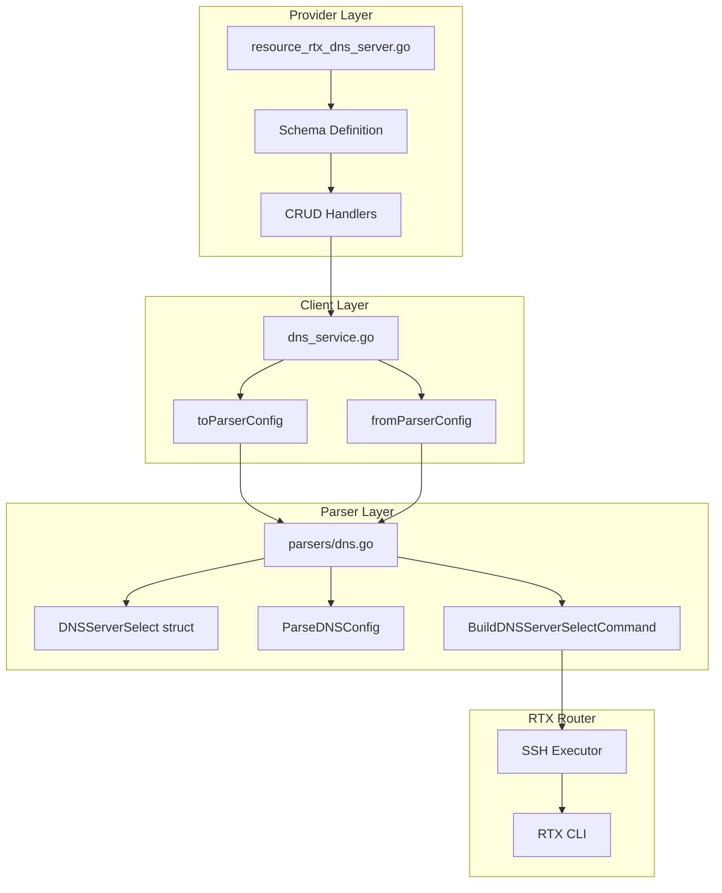

# Design Document: DNS Server Select Schema Refactor

## Overview

This feature refactors the `server_select` block in `rtx_dns_server` resource to separate mixed concerns (EDNS options, record types, domain patterns) into distinct schema fields. The change affects the parser layer, client layer, and provider layer, following the established patterns in this codebase.

## Steering Document Alignment

### Technical Standards (tech.md)
- **Go 1.23**: All changes will be written in Go following existing code style
- **terraform-plugin-sdk/v2**: Schema changes follow SDK v2 patterns
- **Parser Registry Pattern**: DNS parser will be updated using existing parser patterns
- **Stateless Communication**: No changes to SSH communication patterns

### Project Structure (structure.md)
- Parser changes in `internal/rtx/parsers/dns.go`
- Client interface changes in `internal/client/interfaces.go`
- Service layer changes in `internal/client/dns_service.go`
- Provider schema changes in `internal/provider/resource_rtx_dns_server.go`
- Tests alongside each modified file

## Code Reuse Analysis

### Existing Components to Leverage
- **DNSParser**: Existing parser infrastructure in `internal/rtx/parsers/dns.go` will be extended
- **DNSService**: Service layer in `internal/client/dns_service.go` handles toParserConfig/fromParserConfig conversion
- **Validation Functions**: Existing `validateIPAddress`, `validateIPAddressAny` in provider layer
- **validation Package**: `validation.StringInSlice` for record_type validation

### Integration Points
- **Terraform State**: Schema changes require state migration consideration (breaking change)
- **RTX CLI**: Parser must handle RTX `dns server select` command syntax
- **Existing Resources**: No impact on other resources

## Architecture

The refactoring follows the existing three-layer architecture:



### Modular Design Principles
- **Single File Responsibility**: Each layer handles its specific concern
- **Component Isolation**: Parser logic isolated from Terraform schema logic
- **Clear Interfaces**: DNSServerSelect struct serves as contract between layers

## Components and Interfaces

### Component 1: DNSServerSelect Struct (Parser Layer)
- **Purpose:** Data model for DNS server selection entry
- **Location:** `internal/rtx/parsers/dns.go` (primary), `internal/client/interfaces.go` (mirror)
- **Interfaces:**
  ```go
  type DNSServerSelect struct {
      ID             int    `json:"id"`
      Servers        []string `json:"servers"`
      EDNS           bool   `json:"edns"`
      RecordType     string `json:"record_type"`
      QueryPattern   string `json:"query_pattern"`
      OriginalSender string `json:"original_sender"`
      RestrictPP     int    `json:"restrict_pp"`
  }
  ```
- **Dependencies:** None
- **Reuses:** Existing struct pattern from current DNSServerSelect

### Component 2: ParseDNSConfig (Parser Layer)
- **Purpose:** Parse RTX CLI output into DNSConfig struct
- **Location:** `internal/rtx/parsers/dns.go`
- **Interfaces:** `func (p *DNSParser) ParseDNSConfig(raw string) (*DNSConfig, error)`
- **Dependencies:** regexp, strconv, strings
- **Changes Required:**
  - Update regex pattern for `dns server select` command
  - Parse new fields: edns, record type, query pattern, original sender, restrict pp

### Component 3: BuildDNSServerSelectCommand (Parser Layer)
- **Purpose:** Build RTX CLI command from DNSServerSelect struct
- **Location:** `internal/rtx/parsers/dns.go`
- **Interfaces:** `func BuildDNSServerSelectCommand(sel DNSServerSelect) string`
- **Dependencies:** fmt, strings
- **Changes Required:**
  - Generate command with proper field ordering
  - Handle optional fields (edns, original_sender, restrict_pp)

### Component 4: Terraform Schema (Provider Layer)
- **Purpose:** Define Terraform resource schema for server_select block
- **Location:** `internal/provider/resource_rtx_dns_server.go`
- **Interfaces:** `schema.Resource.Schema["server_select"]`
- **Dependencies:** terraform-plugin-sdk/v2
- **Changes Required:**
  - Remove `domains` field
  - Add `edns`, `record_type`, `query_pattern`, `original_sender`, `restrict_pp` fields

## Data Models

### DNSServerSelect (New Schema)
```go
type DNSServerSelect struct {
    ID             int      `json:"id"`              // Required: Selector ID (1+)
    Servers        []string `json:"servers"`         // Required: DNS server IPs
    EDNS           bool     `json:"edns"`            // Optional: Enable EDNS (default: false)
    RecordType     string   `json:"record_type"`     // Optional: a|aaaa|ptr|mx|ns|cname|any (default: "a")
    QueryPattern   string   `json:"query_pattern"`   // Required: Domain pattern (".", "*.example.com", etc.)
    OriginalSender string   `json:"original_sender"` // Optional: Source IP/CIDR restriction
    RestrictPP     int      `json:"restrict_pp"`     // Optional: PP session restriction (0=none)
}
```

### RTX Command Format
```
dns server select <id> <server1> [<server2>] [edns=on] [<type>] <query-pattern> [<original-sender>] [restrict pp <n>]
```

Example mappings:
| Terraform Config | RTX Command |
|-----------------|-------------|
| `edns = true` | `edns=on` |
| `record_type = "any"` | `any` |
| `query_pattern = "."` | `.` |
| `original_sender = "192.168.1.0/24"` | `192.168.1.0/24` |
| `restrict_pp = 1` | `restrict pp 1` |

## Error Handling

### Error Scenarios

1. **Invalid Record Type**
   - **Handling:** Schema validation rejects invalid values
   - **User Impact:** Terraform plan fails with clear error: "record_type must be one of: a, aaaa, ptr, mx, ns, cname, any"

2. **Invalid Query Pattern**
   - **Handling:** Accept any non-empty string (RTX validates actual value)
   - **User Impact:** RTX CLI error propagated to Terraform output

3. **Invalid Original Sender Format**
   - **Handling:** Validate IP/CIDR format in schema
   - **User Impact:** Terraform plan fails with validation error

4. **Migration from Old Schema**
   - **Handling:** Terraform reports unknown attribute error for `domains`
   - **User Impact:** Clear message to update configuration to new schema

## Testing Strategy

### Unit Testing
- **Parser Tests** (`internal/rtx/parsers/dns_test.go`):
  - Parse RTX output with all field combinations
  - Parse legacy format (graceful handling)
  - Parse edge cases (empty fields, special characters)

- **Command Builder Tests**:
  - Build command with all fields
  - Build command with optional fields omitted
  - Validate command format matches RTX syntax

### Integration Testing
- **Provider Tests** (`internal/provider/resource_rtx_dns_server_test.go`):
  - Schema validation for new fields
  - CRUD operations with new schema
  - State migration scenarios (detecting old schema)

### End-to-End Testing (Manual)
- Deploy configuration to real RTX router
- Verify `show config | grep dns` output matches expected
- Import existing configuration with new schema

## Implementation Sequence

1. **Parser Layer** (internal/rtx/parsers/dns.go)
   - Update DNSServerSelect struct
   - Update ParseDNSConfig regex and logic
   - Update BuildDNSServerSelectCommand
   - Add validation for new fields

2. **Client Layer** (internal/client/)
   - Update interfaces.go DNSServerSelect struct
   - Update dns_service.go conversion functions

3. **Provider Layer** (internal/provider/resource_rtx_dns_server.go)
   - Update schema definition
   - Update buildDNSConfigFromResourceData
   - Update flatten functions for Read

4. **Tests**
   - Update parser tests
   - Update provider tests
   - Add migration test cases
