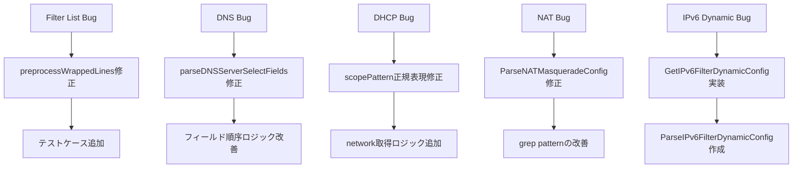

# Design Document: Parser Import Bugs

## Overview

本設計書では、Terraform import機能のテスト中に発見された5つのパーサーバグの修正方法を定義します。これらのバグにより、RTXルーターからの設定インポートが不完全になり、`terraform plan`で差分が発生しています。

## Steering Document Alignment

### Technical Standards (tech.md)
- 既存のパーサーパッケージ構造に従う
- ユニットテストでカバレッジを確保
- Go標準ライブラリのみを使用（外部依存なし）

### Project Structure (structure.md)
- パーサーは `internal/rtx/parsers/` に配置
- リソースは `internal/provider/` に配置
- クライアントは `internal/client/` に配置

## Code Reuse Analysis

### Existing Components to Leverage
- **parseFilterList関数**: interface_config.goで定義済み、IPv6でも共有可能
- **isValidIPForDNS関数**: dns.goで定義済み、IPアドレス判定に使用
- **ParseIPFilterDynamicConfig**: ip_filter.goで定義済み、IPv6版の参考に

### Integration Points
- **RTX SSH Client**: 既存のSSH接続を使用してコマンド実行
- **Terraform Resource State**: 既存のスキーマ構造を維持

## Architecture

### Bug Fix Strategy



## Component Details

### Component 1: Filter List Parsing Fix

**File:** `internal/rtx/parsers/interface_config.go`

**Problem:**
- `preprocessWrappedLines`関数が継続行を正しく検出できていない
- 継続行は先頭にスペース1つがあり、その後に数字が続く
- 現在のパターン `^\d` は先頭スペースを考慮していない

**Root Cause:**
RTXの出力では、行が80文字を超えると次の行に継続される。継続行は先頭にスペース1つが入り、その後に数字が続く。

```
ip lan2 secure filter in 200020 200021 200022 200023 200024 200025 200103 200100
 200102 200104 200101 200105 200099
```

現在のコードは `strings.TrimSpace` を先に行ってから `^\d` でマッチしているが、実際のRTX出力では継続行は先頭にスペースがある。

**Solution:**
```go
// preprocessWrappedLines修正案
func preprocessWrappedLines(input string) string {
    // 継続行パターン: 行頭がスペースで始まり、その後に数字が続く
    // RTXは80文字で折り返し、継続行は " <数字>" で始まる
    continuationPattern := regexp.MustCompile(`^\s+\d`)

    lines := strings.Split(input, "\n")
    var result []string

    for i := 0; i < len(lines); i++ {
        line := lines[i]

        // 次の行が継続行かチェック（スペースで始まり数字が続く）
        for i+1 < len(lines) && continuationPattern.MatchString(lines[i+1]) {
            i++
            line = line + " " + strings.TrimSpace(lines[i])
        }

        result = append(result, line)
    }

    return strings.Join(result, "\n")
}
```

**Testing:**
- 10+フィルター番号を含む折り返し行のテスト
- 200100などの6桁番号が正しくパースされることを確認
- dynamic キーワードを含む複合行のテスト

---

### Component 2: DNS server_select Parsing Fix

**File:** `internal/rtx/parsers/dns.go`

**Problem:**
- `parseDNSServerSelectFields`関数のフィールド順序検出が不正確
- 2つ目のサーバーIPがquery_patternとして認識される

**Root Cause:**
コマンドフォーマット: `dns server select <id> <server1> [<server2>] [edns=on] [<record_type>] <query_pattern>`

現在のパーサーは:
1. サーバーIPを1〜2個パース
2. edns=onをチェック
3. record_typeをチェック
4. query_patternをパース

問題は、record_typeのチェックで`.`（ドット）をquery_patternとして正しく認識できていない場合がある。

**Solution:**
```go
// parseDNSServerSelectFields修正案
func parseDNSServerSelectFields(id int, rest string) *DNSServerSelect {
    fields := strings.Fields(rest)
    if len(fields) < 2 {
        return nil
    }

    sel := &DNSServerSelect{
        ID:      id,
        Servers: []string{},
    }

    i := 0

    // Phase 1: サーバーをパース（最初の1〜2つのIP）
    for i < len(fields) && isValidIPForDNS(fields[i]) {
        sel.Servers = append(sel.Servers, fields[i])
        i++
        if len(sel.Servers) >= 2 {
            break // 最大2サーバー
        }
    }

    if len(sel.Servers) == 0 {
        return nil
    }

    // Phase 2: edns=onをチェック
    if i < len(fields) && strings.ToLower(fields[i]) == "edns=on" {
        sel.EDNS = true
        i++
    }

    // Phase 3: record_typeをチェック（"."は除外、それはquery_pattern）
    if i < len(fields) && validRecordTypes[strings.ToLower(fields[i])] && fields[i] != "." {
        sel.RecordType = strings.ToLower(fields[i])
        i++
    }

    // Phase 4: query_pattern（必須）
    if i < len(fields) {
        sel.QueryPattern = fields[i]
        i++
    }

    // ...残りのフィールド
    return sel
}
```

**Testing:**
- `dns server select 500000 1.1.1.1 1.0.0.1 edns=on a .` のパース
- 2サーバー構成でquery_patternが`.`の場合
- record_type `aaaa` が正しく認識されることを確認

---

### Component 3: DHCP Scope Parsing Fix

**File:** `internal/rtx/parsers/dhcp_scope.go`

**Problem:**
- `scopePattern`正規表現がnetworkフィールドを正しくキャプチャできていない可能性
- `expire`キーワードのパース問題

**Root Cause:**
現在のパターン:
```go
scopePattern := regexp.MustCompile(`^\s*dhcp\s+scope\s+(\d+)\s+([0-9.]+/\d+)(?:\s+gateway\s+([0-9.]+))?(?:\s+expire\s+(\S+))?\s*$`)
```

RTXの出力フォーマット:
```
dhcp scope 1 192.168.0.0/16 expire 24:00
```

問題: `gateway`がオプショナルだが、実際のコマンドでは`gateway`が省略されて`expire`が直接来る場合がある。

**Solution:**
```go
// scopePattern修正案
// gateway is deprecated, directly expect expire after network
scopePattern := regexp.MustCompile(`^\s*dhcp\s+scope\s+(\d+)\s+([0-9.]+/\d+)(?:\s+expire\s+(\S+))?\s*$`)
```

**Testing:**
- `dhcp scope 1 192.168.0.0/16 expire 24:00` のパース
- networkフィールドが正しく`192.168.0.0/16`になることを確認
- lease_timeが`24h`に変換されることを確認

---

### Component 4: NAT Masquerade Import Fix

**File:** `internal/rtx/parsers/nat_masquerade.go`

**Problem:**
- インポート時に「not found」エラーが発生
- `BuildShowNATDescriptorCommand`のgrepパターンが適切でない可能性

**Root Cause:**
現在のshowコマンド:
```go
return fmt.Sprintf("show config | grep -E \"nat descriptor (type|address outer|address inner|masquerade static) %d \"", id)
```

問題:
1. 末尾のスペースがマッチを妨げる可能性
2. `type`行では数字の後にスペースがなく`masquerade`が続く

**Solution:**
```go
// BuildShowNATDescriptorCommand修正案
func BuildShowNATDescriptorCommand(id int) string {
    // nat descriptor type 1000 masquerade
    // nat descriptor address outer 1000 primary
    // nat descriptor masquerade static 1000 1 ...
    return fmt.Sprintf("show config | grep \"nat descriptor\" | grep -E \"( %d | %d$)\"", id, id)
}
```

または、より広いパターンでフェッチしてパーサーでフィルタリング:
```go
func BuildShowNATDescriptorCommand(id int) string {
    return "show config | grep \"nat descriptor\""
}
```

**Testing:**
- descriptor ID 1000のNAT masqueradeが正しくパースされる
- static entriesが全て取得される

---

### Component 5: IPv6 Filter Dynamic Read Implementation

**Files:**
- `internal/rtx/parsers/ip_filter.go` - IPv6版パーサー追加
- `internal/client/rtx_ipv6_filter_dynamic.go` - クライアント実装

**Problem:**
- `GetIPv6FilterDynamicConfig`が未実装または不完全
- エラーメッセージ「IPv6 filter dynamic config not implemented」

**Solution:**

**Step 1: パーサー追加 (ip_filter.go)**
```go
// ParseIPv6FilterDynamicConfig parses IPv6 dynamic filter lines
func ParseIPv6FilterDynamicConfig(raw string) ([]IPFilterDynamic, error) {
    filters := []IPFilterDynamic{}
    lines := strings.Split(raw, "\n")

    // Pattern: ipv6 filter dynamic <n> <src> <dst> <protocol> [syslog on]
    dynamicPattern := regexp.MustCompile(`^\s*ipv6\s+filter\s+dynamic\s+(\d+)\s+(\S+)\s+(\S+)\s+(\S+)(?:\s+(.*))?$`)
    syslogPattern := regexp.MustCompile(`\bsyslog\s+on\b`)

    for _, line := range lines {
        line = strings.TrimSpace(line)
        if line == "" || strings.HasPrefix(line, "#") {
            continue
        }

        if matches := dynamicPattern.FindStringSubmatch(line); len(matches) >= 5 {
            number, err := strconv.Atoi(matches[1])
            if err != nil {
                continue
            }

            filter := IPFilterDynamic{
                Number:   number,
                Source:   matches[2],
                Dest:     matches[3],
                Protocol: matches[4],
            }

            if len(matches) > 5 && matches[5] != "" {
                if syslogPattern.MatchString(matches[5]) {
                    filter.SyslogOn = true
                }
            }

            filters = append(filters, filter)
        }
    }

    return filters, nil
}
```

**Step 2: クライアント実装**
```go
// GetIPv6FilterDynamicConfig retrieves IPv6 dynamic filter configuration
func (c *RTXClient) GetIPv6FilterDynamicConfig(ctx context.Context) (*IPv6FilterDynamicConfig, error) {
    raw, err := c.RunCommand(ctx, "show config | grep \"ipv6 filter dynamic\"")
    if err != nil {
        return nil, err
    }

    filters, err := parsers.ParseIPv6FilterDynamicConfig(raw)
    if err != nil {
        return nil, err
    }

    if len(filters) == 0 {
        return &IPv6FilterDynamicConfig{Entries: []IPv6FilterDynamicEntry{}}, nil
    }

    config := &IPv6FilterDynamicConfig{
        Entries: make([]IPv6FilterDynamicEntry, 0, len(filters)),
    }

    for _, f := range filters {
        config.Entries = append(config.Entries, IPv6FilterDynamicEntry{
            Number:   f.Number,
            Source:   f.Source,
            Dest:     f.Dest,
            Protocol: f.Protocol,
            Syslog:   f.SyslogOn,
        })
    }

    return config, nil
}
```

**Testing:**
- 8エントリーのIPv6 dynamic filterが正しくパースされる
- syslog=onオプションの検出
- 空の設定でもエラーにならないことを確認

---

## Data Models

### Existing Models (変更なし)
```go
// IPFilterDynamic - ip_filter.go
type IPFilterDynamic struct {
    Number   int    `json:"number"`
    Source   string `json:"source"`
    Dest     string `json:"dest"`
    Protocol string `json:"protocol"`
    SyslogOn bool   `json:"syslog,omitempty"`
}

// DNSServerSelect - dns.go
type DNSServerSelect struct {
    ID             int      `json:"id"`
    Servers        []string `json:"servers"`
    EDNS           bool     `json:"edns"`
    RecordType     string   `json:"record_type"`
    QueryPattern   string   `json:"query_pattern"`
    OriginalSender string   `json:"original_sender"`
    RestrictPP     int      `json:"restrict_pp"`
}
```

## Error Handling

### Error Scenarios

1. **パース失敗時**
   - **Handling:** 警告ログを出力し、空のスライスを返す
   - **User Impact:** terraform planで差分が表示される

2. **SSH接続エラー**
   - **Handling:** 既存のエラーハンドリングを使用
   - **User Impact:** エラーメッセージが表示される

3. **予期しないフォーマット**
   - **Handling:** パースをスキップしてログに記録
   - **User Impact:** 一部の設定がインポートされない

## Testing Strategy

### Unit Testing
- 各パーサー関数のテストケース追加
- 実際のRTX出力を模したテストデータ使用
- エッジケース（空入力、不正フォーマット）のテスト

### Integration Testing
- 実機との接続テスト（TF_ACC=1）
- インポート→plan→差分なしの確認

### Test Files to Create/Update
1. `internal/rtx/parsers/interface_config_test.go` - 折り返し行テスト追加
2. `internal/rtx/parsers/dns_test.go` - server_selectテスト追加
3. `internal/rtx/parsers/dhcp_scope_test.go` - networkパーステスト追加
4. `internal/rtx/parsers/nat_masquerade_test.go` - import用テスト追加
5. `internal/rtx/parsers/ip_filter_test.go` - IPv6 dynamicテスト追加
