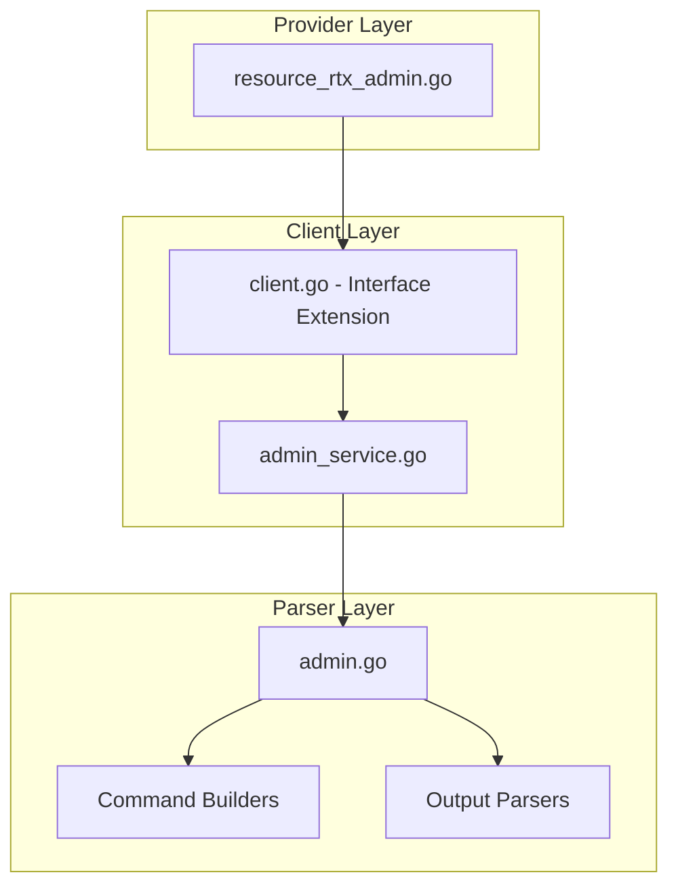

# Design Document: rtx_admin

## Overview

The `rtx_admin` resource enables Terraform-based management of administrative access settings on Yamaha RTX series routers. This includes login passwords, administrator passwords, and user account management.

**Security Note**: This resource manages sensitive credentials. Special care must be taken to handle passwords securely.

## Scope

This resource manages **administrative access configuration** including:
- Login password (anonymous console access)
- Administrator password (privileged mode)
- User accounts with attributes
- Login timer settings

**Note**: This is a sensitive resource that manages authentication credentials.

## Code Reuse Analysis

### Existing Components to Leverage

- **`internal/client/dhcp_scope_service.go`**: Pattern for service layer implementation.
- **`internal/client/interfaces.go`**: Extend the `Client` interface with admin methods.
- **`internal/rtx/parsers/`**: Reference for parser implementation patterns.
- **`internal/provider/resource_rtx_dhcp_scope.go`**: Template for Terraform resource structure.

### Integration Points

- **`rtxClient`**: Add admin configuration methods
- **`Executor`**: Use existing SSH command execution infrastructure

## Architecture



## Components and Interfaces

### Component 1: AdminService (`internal/client/admin_service.go`)

- **Purpose:** Handles all admin CRUD operations against the RTX router
- **Interfaces:**
  ```go
  type AdminService struct {
      executor Executor
      client   *rtxClient
  }

  func (s *AdminService) Configure(ctx context.Context, config AdminConfig) error
  func (s *AdminService) Get(ctx context.Context) (*AdminConfig, error)
  func (s *AdminService) Update(ctx context.Context, config AdminConfig) error
  func (s *AdminService) CreateUser(ctx context.Context, user UserConfig) error
  func (s *AdminService) DeleteUser(ctx context.Context, username string) error
  func (s *AdminService) ListUsers(ctx context.Context) ([]UserConfig, error)
  ```
- **Dependencies:** `Executor`, `rtxClient`, `parsers.AdminParser`

### Component 2: AdminParser (`internal/rtx/parsers/admin.go`)

- **Purpose:** Parses RTX router output for admin configuration and builds commands
- **Interfaces:**
  ```go
  type AdminConfig struct {
      LoginPassword string       `json:"login_password,omitempty"`
      AdminPassword string       `json:"admin_password,omitempty"`
      Users         []UserConfig `json:"users,omitempty"`
  }

  type UserConfig struct {
      Username      string            `json:"username"`
      Password      string            `json:"password,omitempty"`
      Encrypted     bool              `json:"encrypted"` // Password is already encrypted
      Attributes    UserAttributes    `json:"attributes"`
  }

  type UserAttributes struct {
      Administrator bool     `json:"administrator"`
      Connection    []string `json:"connection"` // serial, telnet, remote, ssh, sftp, http
      GUIPages      []string `json:"gui_pages"`  // dashboard, lan-map, config
      LoginTimer    int      `json:"login_timer"` // Seconds
  }

  func ParseAdminConfig(raw string) (*AdminConfig, error)
  func BuildLoginPasswordCommand(password string) string
  func BuildAdminPasswordCommand(password string) string
  func BuildUserCommand(user UserConfig) string
  func BuildUserAttributeCommand(username string, attrs UserAttributes) string
  func BuildDeleteUserCommand(username string) string
  ```
- **Dependencies:** `regexp`, `strings`, `strconv`

### Component 3: Terraform Resource (`internal/provider/resource_rtx_admin.go`)

- **Purpose:** Terraform resource definition implementing CRUD lifecycle
- **Interfaces:**
  ```go
  func resourceRTXAdmin() *schema.Resource
  func resourceRTXAdminCreate(ctx, d, meta) diag.Diagnostics
  func resourceRTXAdminRead(ctx, d, meta) diag.Diagnostics
  func resourceRTXAdminUpdate(ctx, d, meta) diag.Diagnostics
  func resourceRTXAdminDelete(ctx, d, meta) diag.Diagnostics
  func resourceRTXAdminImport(ctx, d, meta) ([]*schema.ResourceData, error)
  ```
- **Dependencies:** `Client`, `AdminConfig`, Terraform SDK

### Component 4: Client Interface Extension (`internal/client/interfaces.go`)

- **Purpose:** Extend Client interface with admin methods
- **Interfaces:**
  ```go
  // Add to existing Client interface:
  GetAdminConfig(ctx context.Context) (*AdminConfig, error)
  ConfigureAdmin(ctx context.Context, config AdminConfig) error
  UpdateAdminConfig(ctx context.Context, config AdminConfig) error
  CreateUser(ctx context.Context, user UserConfig) error
  DeleteUser(ctx context.Context, username string) error
  ListUsers(ctx context.Context) ([]UserConfig, error)
  ```
- **Dependencies:** Existing Client interface

## Data Models

### AdminConfig

```go
// AdminConfig represents administrative access configuration
type AdminConfig struct {
    LoginPassword string       `json:"login_password,omitempty"` // Sensitive
    AdminPassword string       `json:"admin_password,omitempty"` // Sensitive
    Users         []UserConfig `json:"users,omitempty"`
}

// UserConfig represents a user account configuration
type UserConfig struct {
    Username   string         `json:"username"`
    Password   string         `json:"password,omitempty"` // Sensitive, plaintext or encrypted
    Encrypted  bool           `json:"encrypted"`          // If true, password is pre-encrypted
    Attributes UserAttributes `json:"attributes"`
}

// UserAttributes represents user access attributes
type UserAttributes struct {
    Administrator bool     `json:"administrator"`   // Admin privileges
    Connection    []string `json:"connection"`      // Allowed connection methods
    GUIPages      []string `json:"gui_pages"`       // Allowed GUI pages
    LoginTimer    int      `json:"login_timer"`     // Session timeout in seconds
}
```

### Terraform Schema

```hcl
# Admin passwords only (singleton)
resource "rtx_admin" "main" {
  # Console login password
  login_password = var.login_password

  # Administrator (privileged mode) password
  admin_password = var.admin_password
}

# User accounts (separate resource for each user)
resource "rtx_admin_user" "operator" {
  username = "operator"
  password = var.operator_password

  attributes {
    administrator = false
    connection    = ["ssh", "http"]
    gui_pages     = ["dashboard", "lan-map"]
    login_timer   = 300  # 5 minutes
  }
}

resource "rtx_admin_user" "admin_user" {
  username = "admin_user"
  password = var.admin_user_password

  attributes {
    administrator = true
    connection    = ["serial", "telnet", "remote", "ssh", "sftp", "http"]
    gui_pages     = ["dashboard", "lan-map", "config"]
    login_timer   = 3600  # 1 hour
  }
}
```

## RTX Command Mapping

### Configure Login Password

```
login password <password>
```

Example: `login password secret123`

### Configure Administrator Password

```
administrator password <password>
```

Example: `administrator password admin456`

### Create User Account

```
login user <username> <password>
login user <username> encrypted <encrypted_password>
```

Example: `login user operator secret789`

### Configure User Attributes

```
user attribute <username> administrator=on|off connection=<types> gui-page=<pages> login-timer=<seconds>
```

Example: `user attribute operator administrator=off connection=ssh,http gui-page=dashboard,lan-map login-timer=300`

### Delete User

```
no login user <username>
no user attribute <username>
```

### Show Configuration

```
show config | grep -E "(login|administrator|user)"
```

**Note**: Passwords are not shown in plaintext in `show config`.

## Error Handling

### Error Scenarios

1. **Invalid Password**
   - **Handling:** Validate password meets complexity requirements
   - **User Impact:** Clear validation error with requirements

2. **Invalid Username**
   - **Handling:** Validate username format
   - **User Impact:** Clear error with valid format

3. **Invalid Connection Type**
   - **Handling:** Validate connection types are valid
   - **User Impact:** Error with valid types

4. **Invalid GUI Page**
   - **Handling:** Validate GUI pages are valid
   - **User Impact:** Error with valid pages

5. **User Already Exists**
   - **Handling:** Check for existing user
   - **User Impact:** Error suggesting import

6. **Connection/Command Timeout**
   - **Handling:** Use existing retry logic from `rtxClient`
   - **User Impact:** Standard Terraform timeout error

## Testing Strategy

### Unit Testing

- **Parser Tests** (`admin_test.go`):
  - Parse various RTX `show config` output for admin settings
  - Test command builder functions with different parameters
  - Test attribute string building

- **Service Tests** (`admin_service_test.go`):
  - Mock executor for service method testing
  - Test error handling for various failure scenarios
  - Test user CRUD operations

### Integration Testing

- **Resource Tests** (`resource_rtx_admin_test.go`):
  - Full CRUD lifecycle with mock client
  - Import functionality testing
  - Sensitive attribute handling

### End-to-End Testing

- **Acceptance Tests** (with real RTX router):
  - Configure passwords
  - Create user account
  - Configure user attributes
  - Update user
  - Delete user
  - Import existing configuration

## File Structure

```
internal/
├── provider/
│   ├── resource_rtx_admin.go           # NEW: Admin passwords resource
│   ├── resource_rtx_admin_user.go      # NEW: User account resource
│   ├── resource_rtx_admin_test.go      # NEW: Admin tests
│   └── resource_rtx_admin_user_test.go # NEW: User tests
├── client/
│   ├── interfaces.go                    # MODIFY: Add admin types and methods
│   ├── client.go                        # MODIFY: Add admin service initialization
│   ├── admin_service.go                # NEW: Admin service implementation
│   └── admin_service_test.go           # NEW: Service tests
└── rtx/
    └── parsers/
        ├── admin.go                    # NEW: Parser and command builders
        └── admin_test.go               # NEW: Parser tests
```

## Implementation Notes

1. **Singleton for Passwords**: `rtx_admin` (passwords) is a singleton resource with fixed ID.

2. **User as Separate Resource**: `rtx_admin_user` is a separate resource per user account.

3. **Sensitive Attributes**: Mark `login_password`, `admin_password`, and user `password` as sensitive.

4. **Encrypted Passwords**: Support both plaintext and pre-encrypted password formats.

5. **Connection Types**: Valid values: `serial`, `telnet`, `remote`, `ssh`, `sftp`, `http`

6. **GUI Pages**: Valid values: `dashboard`, `lan-map`, `config`

7. **Login Timer**: Timeout in seconds (0 = no timeout, max varies by model).

8. **Password Read**: Passwords cannot be read back from router. Use `ignore_changes` lifecycle or store state.

9. **Configuration Save**: Use existing `SaveConfig()` pattern after modifications.

10. **Provider Registration**: Add `resourceRTXAdmin` and `resourceRTXAdminUser` to provider's resource map.

## Security Considerations

1. **State File Security**: Terraform state contains passwords. Use remote backend with encryption.

2. **No Password Echo**: Passwords should not be logged or displayed.

3. **Sensitive Marking**: All password fields must be marked as `Sensitive: true` in schema.

4. **Minimum Complexity**: Consider validating password complexity (if router enforces it).

5. **Audit Logging**: Consider logging password change events (without the password itself).

## State Handling

- Persist only configuration attributes in Terraform state.
- Operational/runtime status must not be stored in state to avoid perpetual diffs.
