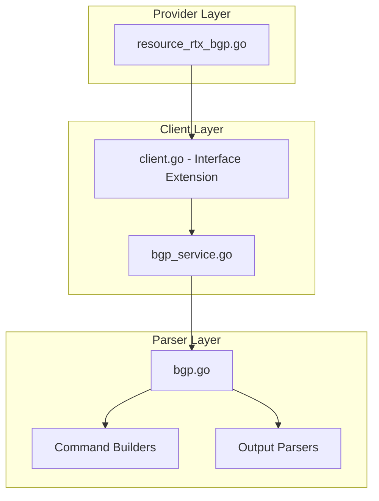

# Design Document: rtx_bgp

## Overview

The `rtx_bgp` resource enables Terraform-based management of BGP (Border Gateway Protocol) routing configuration on Yamaha RTX series routers. Following Cisco IOS XE Terraform provider naming conventions, this resource manages BGP process, neighbor, and network configuration.

## Scope

This resource manages **BGP routing configuration** including:
- BGP process enable/disable
- Local AS number and router ID
- Neighbor (peer) configuration
- Network announcements
- Route redistribution

**Note**: This is a comprehensive resource that may be split into separate resources (`rtx_bgp`, `rtx_bgp_neighbor`) in implementation if complexity warrants it.

## Code Reuse Analysis

### Existing Components to Leverage

- **`internal/client/dhcp_scope_service.go`**: Pattern for service layer implementation with CRUD operations.
- **`internal/client/interfaces.go`**: Extend the `Client` interface with BGP methods.
- **`internal/rtx/parsers/`**: Reference for parser implementation patterns.
- **`internal/provider/resource_rtx_dhcp_scope.go`**: Template for Terraform resource structure.

### Integration Points

- **`rtxClient`**: Add BGP methods for CRUD operations
- **`Executor`**: Use existing SSH command execution infrastructure
- **`rtx_static_route`**: BGP may redistribute static routes

## Architecture



### Modular Design Principles

- **Single File Responsibility**: `BGPService` handles all BGP CRUD operations
- **Component Isolation**: Parser, service, and resource layers clearly separated
- **Service Layer Separation**: Service encapsulates all BGP logic
- **Utility Modularity**: Shared validation functions for AS numbers and IPs

## Components and Interfaces

### Component 1: BGPService (`internal/client/bgp_service.go`)

- **Purpose:** Handles all BGP CRUD operations against the RTX router
- **Interfaces:**
  ```go
  type BGPService struct {
      executor Executor
      client   *rtxClient
  }

  func (s *BGPService) Configure(ctx context.Context, config BGPConfig) error
  func (s *BGPService) Get(ctx context.Context) (*BGPConfig, error)
  func (s *BGPService) Update(ctx context.Context, config BGPConfig) error
  func (s *BGPService) Reset(ctx context.Context) error
  ```
- **Dependencies:** `Executor`, `rtxClient`, `parsers.BGPParser`
- **Reuses:** Pattern from `DHCPScopeService`, `Executor` interface

### Component 2: BGPParser (`internal/rtx/parsers/bgp.go`)

- **Purpose:** Parses RTX router output for BGP configuration and builds commands
- **Interfaces:**
  ```go
  type BGPConfig struct {
      Enabled             bool          `json:"enabled"`
      ASN                 string        `json:"asn"`
      RouterID            string        `json:"router_id,omitempty"`
      DefaultIPv4Unicast  bool          `json:"default_ipv4_unicast"`
      LogNeighborChanges  bool          `json:"log_neighbor_changes"`
      Neighbors           []BGPNeighbor `json:"neighbors,omitempty"`
      Networks            []BGPNetwork  `json:"networks,omitempty"`
      RedistributeStatic  bool          `json:"redistribute_static"`
      RedistributeConnected bool        `json:"redistribute_connected"`
  }

  type BGPNeighbor struct {
      ID        int    `json:"id"`
      IP        string `json:"ip"`
      RemoteAS  string `json:"remote_as"`
      HoldTime  int    `json:"hold_time,omitempty"`
      Keepalive int    `json:"keepalive,omitempty"`
      Multihop  int    `json:"multihop,omitempty"`
      Password  string `json:"password,omitempty"`
      LocalAddress string `json:"local_address,omitempty"`
  }

  type BGPNetwork struct {
      Prefix string `json:"prefix"`
      Mask   string `json:"mask"`
  }

  func ParseBGPConfig(raw string) (*BGPConfig, error)
  func BuildBGPUseCommand(enabled bool) string
  func BuildBGPASNCommand(asn string) string
  func BuildBGPRouterIDCommand(routerID string) string
  func BuildBGPNeighborCommand(n BGPNeighbor) []string
  func BuildBGPNetworkCommand(network BGPNetwork) string
  func BuildBGPRedistributeCommand(routeType string) string
  ```
- **Dependencies:** `regexp`, `strings`, `strconv`

### Component 3: Terraform Resource (`internal/provider/resource_rtx_bgp.go`)

- **Purpose:** Terraform resource definition implementing CRUD lifecycle
- **Interfaces:**
  ```go
  func resourceRTXBGP() *schema.Resource
  func resourceRTXBGPCreate(ctx, d, meta) diag.Diagnostics
  func resourceRTXBGPRead(ctx, d, meta) diag.Diagnostics
  func resourceRTXBGPUpdate(ctx, d, meta) diag.Diagnostics
  func resourceRTXBGPDelete(ctx, d, meta) diag.Diagnostics
  func resourceRTXBGPImport(ctx, d, meta) ([]*schema.ResourceData, error)
  ```
- **Dependencies:** `Client`, `BGPConfig`, Terraform SDK
- **Reuses:** `resourceRTXDHCPScope` patterns

### Component 4: Client Interface Extension (`internal/client/interfaces.go`)

- **Purpose:** Extend Client interface with BGP methods
- **Interfaces:**
  ```go
  // Add to existing Client interface:
  GetBGPConfig(ctx context.Context) (*BGPConfig, error)
  ConfigureBGP(ctx context.Context, config BGPConfig) error
  UpdateBGPConfig(ctx context.Context, config BGPConfig) error
  ResetBGP(ctx context.Context) error
  ```
- **Dependencies:** Existing Client interface
- **Reuses:** Pattern from existing methods

## Data Models

### BGPConfig

```go
// BGPConfig represents BGP configuration on an RTX router
type BGPConfig struct {
    Enabled              bool          `json:"enabled"`
    ASN                  string        `json:"asn"`                    // String for 4-byte ASN support
    RouterID             string        `json:"router_id,omitempty"`
    DefaultIPv4Unicast   bool          `json:"default_ipv4_unicast"`
    LogNeighborChanges   bool          `json:"log_neighbor_changes"`
    Neighbors            []BGPNeighbor `json:"neighbors,omitempty"`
    Networks             []BGPNetwork  `json:"networks,omitempty"`
    RedistributeStatic   bool          `json:"redistribute_static"`
    RedistributeConnected bool         `json:"redistribute_connected"`
}

// BGPNeighbor represents a BGP neighbor (peer) configuration
type BGPNeighbor struct {
    ID           int    `json:"id"`                        // RTX neighbor ID (1-based)
    IP           string `json:"ip"`                        // Neighbor IP address
    RemoteAS     string `json:"remote_as"`                 // Remote AS number
    HoldTime     int    `json:"hold_time,omitempty"`       // Hold timer (seconds)
    Keepalive    int    `json:"keepalive,omitempty"`       // Keepalive interval
    Multihop     int    `json:"multihop,omitempty"`        // eBGP multihop TTL
    Password     string `json:"password,omitempty"`        // MD5 authentication (sensitive)
    LocalAddress string `json:"local_address,omitempty"`   // Local address for session
}

// BGPNetwork represents a network to announce via BGP
type BGPNetwork struct {
    Prefix string `json:"prefix"` // Network prefix
    Mask   string `json:"mask"`   // Network mask
}
```

### Terraform Schema

```hcl
resource "rtx_bgp" "main" {
  asn                  = "65001"
  router_id            = "1.1.1.1"
  default_ipv4_unicast = true
  log_neighbor_changes = true

  neighbors = [
    {
      ip        = "203.0.113.1"
      remote_as = "65002"
      hold_time = 90
      keepalive = 30
    },
    {
      ip        = "198.51.100.1"
      remote_as = "65003"
      multihop  = 2
      password  = var.bgp_password
    }
  ]

  networks = [
    {
      prefix = "192.168.0.0"
      mask   = "255.255.0.0"
    }
  ]

  redistribute_static = true
}
```

## RTX Command Mapping

### Enable BGP

```
bgp use on
```

### Configure AS Number

```
bgp autonomous-system <asn>
```

Example: `bgp autonomous-system 65001`

### Configure Router ID

```
bgp router id <router_id>
```

Example: `bgp router id 1.1.1.1`

### Configure Neighbor

```
bgp neighbor <n> address <ip> as <asn>
bgp neighbor <n> hold-time <time>
bgp neighbor <n> local-address <ip>
bgp neighbor <n> password <password>
```

Example:
```
bgp neighbor 1 address 203.0.113.1 as 65002
bgp neighbor 1 hold-time 90
```

### Configure Network Announcements

```
bgp import filter <n> include <network>/<mask>
```

Example: `bgp import filter 1 include 192.168.0.0/16`

### Configure Redistribution

```
bgp import from static
bgp import from connected
```

### Disable BGP

```
bgp use off
```

### Show Configuration

```
show config | grep bgp
show bgp neighbor
show bgp summary
```

## Error Handling

### Error Scenarios

1. **Invalid AS Number**
   - **Handling:** Validate ASN is in valid range (1-4294967295)
   - **User Impact:** Clear validation error with valid range

2. **Invalid Router ID**
   - **Handling:** Validate router ID is valid IPv4 address
   - **User Impact:** Clear error with expected format

3. **Invalid Neighbor IP**
   - **Handling:** Validate IP address format
   - **User Impact:** Clear error with expected format

4. **Neighbor Already Exists**
   - **Handling:** Parse RTX output for existing neighbor
   - **User Impact:** Error suggesting import or different ID

5. **BGP Already Configured**
   - **Handling:** Check for existing BGP configuration
   - **User Impact:** Error suggesting import

6. **Connection/Command Timeout**
   - **Handling:** Use existing retry logic from `rtxClient`
   - **User Impact:** Standard Terraform timeout error

## Testing Strategy

### Unit Testing

- **Parser Tests** (`bgp_test.go`):
  - Parse various RTX `show config` output for BGP settings
  - Test command builder functions with different parameters
  - Test ASN and IP validation functions

- **Service Tests** (`bgp_service_test.go`):
  - Mock executor for service method testing
  - Test error handling for various failure scenarios
  - Test neighbor and network configuration

### Integration Testing

- **Resource Tests** (`resource_rtx_bgp_test.go`):
  - Full CRUD lifecycle with mock client
  - Import functionality testing
  - Neighbor configuration testing

### End-to-End Testing

- **Acceptance Tests** (with real RTX router):
  - Enable BGP with AS number
  - Configure router ID
  - Add BGP neighbors
  - Configure network announcements
  - Enable redistribution
  - Update configuration
  - Disable BGP
  - Import existing configuration

## State Handling

- Persist only configuration attributes in Terraform state.
- Neighbor status is operational-only and must not be stored in state to avoid perpetual diffs.

## File Structure

```
internal/
├── provider/
│   ├── resource_rtx_bgp.go           # NEW: Terraform resource
│   └── resource_rtx_bgp_test.go      # NEW: Resource tests
├── client/
│   ├── interfaces.go                  # MODIFY: Add BGPConfig types and methods
│   ├── client.go                      # MODIFY: Add BGP service initialization
│   ├── bgp_service.go                # NEW: BGP service implementation
│   └── bgp_service_test.go           # NEW: Service tests
└── rtx/
    └── parsers/
        ├── bgp.go                    # NEW: Parser and command builders
        └── bgp_test.go               # NEW: Parser tests
```

## Implementation Notes

1. **Singleton Resource**: BGP configuration is global to the router. Use fixed ID `"bgp"`.

2. **Neighbor IDs**: RTX uses numeric IDs for neighbors (1, 2, 3...). Auto-assign based on array index.

3. **4-Byte ASN**: Support 4-byte AS numbers as strings for Cisco compatibility.

4. **Password Sensitivity**: Mark neighbor passwords as sensitive in Terraform schema.

5. **eBGP vs iBGP**: If `remote_as` matches `asn`, it's iBGP; otherwise eBGP.

6. **Multihop**: Only applicable for eBGP neighbors.

7. **Configuration Save**: Use existing `SaveConfig()` pattern after modifications.

8. **Provider Registration**: Add `resourceRTXBGP` to provider's resource map.

9. **Import**: Import uses fixed ID `"bgp"` since it's a singleton resource.

10. **Order of Operations**: Enable BGP first, then configure AS, router ID, neighbors, and networks.

## Security Considerations

1. **Neighbor Passwords**: Mark as sensitive in Terraform state.

2. **Route Filtering**: Consider documenting import/export filter configuration.

3. **Prefix Limits**: Consider implementing maximum-prefix limits for neighbors.

4. **AS Path Security**: Document AS path manipulation risks.

5. **MD5 Authentication**: Recommend using authentication for all neighbors.
