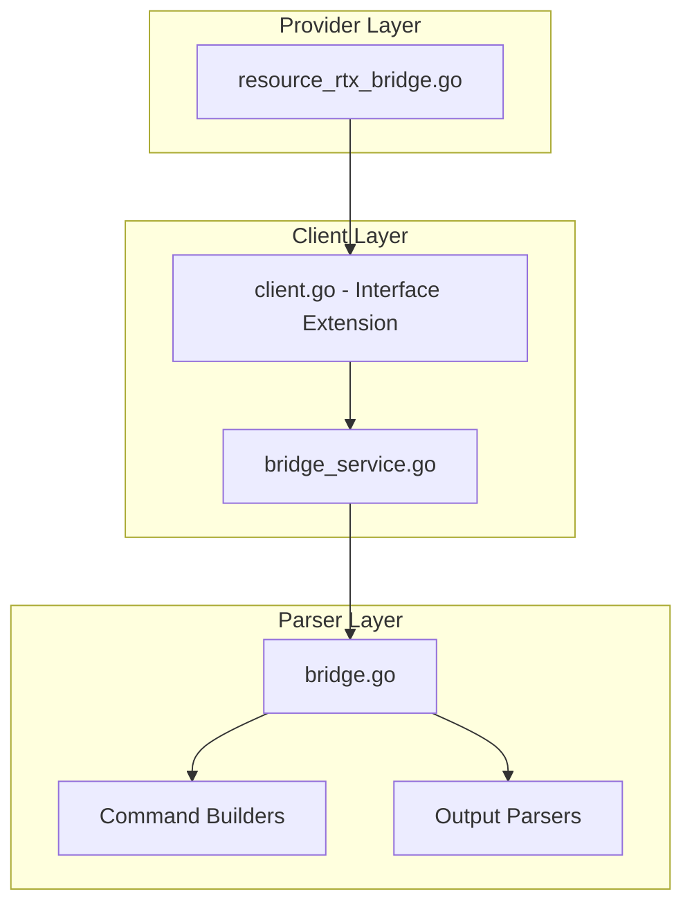

# Design Document: rtx_bridge

## Overview

The `rtx_bridge` resource enables Terraform-based management of bridge interface configurations on Yamaha RTX series routers. Bridges allow multiple network segments (physical interfaces, tunnels) to operate as a single Layer 2 broadcast domain.

## Scope

This resource manages **bridge membership configuration** including:
- Bridge interface creation
- Member interface assignment (LAN, tunnel, etc.)
- Bridge member management

**Note**: IP address configuration for bridge interfaces is handled by the `rtx_interface` resource.

## Code Reuse Analysis

### Existing Components to Leverage

- **`internal/client/dhcp_scope_service.go`**: Pattern for service layer implementation with CRUD operations.
- **`internal/client/interfaces.go`**: Extend the `Client` interface with bridge methods.
- **`internal/rtx/parsers/`**: Reference for parser implementation patterns.
- **`internal/provider/resource_rtx_dhcp_scope.go`**: Template for Terraform resource structure.

### Integration Points

- **`rtxClient`**: Add bridge methods for CRUD operations
- **`Executor`**: Use existing SSH command execution infrastructure
- **`rtx_interface`**: Bridge IP configuration
- **`rtx_l2tp`**: L2TPv3 tunnels as bridge members

## Architecture



## Components and Interfaces

### Component 1: BridgeService (`internal/client/bridge_service.go`)

- **Purpose:** Handles all bridge CRUD operations against the RTX router
- **Interfaces:**
  ```go
  type BridgeService struct {
      executor Executor
      client   *rtxClient
  }

  func (s *BridgeService) Create(ctx context.Context, bridge BridgeConfig) error
  func (s *BridgeService) Get(ctx context.Context, bridgeName string) (*BridgeConfig, error)
  func (s *BridgeService) Update(ctx context.Context, bridge BridgeConfig) error
  func (s *BridgeService) Delete(ctx context.Context, bridgeName string) error
  func (s *BridgeService) List(ctx context.Context) ([]BridgeConfig, error)
  ```
- **Dependencies:** `Executor`, `rtxClient`, `parsers.BridgeParser`

### Component 2: BridgeParser (`internal/rtx/parsers/bridge.go`)

- **Purpose:** Parses RTX router output for bridge configuration and builds commands
- **Interfaces:**
  ```go
  type BridgeConfig struct {
      Name    string   `json:"name"`    // bridge1, bridge2, etc.
      Members []string `json:"members"` // lan1, lan2, tunnel1, etc.
  }

  func ParseBridgeConfig(raw string) ([]BridgeConfig, error)
  func BuildBridgeMemberCommand(bridgeName string, members []string) string
  func BuildDeleteBridgeCommand(bridgeName string) string
  func BuildShowBridgeCommand(bridgeName string) string
  ```
- **Dependencies:** `regexp`, `strings`, `strconv`

### Component 3: Terraform Resource (`internal/provider/resource_rtx_bridge.go`)

- **Purpose:** Terraform resource definition implementing CRUD lifecycle
- **Interfaces:**
  ```go
  func resourceRTXBridge() *schema.Resource
  func resourceRTXBridgeCreate(ctx, d, meta) diag.Diagnostics
  func resourceRTXBridgeRead(ctx, d, meta) diag.Diagnostics
  func resourceRTXBridgeUpdate(ctx, d, meta) diag.Diagnostics
  func resourceRTXBridgeDelete(ctx, d, meta) diag.Diagnostics
  func resourceRTXBridgeImport(ctx, d, meta) ([]*schema.ResourceData, error)
  ```
- **Dependencies:** `Client`, `BridgeConfig`, Terraform SDK

### Component 4: Client Interface Extension (`internal/client/interfaces.go`)

- **Purpose:** Extend Client interface with bridge methods
- **Interfaces:**
  ```go
  // Add to existing Client interface:
  GetBridge(ctx context.Context, bridgeName string) (*BridgeConfig, error)
  CreateBridge(ctx context.Context, bridge BridgeConfig) error
  UpdateBridge(ctx context.Context, bridge BridgeConfig) error
  DeleteBridge(ctx context.Context, bridgeName string) error
  ListBridges(ctx context.Context) ([]BridgeConfig, error)
  ```
- **Dependencies:** Existing Client interface

## Data Models

### BridgeConfig

```go
// BridgeConfig represents bridge configuration on an RTX router
type BridgeConfig struct {
    Name    string   `json:"name"`    // Bridge interface name (bridge1, bridge2, etc.)
    Members []string `json:"members"` // Member interfaces (lan1, lan2, tunnel1, etc.)
}
```

### Terraform Schema

```hcl
resource "rtx_bridge" "main" {
  name = "bridge1"  # Required, ForceNew

  # Member interfaces
  members = ["lan1", "tunnel1"]
}

# Example: L2VPN bridge with multiple sites
resource "rtx_bridge" "l2vpn" {
  name = "bridge2"

  members = [
    "lan1",     # Local LAN
    "tunnel1",  # L2TPv3 tunnel to site A
    "tunnel2",  # L2TPv3 tunnel to site B
  ]
}

# IP configuration for bridge (separate resource)
resource "rtx_interface" "bridge_ip" {
  name = rtx_bridge.main.name

  ip_address {
    address = "192.168.1.253/16"
  }
}
```

## RTX Command Mapping

### Create/Update Bridge Membership

```
bridge member <bridge_name> <member1> [<member2> ...]
```

Example: `bridge member bridge1 lan1 tunnel1`

### Remove Bridge

```
no bridge member <bridge_name>
```

Example: `no bridge member bridge1`

### Show Configuration

```
show config | grep bridge
show status bridge
show status bridge1
```

## Error Handling

### Error Scenarios

1. **Invalid Bridge Name**
   - **Handling:** Validate bridge name format (bridge1, bridge2, etc.)
   - **User Impact:** Clear validation error with valid names

2. **Invalid Member Interface**
   - **Handling:** Validate member interface names
   - **User Impact:** Clear error with valid interface types

3. **Member Already in Another Bridge**
   - **Handling:** Check if member is already assigned
   - **User Impact:** Error indicating which bridge owns the member

4. **Bridge Limit Exceeded**
   - **Handling:** RTX has maximum bridge count (typically 8)
   - **User Impact:** Error with available bridge slots

5. **Connection/Command Timeout**
   - **Handling:** Use existing retry logic from `rtxClient`
   - **User Impact:** Standard Terraform timeout error

## Testing Strategy

### Unit Testing

- **Parser Tests** (`bridge_test.go`):
  - Parse various RTX `show config` output for bridge settings
  - Test command builder functions with different parameters
  - Test member list handling

- **Service Tests** (`bridge_service_test.go`):
  - Mock executor for service method testing
  - Test error handling for various failure scenarios
  - Test member addition/removal

### Integration Testing

- **Resource Tests** (`resource_rtx_bridge_test.go`):
  - Full CRUD lifecycle with mock client
  - Import functionality testing
  - Member update testing

### End-to-End Testing

- **Acceptance Tests** (with real RTX router):
  - Create bridge with single member
  - Create bridge with multiple members
  - Add member to existing bridge
  - Remove member from bridge
  - Delete bridge
  - Import existing bridge

## File Structure

```
internal/
├── provider/
│   ├── resource_rtx_bridge.go      # NEW: Terraform resource
│   └── resource_rtx_bridge_test.go # NEW: Resource tests
├── client/
│   ├── interfaces.go                # MODIFY: Add BridgeConfig types and methods
│   ├── client.go                    # MODIFY: Add bridge service initialization
│   ├── bridge_service.go           # NEW: Bridge service implementation
│   └── bridge_service_test.go      # NEW: Service tests
└── rtx/
    └── parsers/
        ├── bridge.go               # NEW: Parser and command builders
        └── bridge_test.go          # NEW: Parser tests
```

## Implementation Notes

1. **Bridge Name as Terraform ID**: Use bridge name (e.g., `bridge1`) as Terraform resource ID.

2. **ForceNew**: `name` is ForceNew. `members` supports in-place updates.

3. **Member Order**: Member order in the command doesn't affect functionality.

4. **Valid Members**: Valid member types include:
   - `lan1`, `lan2`, etc. (physical LAN ports)
   - `tunnel1`, `tunnel2`, etc. (L2TPv3 tunnels)
   - `pp1`, `pp2`, etc. (point-to-point interfaces, rare)

5. **Bridge IP**: Bridge interface IP is configured separately via `rtx_interface`.

6. **L2TPv3 Integration**: Commonly used with L2TPv3 tunnels for L2VPN.

7. **Configuration Save**: Use existing `SaveConfig()` pattern after modifications.

8. **Provider Registration**: Add `resourceRTXBridge` to provider's resource map.

9. **Empty Members**: Bridge with no members is valid but non-functional.

10. **Dependency**: Create bridge before configuring its IP address.

## State Handling

- Persist only configuration attributes in Terraform state.
- Operational/runtime status must not be stored in state to avoid perpetual diffs.
