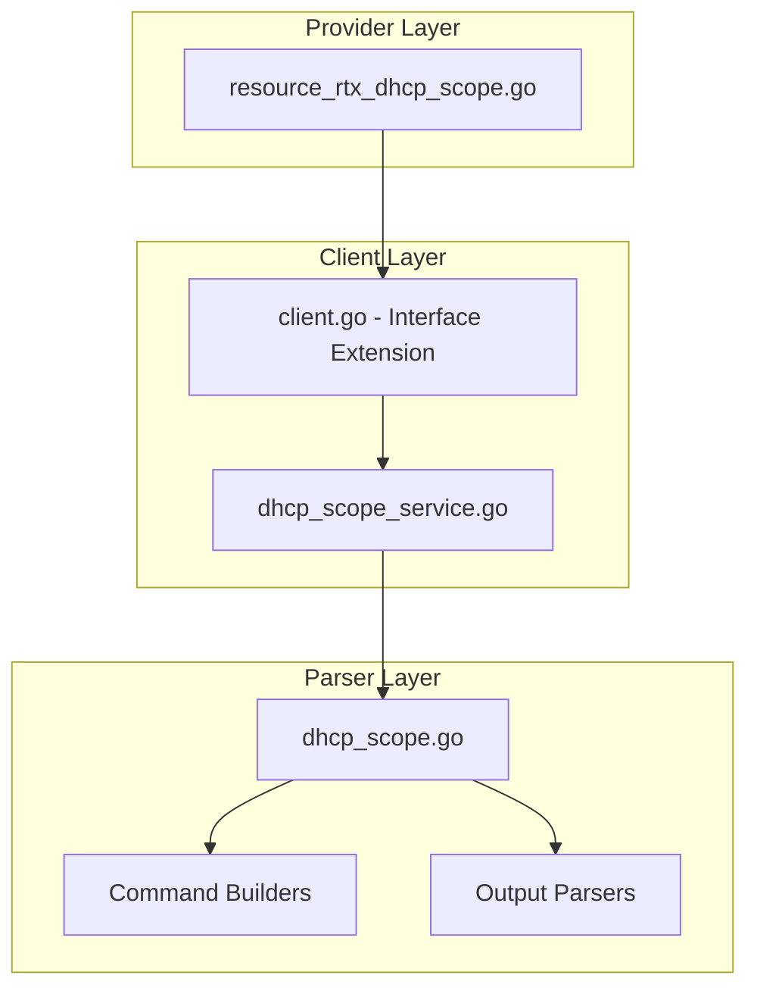

# Design Document: rtx_dhcp_scope

## Overview

The `rtx_dhcp_scope` resource enables Terraform-based management of DHCP scopes on Yamaha RTX series routers. This is the parent resource for the existing `rtx_dhcp_binding` resource, completing the DHCP infrastructure management capability. The implementation follows established patterns from the existing `rtx_dhcp_binding` resource to ensure consistency and maintainability.

## Code Reuse Analysis

### Existing Components to Leverage

- **`internal/client/dhcp_service.go`**: Pattern for service layer implementation. The new `DHCPScopeService` will follow this structure for CRUD operations.
- **`internal/client/interfaces.go`**: Extend the `Client` interface with scope management methods following the existing pattern.
- **`internal/rtx/parsers/dhcp_bindings.go`**: Reference for parser implementation and command builders. The new scope parser will follow similar patterns.
- **`internal/rtx/parsers/registry.go`**: Use the existing registry pattern for parser registration if model-specific parsing is needed.
- **`internal/provider/resource_rtx_dhcp_binding.go`**: Template for Terraform resource structure including CRUD operations, import, and validation.

### Integration Points

- **`rtxClient`**: Add scope methods similar to existing binding methods
- **`DHCPService`**: Reference for service layer patterns (but create separate `DHCPScopeService` for SRP)
- **`rtx_dhcp_binding`**: Parent-child relationship via `scope_id` reference

## Architecture

The implementation follows a three-layer architecture consistent with the existing codebase:



### Modular Design Principles

- **Single File Responsibility**: `DHCPScopeService` separate from `DHCPService` (bindings)
- **Component Isolation**: Parser, service, and resource layers clearly separated
- **Service Layer Separation**: Service encapsulates all scope CRUD logic
- **Utility Modularity**: Shared validation functions for IP/CIDR operations

## Components and Interfaces

### Component 1: DHCPScopeService (`internal/client/dhcp_scope_service.go`)

- **Purpose:** Handles all DHCP scope CRUD operations against the RTX router
- **Interfaces:**
  ```go
  type DHCPScopeService struct {
      executor Executor
      client   *rtxClient
  }

  func (s *DHCPScopeService) CreateScope(ctx context.Context, scope DHCPScope) error
  func (s *DHCPScopeService) GetScope(ctx context.Context, scopeID int) (*DHCPScope, error)
  func (s *DHCPScopeService) UpdateScope(ctx context.Context, scope DHCPScope) error
  func (s *DHCPScopeService) DeleteScope(ctx context.Context, scopeID int) error
  func (s *DHCPScopeService) ListScopes(ctx context.Context) ([]DHCPScope, error)
  ```
- **Dependencies:** `Executor`, `rtxClient`, `parsers.DHCPScopeParser`
- **Reuses:** Pattern from `DHCPService`, `Executor` interface, `containsError()` helper

### Component 2: DHCPScopeParser (`internal/rtx/parsers/dhcp_scope.go`)

- **Purpose:** Parses RTX router output for scope configuration and builds commands
- **Interfaces:**
  ```go
  type DHCPScope struct {
      ScopeID       int
      Network       string
      Gateway       string
      DNSServers    []string
      LeaseTime     string
      ExcludeRanges []ExcludeRange
  }

  type ExcludeRange struct {
      Start string
      End   string
  }

  func ParseScopeConfig(raw string) ([]DHCPScope, error)
  func BuildDHCPScopeCommand(scope DHCPScope) string
  func BuildDHCPScopeOptionsCommand(scopeID int, dnsServers []string) string
  func BuildDHCPScopeExceptCommand(scopeID int, ranges []ExcludeRange) string
  func BuildDeleteDHCPScopeCommand(scopeID int) string
  func BuildShowDHCPScopeCommand(scopeID int) string
  ```
- **Dependencies:** `regexp`, `strings`, `strconv`
- **Reuses:** `NormalizeMACAddress` patterns for IP validation

### Component 3: Terraform Resource (`internal/provider/resource_rtx_dhcp_scope.go`)

- **Purpose:** Terraform resource definition implementing CRUD lifecycle
- **Interfaces:**
  ```go
  func resourceRTXDHCPScope() *schema.Resource
  func resourceRTXDHCPScopeCreate(ctx, d, meta) diag.Diagnostics
  func resourceRTXDHCPScopeRead(ctx, d, meta) diag.Diagnostics
  func resourceRTXDHCPScopeUpdate(ctx, d, meta) diag.Diagnostics
  func resourceRTXDHCPScopeDelete(ctx, d, meta) diag.Diagnostics
  func resourceRTXDHCPScopeImport(ctx, d, meta) ([]*schema.ResourceData, error)
  ```
- **Dependencies:** `Client`, `DHCPScope`, Terraform SDK
- **Reuses:** `resourceRTXDHCPBinding` patterns for structure and error handling

### Component 4: Client Interface Extension (`internal/client/interfaces.go`)

- **Purpose:** Extend Client interface with scope management methods
- **Interfaces:**
  ```go
  // Add to existing Client interface:
  GetDHCPScope(ctx context.Context, scopeID int) (*DHCPScope, error)
  CreateDHCPScope(ctx context.Context, scope DHCPScope) error
  UpdateDHCPScope(ctx context.Context, scope DHCPScope) error
  DeleteDHCPScope(ctx context.Context, scopeID int) error
  ListDHCPScopes(ctx context.Context) ([]DHCPScope, error)
  ```
- **Dependencies:** Existing Client interface
- **Reuses:** Pattern from existing DHCP binding methods

## Data Models

### DHCPScope

```go
// DHCPScope represents a DHCP scope configuration on an RTX router
type DHCPScope struct {
    ScopeID       int            `json:"scope_id"`
    Network       string         `json:"network"`        // CIDR notation: "192.168.1.0/24"
    Gateway       string         `json:"gateway,omitempty"`
    DNSServers    []string       `json:"dns_servers,omitempty"` // Max 3
    LeaseTime     string         `json:"lease_time,omitempty"`  // Go duration or "infinite"
    ExcludeRanges []ExcludeRange `json:"exclude_ranges,omitempty"`
}

// ExcludeRange represents an IP range excluded from DHCP allocation
type ExcludeRange struct {
    Start string `json:"start"` // Start IP address
    End   string `json:"end"`   // End IP address
}
```

### Terraform Schema (Cisco-Compatible)

```hcl
resource "rtx_dhcp_scope" "example" {
  scope_id = 1  # Required, ForceNew

  # Network configuration
  network = "192.168.1.0/24"  # Required, ForceNew

  # Lease configuration
  lease_time = "72h"  # Go duration format, or "infinite"

  # Exclusions
  exclude_ranges = [
    {
      start = "192.168.1.1"
      end   = "192.168.1.10"
    }
  ]

  # DHCP Options (Cisco-compatible nested block)
  options {
    routers     = ["192.168.1.253"]            # Default gateways (max 3)
    dns_servers = ["1.1.1.1", "1.0.0.1"]       # DNS servers (max 3)
    domain_name = "home.local"                  # Domain name
  }
}
```

### Data Models (Implemented)

```go
// DHCPScope represents a DHCP scope configuration on an RTX router
type DHCPScope struct {
    ScopeID       int              `json:"scope_id"`
    Network       string           `json:"network"`                  // CIDR notation
    LeaseTime     string           `json:"lease_time,omitempty"`     // Go duration or "infinite"
    ExcludeRanges []ExcludeRange   `json:"exclude_ranges,omitempty"`
    Options       DHCPScopeOptions `json:"options,omitempty"`
}

// DHCPScopeOptions represents DHCP options (Cisco-compatible naming)
type DHCPScopeOptions struct {
    DNSServers []string `json:"dns_servers,omitempty"` // Max 3
    Routers    []string `json:"routers,omitempty"`     // Default gateways (max 3)
    DomainName string   `json:"domain_name,omitempty"` // Domain name
}
```

## RTX Command Mapping

### Create Scope

```
dhcp scope <scope-id> <network>/<prefix> [gateway <gateway>] [expire <time>]
```

Example: `dhcp scope 1 192.168.1.0/24 gateway 192.168.1.1 expire 3:00`

### Configure DNS

```
dhcp scope option <scope-id> dns=<dns1>[,<dns2>[,<dns3>]]
```

Example: `dhcp scope option 1 dns=8.8.8.8,8.8.4.4`

### Configure Router (Default Gateway)

```
dhcp scope option <scope-id> router=<gateway1>[,<gateway2>[,<gateway3>]]
```

Example: `dhcp scope option 1 router=192.168.1.253`

### Configure All Options

RTX routers support various DHCP options via the `dhcp scope option` command:

| Option | Description | Example |
|--------|-------------|---------|
| `dns` | DNS servers (max 3) | `dns=1.1.1.1,1.0.0.1` |
| `router` | Default gateways (max 3) | `router=192.168.1.1` |
| `domain` | Domain name | `domain=example.com` |
| `wins` | WINS servers | `wins=192.168.1.10` |
| `ntp` | NTP servers | `ntp=pool.ntp.org` |
| `tftp` | TFTP server | `tftp=192.168.1.100` |
| `sip` | SIP servers | `sip=sip.example.com` |

Combined example: `dhcp scope option 1 dns=1.1.1.1,1.0.0.1 router=192.168.1.253`

### Configure Exclusions

```
dhcp scope <scope-id> except <start-ip>-<end-ip>
```

Example: `dhcp scope 1 except 192.168.1.1-192.168.1.10`

### Delete Scope

```
no dhcp scope <scope-id>
```

### Show Scope

```
show config | grep "dhcp scope <scope-id>"
```

## Error Handling

### Error Scenarios

1. **Invalid Network Format**
   - **Handling:** Validate CIDR notation in Terraform schema before sending to router
   - **User Impact:** Clear validation error with expected format example

2. **Scope Already Exists**
   - **Handling:** Parse RTX output for "already exists" pattern
   - **User Impact:** Return error suggesting import or different scope_id

3. **Scope Has Active Bindings**
   - **Handling:** Check for bindings before delete, warn user
   - **User Impact:** Error with list of active bindings, suggest removing bindings first

4. **Invalid Exclusion Range**
   - **Handling:** Validate exclusion IPs are within scope network
   - **User Impact:** Validation error specifying which IPs are out of range

5. **DNS Server Limit Exceeded**
   - **Handling:** Validate max 3 DNS servers in schema
   - **User Impact:** Clear validation error about RTX limitation

6. **Connection/Command Timeout**
   - **Handling:** Use existing retry logic from `rtxClient`
   - **User Impact:** Standard Terraform timeout error with retry option

## Testing Strategy

### Unit Testing

- **Parser Tests** (`dhcp_scope_test.go`):
  - Parse various RTX output formats for scope configuration
  - Test command builder functions with different parameter combinations
  - Test validation functions for network, IP, and lease time formats

- **Service Tests** (`dhcp_scope_service_test.go`):
  - Mock executor for service method testing
  - Test error handling for various failure scenarios
  - Test validation of input parameters

### Integration Testing

- **Resource Tests** (`resource_rtx_dhcp_scope_test.go`):
  - Full CRUD lifecycle with mock client
  - Import functionality testing
  - Dependency graph with `rtx_dhcp_binding`

- **Client Integration**:
  - Test scope methods through client interface
  - Verify proper initialization of scope service

### End-to-End Testing

- **Acceptance Tests** (with real RTX router):
  - Create scope with all parameters
  - Update scope options (DNS, lease time)
  - Create binding within scope to verify dependency
  - Delete scope (verify binding cleanup behavior)
  - Import existing scope

### Test Data Structure

```
internal/rtx/testdata/
├── RTX1210/
│   ├── show_dhcp_scope.txt
│   └── show_dhcp_scope.golden.json
└── RTX830/
    ├── show_dhcp_scope.txt
    └── show_dhcp_scope.golden.json
```

## File Structure

```
internal/
├── provider/
│   ├── resource_rtx_dhcp_scope.go      # NEW: Terraform resource
│   └── resource_rtx_dhcp_scope_test.go # NEW: Resource tests
├── client/
│   ├── interfaces.go                    # MODIFY: Add DHCPScope type and interface methods
│   ├── client.go                        # MODIFY: Add scope service initialization and methods
│   ├── dhcp_scope_service.go           # NEW: Scope service implementation
│   └── dhcp_scope_service_test.go      # NEW: Service tests
└── rtx/
    └── parsers/
        ├── dhcp_scope.go               # NEW: Parser and command builders
        └── dhcp_scope_test.go          # NEW: Parser tests
```

## Implementation Notes

1. **Lease Time Format Conversion**: RTX uses `h:mm` format (e.g., `3:00` for 3 hours). Convert from Go duration format (e.g., `72h`) to RTX format in command builder.

2. **Scope ID as Terraform ID**: Use `scope_id` directly as Terraform resource ID (simple integer) unlike binding which uses composite ID.

3. **ForceNew vs Update**: `scope_id` and `network` are ForceNew (cannot change without recreating). Other attributes (gateway, dns_servers, lease_time, exclude_ranges) support in-place updates.

4. **Configuration Save**: Use existing `SaveConfig()` pattern after modifications to persist to router memory.

5. **Provider Registration**: Add `resourceRTXDHCPScope` to provider's resource map in `provider.go`.
