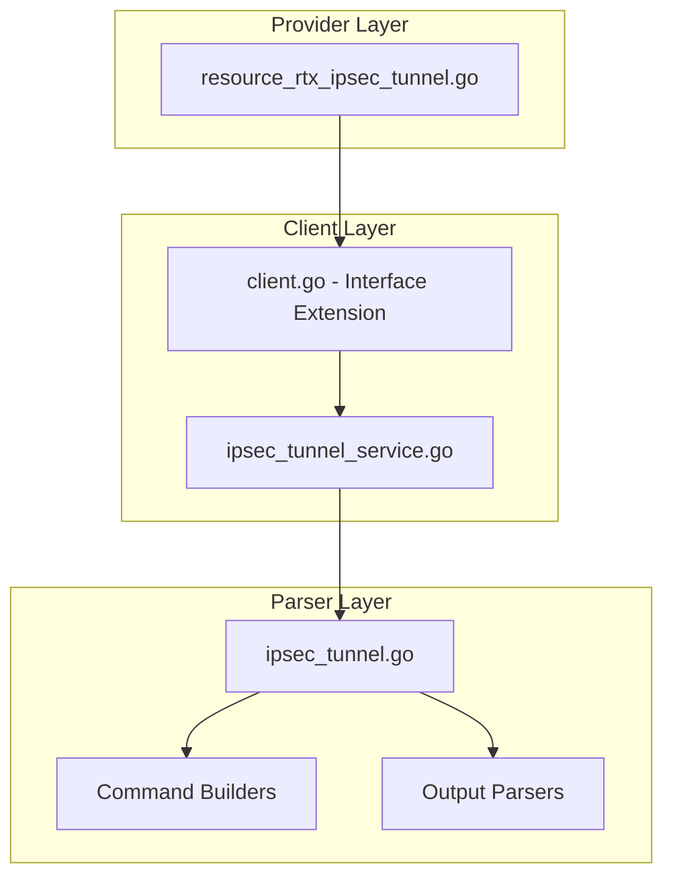

# Design Document: rtx_ipsec_tunnel

## Overview

The `rtx_ipsec_tunnel` resource enables Terraform-based management of IPsec VPN tunnels on Yamaha RTX series routers. Following Cisco IOS XE Terraform provider naming conventions, this resource manages complete IPsec tunnel configuration including IKE Phase 1, IPsec Phase 2, peer settings, and DPD configuration.

## Code Reuse Analysis

### Existing Components to Leverage

- **`internal/client/dhcp_scope_service.go`**: Pattern for service layer implementation with CRUD operations.
- **`internal/client/interfaces.go`**: Extend the `Client` interface with IPsec methods.
- **`internal/rtx/parsers/dhcp_scope.go`**: Reference for parser implementation and command builders.
- **`internal/provider/resource_rtx_dhcp_scope.go`**: Template for Terraform resource structure.

### Integration Points

- **`rtxClient`**: Add IPsec methods for CRUD operations
- **`Executor`**: Use existing SSH command execution infrastructure
- **Tunnel interface**: Coordinate with tunnel interface configuration

## Architecture



### Modular Design Principles

- **Single File Responsibility**: `IPsecTunnelService` handles all IPsec CRUD operations
- **Component Isolation**: Parser, service, and resource layers clearly separated
- **Service Layer Separation**: Service encapsulates all IPsec logic
- **Utility Modularity**: Shared validation functions for cryptographic parameters

## Components and Interfaces

### Component 1: IPsecTunnelService (`internal/client/ipsec_tunnel_service.go`)

- **Purpose:** Handles all IPsec tunnel CRUD operations against the RTX router
- **Interfaces:**
  ```go
  type IPsecTunnelService struct {
      executor Executor
      client   *rtxClient
  }

  func (s *IPsecTunnelService) Create(ctx context.Context, tunnel IPsecTunnel) error
  func (s *IPsecTunnelService) Get(ctx context.Context, tunnelID int) (*IPsecTunnel, error)
  func (s *IPsecTunnelService) Update(ctx context.Context, tunnel IPsecTunnel) error
  func (s *IPsecTunnelService) Delete(ctx context.Context, tunnelID int) error
  func (s *IPsecTunnelService) List(ctx context.Context) ([]IPsecTunnel, error)
  ```
- **Dependencies:** `Executor`, `rtxClient`, `parsers.IPsecTunnelParser`
- **Reuses:** Pattern from service layer implementations

### Component 2: IPsecTunnelParser (`internal/rtx/parsers/ipsec_tunnel.go`)

- **Purpose:** Parses RTX router output for IPsec configuration and builds commands
- **Interfaces:**
  ```go
  type IPsecTunnel struct {
      ID            int              `json:"id"`
      Name          string           `json:"name,omitempty"`
      LocalAddress  string           `json:"local_address"`
      RemoteAddress string           `json:"remote_address"`
      PreSharedKey  string           `json:"pre_shared_key"`
      IKEv2Proposal IKEv2Proposal    `json:"ikev2_proposal"`
      IPsecTransform IPsecTransform  `json:"ipsec_transform"`
      LocalNetwork  string           `json:"local_network"`
      RemoteNetwork string           `json:"remote_network"`
      DPDEnabled    bool             `json:"dpd_enabled"`
      DPDInterval   int              `json:"dpd_interval"`
  }

  type IKEv2Proposal struct {
      EncryptionAES256 bool `json:"encryption_aes_cbc_256"`
      IntegritySHA256  bool `json:"integrity_sha256"`
      GroupFourteen    bool `json:"group_fourteen"`
      LifetimeSeconds  int  `json:"lifetime_seconds"`
  }

  type IPsecTransform struct {
      Protocol          string `json:"protocol"`
      EncryptionAES256  bool   `json:"encryption_aes_cbc_256"`
      IntegritySHA256   bool   `json:"integrity_sha256_hmac"`
      PFSGroupFourteen  bool   `json:"pfs_group_fourteen"`
      LifetimeSeconds   int    `json:"lifetime_seconds"`
  }

  func ParseIPsecTunnelConfig(raw string) ([]IPsecTunnel, error)
  func BuildTunnelSelectCommand(id int) string
  func BuildIPsecTunnelCommand(id int) string
  func BuildIPsecSAPolicyCommand(tunnel IPsecTunnel) string
  func BuildIPsecIKEPreSharedKeyCommand(id int, key string) string
  func BuildIPsecIKERemoteAddressCommand(id int, addr string) string
  func BuildIPsecIKEEncryptionCommand(id int, algo string) string
  func BuildIPsecIKEGroupCommand(id int, group string) string
  func BuildIPsecIKEKeepaliveCommand(id int, enabled bool) string
  func BuildDeleteIPsecTunnelCommand(id int) string
  ```
- **Dependencies:** `regexp`, `strings`, `strconv`
- **Reuses:** IP validation patterns

### Component 3: Terraform Resource (`internal/provider/resource_rtx_ipsec_tunnel.go`)

- **Purpose:** Terraform resource definition implementing CRUD lifecycle
- **Interfaces:**
  ```go
  func resourceRTXIPsecTunnel() *schema.Resource
  func resourceRTXIPsecTunnelCreate(ctx, d, meta) diag.Diagnostics
  func resourceRTXIPsecTunnelRead(ctx, d, meta) diag.Diagnostics
  func resourceRTXIPsecTunnelUpdate(ctx, d, meta) diag.Diagnostics
  func resourceRTXIPsecTunnelDelete(ctx, d, meta) diag.Diagnostics
  func resourceRTXIPsecTunnelImport(ctx, d, meta) ([]*schema.ResourceData, error)
  ```
- **Dependencies:** `Client`, `IPsecTunnel`, Terraform SDK
- **Reuses:** Resource patterns from other implementations

### Component 4: Client Interface Extension (`internal/client/interfaces.go`)

- **Purpose:** Extend Client interface with IPsec methods
- **Interfaces:**
  ```go
  // Add to existing Client interface:
  GetIPsecTunnel(ctx context.Context, tunnelID int) (*IPsecTunnel, error)
  CreateIPsecTunnel(ctx context.Context, tunnel IPsecTunnel) error
  UpdateIPsecTunnel(ctx context.Context, tunnel IPsecTunnel) error
  DeleteIPsecTunnel(ctx context.Context, tunnelID int) error
  ListIPsecTunnels(ctx context.Context) ([]IPsecTunnel, error)
  ```
- **Dependencies:** Existing Client interface
- **Reuses:** Pattern from existing methods

## Data Models

### IPsecTunnel

```go
// IPsecTunnel represents an IPsec tunnel configuration on an RTX router
type IPsecTunnel struct {
    ID             int            `json:"id"`               // Tunnel ID (1-100+)
    Name           string         `json:"name,omitempty"`   // Tunnel description
    LocalAddress   string         `json:"local_address"`    // Local endpoint IP
    RemoteAddress  string         `json:"remote_address"`   // Remote endpoint IP
    PreSharedKey   string         `json:"pre_shared_key"`   // IKE PSK (sensitive)
    IKEv2Proposal  IKEv2Proposal  `json:"ikev2_proposal"`   // Phase 1 settings
    IPsecTransform IPsecTransform `json:"ipsec_transform"`  // Phase 2 settings
    LocalNetwork   string         `json:"local_network"`    // Local interesting traffic
    RemoteNetwork  string         `json:"remote_network"`   // Remote interesting traffic
    DPDEnabled     bool           `json:"dpd_enabled"`      // Dead Peer Detection
    DPDInterval    int            `json:"dpd_interval"`     // DPD interval seconds
}

// IKEv2Proposal represents IKE Phase 1 settings
type IKEv2Proposal struct {
    EncryptionAES256 bool `json:"encryption_aes_cbc_256"`
    IntegritySHA256  bool `json:"integrity_sha256"`
    GroupFourteen    bool `json:"group_fourteen"` // DH Group 14
    LifetimeSeconds  int  `json:"lifetime_seconds"`
}

// IPsecTransform represents IPsec Phase 2 settings
type IPsecTransform struct {
    Protocol         string `json:"protocol"`              // esp or ah
    EncryptionAES256 bool   `json:"encryption_aes_cbc_256"`
    IntegritySHA256  bool   `json:"integrity_sha256_hmac"`
    PFSGroupFourteen bool   `json:"pfs_group_fourteen"`
    LifetimeSeconds  int    `json:"lifetime_seconds"`
}
```

### Terraform Schema

```hcl
resource "rtx_ipsec_tunnel" "site_to_site" {
  id   = 1
  name = "site-to-site-vpn"

  local_address  = "203.0.113.1"
  remote_address = "198.51.100.1"

  pre_shared_key = var.ipsec_psk

  # IKE Phase 1 (IKEv2)
  ikev2_proposal {
    encryption_aes_cbc_256 = true
    integrity_sha256       = true
    group_fourteen         = true  # DH Group 14
    lifetime_seconds       = 28800
  }

  # IPsec Phase 2
  ipsec_transform {
    protocol               = "esp"
    encryption_aes_cbc_256 = true
    integrity_sha256_hmac  = true
    pfs_group_fourteen     = true
    lifetime_seconds       = 3600
  }

  local_network  = "192.168.1.0/24"
  remote_network = "192.168.2.0/24"

  dpd_enabled  = true
  dpd_interval = 30
}
```

## RTX Command Mapping

### Create Tunnel

```
tunnel select <n>
ipsec tunnel <n>
```

### Configure IKE Pre-Shared Key

```
ipsec ike pre-shared-key <n> text <key>
```

### Configure Remote Address

```
ipsec ike remote address <n> <ip>
```

### Configure IKE Encryption

```
ipsec ike encryption <n> aes-cbc
```

### Configure IKE Hash

```
ipsec ike hash <n> sha256
```

### Configure IKE DH Group

```
ipsec ike group <n> modp2048
```

### Configure IPsec SA Policy

```
ipsec sa policy <n> <tunnel> esp aes-cbc sha-hmac
```

### Configure Keepalive/DPD

```
ipsec ike keepalive use <n> on dpd <interval>
```

### Configure Interesting Traffic

```
ipsec ike local address <n> <network>
ipsec ike remote address <n> <network>
```

### Delete Tunnel

```
no tunnel select <n>
no ipsec tunnel <n>
```

### Show Configuration

```
show config | grep ipsec
show ipsec sa
show ipsec sa gateway
```

## Error Handling

### Error Scenarios

1. **Invalid Tunnel ID**
   - **Handling:** Validate ID is positive integer
   - **User Impact:** Clear validation error

2. **Invalid IP Address**
   - **Handling:** Validate IP address format
   - **User Impact:** Clear error with expected format

3. **Invalid Algorithm Combination**
   - **Handling:** Validate supported algorithm combinations
   - **User Impact:** Error indicating invalid combination

4. **Tunnel Already Exists**
   - **Handling:** Parse RTX output for existing tunnel
   - **User Impact:** Error suggesting import

5. **Invalid Network CIDR**
   - **Handling:** Validate CIDR notation
   - **User Impact:** Clear error with expected format

6. **Connection/Command Timeout**
   - **Handling:** Use existing retry logic from `rtxClient`
   - **User Impact:** Standard Terraform timeout error

## Testing Strategy

### Unit Testing

- **Parser Tests** (`ipsec_tunnel_test.go`):
  - Parse various RTX `show config` output for IPsec
  - Test command builder functions with different parameters
  - Test algorithm validation

- **Service Tests** (`ipsec_tunnel_service_test.go`):
  - Mock executor for service method testing
  - Test error handling for various failure scenarios
  - Test proposal/transform configuration

### Integration Testing

- **Resource Tests** (`resource_rtx_ipsec_tunnel_test.go`):
  - Full CRUD lifecycle with mock client
  - Import functionality testing
  - Sensitive attribute handling (PSK)

### End-to-End Testing

- **Acceptance Tests** (with real RTX router):
  - Create IPsec tunnel with various algorithms
  - Configure DPD
  - Update tunnel parameters
  - Delete tunnel
  - Import existing tunnel

## State Handling

- Persist only configuration attributes in Terraform state.
- Tunnel/SA status is operational-only and must not be stored in state to avoid perpetual diffs.

## File Structure

```
internal/
├── provider/
│   ├── resource_rtx_ipsec_tunnel.go      # NEW: Terraform resource
│   └── resource_rtx_ipsec_tunnel_test.go # NEW: Resource tests
├── client/
│   ├── interfaces.go                      # MODIFY: Add IPsec types and methods
│   ├── client.go                          # MODIFY: Add IPsec service initialization
│   ├── ipsec_tunnel_service.go           # NEW: IPsec service implementation
│   └── ipsec_tunnel_service_test.go      # NEW: Service tests
└── rtx/
    └── parsers/
        ├── ipsec_tunnel.go               # NEW: Parser and command builders
        └── ipsec_tunnel_test.go          # NEW: Parser tests
```

## Implementation Notes

1. **Sensitive Data**: Pre-shared key must be marked as sensitive in Terraform state.

2. **Terraform ID**: Use tunnel ID directly as Terraform resource ID.

3. **ForceNew**: Tunnel ID is ForceNew. Most other attributes support in-place updates.

4. **Algorithm Mapping**: Map Cisco-style attribute names to RTX commands (e.g., `encryption_aes_cbc_256` -> `aes-cbc`).

5. **DH Group Mapping**: Map group names (group_fourteen -> modp2048).

6. **IKE Version**: RTX supports both IKEv1 and IKEv2. Consider as separate attribute or auto-detect.

7. **Tunnel Interface**: IPsec tunnel creates a tunnel interface. Consider relationship with static routes.

8. **SA Clearing**: May need to clear SAs when updating configuration.

9. **Configuration Save**: Use existing `SaveConfig()` pattern after modifications.

10. **Provider Registration**: Add `resourceRTXIPsecTunnel` to provider's resource map.
