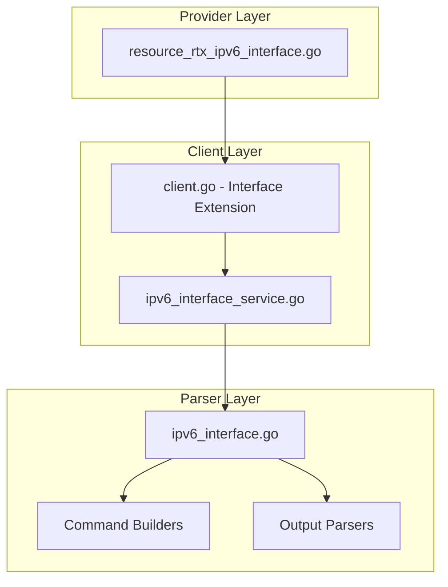

# Design Document: rtx_ipv6_interface

## Overview

The `rtx_ipv6_interface` resource enables Terraform-based management of IPv6 interface configurations on Yamaha RTX series routers. This includes IPv6 address assignment, Router Advertisement (RA), and DHCPv6 server configuration.

## Scope

This resource manages **IPv6 interface configuration** including:
- IPv6 address assignment (static, SLAAC, prefix-based)
- Router Advertisement (RA) settings
- DHCPv6 server/client configuration
- IPv6 MTU settings

**Note**: IPv6 prefix definitions are handled by `rtx_ipv6_prefix`. IPv6 filters are handled by `rtx_ip_filter`.

## Code Reuse Analysis

### Existing Components to Leverage

- **`internal/client/dhcp_scope_service.go`**: Pattern for service layer implementation with CRUD operations.
- **`internal/client/interfaces.go`**: Extend the `Client` interface with IPv6 interface methods.
- **`internal/rtx/parsers/`**: Reference for parser implementation patterns.
- **`internal/provider/resource_rtx_dhcp_scope.go`**: Template for Terraform resource structure.

### Integration Points

- **`rtxClient`**: Add IPv6 interface methods for CRUD operations
- **`Executor`**: Use existing SSH command execution infrastructure
- **`rtx_ipv6_prefix`**: Reference prefix definitions
- **`rtx_interface`**: Coordinate with IPv4 interface settings

## Architecture



## Components and Interfaces

### Component 1: IPv6InterfaceService (`internal/client/ipv6_interface_service.go`)

- **Purpose:** Handles all IPv6 interface CRUD operations against the RTX router
- **Interfaces:**
  ```go
  type IPv6InterfaceService struct {
      executor Executor
      client   *rtxClient
  }

  func (s *IPv6InterfaceService) Configure(ctx context.Context, config IPv6InterfaceConfig) error
  func (s *IPv6InterfaceService) Get(ctx context.Context, interfaceName string) (*IPv6InterfaceConfig, error)
  func (s *IPv6InterfaceService) Update(ctx context.Context, config IPv6InterfaceConfig) error
  func (s *IPv6InterfaceService) Reset(ctx context.Context, interfaceName string) error
  func (s *IPv6InterfaceService) List(ctx context.Context) ([]IPv6InterfaceConfig, error)
  ```
- **Dependencies:** `Executor`, `rtxClient`, `parsers.IPv6InterfaceParser`

### Component 2: IPv6InterfaceParser (`internal/rtx/parsers/ipv6_interface.go`)

- **Purpose:** Parses RTX router output for IPv6 interface configuration and builds commands
- **Interfaces:**
  ```go
  type IPv6InterfaceConfig struct {
      Interface      string            `json:"interface"`
      Addresses      []IPv6Address     `json:"addresses,omitempty"`
      RTADV          *RTADVConfig      `json:"rtadv,omitempty"`
      DHCPv6Service  string            `json:"dhcpv6_service,omitempty"` // "server", "client", "off"
      MTU            int               `json:"mtu,omitempty"`
      SecureFilterIn []int             `json:"secure_filter_in,omitempty"`
      SecureFilterOut []int            `json:"secure_filter_out,omitempty"`
      DynamicFilterOut []int           `json:"dynamic_filter_out,omitempty"`
  }

  type IPv6Address struct {
      Address      string `json:"address,omitempty"`   // Full IPv6 address/prefix
      PrefixRef    int    `json:"prefix_ref,omitempty"` // Reference to ipv6 prefix ID
      InterfaceID  string `json:"interface_id,omitempty"` // ::1, ::2, etc.
  }

  type RTADVConfig struct {
      Enabled    bool     `json:"enabled"`
      PrefixID   int      `json:"prefix_id"`
      OFlag      bool     `json:"o_flag"`     // Other config flag (DHCPv6 for options)
      MFlag      bool     `json:"m_flag"`     // Managed address flag (DHCPv6 for addresses)
      Lifetime   int      `json:"lifetime,omitempty"` // Router lifetime
  }

  func ParseIPv6InterfaceConfig(raw string, interfaceName string) (*IPv6InterfaceConfig, error)
  func BuildIPv6AddressCommand(iface string, addr IPv6Address) string
  func BuildIPv6RTADVCommand(iface string, rtadv RTADVConfig) string
  func BuildIPv6DHCPv6Command(iface, service string) string
  func BuildIPv6MTUCommand(iface string, mtu int) string
  func BuildIPv6SecureFilterCommand(iface, direction string, filters []int) string
  ```
- **Dependencies:** `regexp`, `strings`, `strconv`

### Component 3: Terraform Resource (`internal/provider/resource_rtx_ipv6_interface.go`)

- **Purpose:** Terraform resource definition implementing CRUD lifecycle
- **Interfaces:**
  ```go
  func resourceRTXIPv6Interface() *schema.Resource
  func resourceRTXIPv6InterfaceCreate(ctx, d, meta) diag.Diagnostics
  func resourceRTXIPv6InterfaceRead(ctx, d, meta) diag.Diagnostics
  func resourceRTXIPv6InterfaceUpdate(ctx, d, meta) diag.Diagnostics
  func resourceRTXIPv6InterfaceDelete(ctx, d, meta) diag.Diagnostics
  func resourceRTXIPv6InterfaceImport(ctx, d, meta) ([]*schema.ResourceData, error)
  ```
- **Dependencies:** `Client`, `IPv6InterfaceConfig`, Terraform SDK

### Component 4: Client Interface Extension (`internal/client/interfaces.go`)

- **Purpose:** Extend Client interface with IPv6 interface methods
- **Interfaces:**
  ```go
  // Add to existing Client interface:
  GetIPv6InterfaceConfig(ctx context.Context, interfaceName string) (*IPv6InterfaceConfig, error)
  ConfigureIPv6Interface(ctx context.Context, config IPv6InterfaceConfig) error
  UpdateIPv6InterfaceConfig(ctx context.Context, config IPv6InterfaceConfig) error
  ResetIPv6Interface(ctx context.Context, interfaceName string) error
  ListIPv6InterfaceConfigs(ctx context.Context) ([]IPv6InterfaceConfig, error)
  ```
- **Dependencies:** Existing Client interface

## Data Models

### IPv6InterfaceConfig

```go
// IPv6InterfaceConfig represents IPv6 interface configuration on an RTX router
type IPv6InterfaceConfig struct {
    Interface        string        `json:"interface"`                    // Interface name
    Addresses        []IPv6Address `json:"addresses,omitempty"`          // IPv6 addresses
    RTADV            *RTADVConfig  `json:"rtadv,omitempty"`              // Router Advertisement
    DHCPv6Service    string        `json:"dhcpv6_service,omitempty"`     // "server", "client", "off"
    MTU              int           `json:"mtu,omitempty"`                // IPv6 MTU
    SecureFilterIn   []int         `json:"secure_filter_in,omitempty"`   // Inbound filters
    SecureFilterOut  []int         `json:"secure_filter_out,omitempty"`  // Outbound filters
    DynamicFilterOut []int         `json:"dynamic_filter_out,omitempty"` // Dynamic filters
}

// IPv6Address represents an IPv6 address configuration
type IPv6Address struct {
    Address     string `json:"address,omitempty"`      // Full IPv6/prefix or empty if using prefix_ref
    PrefixRef   int    `json:"prefix_ref,omitempty"`   // Reference to ipv6 prefix ID
    InterfaceID string `json:"interface_id,omitempty"` // Interface identifier (::1, ::2)
}

// RTADVConfig represents Router Advertisement configuration
type RTADVConfig struct {
    Enabled  bool `json:"enabled"`
    PrefixID int  `json:"prefix_id"`          // Prefix to advertise
    OFlag    bool `json:"o_flag"`             // Other config flag
    MFlag    bool `json:"m_flag"`             // Managed address flag
    Lifetime int  `json:"lifetime,omitempty"` // Router lifetime in seconds
}
```

### Terraform Schema

```hcl
# WAN interface with DHCPv6 client
resource "rtx_ipv6_interface" "wan" {
  interface = "lan2"

  dhcpv6_service = "client"

  # IPv6 MTU
  mtu = 1500

  # IPv6 security filters
  secure_filter_in  = [101000, 101002, 101099]
  secure_filter_out = [101099]
  dynamic_filter_out = [101080, 101081, 101082, 101098, 101099]
}

# LAN interface with RA and DHCPv6 server
resource "rtx_ipv6_interface" "lan" {
  interface = "lan1"

  # Address using prefix reference
  address {
    prefix_ref   = 1                  # Reference to rtx_ipv6_prefix.ra_prefix
    interface_id = "::2"              # Host portion
  }

  # Router Advertisement
  rtadv {
    enabled   = true
    prefix_id = 1                     # Advertise this prefix
    o_flag    = true                  # Use DHCPv6 for DNS, etc.
    m_flag    = false                 # Use SLAAC for addresses
  }

  # DHCPv6 server (for options like DNS)
  dhcpv6_service = "server"
}

# Bridge interface with prefix-based address
resource "rtx_ipv6_interface" "bridge" {
  interface = "bridge1"

  address {
    prefix_ref   = 1
    interface_id = "::1"
  }
}
```

## RTX Command Mapping

### Configure IPv6 Address

#### Static Address
```
ipv6 <interface> address <address>/<prefix_length>
```
Example: `ipv6 lan1 address 2001:db8::1/64`

#### Prefix-Based Address
```
ipv6 <interface> address <prefix_ref>::<interface_id>/<length>
```
Example: `ipv6 lan1 address ra-prefix@lan2::2/64`

### Configure Router Advertisement

```
ipv6 <interface> rtadv send <prefix_id> [o_flag=on|off] [m_flag=on|off]
```

Example: `ipv6 lan1 rtadv send 1 o_flag=on`

### Configure DHCPv6

```
ipv6 <interface> dhcp service server
ipv6 <interface> dhcp service client [ir=on|off]
```

Example:
```
ipv6 lan1 dhcp service server
ipv6 lan2 dhcp service client ir=on
```

### Configure IPv6 MTU

```
ipv6 <interface> mtu <size>
```

Example: `ipv6 lan2 mtu 1500`

### Configure IPv6 Security Filters

```
ipv6 <interface> secure filter in <filter_list>
ipv6 <interface> secure filter out <filter_list> [dynamic <dynamic_filter_list>]
```

Example:
```
ipv6 lan2 secure filter in 101000 101002 101099
ipv6 lan2 secure filter out 101099 dynamic 101080 101081 101082 101098 101099
```

### Remove Configuration

```
no ipv6 <interface> address
no ipv6 <interface> rtadv send
no ipv6 <interface> dhcp service
no ipv6 <interface> mtu
no ipv6 <interface> secure filter in
no ipv6 <interface> secure filter out
```

### Show Configuration

```
show config | grep "ipv6 <interface>"
show ipv6 interface
```

## Error Handling

### Error Scenarios

1. **Invalid Interface Name**
   - **Handling:** Validate interface name format
   - **User Impact:** Clear validation error with valid interfaces

2. **Invalid IPv6 Address**
   - **Handling:** Validate IPv6 address format
   - **User Impact:** Clear error with expected format

3. **Invalid Prefix Reference**
   - **Handling:** Validate prefix ID exists
   - **User Impact:** Warning that prefix may not exist

4. **Invalid Filter Number**
   - **Handling:** Validate filter numbers are positive integers
   - **User Impact:** Warning that filter may not exist

5. **RTADV Configuration Error**
   - **Handling:** Validate RTADV parameters
   - **User Impact:** Clear error with valid options

6. **Connection/Command Timeout**
   - **Handling:** Use existing retry logic from `rtxClient`
   - **User Impact:** Standard Terraform timeout error

## Testing Strategy

### Unit Testing

- **Parser Tests** (`ipv6_interface_test.go`):
  - Parse various RTX `show config` output for IPv6 interface settings
  - Test command builder functions with different parameters
  - Test address format validation

- **Service Tests** (`ipv6_interface_service_test.go`):
  - Mock executor for service method testing
  - Test error handling for various failure scenarios
  - Test RA and DHCPv6 configuration

### Integration Testing

- **Resource Tests** (`resource_rtx_ipv6_interface_test.go`):
  - Full CRUD lifecycle with mock client
  - Import functionality testing
  - RA and DHCPv6 configuration testing

### End-to-End Testing

- **Acceptance Tests** (with real RTX router):
  - Configure IPv6 address
  - Configure RA
  - Configure DHCPv6 server
  - Configure DHCPv6 client
  - Apply IPv6 filters
  - Update configuration
  - Remove configuration
  - Import existing configuration

## File Structure

```
internal/
├── provider/
│   ├── resource_rtx_ipv6_interface.go      # NEW: Terraform resource
│   └── resource_rtx_ipv6_interface_test.go # NEW: Resource tests
├── client/
│   ├── interfaces.go                        # MODIFY: Add IPv6 interface types and methods
│   ├── client.go                            # MODIFY: Add IPv6 interface service initialization
│   ├── ipv6_interface_service.go           # NEW: IPv6 interface service implementation
│   └── ipv6_interface_service_test.go      # NEW: Service tests
└── rtx/
    └── parsers/
        ├── ipv6_interface.go               # NEW: Parser and command builders
        └── ipv6_interface_test.go          # NEW: Parser tests
```

## Implementation Notes

1. **Interface Name as Terraform ID**: Use interface name (e.g., `lan1`) as Terraform resource ID.

2. **ForceNew**: Only `interface` is ForceNew. Other attributes support in-place updates.

3. **Prefix Reference Syntax**: RTX uses `ra-prefix@<interface>::<id>/<length>` syntax.

4. **RA Flags**:
   - **O Flag**: When set, clients use DHCPv6 for other configuration (DNS, etc.)
   - **M Flag**: When set, clients use DHCPv6 for address assignment

5. **DHCPv6 IR**: IR (Information Request) mode - client requests configuration only, not addresses.

6. **Filter Order**: Filter list order matters. First match wins.

7. **Configuration Save**: Use existing `SaveConfig()` pattern after modifications.

8. **Provider Registration**: Add `resourceRTXIPv6Interface` to provider's resource map.

9. **Dependency**: Create `rtx_ipv6_prefix` before using prefix references.

10. **Dual-Stack**: Can be used alongside `rtx_interface` for dual-stack configuration.

## State Handling

- Persist only configuration attributes in Terraform state.
- Operational/runtime status must not be stored in state to avoid perpetual diffs.
