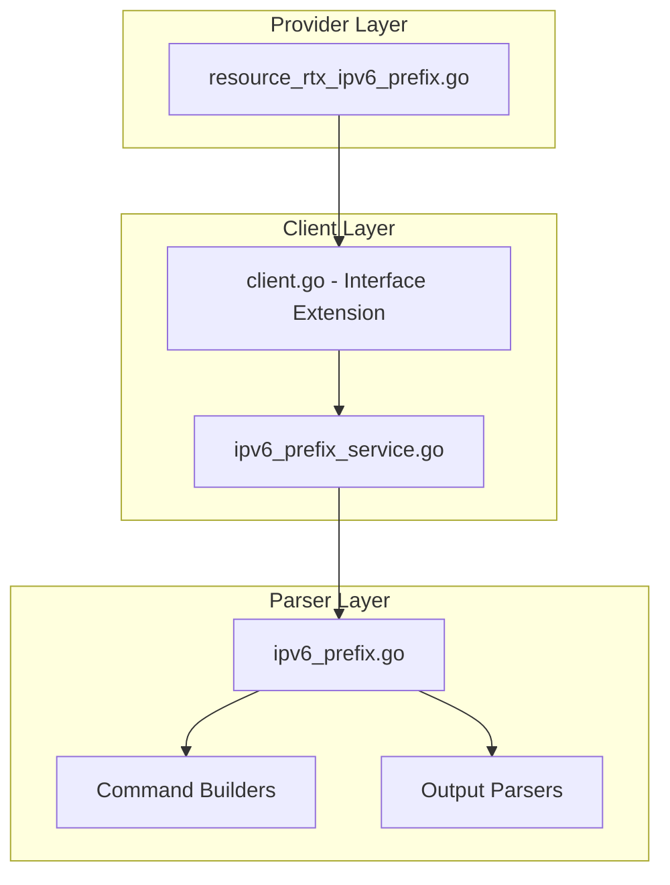

# Design Document: rtx_ipv6_prefix

## Overview

The `rtx_ipv6_prefix` resource enables Terraform-based management of IPv6 prefix definitions on Yamaha RTX series routers. IPv6 prefixes are used for address assignment (SLAAC), Router Advertisement, and DHCPv6 prefix delegation.

## Scope

This resource manages **IPv6 prefix definitions** including:
- Static prefix configuration
- RA-derived prefix (from upstream router/ISP)
- Prefix delegation (DHCPv6-PD)

**Note**: Prefix application to interfaces is handled by `rtx_ipv6_interface`.

## Code Reuse Analysis

### Existing Components to Leverage

- **`internal/client/dhcp_scope_service.go`**: Pattern for service layer implementation with CRUD operations.
- **`internal/client/interfaces.go`**: Extend the `Client` interface with IPv6 prefix methods.
- **`internal/rtx/parsers/`**: Reference for parser implementation patterns.
- **`internal/provider/resource_rtx_dhcp_scope.go`**: Template for Terraform resource structure.

### Integration Points

- **`rtxClient`**: Add IPv6 prefix methods for CRUD operations
- **`Executor`**: Use existing SSH command execution infrastructure
- **`rtx_ipv6_interface`**: Use prefix for interface address assignment

## Architecture



## Components and Interfaces

### Component 1: IPv6PrefixService (`internal/client/ipv6_prefix_service.go`)

- **Purpose:** Handles all IPv6 prefix CRUD operations against the RTX router
- **Interfaces:**
  ```go
  type IPv6PrefixService struct {
      executor Executor
      client   *rtxClient
  }

  func (s *IPv6PrefixService) Create(ctx context.Context, prefix IPv6Prefix) error
  func (s *IPv6PrefixService) Get(ctx context.Context, prefixID int) (*IPv6Prefix, error)
  func (s *IPv6PrefixService) Update(ctx context.Context, prefix IPv6Prefix) error
  func (s *IPv6PrefixService) Delete(ctx context.Context, prefixID int) error
  func (s *IPv6PrefixService) List(ctx context.Context) ([]IPv6Prefix, error)
  ```
- **Dependencies:** `Executor`, `rtxClient`, `parsers.IPv6PrefixParser`

### Component 2: IPv6PrefixParser (`internal/rtx/parsers/ipv6_prefix.go`)

- **Purpose:** Parses RTX router output for IPv6 prefix configuration and builds commands
- **Interfaces:**
  ```go
  type IPv6Prefix struct {
      ID           int    `json:"id"`             // Prefix ID (1-255)
      Prefix       string `json:"prefix"`         // Static prefix or "ra-prefix@<interface>"
      PrefixLength int    `json:"prefix_length"`  // Prefix length (e.g., 64)
      Source       string `json:"source"`         // "static", "ra", or "dhcpv6-pd"
      Interface    string `json:"interface,omitempty"` // Source interface for ra/pd
  }

  func ParseIPv6PrefixConfig(raw string) ([]IPv6Prefix, error)
  func BuildIPv6PrefixCommand(prefix IPv6Prefix) string
  func BuildDeleteIPv6PrefixCommand(prefixID int) string
  func BuildShowIPv6PrefixCommand() string
  ```
- **Dependencies:** `regexp`, `strings`, `strconv`

### Component 3: Terraform Resource (`internal/provider/resource_rtx_ipv6_prefix.go`)

- **Purpose:** Terraform resource definition implementing CRUD lifecycle
- **Interfaces:**
  ```go
  func resourceRTXIPv6Prefix() *schema.Resource
  func resourceRTXIPv6PrefixCreate(ctx, d, meta) diag.Diagnostics
  func resourceRTXIPv6PrefixRead(ctx, d, meta) diag.Diagnostics
  func resourceRTXIPv6PrefixUpdate(ctx, d, meta) diag.Diagnostics
  func resourceRTXIPv6PrefixDelete(ctx, d, meta) diag.Diagnostics
  func resourceRTXIPv6PrefixImport(ctx, d, meta) ([]*schema.ResourceData, error)
  ```
- **Dependencies:** `Client`, `IPv6Prefix`, Terraform SDK

### Component 4: Client Interface Extension (`internal/client/interfaces.go`)

- **Purpose:** Extend Client interface with IPv6 prefix methods
- **Interfaces:**
  ```go
  // Add to existing Client interface:
  GetIPv6Prefix(ctx context.Context, prefixID int) (*IPv6Prefix, error)
  CreateIPv6Prefix(ctx context.Context, prefix IPv6Prefix) error
  UpdateIPv6Prefix(ctx context.Context, prefix IPv6Prefix) error
  DeleteIPv6Prefix(ctx context.Context, prefixID int) error
  ListIPv6Prefixes(ctx context.Context) ([]IPv6Prefix, error)
  ```
- **Dependencies:** Existing Client interface

## Data Models

### IPv6Prefix

```go
// IPv6Prefix represents an IPv6 prefix definition on an RTX router
type IPv6Prefix struct {
    ID           int    `json:"id"`                     // Prefix ID (1-255)
    Prefix       string `json:"prefix"`                 // Prefix value or special syntax
    PrefixLength int    `json:"prefix_length"`          // Prefix length (e.g., 64)
    Source       string `json:"source"`                 // "static", "ra", or "dhcpv6-pd"
    Interface    string `json:"interface,omitempty"`    // Source interface for dynamic prefixes
}
```

### Terraform Schema

```hcl
# Static prefix
resource "rtx_ipv6_prefix" "static" {
  id            = 1
  source        = "static"
  prefix        = "2001:db8:1234::"
  prefix_length = 64
}

# RA-derived prefix (from upstream ISP)
resource "rtx_ipv6_prefix" "ra_prefix" {
  id            = 2
  source        = "ra"
  interface     = "lan2"   # WAN interface
  prefix_length = 64
}

# DHCPv6 Prefix Delegation
resource "rtx_ipv6_prefix" "pd" {
  id            = 3
  source        = "dhcpv6-pd"
  interface     = "lan2"   # WAN interface
  prefix_length = 48       # Delegated prefix length
}

# Use prefix in interface
resource "rtx_ipv6_interface" "lan" {
  interface = "lan1"

  address {
    prefix_ref   = rtx_ipv6_prefix.ra_prefix.id
    interface_id = "::1"
  }
}
```

## RTX Command Mapping

### Create Static Prefix

```
ipv6 prefix <id> <prefix>::/<length>
```

Example: `ipv6 prefix 1 2001:db8:1234::/64`

### Create RA-Derived Prefix

```
ipv6 prefix <id> ra-prefix@<interface>::/<length>
```

Example: `ipv6 prefix 1 ra-prefix@lan2::/64`

### Create DHCPv6-PD Prefix

```
ipv6 prefix <id> dhcp-prefix@<interface>::/<length>
```

Example: `ipv6 prefix 1 dhcp-prefix@lan2::/48`

### Delete Prefix

```
no ipv6 prefix <id>
```

### Show Configuration

```
show config | grep "ipv6 prefix"
show ipv6 prefix
```

## Error Handling

### Error Scenarios

1. **Invalid Prefix ID**
   - **Handling:** Validate ID is in range 1-255
   - **User Impact:** Clear validation error with valid range

2. **Invalid Prefix Format**
   - **Handling:** Validate IPv6 prefix format
   - **User Impact:** Clear error with expected format

3. **Invalid Prefix Length**
   - **Handling:** Validate length is in range 1-128
   - **User Impact:** Clear error with valid range

4. **Invalid Source Interface**
   - **Handling:** Validate interface exists
   - **User Impact:** Error with available interfaces

5. **Prefix ID Already Exists**
   - **Handling:** Parse RTX output for existing prefix
   - **User Impact:** Error suggesting import or different ID

6. **Connection/Command Timeout**
   - **Handling:** Use existing retry logic from `rtxClient`
   - **User Impact:** Standard Terraform timeout error

## Testing Strategy

### Unit Testing

- **Parser Tests** (`ipv6_prefix_test.go`):
  - Parse various RTX `show config` output for prefix settings
  - Test command builder functions with different parameters
  - Test prefix format validation

- **Service Tests** (`ipv6_prefix_service_test.go`):
  - Mock executor for service method testing
  - Test error handling for various failure scenarios
  - Test different prefix sources

### Integration Testing

- **Resource Tests** (`resource_rtx_ipv6_prefix_test.go`):
  - Full CRUD lifecycle with mock client
  - Import functionality testing
  - Different source type testing

### End-to-End Testing

- **Acceptance Tests** (with real RTX router):
  - Create static prefix
  - Create RA-derived prefix
  - Create DHCPv6-PD prefix
  - Update prefix
  - Delete prefix
  - Import existing prefix

## File Structure

```
internal/
├── provider/
│   ├── resource_rtx_ipv6_prefix.go      # NEW: Terraform resource
│   └── resource_rtx_ipv6_prefix_test.go # NEW: Resource tests
├── client/
│   ├── interfaces.go                     # MODIFY: Add IPv6Prefix types and methods
│   ├── client.go                         # MODIFY: Add IPv6 prefix service initialization
│   ├── ipv6_prefix_service.go           # NEW: IPv6 prefix service implementation
│   └── ipv6_prefix_service_test.go      # NEW: Service tests
└── rtx/
    └── parsers/
        ├── ipv6_prefix.go               # NEW: Parser and command builders
        └── ipv6_prefix_test.go          # NEW: Parser tests
```

## Implementation Notes

1. **Prefix ID as Terraform ID**: Use prefix ID (e.g., `1`) as Terraform resource ID.

2. **ForceNew**: `id` and `source` are ForceNew. Prefix value may be updated for static prefixes.

3. **RA Prefix Syntax**: RTX uses `ra-prefix@<interface>` syntax for Router Advertisement derived prefixes.

4. **DHCPv6-PD Syntax**: RTX uses `dhcp-prefix@<interface>` syntax for DHCPv6 Prefix Delegation.

5. **Prefix Reference**: Prefixes are referenced in interface configuration by ID.

6. **Dynamic Prefix Value**: For RA and DHCPv6-PD, the actual prefix is learned dynamically. Terraform tracks the configuration, not the learned value.

7. **Configuration Save**: Use existing `SaveConfig()` pattern after modifications.

8. **Provider Registration**: Add `resourceRTXIPv6Prefix` to provider's resource map.

9. **Dependency**: Create prefix before using it in interface configuration.

10. **ISP Integration**: RA-derived prefixes are commonly used with Japanese ISPs using IPoE/MAP-E.

## State Handling

- Persist only configuration attributes in Terraform state.
- Operational/runtime status must not be stored in state to avoid perpetual diffs.
