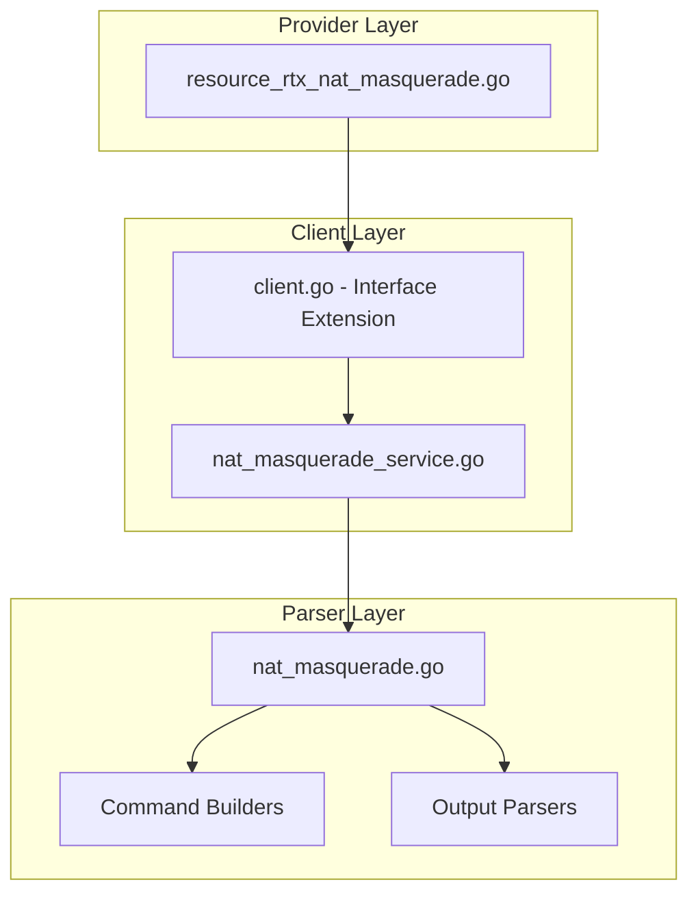

# Design Document: rtx_nat_masquerade

## Overview

The `rtx_nat_masquerade` resource enables Terraform-based management of NAT masquerade (dynamic NAPT/PAT) on Yamaha RTX series routers. This resource manages NAT descriptors configured for many-to-one address translation, following Cisco IOS XE Terraform provider naming conventions where applicable.

## Code Reuse Analysis

### Existing Components to Leverage

- **`internal/client/dhcp_scope_service.go`**: Pattern for service layer implementation with CRUD operations.
- **`internal/client/interfaces.go`**: Extend the `Client` interface with NAT descriptor methods.
- **`internal/rtx/parsers/dhcp_scope.go`**: Reference for parser implementation and command builders.
- **`internal/provider/resource_rtx_dhcp_scope.go`**: Template for Terraform resource structure.

### Integration Points

- **`rtxClient`**: Add NAT masquerade methods for CRUD operations
- **`Executor`**: Use existing SSH command execution infrastructure
- **Interface binding**: Coordinate with interface configuration

## Architecture



### Modular Design Principles

- **Single File Responsibility**: `NATMasqueradeService` handles all NAT masquerade CRUD operations
- **Component Isolation**: Parser, service, and resource layers clearly separated
- **Service Layer Separation**: Service encapsulates all NAT masquerade logic
- **Utility Modularity**: Shared validation functions for IP/network operations

## Components and Interfaces

### Component 1: NATMasqueradeService (`internal/client/nat_masquerade_service.go`)

- **Purpose:** Handles all NAT masquerade CRUD operations against the RTX router
- **Interfaces:**
  ```go
  type NATMasqueradeService struct {
      executor Executor
      client   *rtxClient
  }

  func (s *NATMasqueradeService) Create(ctx context.Context, nat NATMasquerade) error
  func (s *NATMasqueradeService) Get(ctx context.Context, descriptorID int) (*NATMasquerade, error)
  func (s *NATMasqueradeService) Update(ctx context.Context, nat NATMasquerade) error
  func (s *NATMasqueradeService) Delete(ctx context.Context, descriptorID int) error
  func (s *NATMasqueradeService) List(ctx context.Context) ([]NATMasquerade, error)
  ```
- **Dependencies:** `Executor`, `rtxClient`, `parsers.NATMasqueradeParser`
- **Reuses:** Pattern from `DHCPScopeService`, `Executor` interface

### Component 2: NATMasqueradeParser (`internal/rtx/parsers/nat_masquerade.go`)

- **Purpose:** Parses RTX router output for NAT descriptor configuration and builds commands
- **Interfaces:**
  ```go
  type NATMasquerade struct {
      DescriptorID   int            `json:"descriptor_id"`
      OuterAddress   string         `json:"outer_address"`    // Interface name or IP
      InnerNetwork   string         `json:"inner_network"`    // CIDR notation
      Interface      string         `json:"interface"`        // Bound interface
      StaticEntries  []StaticEntry  `json:"static_entries,omitempty"`
  }

  type StaticEntry struct {
      InsideLocal      string `json:"inside_local"`
      InsideLocalPort  int    `json:"inside_local_port,omitempty"`
      OutsideGlobal    string `json:"outside_global"`
      OutsideGlobalPort int   `json:"outside_global_port,omitempty"`
      Protocol         string `json:"protocol,omitempty"` // tcp/udp
  }

  func ParseNATDescriptorConfig(raw string) ([]NATMasquerade, error)
  func BuildNATDescriptorTypeCommand(id int) string
  func BuildNATDescriptorAddressOuterCommand(id int, address string) string
  func BuildNATDescriptorAddressInnerCommand(id int, network string) string
  func BuildNATDescriptorStaticCommand(id int, entry StaticEntry) string
  func BuildInterfaceNATCommand(iface string, id int) string
  func BuildDeleteNATDescriptorCommand(id int) string
  ```
- **Dependencies:** `regexp`, `strings`, `strconv`
- **Reuses:** IP validation patterns

### Component 3: Terraform Resource (`internal/provider/resource_rtx_nat_masquerade.go`)

- **Purpose:** Terraform resource definition implementing CRUD lifecycle
- **Interfaces:**
  ```go
  func resourceRTXNATMasquerade() *schema.Resource
  func resourceRTXNATMasqueradeCreate(ctx, d, meta) diag.Diagnostics
  func resourceRTXNATMasqueradeRead(ctx, d, meta) diag.Diagnostics
  func resourceRTXNATMasqueradeUpdate(ctx, d, meta) diag.Diagnostics
  func resourceRTXNATMasqueradeDelete(ctx, d, meta) diag.Diagnostics
  func resourceRTXNATMasqueradeImport(ctx, d, meta) ([]*schema.ResourceData, error)
  ```
- **Dependencies:** `Client`, `NATMasquerade`, Terraform SDK
- **Reuses:** `resourceRTXDHCPScope` patterns

### Component 4: Client Interface Extension (`internal/client/interfaces.go`)

- **Purpose:** Extend Client interface with NAT masquerade methods
- **Interfaces:**
  ```go
  // Add to existing Client interface:
  GetNATMasquerade(ctx context.Context, descriptorID int) (*NATMasquerade, error)
  CreateNATMasquerade(ctx context.Context, nat NATMasquerade) error
  UpdateNATMasquerade(ctx context.Context, nat NATMasquerade) error
  DeleteNATMasquerade(ctx context.Context, descriptorID int) error
  ListNATMasquerades(ctx context.Context) ([]NATMasquerade, error)
  ```
- **Dependencies:** Existing Client interface
- **Reuses:** Pattern from existing methods

## Data Models

### NATMasquerade

```go
// NATMasquerade represents a NAT masquerade descriptor on an RTX router
type NATMasquerade struct {
    DescriptorID  int           `json:"descriptor_id"`    // NAT descriptor ID (1-65535)
    OuterAddress  string        `json:"outer_address"`    // Outer IP or interface (e.g., "ipcp", "pp1")
    InnerNetwork  string        `json:"inner_network"`    // Inner network CIDR
    Interface     string        `json:"interface"`        // Interface to apply NAT
    StaticEntries []StaticEntry `json:"static_entries,omitempty"` // Port forwarding entries
}

// StaticEntry represents a static port mapping in NAT masquerade
type StaticEntry struct {
    InsideLocal       string `json:"inside_local"`         // Inside local IP
    InsideLocalPort   int    `json:"inside_local_port,omitempty"`
    OutsideGlobal     string `json:"outside_global"`       // Outside global IP
    OutsideGlobalPort int    `json:"outside_global_port,omitempty"`
    Protocol          string `json:"protocol,omitempty"`   // tcp/udp
}
```

### Terraform Schema

```hcl
resource "rtx_nat_masquerade" "main" {
  id = 1  # Descriptor ID, Required, ForceNew

  inside_source {
    acl       = "192.168.1.0/24"  # Inner network
    interface = "pp1"             # Outside interface
    overload  = true              # Always true for masquerade
  }

  # Optional: static port mappings
  static_entries = [
    {
      inside_local        = "192.168.1.10"
      inside_local_port   = 80
      outside_global      = "ipcp"  # Use PPPoE assigned IP
      outside_global_port = 8080
      protocol            = "tcp"
    }
  ]
}
```

## RTX Command Mapping

### Create NAT Descriptor

```
nat descriptor type <id> masquerade
nat descriptor address outer <id> <interface/ip>
nat descriptor address inner <id> <network>
```

Example:
```
nat descriptor type 1 masquerade
nat descriptor address outer 1 ipcp
nat descriptor address inner 1 192.168.1.0-192.168.1.255
```

### Configure Static Mapping

```
nat descriptor masquerade static <id> <n> <outer_ip>:<port>=<inner_ip>:<port> [<protocol>]
```

Example: `nat descriptor masquerade static 1 1 ipcp:8080=192.168.1.10:80 tcp`

### Apply to Interface

```
ip <interface> nat descriptor <id>
```

Example: `ip pp1 nat descriptor 1`

### Delete NAT Descriptor

```
no nat descriptor type <id>
```

### Show NAT Configuration

```
show nat descriptor address
show config | grep "nat descriptor"
```

## Error Handling

### Error Scenarios

1. **Invalid Descriptor ID**
   - **Handling:** Validate ID is in range 1-65535
   - **User Impact:** Clear validation error with valid range

2. **Descriptor Already Exists**
   - **Handling:** Parse RTX output for existing descriptor
   - **User Impact:** Error suggesting import or different ID

3. **Invalid Network Format**
   - **Handling:** Validate CIDR notation for inner network
   - **User Impact:** Clear error with expected format

4. **Invalid Interface**
   - **Handling:** Validate interface name exists
   - **User Impact:** Error indicating invalid interface

5. **Port Conflict**
   - **Handling:** Check for port conflicts in static mappings
   - **User Impact:** Error indicating conflicting port

6. **Connection/Command Timeout**
   - **Handling:** Use existing retry logic from `rtxClient`
   - **User Impact:** Standard Terraform timeout error

## Testing Strategy

### Unit Testing

- **Parser Tests** (`nat_masquerade_test.go`):
  - Parse various RTX `show nat descriptor` output formats
  - Test command builder functions with different parameters
  - Test static entry parsing

- **Service Tests** (`nat_masquerade_service_test.go`):
  - Mock executor for service method testing
  - Test error handling for various failure scenarios
  - Test static mapping handling

### Integration Testing

- **Resource Tests** (`resource_rtx_nat_masquerade_test.go`):
  - Full CRUD lifecycle with mock client
  - Import functionality testing
  - Static mapping configuration testing

### End-to-End Testing

- **Acceptance Tests** (with real RTX router):
  - Create basic NAT masquerade
  - Create NAT with static port mappings
  - Update static mappings
  - Delete NAT descriptor
  - Import existing NAT configuration

## File Structure

```
internal/
├── provider/
│   ├── resource_rtx_nat_masquerade.go      # NEW: Terraform resource
│   └── resource_rtx_nat_masquerade_test.go # NEW: Resource tests
├── client/
│   ├── interfaces.go                        # MODIFY: Add NATMasquerade type and methods
│   ├── client.go                            # MODIFY: Add NAT service initialization
│   ├── nat_masquerade_service.go           # NEW: NAT service implementation
│   └── nat_masquerade_service_test.go      # NEW: Service tests
└── rtx/
    └── parsers/
        ├── nat_masquerade.go               # NEW: Parser and command builders
        └── nat_masquerade_test.go          # NEW: Parser tests
```

## Implementation Notes

1. **Descriptor Type**: RTX NAT descriptors support multiple types (masquerade, nat, twice-nat). This resource specifically handles `masquerade` type.

2. **Outer Address**: Can be specific IP, interface name (e.g., "pp1"), or special keywords like "ipcp" for PPPoE.

3. **Inner Network Format**: RTX uses range notation (192.168.1.0-192.168.1.255). Convert from CIDR in Terraform.

4. **Terraform ID**: Use descriptor ID directly as Terraform resource ID.

5. **ForceNew**: `descriptor_id` is ForceNew. Other attributes support in-place updates.

6. **Static Entries**: Each static entry requires a sequence number. Auto-generate or require explicit specification.

7. **Interface Binding**: The interface binding is a separate command. Consider as part of this resource or separate resource.

8. **Configuration Save**: Use existing `SaveConfig()` pattern after modifications.

9. **Provider Registration**: Add `resourceRTXNATMasquerade` to provider's resource map.

## State Handling

- Persist only configuration attributes in Terraform state.
- Operational/runtime status must not be stored in state to avoid perpetual diffs.
