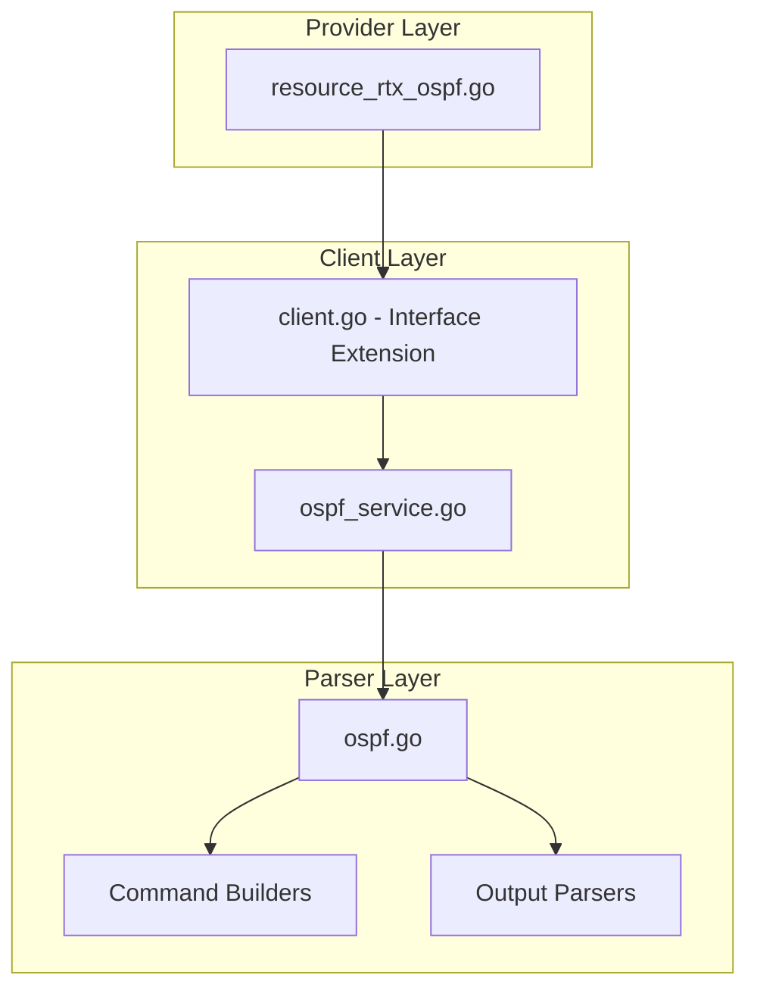

# Design Document: rtx_ospf

## Overview

The `rtx_ospf` resource enables Terraform-based management of OSPF (Open Shortest Path First) routing configuration on Yamaha RTX series routers. Following Cisco IOS XE Terraform provider naming conventions, this resource manages OSPF process configuration including router ID, areas, networks, and redistribution settings.

## Code Reuse Analysis

### Existing Components to Leverage

- **`internal/client/dhcp_scope_service.go`**: Pattern for service layer implementation with CRUD operations.
- **`internal/client/interfaces.go`**: Extend the `Client` interface with OSPF methods.
- **`internal/rtx/parsers/dhcp_scope.go`**: Reference for parser implementation and command builders.
- **`internal/provider/resource_rtx_dhcp_scope.go`**: Template for Terraform resource structure.

### Integration Points

- **`rtxClient`**: Add OSPF methods for CRUD operations
- **`Executor`**: Use existing SSH command execution infrastructure
- **Interface configuration**: Coordinate with interface IP settings

## Architecture



### Modular Design Principles

- **Single File Responsibility**: `OSPFService` handles all OSPF CRUD operations
- **Component Isolation**: Parser, service, and resource layers clearly separated
- **Service Layer Separation**: Service encapsulates all OSPF logic
- **Utility Modularity**: Shared validation functions for IP/area operations

## Components and Interfaces

### Component 1: OSPFService (`internal/client/ospf_service.go`)

- **Purpose:** Handles all OSPF CRUD operations against the RTX router
- **Interfaces:**
  ```go
  type OSPFService struct {
      executor Executor
      client   *rtxClient
  }

  func (s *OSPFService) Create(ctx context.Context, ospf OSPFConfig) error
  func (s *OSPFService) Get(ctx context.Context) (*OSPFConfig, error)
  func (s *OSPFService) Update(ctx context.Context, ospf OSPFConfig) error
  func (s *OSPFService) Delete(ctx context.Context) error
  ```
- **Dependencies:** `Executor`, `rtxClient`, `parsers.OSPFParser`
- **Reuses:** Pattern from `DHCPScopeService`, `Executor` interface

### Component 2: OSPFParser (`internal/rtx/parsers/ospf.go`)

- **Purpose:** Parses RTX router output for OSPF configuration and builds commands
- **Interfaces:**
  ```go
  type OSPFConfig struct {
      ProcessID            int           `json:"process_id"`
      RouterID             string        `json:"router_id"`
      Distance             int           `json:"distance"`
      DefaultOriginate     bool          `json:"default_information_originate"`
      Networks             []OSPFNetwork `json:"networks"`
      Areas                []OSPFArea    `json:"areas,omitempty"`
      Neighbors            []OSPFNeighbor `json:"neighbors,omitempty"`
      RedistributeStatic   bool          `json:"redistribute_static"`
      RedistributeConnected bool         `json:"redistribute_connected"`
  }

  type OSPFNetwork struct {
      IP       string `json:"ip"`
      Wildcard string `json:"wildcard"`
      Area     string `json:"area"`
  }

  type OSPFArea struct {
      ID        string `json:"id"`
      Type      string `json:"type"`  // normal, stub, nssa
      NoSummary bool   `json:"no_summary,omitempty"`
  }

  type OSPFNeighbor struct {
      IP       string `json:"ip"`
      Priority int    `json:"priority,omitempty"`
      Cost     int    `json:"cost,omitempty"`
  }

  func ParseOSPFConfig(raw string) (*OSPFConfig, error)
  func BuildOSPFEnableCommand() string
  func BuildOSPFRouterIDCommand(routerID string) string
  func BuildOSPFAreaCommand(area, iface string) string
  func BuildOSPFImportCommand(protocol string) string
  func BuildDeleteOSPFCommand() string
  ```
- **Dependencies:** `regexp`, `strings`, `net`
- **Reuses:** IP validation patterns

### Component 3: Terraform Resource (`internal/provider/resource_rtx_ospf.go`)

- **Purpose:** Terraform resource definition implementing CRUD lifecycle
- **Interfaces:**
  ```go
  func resourceRTXOSPF() *schema.Resource
  func resourceRTXOSPFCreate(ctx, d, meta) diag.Diagnostics
  func resourceRTXOSPFRead(ctx, d, meta) diag.Diagnostics
  func resourceRTXOSPFUpdate(ctx, d, meta) diag.Diagnostics
  func resourceRTXOSPFDelete(ctx, d, meta) diag.Diagnostics
  func resourceRTXOSPFImport(ctx, d, meta) ([]*schema.ResourceData, error)
  ```
- **Dependencies:** `Client`, `OSPFConfig`, Terraform SDK
- **Reuses:** `resourceRTXDHCPScope` patterns

### Component 4: Client Interface Extension (`internal/client/interfaces.go`)

- **Purpose:** Extend Client interface with OSPF methods
- **Interfaces:**
  ```go
  // Add to existing Client interface:
  GetOSPF(ctx context.Context) (*OSPFConfig, error)
  CreateOSPF(ctx context.Context, ospf OSPFConfig) error
  UpdateOSPF(ctx context.Context, ospf OSPFConfig) error
  DeleteOSPF(ctx context.Context) error
  ```
- **Dependencies:** Existing Client interface
- **Reuses:** Pattern from existing methods

## Data Models

### OSPFConfig

```go
// OSPFConfig represents OSPF configuration on an RTX router
type OSPFConfig struct {
    ProcessID             int            `json:"process_id"`              // OSPF process ID
    RouterID              string         `json:"router_id"`               // Router ID (dotted decimal)
    Distance              int            `json:"distance"`                // Administrative distance
    DefaultOriginate      bool           `json:"default_information_originate"`
    Networks              []OSPFNetwork  `json:"networks"`
    Areas                 []OSPFArea     `json:"areas,omitempty"`
    Neighbors             []OSPFNeighbor `json:"neighbors,omitempty"`
    RedistributeStatic    bool           `json:"redistribute_static"`
    RedistributeConnected bool           `json:"redistribute_connected"`
}

// OSPFNetwork represents a network/area mapping
type OSPFNetwork struct {
    IP       string `json:"ip"`       // Network IP
    Wildcard string `json:"wildcard"` // Wildcard mask
    Area     string `json:"area"`     // Area ID
}

// OSPFArea represents an OSPF area configuration
type OSPFArea struct {
    ID        string `json:"id"`         // Area ID (0.0.0.0 for backbone)
    Type      string `json:"type"`       // normal, stub, nssa
    NoSummary bool   `json:"no_summary"` // Totally stubby
}

// OSPFNeighbor represents a static neighbor configuration
type OSPFNeighbor struct {
    IP       string `json:"ip"`       // Neighbor IP
    Priority int    `json:"priority"` // DR/BDR priority
    Cost     int    `json:"cost"`     // Link cost
}
```

### Terraform Schema

```hcl
resource "rtx_ospf" "backbone" {
  process_id = 1               # Optional, default 1
  router_id  = "1.1.1.1"       # Required
  distance   = 110             # Optional, default 110

  default_information_originate = true

  networks = [
    {
      ip       = "192.168.1.0"
      wildcard = "0.0.0.255"
      area     = "0"
    },
    {
      ip       = "10.0.0.0"
      wildcard = "0.0.0.255"
      area     = "1"
    }
  ]

  areas = [
    {
      id   = "0"
      type = "normal"
    },
    {
      id         = "1"
      type       = "stub"
      no_summary = false
    }
  ]

  neighbors = [
    {
      ip       = "192.168.1.2"
      priority = 10
      cost     = 100
    }
  ]

  redistribute_static = true
}
```

## RTX Command Mapping

### Enable OSPF

```
ospf use on
```

### Configure Router ID

```
ospf router id <router_id>
```

Example: `ospf router id 1.1.1.1`

### Configure Area

```
ospf area <area>
ip <interface> ospf area <area>
```

Example: `ip lan1 ospf area 0`

### Configure Network

```
ospf area <area> <interface>
```

### Configure Stub Area

```
ospf area <area> stub [no-summary]
```

### Redistribute Routes

```
ospf import from static
ospf import from ospf
```

### Configure Interface OSPF Settings

```
ip <interface> ospf cost <cost>
ip <interface> ospf priority <priority>
```

### Delete OSPF

```
ospf use off
```

### Show OSPF Configuration

```
show config | grep ospf
show status ospf neighbor
```

## Error Handling

### Error Scenarios

1. **Invalid Router ID**
   - **Handling:** Validate router ID is valid IPv4 format
   - **User Impact:** Clear validation error with expected format

2. **OSPF Already Configured**
   - **Handling:** Parse RTX output for existing configuration
   - **User Impact:** Error suggesting import

3. **Invalid Area ID**
   - **Handling:** Validate area ID format (decimal or dotted decimal)
   - **User Impact:** Clear error with valid formats

4. **Invalid Network**
   - **Handling:** Validate IP and wildcard mask
   - **User Impact:** Error indicating invalid network

5. **Interface Not Found**
   - **Handling:** Validate interface exists before assigning to area
   - **User Impact:** Error indicating missing interface

6. **Connection/Command Timeout**
   - **Handling:** Use existing retry logic from `rtxClient`
   - **User Impact:** Standard Terraform timeout error

## Testing Strategy

### Unit Testing

- **Parser Tests** (`ospf_test.go`):
  - Parse various RTX `show config` output for OSPF
  - Test command builder functions with different parameters
  - Test router ID and area validation

- **Service Tests** (`ospf_service_test.go`):
  - Mock executor for service method testing
  - Test error handling for various failure scenarios
  - Test network/area configuration

### Integration Testing

- **Resource Tests** (`resource_rtx_ospf_test.go`):
  - Full CRUD lifecycle with mock client
  - Import functionality testing
  - Multi-area configuration testing

### End-to-End Testing

- **Acceptance Tests** (with real RTX router):
  - Create OSPF with single area
  - Create OSPF with multiple areas
  - Configure stub area
  - Enable redistribution
  - Update OSPF settings
  - Delete OSPF
  - Import existing OSPF

## State Handling

- Persist only configuration attributes in Terraform state.
- Neighbor status is operational-only and must not be stored in state to avoid perpetual diffs.

## File Structure

```
internal/
├── provider/
│   ├── resource_rtx_ospf.go      # NEW: Terraform resource
│   └── resource_rtx_ospf_test.go # NEW: Resource tests
├── client/
│   ├── interfaces.go              # MODIFY: Add OSPF types and methods
│   ├── client.go                  # MODIFY: Add OSPF service initialization
│   ├── ospf_service.go           # NEW: OSPF service implementation
│   └── ospf_service_test.go      # NEW: Service tests
└── rtx/
    └── parsers/
        ├── ospf.go               # NEW: Parser and command builders
        └── ospf_test.go          # NEW: Parser tests
```

## Implementation Notes

1. **Singleton Resource**: OSPF is a singleton resource on RTX. Only one OSPF configuration can exist.

2. **Terraform ID**: Use "ospf" as the fixed Terraform resource ID.

3. **Area Format**: RTX supports both decimal (0) and dotted decimal (0.0.0.0) area IDs. Normalize to one format.

4. **Wildcard Mask**: Cisco-style wildcard masks (0.0.0.255 = /24). Convert between formats as needed.

5. **Process ID**: RTX may not support multiple OSPF processes. The process_id is for Cisco compatibility.

6. **In-place Updates**: Most OSPF settings support in-place updates without recreating the resource.

7. **Dependency Ordering**: Networks depend on interfaces having IP addresses configured.

8. **Configuration Save**: Use existing `SaveConfig()` pattern after modifications.

9. **Provider Registration**: Add `resourceRTXOSPF` to provider's resource map.
