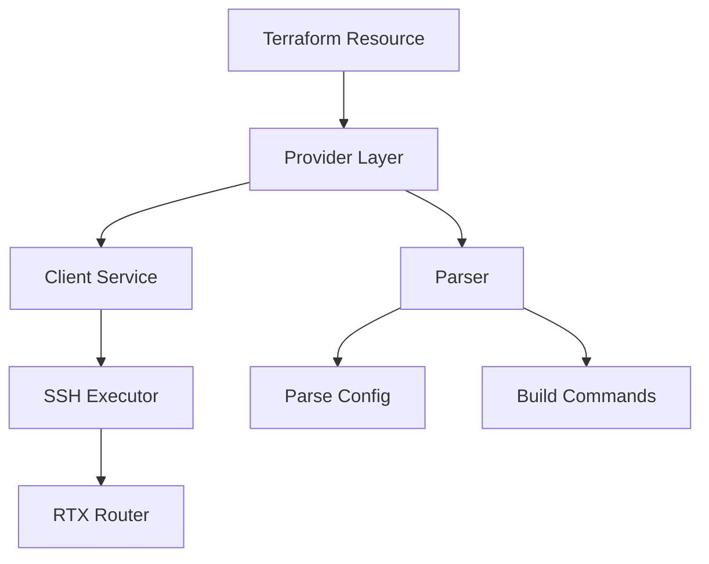

# Design Document: RTX PPP/PPPoE Resource

## Overview

This feature implements Terraform resources for PPP/PPPoE WAN connectivity on Yamaha RTX routers. The design follows the established parser → client → provider pattern used by all existing resources.

## Steering Document Alignment

### Technical Standards (tech.md)
- Follow existing parser implementation patterns
- Use SSH command execution via existing client infrastructure
- Implement CRUD operations with import support

### Project Structure (structure.md)
- Parser: `internal/rtx/parsers/ppp.go`
- Client: `internal/client/ppp_service.go`
- Provider: `internal/provider/resource_rtx_pppoe.go`, `resource_rtx_pp_interface.go`
- Tests: Corresponding `*_test.go` files
- Examples: `examples/pppoe/main.tf`

## Code Reuse Analysis

### Existing Components to Leverage
- **SSH Client**: `internal/client/client.go` for command execution
- **Parser patterns**: Follow `interface_config.go` structure
- **Resource patterns**: Follow `resource_rtx_interface.go` structure
- **Validation helpers**: Reuse IP address and interface validators

### Integration Points
- **Interface system**: PP interfaces integrate with existing interface management
- **DNS configuration**: PPPoE can provide DNS servers (integrate with dns_server)
- **Static routes**: Default route via PP interface

## Architecture



## Components and Interfaces

### Component 1: PPP Parser
- **Purpose:** Parse and build PPP/PPPoE commands
- **File:** `internal/rtx/parsers/ppp.go`
- **Interfaces:**
  ```go
  func ParsePPPConfig(output string) (*PPPConfig, error)
  func ParsePPPoEConfig(output string, ppNum int) (*PPPoEConfig, error)
  func BuildPPPoECommand(config *PPPoEConfig) []string
  func BuildPPInterfaceCommand(config *PPInterfaceConfig) []string
  ```
- **Dependencies:** regexp, strings, strconv
- **Reuses:** Validation patterns from interface_config.go

### Component 2: PPP Service
- **Purpose:** Execute PPP/PPPoE operations via SSH
- **File:** `internal/client/ppp_service.go`
- **Interfaces:**
  ```go
  type PPPService interface {
      GetPPPoE(ppNum int) (*PPPoEConfig, error)
      ConfigurePPPoE(config *PPPoEConfig) error
      UpdatePPPoE(config *PPPoEConfig) error
      DeletePPPoE(ppNum int) error
      GetPPInterface(ppNum int) (*PPInterfaceConfig, error)
      ConfigurePPInterface(config *PPInterfaceConfig) error
      GetConnectionStatus(ppNum int) (*PPConnectionStatus, error)
  }
  ```
- **Dependencies:** client.Executor
- **Reuses:** Command execution pattern from interface_service.go

### Component 3: PPPoE Resource
- **Purpose:** Terraform resource for PPPoE client configuration
- **File:** `internal/provider/resource_rtx_pppoe.go`
- **Schema:**
  ```hcl
  resource "rtx_pppoe" "wan" {
    pp_number      = 1
    bind_interface = "lan2"
    username       = "user@isp.ne.jp"
    password       = "secret"
    auth_method    = "chap"  # pap, chap, mschap, mschapv2
    service_name   = ""       # optional
    auto_connect   = true
    lcp_echo {
      interval      = 30
      failure_count = 3
    }
  }
  ```
- **Dependencies:** PPPService, schema package
- **Reuses:** Resource CRUD pattern from resource_rtx_interface.go

### Component 4: PP Interface Resource
- **Purpose:** Terraform resource for PP interface IP configuration
- **File:** `internal/provider/resource_rtx_pp_interface.go`
- **Schema:**
  ```hcl
  resource "rtx_pp_interface" "wan" {
    pp_number    = 1
    ip_address   = "ipcp"  # or static IP
    netmask      = "ipcp"  # or static mask
    mtu          = 1454
    tcp_mss      = 1414
    nat_descriptor = 1000
    default_route = true
    route_metric  = 1
  }
  ```
- **Dependencies:** PPPService, schema package
- **Reuses:** Interface configuration patterns

## Data Models

### PPPoEConfig
```go
type PPPoEConfig struct {
    PPNumber       int
    BindInterface  string
    Username       string
    Password       string   // Sensitive
    AuthMethod     string   // pap, chap, mschap, mschapv2
    ServiceName    string
    ACName         string
    AutoConnect    bool
    LCPEcho        LCPEchoConfig
}

type LCPEchoConfig struct {
    Interval     int  // seconds
    FailureCount int
}
```

### PPInterfaceConfig
```go
type PPInterfaceConfig struct {
    PPNumber      int
    IPAddress     string  // "ipcp" or static IP
    Netmask       string  // "ipcp" or static mask
    MTU           int
    TCPMSS        int
    NATDescriptor int
    DefaultRoute  bool
    RouteMetric   int
    DNSServers    []string  // from IPCP or static
}
```

### RTX Commands Mapping
| Terraform Attribute | RTX Command |
|---------------------|-------------|
| bind_interface | `pp bind lan2` |
| username/password | `pp auth myname <user> <pass>` |
| auth_method | `pp auth accept <method>` |
| service_name | `pppoe service-name <name>` |
| auto_connect | `pp always-on on` |
| lcp_echo.interval | `ppp lcp echo <interval>` |
| ip_address | `ip pp address <ip>/<mask>` |
| mtu | `ip pp mtu <size>` |
| tcp_mss | `ip pp tcp mss <size>` |
| nat_descriptor | `ip pp nat descriptor <id>` |
| default_route | `ip route default gateway pp 1` |

## Error Handling

### Error Scenarios
1. **Authentication failure:**
   - **Handling:** Return error with ISP authentication failure message
   - **User Impact:** Clear message about username/password issue

2. **Interface already bound:**
   - **Handling:** Check existing binding before configure
   - **User Impact:** Suggest unbinding or using different PP number

3. **Connection timeout:**
   - **Handling:** Retry with exponential backoff
   - **User Impact:** Report timeout with troubleshooting hints

## Testing Strategy

### Unit Testing
- Parser tests with sample RTX output
- Command builder tests for all configurations
- Validation tests for auth methods, MTU ranges

### Integration Testing
- Mock client tests for CRUD operations
- State management tests

### Acceptance Testing (requires RTX)
- Full PPPoE lifecycle test
- Import existing configuration test
- Multi-PP interface test
